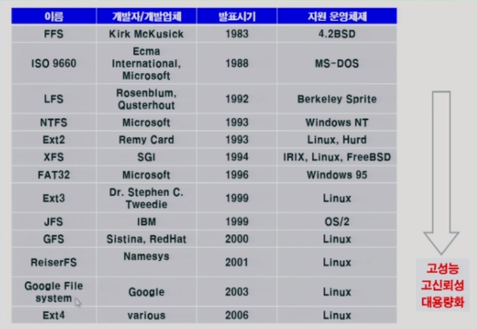
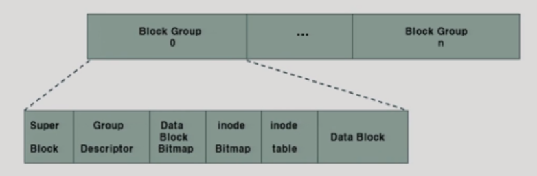
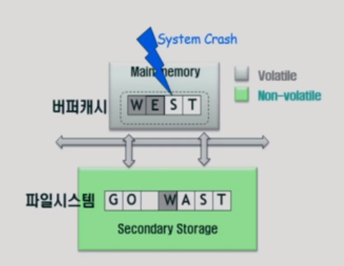
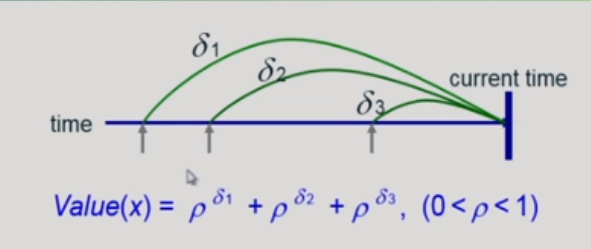
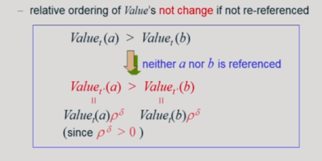

# 10_Disk_Management_and_Scheduling

##### 시간

seek time : 헤드가 해당 실린더로 오는 시간 (가장 오랜시간이 걸림)

Rotational latency : 원하는 섹터가 돌아서 오는 시간

Transfer time : 전송시간

##### Disk Structure

- cylinder
  - track에서 여러 디스크를 모아둔 모습
- track
  - 디스크 내부에 하나의 길
- sector
  - track안에 나눠져 있는 부분
- head
  - 모든 head들은 동일한 track 위치를 읽고 쓸 수 있음
  - 즉 다같이 움직임

- logical block
  - 디스크의 외부(호스트)에서 보는 디스크의 단위 정보 저장 공간들 
  - 정보를 전송하는 최소단위

디스크 내부

- disk controller가 sector에다가 데이터를 저장하거나 꺼내거나 한다
- 데이터를 꺼낼떄 장확한 sector의 번호등등을 알아야 어디있는지 찾을 수 있다. 
- 디스크 외부 (컴퓨터)에서 logical block번호를 받으면 그때 sector 번호등등으로 그 정보를 찾고 보내준다(controller가 함)

디스크 외부

- 디스크외부(컴퓨터)가 디스크를 읽고 쓰라고 요청할 때
- 그 요청을 sector에다가 내리는 것이 아니고 logical block에다가 한다.
- 외부에서는 데이터를 요청할때 logical block번호를 말해준다

## Disk Management

- ##### physical formatting(low-level formatting)

  - 디스크를 포멧한다고 한다
  - 각 섹터
    - header + 실제 data(보통 512bytes) + tariler로 구성
    - header와 tariler는 sector number, ECC(에러 확인 코드)등의 정보가 저장되어 있음
    - controller가 직접 접근 및 운영

- ##### Partitioning

  - 디스크를 하나 이상의 실린더 그룹으로 나눈는 과정
  - 서로다른 용도로 사용할 수 있음

- ##### Logical formatting

  - 파티션 된 곳에 파일시스템을 만드는 것
  - FAT, Inode등의 구조 포함

- ##### Booting

  - 처음 컴퓨터를 키면 CPU는 기계어를 실행시킬 수 없음
  - 왜냐하면 메모리는 휘발성이라 다 비워져 있기 때문 (DRAM)
  - ROM => 휘발성 아님 => CPU는 ROM에 있는 기계어 실행
  - ROM에는 0번 섹터를 읽으라는 명령이 있음 (small bootstrap loader)
  - sector 0  = OS를 디스크에서 load하여 실행 (full bootstrap loader )

## Disk scheduling Algorithm

#### FCFS

- 먼저 들어온 순서대로
- 헤드의 이동이 늘어남

#### SSTF

- shortest seek time First
- 짧은거 먼저
- starvation 문제 있을 수 있음

#### SCAN

- 엘리베이터 스케줄링과 같음
- 가는 길목에 처리할 것이 있으면 그때마다 처리함
- 요청의 위치와 관계없이 마이웨이로 움직인다.
- 문제: 
  - 실린더 위치에 따라 대기시간이 다르다
  - 엘리베이터 놓쳤을때랑 똑같음

#### C-SCAN

- SCAN 업글 버전
- 왼쪽에서 오른쪽으로만 작업을 하다
- 어느 위치에 있건 기다리는 대기시간이 동일하다
- 딱히 효율적이진 않음

#### N-SCAN

- 출발한 시점에 누구를 처리할지 미리 계획함
- 중간에 들어온 애들은 처리하지 않음
- 돌아올때 나머지 애들 처리함
- 대기시간 편차를 줄일 수 있음

#### LOOK and C-LOOK

- LOOK은 마지막에 딱히 요청이 없을때 끝까지 안가고 그냥 턴 한다
- C-LOOK은 똑같음 (대신 C-SCAN처럼 한쪽 방향으로만)

#### 현재

SCAN, C_SCAN 및 LOOK, C-LOOK을 사용한다

## Swap-Space Management

- ##### 파일 시스템

  - 휘발성이 아님
  - 즉 영구적인 데이터를 보관
  - 512바이트 단위로 나눠서 보관

- ##### swap area

  - 메모리의 연장공간
  - 파일시스템보다 단위가 더 크게 된다. 
  - 전원을 끄면 어차피 사라짐
    - 따라서 공간을 효율성이 그다지 중요하지 않음
    - 시간 효율성이 더 중요함 ==> 따라서 더 큰 단위로 보관하게 함
    - 많은 양을 한번에 읽고 쓰게 하기 위해서
      

##### RAID

- 여러개의 디스크를 묶어서 사용
- 장점
  - 신뢰성 향상 = 디스크 하나가 고장나도 다른거 쓰면됨(중복 저장=mirroring)
  - 디스크 처리속도 향상(성능)
    - 여러군데 저장하면 ==> 호스트가 분산해서 병렬적으로 읽어옴
    - 즉...... 분업한다고 생각하면 됨(interleaving)

## UNIX파일시스템

 

#### 파일시스템의 변천사

### Ext2

차이점

- i-node와 data블록을 그룹으로 저장한다  (+super block)
- 헤드의 이동이 빈번해지는 것을 막기위해
- 실제로 i-node와 data블록을 가까히 위치시키기 위해서
- group descriptor
  - 그룹안에서 super block같은 것

## Ext4

- ##### Ext4와 Ext2의 차이점

  - Ext4 = Ext2 = 저널링

#### 저널링????

- 갑자기 전원 공급 중단 ==> 파일시스테 일관성 훼손

- ##### 깨지는 이유와 저널링을 하는 이유

  - 작업할때 버퍼캐시에 올려놓고 작업을 하게 된다.
  - 버퍼는 전원이 나가면 사라짐(휘발성)
  - 수정함 ==> 버퍼캐시에만 수정이 됨 일단
  - 이때 버퍼캐쉬에서 w만 파일시스템에게 보내고 전원이 나감
  - 그럼 데이터가 아예 깨지게 된다

#### check pointing 

- => 수정된 내용을 파일시스템 위치에 반영(주기: 길다 5분)

#### 저널링

- ##### 목적

  - 정보가 깨지지 않게 하기 위함

- ##### 특징

  - 수정된 정보를 주기적으로(5~30초 단위로) 버퍼캐시에서 저널영역에 기록한다.
  - 파일위치에 바로 쓰는 것이 아님// 저널영역에 쓰는 것임
  - 그리고 나중에 원래 위치에 수정된 데이터를 반영해준다

- ##### 크러쉬가 안나는 이유

  - 중간에 전원이 꺼진다 하더라도 ==> 저널영역에 있는 것이 날아감
  - 즉 그 전에 정보는 보존이 된다

- ##### 만약 check pointing하다가 전원나가면??

  - 그래도 괜찮음
  - 어차피 저널에 저장이 되어있어서 다시 파일시스템에다가 보내면 된다.

### 파일시스템을 위한 버퍼캐시 알고리즘

#### LRFU 알고리즘

- 로우 : 상수(0<로우<1)

- 델타 : 사용된 시점부터 현재까지 흐른 시간

  - 흐른 시간이 길수록 로우값이 작아진다 (이유: 소수값이기 때문에)

- ##### 정리

  -  많이 사용되면 값이 커짐
  - 오래될 수록 기여도가 낮아짐

- LFU적인 성질 + LRU성질

- ##### Space overhead??

  - 시간을 다 저장하고 있어야 하는데
  - 이거 너무 많은 공간 낭비 아닌가??

- ##### Time overhead??

  - O(logN)이내로 결정을 할 수 있어야한다. 

#### 효율적으로 구현

##### Space overhead?? ==> 해결

- 식을 정리함

- t를 기준으로 t 델타 1 2 3 은 t시점에서 Value(x)다 된다

  - 즉 이미 구해놓은 값을 저장해서 계속 쓰겠다는 뜻

  - 모든 참조기록을 저장하고 있지 않아도 된다는 뜻

##### Time overhead?? ==>

- 블럭들이 재사용되지 않으면 ==> 가치의 대소관계가 변하지 않는다 ==> 즉 heap이용가능
- heap을 이용

- logN안으로 사용가능
- 재사용이 된 아이(벨류가 변한 아이)만 힙에서 대소관계를 따져 움직여주면 된다
- 나머지는 냅둬도 됨 왜?? ==> 어차피 대소관계가 같기 때문에

### 성능차이

- OPT는 이상적인 값
- 현재는 많은 여러 알고리즘들이 개발이 되었다.
- 그러니 더 알아볼 것
