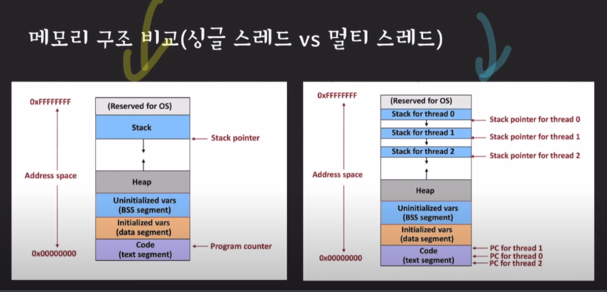

# cs_01_Thread_processing

용어정리

- 프로그램 : 컴퓨터가 실행할 수 있는 명령어들의 집합

- 프로세스 
  - **컴퓨터에서 실행중인 프로그램**
  - 각각의 프로세스는 독립된 메모리 공간을 할당
  - 메모리 공간에서 각각의 프로세스에 명령어들과 데이터들을 가짐

- 메인 메모리
  - 프로세스가 CPU에서 실행되기 위해 대기하는 곳

## Thread

- 프로세스는 한 개 이상의 스레드를 가질 수 있음
  - 하나의 프로세스에서 여러작업을 수행하기 위함
- CPU에서 실행되는 단위
- 자기들이 속한 프로세스의 메모리 영역 공유 => 데이터 공유가 쉬움

- 멀티 스레드
  - 스레드마다 stack이 존재
  - 공유하는 Heap존재

- 멀티 프로세싱: 두 개 이상의 프로세서나 코어를 활용
- 멀티 쓰레딩 : 하나의 프로세스가 동기에 여러 작업을 실행하는 것

