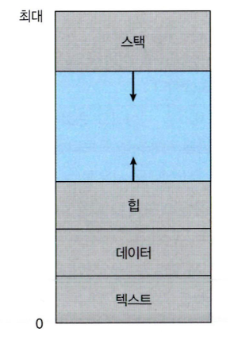
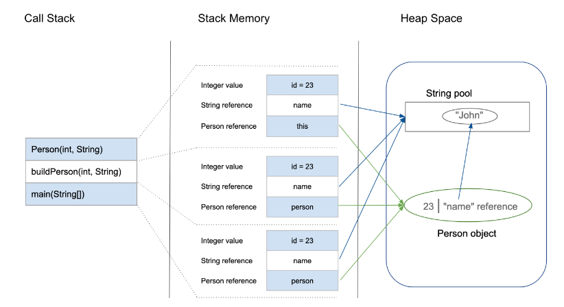
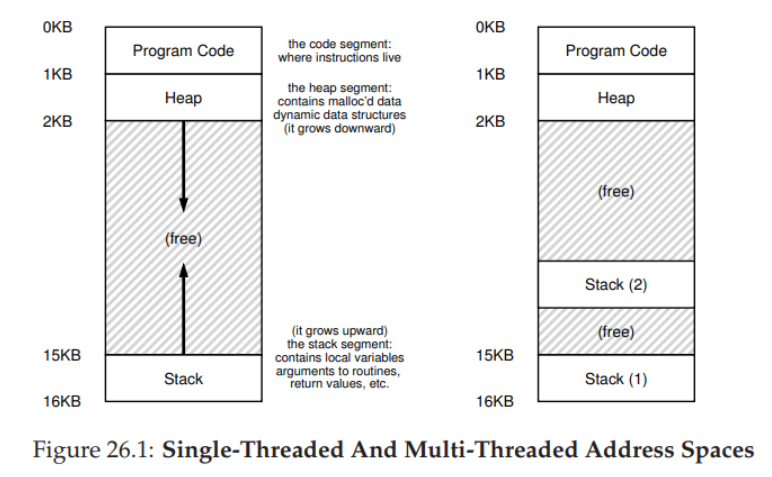

# cs_03_process_address

출처 : https://velog.io/@klm03025/

## 프로세스 주소 공간

- **Stack**

  - 함수의 호출과 관계되는 **지역변수와 매개변수**가 저장되는 영역

  - 함수 호출         => 할당

  - 함수 호출 완료 => 소멸

  - 메모리가 높은 주소에서 낮은 주소의 방향으로 할당

  - 지역 변수가 너무 많으면 => stack overflow발생

    

- **Heap**

  - **런타임에 크기가 결정**되는 영역

  - 사용자에 의해 공간이 동적으로 할당 및 해제 (?)

  - 주로 참조형 데이터 (ex. 클래스) 등의 데이터가 할당

  - 메모리의 낮은 주소에서 높은 주소의 방향으로 할당된다.

    

- **Data**

  - **전역 변수나 Static 변수** 등 **프로그램이 사용할 수 있는 데이터**를 저장하는 영역이다.

  - 어떤 프로그램에 전역/static 변수를 참조하는 코드가 존재한다면, 이 프로그램은 **컴파일 된 후에 data 영역을 참조**하게 된다.

  - **프로그램의 시작과 함께 할당**되며, **프로그램이 종료되면 소멸**한다

    - 즉 프로그램과 같은 사이클을 가진다.

  - **초기화 되지 않은 변수 존재** => **BSS영역에 저장** 된다.

    

- **Text**
  - CPU가 해석가능한 기계어 코드가 저장되어 있는 공간
  - 프로그램이 수정되면 안됨 => Read Only 상태로 저장 되어있음

## 최적화

### Data /  Stack 

- stack 영역을 통해서 **함수의 흐름** 관리
- Data영역(+BSS)을 통해 전역변수, static 변수 관리
- **멀티 스레드**
  - 각각의 스레드는 자신만의 stack영역을 가진다.
  - 스레드 내에서 수행되는 **함수의 흐름을 각각 관리하기 위함**

- **Data 영역의 공유**
  - Stack은 각자의 공간을 가짐 하지만 Data는 공유공간을 가진다.
  - 즉 메모리를 절약할 수 있음

### Heap의 크기와 Stack의 크기

### Mulit Thread

- 쓰레드는 Stack영역 외에 것들은 다른 쓰레드와 공유한다고 볼 수 있음
- 따라서 **Data 영역**에 있는 자원은 **동시에 여러 스레드 접근 가능**
  - 동기화를 통해 문제 해결

