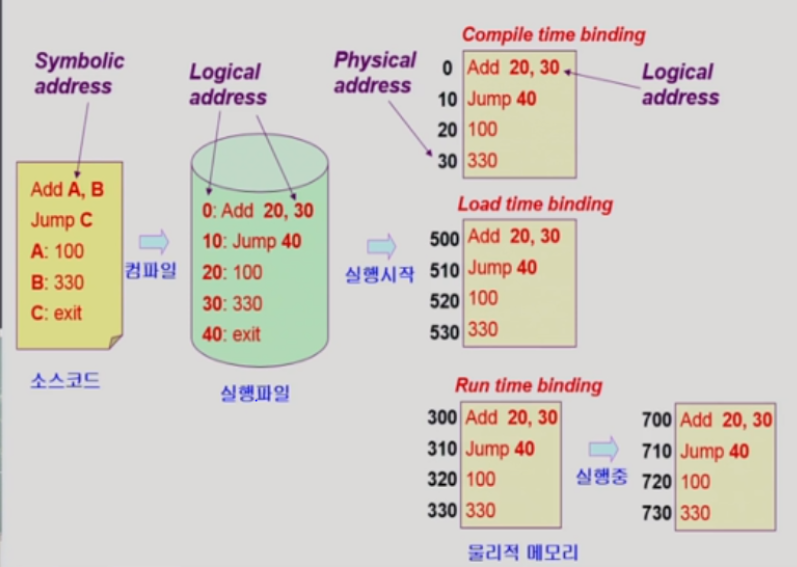
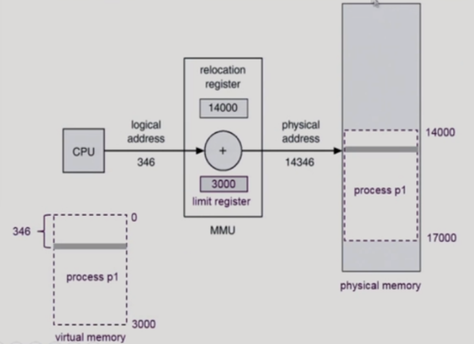
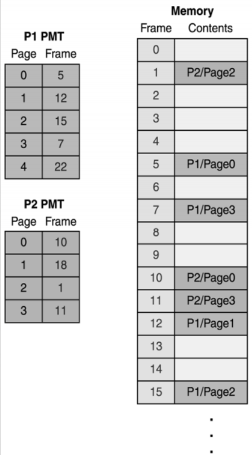
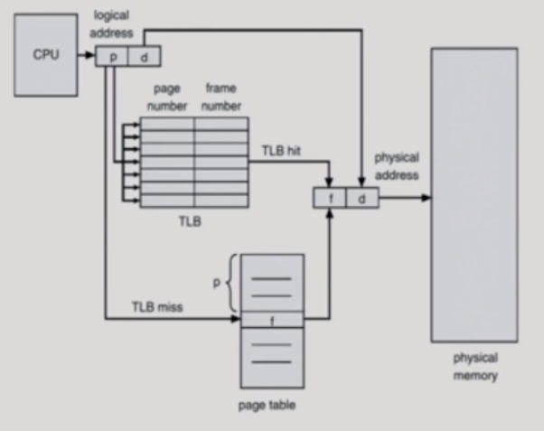

# cs_07_paging

- 출처

  - https://cocoon1787.tistory.com/859
  - https://cocoon1787.tistory.com/860
  - https://github.com/jayho-k/TIL/blob/master/CS/operating_system/07_Memory_Management.md
  

## 00_binding

### 0_1) address 종류

- Logical address(= Virtual address)

  - 프로그램만의 독자적인 메모리 공간

  - cpu가 보는 주소

    

- Physical address

  - 메모리에 실제 올라가는 위치

    

- Symbolic address

  - 프로그래머가 변수로 이름을 짓는 것

### 0_2) address binding

> - Physical address에서 Logical address로 바뀌는 시점이 언제인가??
> - Compile time binding
> - Load time binding
> - Execution time binding (Runtime binding)

**Compile time binding**

- 컴파일 나는 시점에 이미 물리적인 주소까지 저장이되는 것

- 컴파일 타임 주소 할당은 프로세스 내부에서 사용하는 논리적 주소와 물리적 주소가 동일하다. 

- 만약 위치가 변경된다면 재컴파일을 해주어야 한다.

- 문제점

  - 주소가 고정되어 있기 때문에 메모리 상에 빈 공간이 많이 발생할 수 있어 비효율적이고, 로드하려는 위치에 이미 다른 프로세스가 존재할 수 있다. 

  

**Load time binding**

- 이 프로그램을 실행시키는 시점

-  논리적 주소와 물리적 주소가 다르다.

- 실제로 잘 사용하지 않는다.

  

**Execution time binding (Runtime binding)**

- **프로세스가 수행이 시작된 이후에 프로세스가 실행될 때 메모리 주소를 바꾸는 방법이다**
- **MMU(Memory Management Unit)**라는 하드웨어 장치를 사용하여 논리적 주소를 물리적 주소로 바꿔준다. 

- load와 차이점
  - 실행중에 주소가 바뀔 수 있음
  - 수행이 시작된 이후에도 프로세스의 메모리상 위치를 옮길 수 있음
  - cpu가 주소를 참조할 때마다 binding을 수시로 점검해야한다.
    - (가상메모리 주소가 물리적인 주소에서는 어디인지 봐야한다)라는 뜻
  - 하드웨어적인 지원이 필요하다
    - 매번 주소변환이 필요하기 때문에

### 04_MMU (Memory management Unit)

- MMU란?
  - CPU코어 안에 답재되어 가상주소를 실제 메모리 주소로 변환해주는 장치

- 사용자 프로그램
  - 논리적인 주소만 다룬다.
  - 실제 물리적 주소를 볼 수 없다.

- 2개의 register필요

  - **relocation register**

    - 시작 위치를 알고 있음
    - 가상 주소가 들어오면 거기다가 relocation에서 알려주는 값을 더함
    - => 물리메모리

    

  - **limit register**

    - 논리적인 주소의 범위를 알려준다.
    - 3000을 가지고 있다면?
    - 14000에서 17000까지 주소의 번위를 제한한다.

## 01_Memory Fragmentation

### 01_1 ) Memory Fragmentation이란?

- 컴퓨터는 메모리에 해당 프로그램을 올리고 실행
- 이때 주기억장치 상에서 빈번하게 기억장소가 할당되고 반납 됨
  - **메모리 공간이 작은 공간으로 나위게 됨**
  - 사용 가능한 메모리가 충분함에도 불구하고 메모리 할당이 불가능한 상태가 발생
    - 이것을 Memory Fragmentation이라고 한다.

### 01_2) Memory Fragmentation의 종류

> - 내부 단편화
> - 외부 단편화

**내부 단편화**

- 주기억장치 내의 **실행 프로그램 < 사용자 영역**
  - 메모리 할당 후 사용되지 않고 남아있는 공간을 의미
- ex)
  - 메모장을 실행
  -  OS가 4KB만큼의 메모리를 할당
  - 그러나 1KB만큼만 사용하고 있음
    -  필요 이상으로 프로세스가 메모리를 할당받았기 때문에 내부 단편화가 3KB만큼 생김

**외부 단편화**

- 주기억장치 내의 **사용자 영역 < 실행 프로그램**
  - 프로그램이 메모리가 할당되지 않고 남아있는 공간을 의미

- 메모리가 **할당되고 해제되는 작업이 반복적으로 일어날 때 발생**

## 02_메모리 관리 기법

**1. 연속 메모리 기법**

- 프로그램 전체가 메모리에 연속적으로 할당

  - **고정 분할 기법**

    - 메모리가 고정된 파티션으로 분할
    - **내부 단편화 발생**

    

  - **동적 분할 기법**

    - 파티션들이 동적으로 생성되고 자신의 크기와 같은 파티션에 메모리 할당
    - **외부 단편화 발생**

**2. 불연속 메모리 기법**

-  프로그램의 일부가 서로 다른 주소 공간에 할당
  - Page => 프로세스를 고정된 크기로 나눈 블록
  - Frame => 메모리를 고정된 크기로 나눈 블록
  - Segment => 서로 다른 크기의 논리적 블록

## 03_Paging

- 프로세스의 주소 공간을 **고정된 사이즈의 Page 단위로 나눔**
  - 물리적 메모리에 **불연속적으로 할당**
  - 당장 필요한 부분 => 먼저 올려좋음
  - 일부는 backing storage에 올려놓는다

- **(물리적인) 메모리** : **Frame**이라는 고정 크기로 분할 

- **프로세스** : **Page**라는 고정 크기로 분할

  - 페이지와 프레임은 크기가 같음

  - 페이지와 프레임을 대응시키는 page mapping 과정이 필요

    - paging table을 생성해야 한다.

      

### Paging Table

- 주소변환을 위한 table
- table에서 각각의 번호 => **엔트리**
- valid
  - 비트가 valid하다 ? ==> 정말 올라가 있구나?
  - 비트가 invalid하다? ==> 메모리가 실제로 올라가있진 않구나
-  **페이지 번호**
- **해당 페이지가 할당된 프레임의 시작 물리 주소를 저장**

**장점**

- 연속적이지 않은 공간 => 활용가능 => 외부 단편화 해결

  

**단점**

- 내부 단편화가 생길 수 있음
- page단위로 자르다 보면 마지막에 남은 짜투리
- 프로세스의 크기가 페이지 크기의 배수가 아닐 경우 마지막 페이지에 내부 단편화가 발생하고 **페이지의 크기가 클수록 내부 단편화가 커짐** 
  - => **페이지 단위를 작게 하면** 내부 단편화 문제도 해결할 수 있겠지만 **page mapping 과정이 많아지므로 효율이 떨어짐**

- p = page번호
- d는 p번호로 부터 얼마나 떨어져 있는지
  - f는 d만큼 떨어져 있는 번호
  - 상대적인 위치는 같다

### Paging Hardware with TLB

**page table위치**

- page테이블 자체가 main memory에 있으면 문제가 생긴다.
  - page table접근 1번 + data/instruction 접근 1번 => 2번 접근해야한다.
- **캐쉬 메모리 사용**=> **TLB**

**TLB의 단점**

- context switch가 날 때 모든 엔트리가 다 지워져야 한다.
  - why??
    - 현재 cpu가 잡고있는 그 프로그램의 page table의 page number와 frame number가 잡고 있기 때문에 다른 것이 들어오면 다시 지우고 새로 받아줘야한다.
  - 그래서 context switch가 많은 overhead를 일으킨다고 하는 이유중에 하나이다.

## Segmentation

> - 동일한 크기가 아님
> - 의미 단위로 주소공간을 자르게 된다.

- 각 세그먼트는 연속적인 공간에 저장
- 세그먼트들의 크기가서로 가르기 때문에 메모리에 적재될 때 빈공간을 찾아 할당
- 페이징과 마찬가지로 mapping을 위한 segment table필요
  - paging과 달리 limit가 필요하다.
  - 왜냐하면 서로 크기가 다 다르기 때문이다.

###  Paging vs Segmentation

- Paging은 고정 크기를 가짐
- Segmentation은 가변 크기를 가짐
- Paging은 내부 단편화 발생 가능, Segmentation은 외부 단편화 발생 가능

현실에서 segment를 많이 사용하지 않음

- 사용한다면 segment with page를 사용한다고 한다.
- 세그먼트가 여러개의 페이지로 구성이 된다.

## 03_가상 메모리

- 실제 메모리 크기와 관계없이 메모리를 사용
  - => 가상 메모리 주소를 사용
  - 대부분 paging기법을 사용한다.
- 프로세스의 일부분만 메모리에 로드 => 나머지 보조기억장치(가상 메모리 공간)에 할당
- MMU(Memory Management Unit)를 통해 논리 주소, 물리 주소를 나누어서 사용
- 가상 주소를 주기억장치의 실제적인 주소로 매핑(Mapping)하는 방법을 통해 구현

**MMU(Memory Management Unit)**

- relocation register : 
  - 시작위치를 알고 있음
  - 가상 주소가 들어오면 relocation에서 알려주는 값을 더해주면 물리 메모리
- limit register
  - 논리적인 주소의 범위를 알려준다.
  - 3000을 가지고 있으면 14000~17000까지 범위

