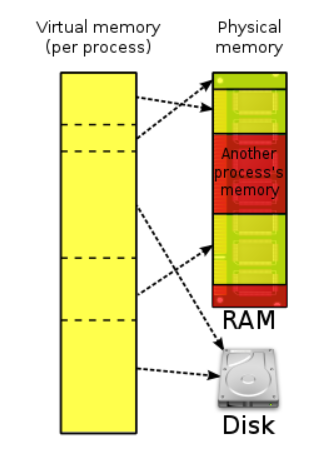
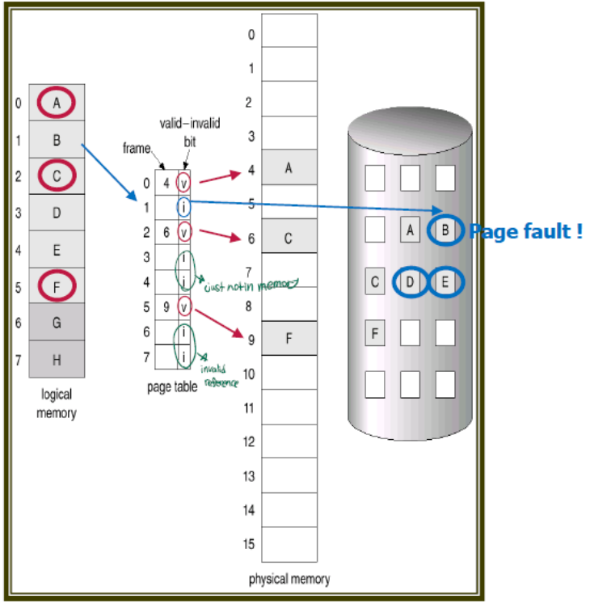
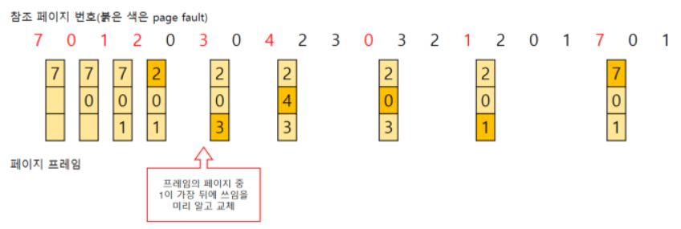
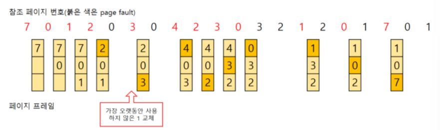
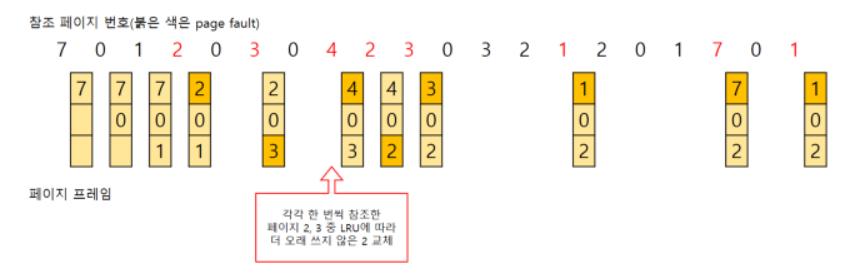
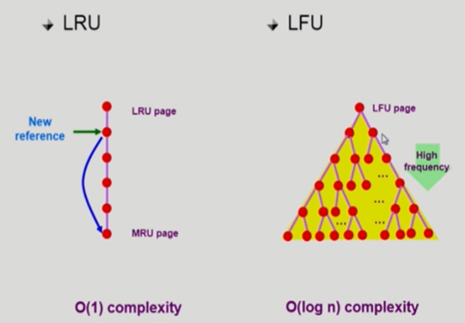
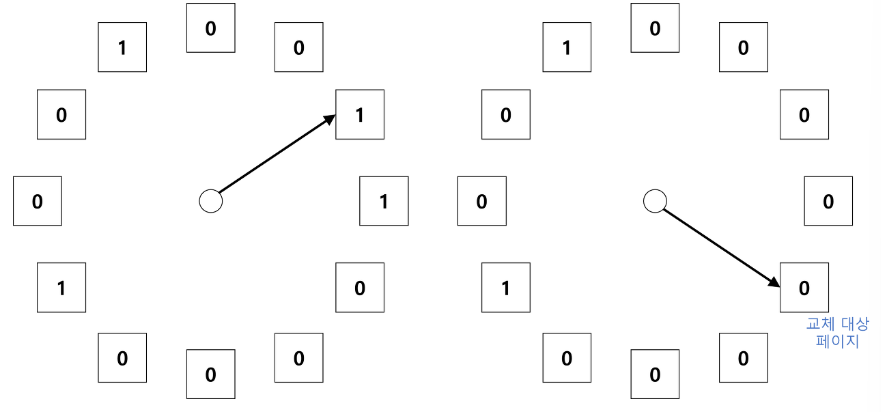

# cs_08_Page_Replacement_Algorithm

https://code-lab1.tistory.com/59

## Virtual Memory

- 기계에 실제로 **이용 가능한 자원을 추상화**
- **사용자들에게 매우 큰 메모리인 것처럼 보이게 만드는 것**
- 즉, 프로그램에 실제 메모리 주소가 아닌 가상의 메모리 주소를 주는 방식이다.

**장점**

- 사용자 프로그램이 물리 메모리보다 커져도 된다. 즉 **메모리 크기의 제약이 자유로워진다.**
- 각 사용자 프로그램이 더 적은 메모리를 차지하여 **더 많은 프로그램을 동시에 수행할 수 있다.**
- **CPU 이용률과 처리율이 높아진다.**
- 프로그램을 메모리에 올리고 스왑 하는 필요한 입출력 횟수가 줄어든다.
- 가상 메모리 파일의 공유를 쉽게 하고 공유 메모리 구현을 가능하게 한다.
- 프로세스 생성을 효율적으로 처리할 수 있는 메커니즘을 제공한다.

## Demand Paging

- **요청**이 있으면 그 페이지를 **메모리에 올리겠다는 뜻**
- **당장 실행에 필요한 페이지**만 **메모리에 적재**하는 기법이 요구 페이징
- 당장 실행에 필요없는 부분은 **Backing Store**에 저장해놓았다가 필요할 때 메모리에 올리게 된다. 

### Demand Paging가 있는 이유

- 프로세스를 실행 시 모든 부분이 필요한 것은 아니다.
-  실행 시 필요한 부분만 메모리에 올림으로써 **메인 메모리에 올라가는 프로세스의 크기를 줄일 수 있다.**

- **장점**
  - I/O양의 감소(왜냐하면 필요한것만 메모리에 올리기 때문에)
  - 메모리 사용량 감소
  - 빠른 응답시간
  - 더 많은 사용자 수용(동시에 메모리에 올릴 수 있기 때문에)

## Valid- Invalid Bit

- Demand page를 사용할 때 필요한 페이지가 메모리에 존재할 수도 있고 Backing Store에 존재할 수도 있다
- 페이지가 메모리에 적재되어 있는지 판단할 방법 => Valid- Invalid Bit

- 모든 page table => valid-invalid bit가 존재
- invalid(0)하다면 **Page Fault가 발생**

**Page Fault**

1. 해당 page => invalid (메모리에 없음) => OS부름(Page Fault Trap)
2. OS (PCB check)
   - 주소와 접근권한 맞는지 확인
   - 빈 page (빈 공간) 존재 => 넣어줌
   - 없음? => **교체 알고리즘(Page Replacement Algorithm)**
3. invalid => valid로 바꿔줌

## Page Replacement  Algorithm

### FIFO(First In First Out) 

- 선입 선출 => 큐
- 효율 안좋음 => page fault가 줄어들지 않을 수 있음

### OPT(Optimal)

-  **가장 오랫동안 사용하지 않을** 페이지를 교체
- 실제로 구현하기 거의 불가능한 알고리즘
- 이것을 기준으로 Algorithm을 짜게 되는 것

### LRU(Least Recently Used) 

- 가장 오랫동안 사용하지 않은 페이지를 교체
- OPT(최적 알고리즘)과 비슷한 효과
- 성능이 좋은 편이다.
- 많은 운영체제가 채택하는 알고리즘이다.

### LFU(Least Frequently Used)

- 참조횟수가 가장 적은 페이지를 교체 => 사용빈도가 적은 것
- 교체 대상이 여러 개라면 가장 오랫동안 사용하지 않은 페이지를 교체

**구현**

- LRU
  - 줄세우기를 함
  - 들어올때마다 맨 뒤로 보냄
  - 제일 위에 있는 것을 쫒아냄
  - O( 1 )
- LFU
  - 줄세우기하면 비효율적 = sort해야하기 때문
  - 그래서 힙으로 구현
  - O( logn )

## Second Chance Algorithm (Clock Algorithm)

- paging system에서 LRU와 LFU 알고리즘을 실제로 사용할 수 없음
- LRU와 LFU의 알고리즘 구현에서 운영체제가 자료구조를 변경하고 유지하는 작업을 수행해야한다.
  - 이미 메모리에 page가 올라가 있는 경우에는 CPU가 운영체제에 넘어가지 않는다
- **LRU의 근사(approximation) 알고리즘**

순서

- invalid
- page fault가 일어남
- CPU제어권 (프로세스 A => OS)
  - **즉 => valid하면 OS한테 CPU제어권이 안넘어감**
  - 그럼 얼마나 참조되었는지 OS가 check를 안해서 모름

- 한바퀴 되돌아와서도 0이면 replace당함

