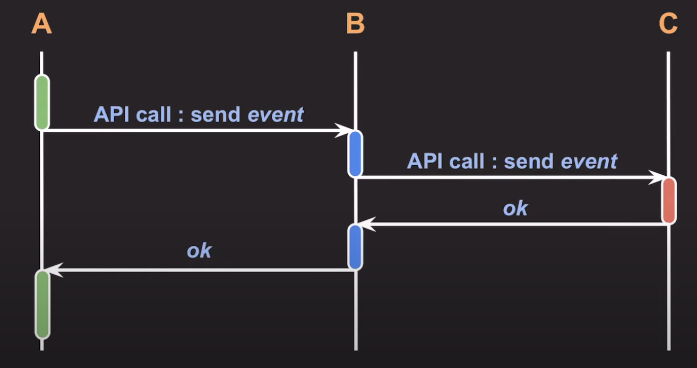
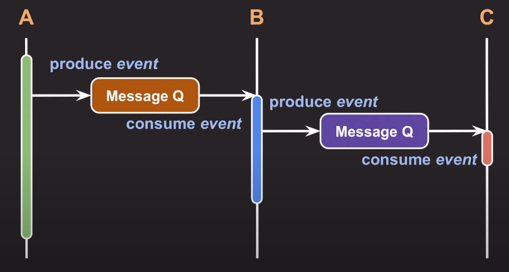

# cs_10_Syncronous_Asyncronous

> https://www.youtube.com/watch?v=EJNBLD3X2yg&t=320s

## Syncronous 와 Asyncronous란?

- **Syncronous**
  - 여러 작업들을 **순차적으로** 실행하도록 개발

- **Asyncronous**
  - 여러 작업들을 **독립적으로** 실행하도록 개발

### Asyncronous를 가능 하게 하는 방법

- **Mulit-threads**

  

  - 장점 :

    - 여러가지 작업을 나눠가져서 작업을 동시에 실행 가능함

      

  - 단점

    - context switching에 비용을 많이 사용하게 된다.

    - race condition발생 가능성 => 동기화

      

- **Non-block I/O**

  

  - 장점
    - 싱글 쓰레드라도 여러가지 일을 동시에 할 수 있게 된다.

백엔드 추세

- **스레드를 적게** 쓰면서 **Non-block I/O를 통해 전체 처리량을 늘리는** 방향으로 발전

## I/O관점에서 비동기

###  관점 1

- Synchronous I/O = block I/O
- Asynchronous I/O = non-block I/O

### 관점2

- Synchronous I/O = 요청자가 I/O 완료까지 챙겨야 할 때
  - 
- Asynchronous I/O = 완료를 noti 주거나 callback으로 처리
  - 요청자가 I/O를 직접 챙길 필요없이 noti를 받는다는 뜻
  - 작업을 시작할 떄 callback을 전달해서 작업이 완료되면 알아서 실행

### 관점3

**Asynchronous I/O : block I/O를 다른 thread에서 실행**

- thread A가 코드실행 중 중간에 block I/O를 실행해야 한다. 
  - 그러면 tread A 가 block이 되어야 한다. 하지만 그러고 싶지 않기 때문에 **thread B를 만들고 thread B에다가 block을 요청하는것**

## 백엔드 아키택쳐 관점

- 하나의 서비스는 **기능과 역할**에 따라 여러개 **마이크로 서비스**로 구성되고
  이들 사이에는 빈번하게 **커뮤니케이션이 발생**한다.

### Synchronous Communication

- A B C : 각각의 마이크로 서비스
- **문제점**
  - 만약 C에서 응답 불능?
    - 영향 ==> B도 응답 불능 ==> C도 응답 불능

### Asynchronous Communication

- 핵심

  - **Message Q를 사용하는 것**

  - API로 직접호출하는 것이 아님

    

- 상황1

  - A에서 작업을 진행 중에 B가 관심있을만한 event발생 

    - ==> **Message Q에 넣는다** ==> **A작업을 계속 진행** 

      

  - B에서는 Message Q에 값이 있으면 작업을 시작한다. ==> C가 관심있을만한 event 발생

    - ==> Message Q에 넣는다. ==> B작업 계속 진행

- 상황 2
  - 만약에 A에서 B에서 제공하는 데이터를 사용?
    - 그러면 API로 직접 호출을 해주어야한다.
    - 왜냐하면 Message Q가 느리기 때문에
    - 하지만 B에서 문제가 생겼을 때 A까지 문제가 번지지 않도록 처리를 해주는 것이 좋음

**장점**

- A,B,C 중에서 문제가 생길 경우에 그 문제가 다른 곳에 번지지 않는다.

