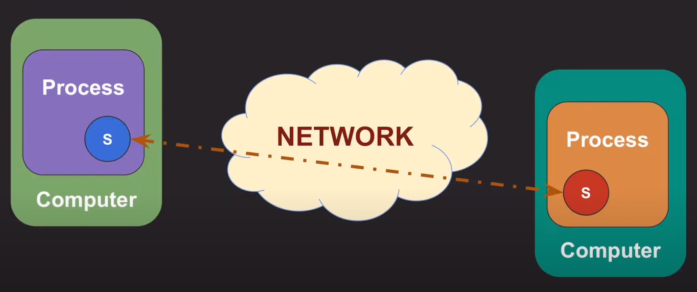
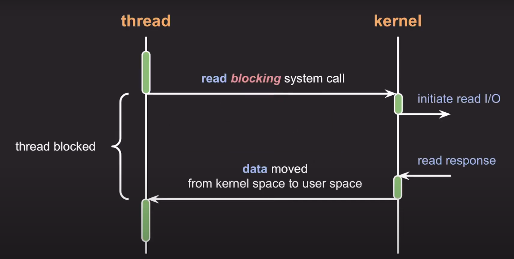
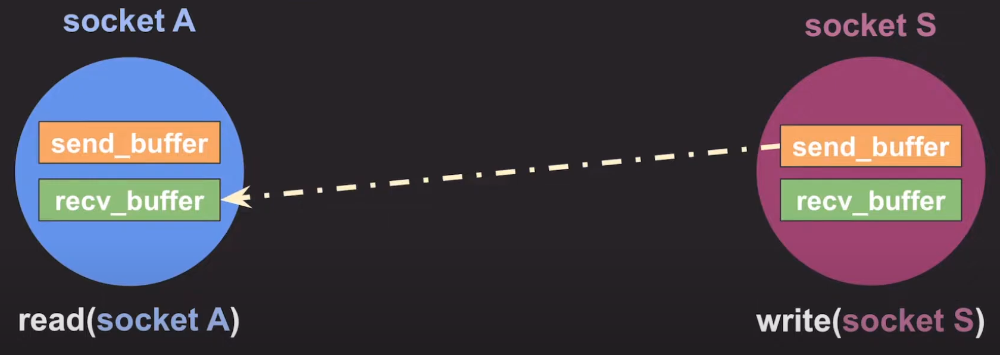
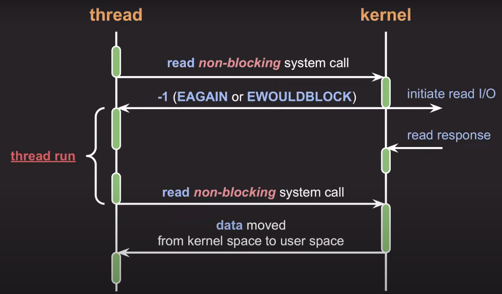
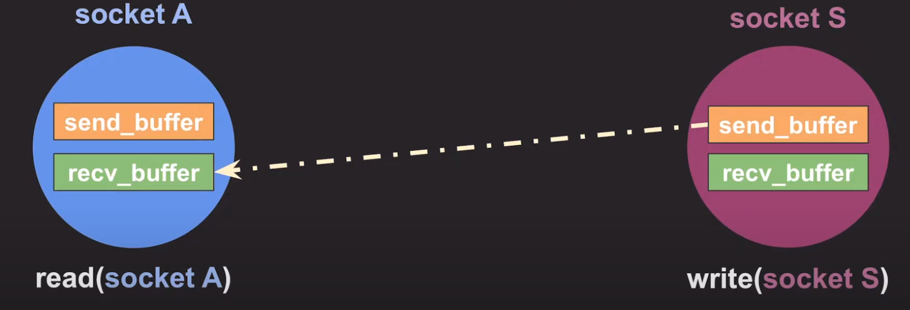
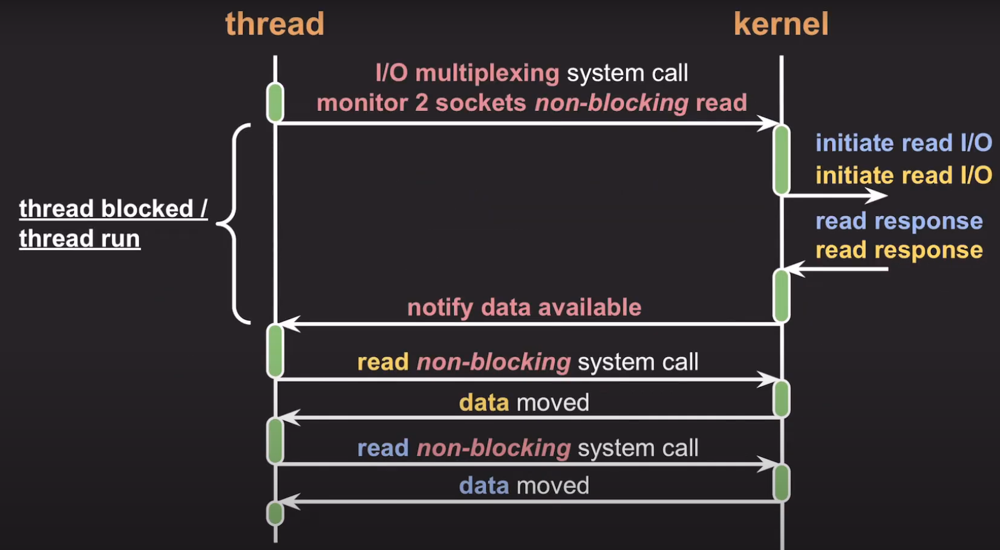
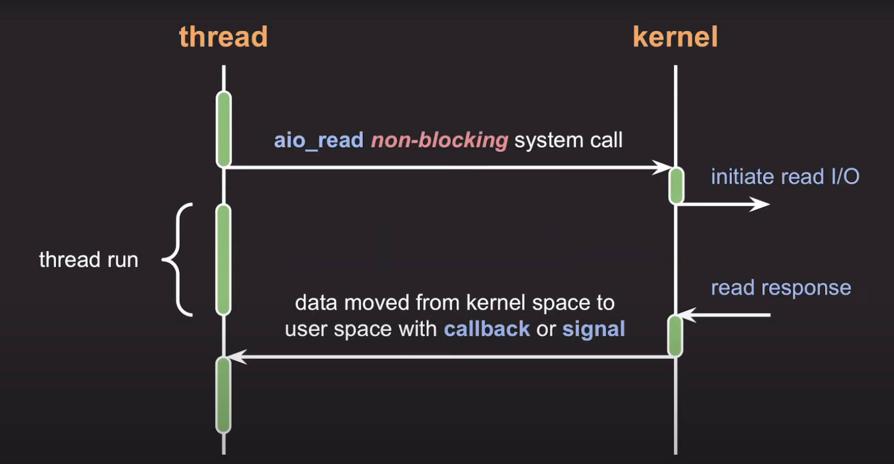

# cs_11_blocking_nonBlocking

**block I/O**

- I/O 작업을 요청한 **프로세스/스레드는 요청이 완료될 때까지 블락됨**

## socket이란

- 네트워크 통신은 socket을 통해 데이터가 입출력 된다.
- 서로 다른 컴퓨터가 서로 데이터를 주고 받고 싶을 경우 Soceck을 열고 데이터를 주고 받을 수 있다.
- **backend server** 
  - 네트워크 상의 요청자들과 각각 소켓을 열고 통신

## block I/O 와 non-block I/O 

### block I/O란?

- I/O 작업을 요청한 프로세스/스레드는 **요청이 완료될 때까지 블락**되는 경우
- 상황
  - read systemcall을 발생
  - **thread는 block이 된다.**
  - kernel에서는 read I/O를 실행시킨다. => 응답을 받고 
    => data를 kernel space에서 user space로 이동시킨다.
  - thread block해제

### Socket에서 block I/O란?

- 상황 : socket S에서 socket A로 data를 보내려고 한다.

  -  socket A는 기다려야한다.

    - send 버퍼

    - recv 버퍼 => read systemcall를 진행할 경우

      - recv버터에 값이 올 때까지 A는 block이 된다는 뜻

        

  -  socket S

    -  socket S도 블락이 될 때가 존재한다.
    - send 버퍼가 가득 찰 경우 빈공간이 생길때 까지 block이 된다.

### non - block I/O란?

- 프로세스/스레드를 블락시키지 않고 요청에 대한 **현재 상태를 즉시 리턴**

- 상황
  - read system call + **Non blocking**으로 실행
  - Kernel mode로 context switching이 되고 read I/O작업을 실행시킨다. 
  - **Kernel에서 바로 -1을 return을 시킨다.**
  - 이어서 다른 코드를 실행할 수 있게 된다.
  - **다시** read system call + **Non blocking**으로 실행
  - 데이터가 준비되어 있는 상태라면?
    - data를 반환하게 된다.

### Socket에서 Non-block I/O 란?

- 상황 : socket S에서 socket A로 data를 보내려고 한다.

  - Socket A

    - recv 버퍼에 data가 있는지 read로 확인한다.

      - 데이터가 없음 ==> 데이터가 **없다고 return되고** read system call **바로 종료**

        

  - Socket S

    - send 버퍼가 가득 찰 경우 에러코드와 값이 반환이 된다.

## Non-block I/O 결과 처리 방식

> 데이터를 언제 확인하지?

### 1. 완료됐는지 반복적으로 확인

- 위에 예시가 여기에 속한다.
  - 문제점
    - 완료된 시간과 완료를 확인한 시간 사이의 갭이 존재
    - 즉 **처리속도가 느려질 수 있음**, 확인할 떄 thread가 kernel에게 system call을 불러야함
    - 완료됐는지 반복적으로 확인 ==> **CPU 낭비**

### 2. I/O  multiplexing(다중 입출력) 사용

- **I/O  multiplexing란?**
  - 관심있는 **I/O 작업들을 동시에 모니터링**하고 그 중에 **완료된 I/O 작업들을 한번에 알려줌**

- 상황

  1. I/O multiplexing system call을 2개의 socket에서 non-blocking으로 read실행 

  2. kernel에서 read I/O를 2개 보내게 된다.

  3. thread에서는?? 

     - block이 될 수도 있고, 다른 코드를 더 실행할 수도 있다.

     - 여기서는 block이 된다고 가정

       

  4. kernel에 read response를 동시에 받게 됐을 경우

     - 데이터를 사용할 수 있다고 kernel에서 알려준다.

       

  5. thread는 blocking모드에서 깨어나게 된다.

  6. 순차적으로 data를 읽어오게 된다.

     - 1번째 read non-blocking system call
     - 2번째 read non-blocking system call

### I/O  multiplexing의 종류

- select , poll ==> 성능이 좋지 않기 떄문에 잘 쓰이지 않음
- **epoll** : 리눅스에서 사용 
- **kquque** : Mac
- **IOCP(I/O completion port)** : 윈도우

### Epoll 

- 8개의 socket이 열려있음
- 이 중에서 하나라도 read 이벤트가 발생한다면 알려줘! 라고 등록을 하게된다.
- 1,3,5 소켓이 있다고 가정한다면 1,3,5 socket이 요청한 data가 준비되었다고 noti를 보낸다(알려준다.)
- 그럼 1,3,5 만 read system call을 실행하면 된다.
- 만약 thread pool을 사용하게 된다면 미리 스레드를 여러개 만들어 놨다가 3개의 thread가 동시에 값을 받아오는 것을 처리

### 3. Callback / signal 사용

- 상황
  - aio_read non-blocking 시스템 콜을 호출한다.
  - thread는 run으로 동작한다.
  - kernel에서 data준비 완료
    - Kernel에서 user 공간으로 data가 이동한다.
    - **추가로 callback 이나 signal을 가지고 이동한다.**

**Callback / signal 종류**

- POSIX AIO
- LINUX AIO

