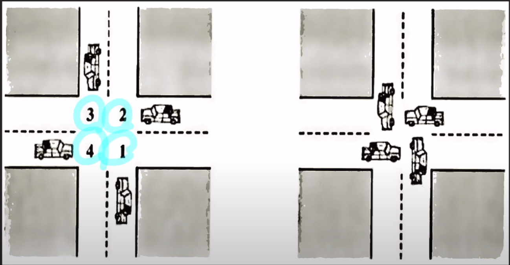

# cs_12_deadlock


## Deadlock이란?

- **두개 이상의 프로세스** 혹은 스레드가 **서로가 가진 리소스를 기다리는 상태**
- 리소스란
  - critical section, CPU, SSD등의 자원을 말한다.


## Deadlock을 만드는 4가지 조건



### 1. Mutual exclusion

- 리소스를 공유해서 사용할 수 없다.
- ex_ 자동차에서 resource를 공유? ==> 교통사고


### 2. Hold and Wait

- 프로세스가 **이미 하나 이상의 리소스**를 hold(취득)한 상태에서 **다른 프로세스가 사용하고 있는 리소스를 추가**로 wait(기다린다)한다.


### 3. No preemption

- 리소스 반환(release)은 오직 그 리소스를 취득한 프로세스만 할 수 있다.
  - 한 프로세스가 리소스를 가지고 있음 => **다른 프로세스가 리소스를 빼앗아 갈 수 없음**


### 4. Circular wait

- 프로세스들이 순환(Circular) 형태로 서로의 리소스를 기다린다.


## Deadlock을 해결하는 방법


### 1. Deadlock 방지

- 네가지 고건 중 하나가 충족되지 않게 시스템을 디자인

  1. 리소스를 공유가능하게 함 ==> **불가능**

     

  2. hold and wait 

     - 사용할 리소스들을 **모두 획득한 뒤에 시작** 

     - **리소스를 전혀 가지지 않은** 상태에서만 리소스 요청

     - 문제점

       - 만약 2,3 필요 => 2번 오래걸림 => 3번 자원 놀고 있음

       - 2,3번 인기 많음?  ==> 확보자체가 어려움

         

  3. 빼앗음 가능

     - CPU에서 context switching과 비슷함

       

  4. 모든 리소스에 순서 체계를 부여 ==> 오름차순 리소스를 요청

     - 만약 4번 차가 리소스를 획득하고 싶음

       - 1번을 먼저 획득한 뒤에 4번을 획득할 수 있음

         

       - **4가지중에 가장 많이 사용된다.**


### 2. Deadlock 회피

- 실행 환경에서 **추가적인 정보를 활용**해서 데드락이 발생할 것 같은 상황을 회피
  - 추가적인 정보
    - 현재 사용가능한 리소스, 할당된 리소스들, 미래에 있을 리소스 요청등의 정보

- Banker algorithm
  - 리소스 요청 허락 => 데드락 발생 가능성 존재? => 안전할 때까지 요청 거절


### 3. Deadlock 감지와 복구

- 데드락을 허용함 ==> 발생하면 복구함

1. 프로세스를 강제로 종료 

   - 모두 종료

   - 하나씩 종료시킴

     

2. 리소스의 일시적인 선점을 허용

   - 데드락 발생? ==> 빼앗을 수 있게함
   - 1번은 2번이 필요 ==> 2번이 양보해줌


### 4. Deadlock 무시

- 개발자가 알아서 하겠지


## 프로그래밍 레벨에서 Deadlock

```java
public class Main{
    public static void main(String[] args){
        Object lock1 = new Object();
        Object lock2 = new Object();
        
        Thread t1 = new Thread(()->{
            synchronized(lock1){
                sout("[t1]getlock1");
                synchronized(lock2){
                    sout("[t1]get lock2");
                }
            } 
        });
        
        Thread t2 = new Thread(()->{
            synchronized(lock2){
                sout("[t2]getlock1");
                synchronized(lock1){
                    sout("[t2]get lock2");
                }
            } 
        });
        t1.start();
        t2.start();
    }
}
```

- 이런 상황이 생기면 Deadlock이 발생하게 된다.

  

- **해결방안**

  1. thread 2의 lock2와 lock1의 위치를 바꿔준다.
  2. hold and wait가 생김 => 따라서 가능하면 lock1과 lock2를 분리 시킬 수 있다면 분리시킨다.


