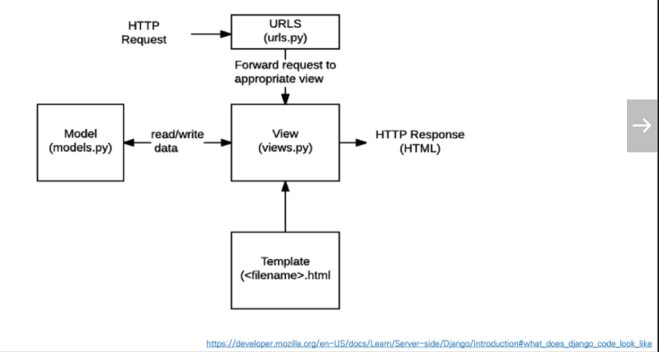
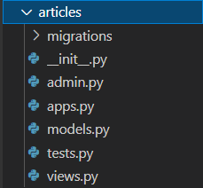
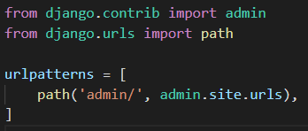
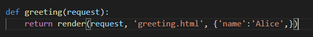
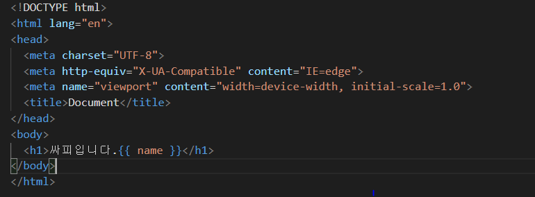
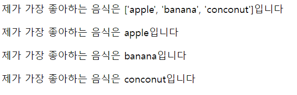
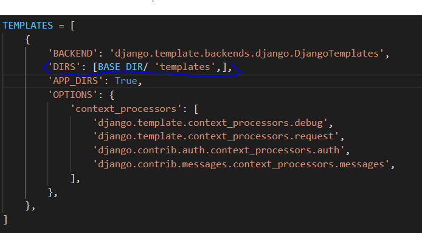
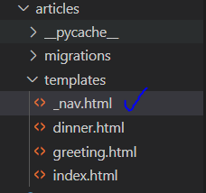
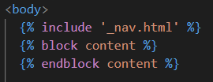

# 01Django

- 장고는 웹 프레임 워크이다


- 웹?
  - 클라이언트
    - 요청을 보냄
  - 서버
    - 응답을 해줌, 네트워크를 통해서 서비스등을 제공해준다
  - 요청
  - 응답

- Static web page(정적 웹페이지)
  - 서버가 정적 웹 페이지에 대한 요청을 받은 경우
    서버는 추가적인 처리 과정 없이 클라이언트에게 응답을 보냄
  - 따라서 모든 상황에서 모든 사용자에게 동일한  정보를 표시
  - 일반적으로 HTML, CSS, JavaScript로 작성된다.
- Dynamic web page(동적 웹페이지)
  - 서버는 추가적인 처리과정 이후 클라이언트에게 응답을 보낸다
  - 방문자와 상호작용하기 때문에 페이지 내용은 그때그때 다르다
  - 서버 사이드 프로그래밍 언어(python등등)가 사용되며 파일을 처리하고 데이터 베이스와의 상호작용이 이루어진다.


- Framework Architecture
  - MVC Dssign Pattern (model- view-controaller)
  - 소프트웨어 공학에서 사용되는 디자인 패턴 중 하나
  - 하지만 장고는 MTV pattern이라고 한다(model - tamplate - view)


- MTV란?
  - Model
    - 응용프로그램의 데이터 구조를 정의하고 DB의 기록을 관리(추가, 수정, 삭제)
  - Template
    - 파일의 구조나 레이아웃을 정의
    - 실제 내용을 보여주는데 사용
    - 어떻게 보여주지?? (HTML 파일)
  - View
    - HTTP 요청을 수신하고 HTTP응답을 반환
    - Model을 통해 요청을 충족시키는데 필요한 데이터에 접근
    - tmaplate에게 응답의 서식 설정을 맡김
    - 어떤 데이터를 보여주지?? (함수)


- MTV pattern



1. HTTP request
2. URLS
3. View(응답, 템플릿 모델과 상호작용)
4. 클라이언트에게 응답을 보냄


## Django설치하기

url ==> view ==> template

장고설치

1. 가상환경 생성 및 활성화

   - python -m venv (가상 환경 이름)
   - source venv/Scripts/activate

2. 장고 설치

   ```python
   pip install django==3.2.12
   ```

3. 프로젝트 생성

   - django-admin startproject {프로젝트 이름} .

4. 서버켜서 로켓확인

5. 앱 생성

   - python manage.py startapp {  app 이름 }
   - settings.py에 애플리케이션을 등록한다
   - urls.py로 url과 view를 매핑한다
     - from articles import views
     - path('articles/', views.articles.urls),

6. 앱 등록

   - view함수를 작성한다 => 관련된 html파일을 렌더한다.

7. html파일을 만들어준다

   - 이때, 앱 안에 templates라는 폴더 안에 해당 html파일을 만들어 준다.


- 프로젝트 이름 주의사항
  - 내부에서 쓰일만한 이름(class, django 등등)을 사용하지 않음
- 버전은 현재 3.2


- asgi.py
  - Asynchronous Server Gateway Interface
  - Django 애플리케이션이 비동기식 웹 서버와 연결 및 소통하는 것을 도움
- settings.py
  - 애플리케이션의 모든 설정을 포함하고 있음
- urls.py
  - 사이트의 url과 적절한 views의 연결을 지정
- wsgi.py
  - web server gateway interface
  - 장고 애플리케이션이 웹서버와 연결 및 소통하는 것을 도움

- manage.py
  - Django 프로젝트와 다양한 방법으로 상호작용 하는 커맨드라인 유틸리티




- admin
  - 관리자용 페이지를 설정하는 곳
- apps
  - 앱 정보가 작성된 곳
- models
  - Model을 정의하는 곳
- tests
  - 프로젝트의 테스트 코드를 작성하는 곳
- views
  - view함수들이 정의 되는 곳


### Project and Application

- ##### Project

  - Project는 Application의 집합
  - 프로젝트는 여러 앱이 포함될 수 있다.
  - 앱은 여러 프로젝트에 있을 수 있다


- ##### Application

  - 앱은 실제 요청을 처리하고 페이지를 보여주는 증의 역할을 담당
  - 하나의 프로젝트는 여러앱을 가진다
  - 일반적으로 앱은 하나의 역할 및 기능 단위로 작성한다


#### 어플리케이션 등록


- setting에서 찾으면 된다.
- articles (application)을 등록해주어야 한다.
- 주의 : 앱은 반드시 생성 후에 등록을 해야한다.

- 앱등록 순서(권장)

  1. Local apps (그래서 articles를 맨 위에다가 쓴 것이다)

  2. Third party apps

  3. Django apps


### 요청과 응답



- 장고는 admin 페이지를 기본적으로 구현이 되어 있다.
- trailing comma = 장고에서 권장하는 방식/ 뒤에 (,)를 적어주는 것
  - 이유: 생산성을 높이기 위함이다.


view함수의 규칙

- request라는 객체를 항상 받아야한다.
  - 이것을 작성하지 않으면 에러가 나게 된다.
- 

```python
def index(request):
    pass
```


- language와 time을 설정할 수 있다
  - settings에서 바꿀 수 있음


### Variable(변수)

- 딕셔너리를 사용할 수 있다






- {{ name }} 이 key값이고 Alice가 value값이다




- 리스트를 for문으로 쓰는 것도 가능하다


### filter

- 많은 함수들이 있음 ==> 공식문서를 통해서 확인할 수 있다.

주소 : https://www.djangoproject.com/


### Tag

```python
  #중괄호 안에 %가 들어가야한다.
```

- 일부 태그는 시작과 종료 태그가 필요하다.


- for + tag버튼을 누르면 자동으로 만들어 준다


### Template inheritance (탬플릿 상속)

- 만약 여러 템플렛을 bootstrap을 하라고 하면 하나하나 따로 해주어야 한다.
- 따라서 상속이 생김
- 이때 base.html에서 만든 block과 엔드 사이에 들어가는 것
- 알아야 하는 tag
  - extends
    - 자식템플릿이 부모 템플릿을 확장한다는 것을 알림
  - block content
    - 하위 템플릿에서 재지정 할 수 있는 블록을 정의한다.


- ##### 경로 추가 방법

  1. 폴더를 최상위층에다가 만든다
     - 이유: 장고가 그 폴더를 읽을 수 없다.

  2. 그뒤에 settings를 들어가서 TEMPLATES를 찾는다

  3. 그리고  [BASE_DIR/ 'templates',],를 적어준다

     - BASE DIR?
       - 현재 장고프로젝트를 가지고 있는 최상단 폴더

     - templates
       - 객체지향 파일 경로 위치

- 왜 이러한 경로를 쓸까??

  - macOS와 window등등 운영체제가 다양하기 때문에 하나로 통일해주기 위함이다




- include
  - base template이 너무 커지게 된다면 article에 있는 templates에다가 따로 _navbar.html등등을 만들어주어 따로 설계를 하게 되면 된다.
  - 이렇게 하면 더욱 깔끔하게 정리할 수 있다






