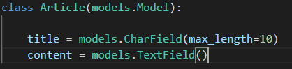
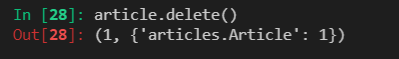

# 02.Django_crud

## 1. model

- Database

  - 체계화된 데이터 모음

- 모델

  - 단일한 데이터에 대한 정보를 가진다(데이터들의 필드를 관리 할 것임)

  - 일반적으로 각각의 model은 하나의 데이터 베이스 테이블에 매핑됨

- 쿼리
  - 데이터를 조회하기 위한 명령어

##### Database의 기본구조

- 스키마
  - 데이터베이스에서 자료의 구조, 표현법, 관계 등을 정의한 구조
- 테이블
  - 열 => field or 속성
  - 행 => recode or 튜플 ==> 즉 가로가 하나의 데이터

### ORM(Object-Relational-Mapping)

- 모델을 객체라고 볼 것이다.
- 장고와 sql은 전혀 다르다 ==> 하지만 ORM을 사용해서 장고에서 sql을 사용할 것 이다.
- 간단하게 ==> 파이썬 이용해서 sql다룰께~ 

- 장점
  - sql을 잘 알지 못해도 DB조작 가능
  - sql의 절차적 접근이 아닌 객체 지향적 접급으로 인한 생산성
- 단점
  - ORM만으로 완전한 서비스를 구현하기 어려운 경우가 있다.

##### Model 생성

- CharField
  - 장고의 유효성 검사에서 활용
  - (내가 원하는 데이터를 줬니 안줬니?)
  - 글자수 제한을 만들수 있다

- TextField
  - 글자수 제한이 없다

### Migrations

##### 순서

1. models.py

2. python manage.py makemigrations
   - migrations파일 생성
3. python manage.py migrate
   - DB반영(모델과 DB의 동기화)

- makemigrations = 설계도를 저장하겠어
- migrate = 만든것을 바탕으로 DB에 반영하기 위해서 사용
  - 즉 2개 다 설정해주어야 DB에서 작동을 할 것이다.

- sqlmigrate
- showmigrations

### DateField's option

- auto_now_add
  - 최초생성일자
  - 최초 insert시에만 련재 날짜와 시간으로 갱신
- auto_now
  - 최종 수정 일자
  - save할때마다 현재 날짜와 시간으로 갱신

### DB API

- Making Quries
  - Article.objects.all( )   ==> class name/ manager / QuerySet API

### CRUD (Create,Read, Update, Delete)

- ##### Create

1.  save를 해줘야 한다.
2.  save를 해줘야한다
3. save를 안해줘도 되고 return값이 나온다.

- ##### Read

  - all(  )
  - get(  )
    - pk나 title가능
    - 하지만 title이 같은 것이 있다면 불러올 수 없다
    - 타입 => articles 모델 => 인스턴스
  - filter(  )
    - title이 똑같은 것이 2개가 있다고 하더라도 다 불러올수 있다
    - 타입 => 쿼리셋

- ##### Update

  - 하나하나 개개인적으로 접근을 해야함

			1.  인스턴스에 직접 접근
			1.  어떤 정보인지 확인
			1.  title과 content를 바꿔줌
			1.  확인
			1.  저장

- #####  Delete

이렇게 하나만 지울수도 있고

filter를 사용해서 모아서 전체를 지울 수 있다.

### Admin

1. from models import Ariticle
   - models에서 Article을 가져와죠
   - 그 다음에 admin을 등록할께
   - 그리고 class는 display로 2개로 나눈뒤에 보이게 해줘

- title과 content를 두개로 나눠주게 만들 수 있다.

### crud를 view에서?

##### create

- 

##### read

- 

