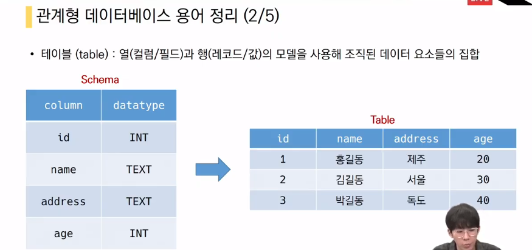
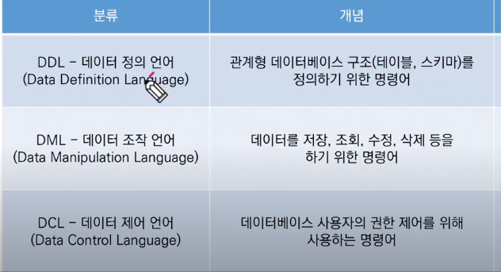

관계형 데이터 베이스

- Rlational Datanase
- 키와 값들의 간단한 관계를 표형태로 정리한 데이터 베이스

용어

- 스키마와 테이블

- Primary Key: 고유값

## RDBMS

- 관리형 데이터베이스 관리 시스템
  - ex) My SQL, SQLite, ORACLE
- SQLite 특징
  - 동적 데이터 타입
    - 타입을 지정하지 않아도 타입 선호도에 따라서 지정이 된다.
- SQL분류

- DML
  - insert
  - select
  - update
  - delete

