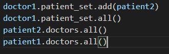
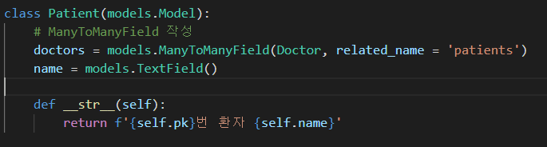

# DB

## Foreign key

- 관계형 데이터 베이스에서 한 테이블의 필드 중 다른 테이블의 행을 식별할 수 있는 키
- 댓글을 기준으로
- 게시글과 댓글 간의 모델 관계 설정

- FK ==> 게시글에서 id값이다 ==> 댓글을 기준으로!!

### FreignKey field

- many to one relationship
- 2개의 위치 인자가 반드시 필요
  - 참조하는 model class
  - on_delete 옵션
- comment 모델 정의

### on_delete

- 댓글이 달렸음
- 근데 게시글을 지웠음
- 참조되었던 댓글들은 어떻게 해결?

##### 데이터 무결성(추가)

데이터의 정확성과 일관성을 유지하고 보증하는 것을 가리킨다

- 개체 무결성
- 참조 무결성
- 범위 무결성

##### migrate할 때 주의할 점(외례키 (model))

article을 만들 떄 ==> 저절로 article_id , 즉 _id가 추가적으로 붙게 된다

따라서 article_id를 만들라고 할때 model에다가 article이라고 만들어야 한다.

##### 댓글작성

### 1:N 관계 related manager

- 역참조('comment_set')
  - Article(1) => comment(N)
  - article.comment형태로는 사용할 수 없음
    - 따라서 article.comment_set이라는 것이 생성 됨
  - 실제로 Article 클래스에 Comment와의 어떠한 관계도 작성되어 있지 않음
- 참조('article')
  - comment(N) ==> Article(1)
  - comment.article과 같이 접근 가능

## Comment Create

## comment read

## comment delete

## Substituting a custom User model

User 모델 대체하기

- 내장 USer모델이 제공하는 인증 요구사항이 적절하지 않을 수 있음
- 커스텀 유저 모델을 설정하는 것을 강력하게 권장!!!!!!
  - 단, 프로젝트의 모든 migrations 혹은 첫 migrate를 실행하기전에
  - 왜? ==> 중간에 바꾸기 시작하면 난이도가 너무 높아진다

## Custom user Built- in auth form

#### 문제 1 : 회원가입이 안됨

- 이유?
  - 기존에 User를 model로 쓰고 있었기 때문이다
  - 어디에?
    - UserCreationForm
    - UserChangeForm
- 해결방법
  - 커스텀 User로 모델 대체 해주어야 한다
  - 그리고 signup에 대체

##### get_user_model()

- 현재 프로젝트에서 **활성화된** 사용자 모델을 반환

## Model Relationship

### 1: N 관계 설정

- User- Article
- User - Comment

### User - Article

- 사용자 : 여러개의 개시물을 작성할 수 있다.

  1. setting.AUTH_USER_MODEL
     - models.py에서user를 사용할 때만 사용

  2. get_user_model( )
     - models.py가 아닌 다른 모든 곳에서 유저 모델을 참조할 때 사용

  - 이유:
    - 장고 app 실행순서 때문에
      - installed app 실행 
      - 그다음에 각 앱의 models실행
  - 암기
    - models.py 에서는 setting.AUTH_USER_MODEL
    - 그 외 get_user_model( )

### User - Comment(1:N)

- 유저가 여러개의 댓글을 달 수 있음

## Many to Many

- 좋아요 기능
- Profile Page
- Follow

### 1:N의 한계

- 여러 의사에게 진료 받은 기록을 환자 한 명에 저장할 수 없음
  - 외래 키에 1, 2를 테이블에 넣을 수 없기 때문에

### 중개 모델

- 둘다 역참조

- doctor1.reservation_set.all()

  patient1.reservation_set.all()

### many to many field

- 닥터 입장에서 역차조
- patent는 참조

- 닥터에다가 manytomany를 만들어도 상관없음 단 ==> 참조 역참조 역할이 바뀔 것임

  

- patient가 닥터에게 예약함 (add라는 새로운 구문이 생김)

- 의사입장에서 역참조이기 때문에 ==> set을 사용해줘야한다.

- 의사 입장에서 삭제
- 환자가 삭제

#### relate_name

- target model (관계 필드를 가지지 않은 모델) : 의사 (역참조)
- source model (관계필드를 가진 모델): 환자 (참조)

- 이런식으로 함으로써 set을 사용하지 않을 것

  - 즉 참조와 역참조에 대해서 신경쓰지 않게 하기 위해서 이다

- 코딩

  - doctor1.patients.all()

  - patient1.doctors.all()
  - 이런식으로 사용할 수 있다

#### through

- 중개 테이블을 직접 작성하는 경우에 사용한다.
- 중개 테이블에 추가 데이터를 사용할때 그리고 다대다 관계와 연결하려는 경우

- Resevation이 부활
- many to many field가 Resevation 모델을 가르키게 된다

### 중개 테이블의 필드 생성 규칙

#### add

- 지정된 객체를 관련 객체 집합에 추가
- 관계가 복제 되지 않음
  - 즉 환자가 닥터 1에 추가
  - 닥터1이 환자 예약?? 안됨
- 모델 인스턴스 필드 값 PK을 인자로 허용

## 좋아요

- html

- view

- models
  - related_name이 필수적으로 필요하다
  - 왜냐하면 user에서도 settings. AUTH_USER_MODEL이라고 되어 있고 like_users에도 그렇다
  - 그렇기 때문에 user입장에서는 똑같은 이름이 두개나 있다 ==> 따라서 하나를 바꿔줘야함

