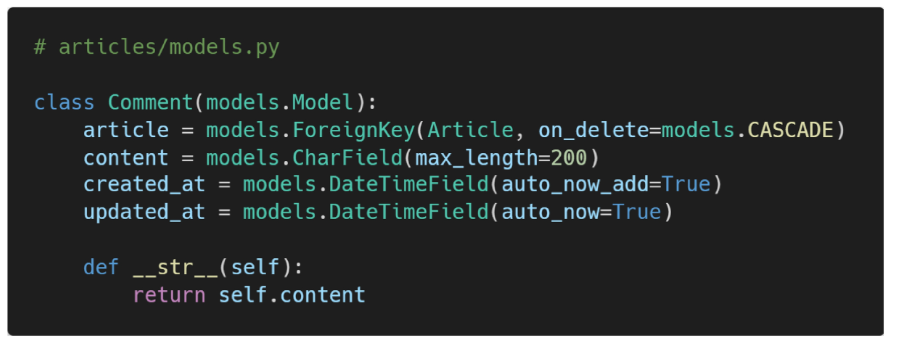
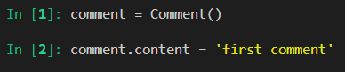
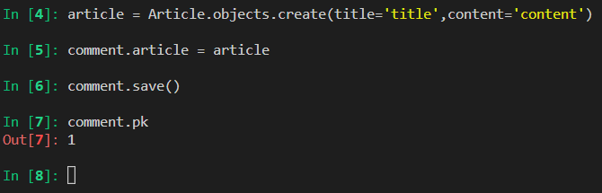

# DB

## Foreign key

- 관계형 데이터 베이스에서 한 테이블의 필드 중 다른 테이블의 행을 식별할 수 있는 키
- 댓글을 기준으로
- 게시글과 댓글 간의 모델 관계 설정

- FK ==> 게시글에서 id값이다 ==> 댓글을 기준으로!!

### FreignKey field

- many to one relationship
- 2개의 위치 인자가 반드시 필요
  - 참조하는 model class
  - on_delete 옵션
- comment 모델 정의

### on_delete

- 댓글이 달렸음
- 근데 게시글을 지웠음
- 참조되었던 댓글들은 어떻게 해결?

##### 데이터 무결성(추가)

데이터의 정확성과 일관성을 유지하고 보증하는 것을 가리킨다

- 개체 무결성
- 참조 무결성
- 범위 무결성

##### migrate할 때 주의할 점(외례키 (model))

article을 만들 떄 ==> 저절로 article_id , 즉 _id가 추가적으로 붙게 된다

따라서 article_id를 만들라고 할때 model에다가 article이라고 만들어야 한다.

##### 댓글작성

### 1:N 관계 related manager

- 역참조('comment_set')
  - Article(1) => comment(N)
  - article.comment형태로는 사용할 수 없음
    - 따라서 article.comment_set이라는 것이 생성 됨
  - 실제로 Article 클래스에 Comment와의 어떠한 관계도 작성되어 있지 않음
- 참조('article')
  - comment(N) ==> Article(1)
  - comment.article과 같이 접근 가능

## Comment Create

## comment read

## comment delete

## Substituting a custom User model

User 모델 대체하기

- 내장 USer모델이 제공하는 인증 요구사항이 적절하지 않을 수 있음
- 커스텀 유저 모델을 설정하는 것을 강력하게 권장!!!!!!
  - 단, 프로젝트의 모든 migrations 혹은 첫 migrate를 실행하기전에
  - 왜? ==> 중간에 바꾸기 시작하면 난이도가 너무 높아진다

## Custom user Built- in auth form

#### 문제 1 : 회원가입이 안됨

- 이유?
  - 기존에 User를 model로 쓰고 있었기 때문이다
  - 어디에?
    - UserCreationForm
    - UserChangeForm
- 해결방법
  - 커스텀 User로 모델 대체 해주어야 한다
  - 그리고 signup에 대체

##### get_user_model()

- 현재 프로젝트에서 **활성화된** 사용자 모델을 반환

## Model Relationship

### 1: N 관계 설정

- User- Article
- User - Comment

### User - Article

- 사용자 : 여러개의 개시물을 작성할 수 있다.

  1. setting.AUTH_USER_MODEL
     - models.py에서user를 사용할 때만 사용

  2. get_user_model( )
     - models.py가 아닌 다른 모든 곳에서 유저 모델을 참조할 때 사용

  - 이유:
    - 장고 app 실행순서 때문에
      - installed app 실행 
      - 그다음에 각 앱의 models실행
  - 암기
    - models.py 에서는 setting.AUTH_USER_MODEL
    - 그 외 get_user_model( )

### User - Comment(1:N)

- 유저가 여러개의 댓글을 달 수 있음

