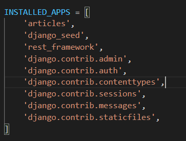
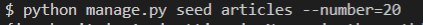
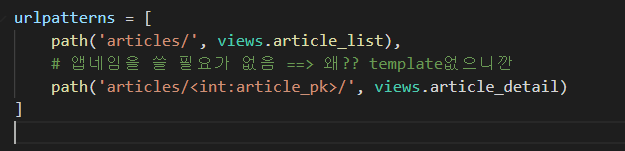
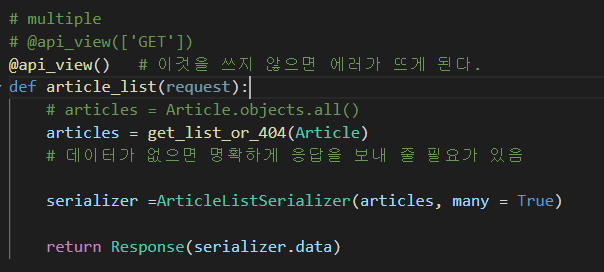
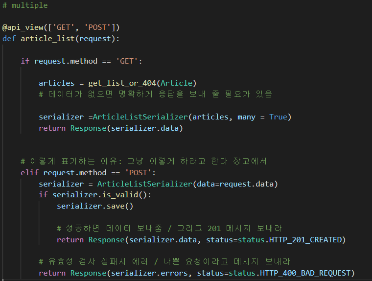
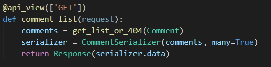
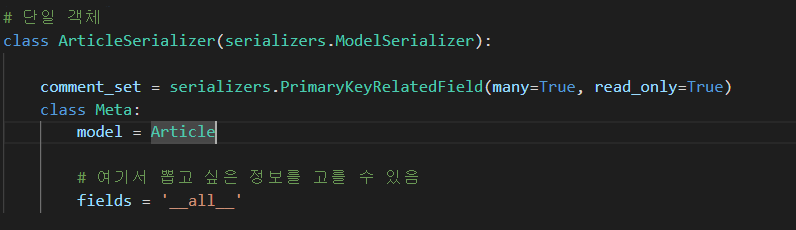

# REST API

## 1. HTTP

#### 기본특성

- stateless
- connectionless

- 쿠키와 세션을 통해 서버 상태 요청과 연결하도록 함

#### HTTP method

- 자원에 대한 행위을 정의

  - GET(조회)

  - POST(작성)

  - PUT (수정)

  - DELETE(삭제)

#### 응답 상태 코드

- informational 1xx
- successful 2xx
- redirection 3xx
- client 4xx
- server 5xx

요청의 대상을 resource라고 한다

#### URL URN URI

인터넷 상에서 정보를 어떻게 표현 할 것인가??

##### URL 

- 통합 자원 위치

##### URN

- 통합 자원 이름
- URL 에 영향을 받지 않음
  -  ==> 별명을 정해준것 따라서 위치가 변해서 이름이 변경안되서 상관 없음

##### URI

- 통합 자원 식별자
- 하위 개념
  - URN URL
- URI는 URL 과 같은 개념으로 본다
  - 이유: URN이 너무 적기 때문에

- 구조
  - https: ==> 브라우저가 사용해야하는 프로토콜
  - www. ===> Host ==> 요청받는 웹서버의 이름
  - : 80 ==> Port ==> https : 443
  - path : 웹서버상의 리소스 경로 
  - ??   : 쿼리 ==> 웹서버에 제공되는 추가적인 매개변수
  - \#    : Fragment ==> 특정지점에 대해서 표현해줄 때 ex) 한페이지에서 특정부분의 위치

### REST

##### Representational State Transfer

- API 서버를 개발하기 위한 일종의 소프트웨어 설계 방법론
- 네트워크 구조 원리의 모음
  - 자원을 정의 , 주소를 지정하는 전반적인 방법
- 정의된 자원을 어디에 위치시킬 것인가??에서 탄생하게 되었음

##### 자원과 주소의 지정 방법

- 자원
  - URI
- 행위
  - HTTP Method
- 표현
  - JSON으로 표현

##### JSON

- 단순 문자열 (자바스크립트의 표기법을 따른)
- 특징
  - 읽고 쓰기 쉬움
  - 키 벨류 형태로 되어있음
  - 파싱하기 쉬움

카카오로 로그인

- 로그인 

## Response

페이지가 아닌 이제는 JSON파일을 보내줄 것이다

- 데이터 랜덤으로 20개 심기

- 게시글들을 json파일로 보내

#### 방법 1

- JsonRespose
  - Json 데이터 타입으로 보내준다는 뜻이다
  - Safe  파라미터
    - True 기본값
    - 딕셔너리 이외의 객체를 직렬화 하려면 False로 설정
    - 그럼 직렬화가 뭐임??

#### 방법 2

##### 직렬화, Serialization

- 데이터 구조나 객체 상태를 동일하거나 다른 컴퓨터 환경에 저장하고, 나중에 재구성할 수 있는 포맷으로 변환하는 과정
- 쿼리셋을 받으면 => json으로 변환해서 줘야한다.
  - 바로 바꾸기 힘듦
  - 그래서 json으로 바꾸기 쉽게 데이터 구조를 바꿈
  - 그런다음에 json으로 바꾼다

- 장고
  - 파이썬으로 된 데이터 타입으로 만들어 준다

#### 방법3

DRF( Django REST framework )를 제공한다. ==> 따라서 이 방법을 사용할 것임

장고의 form과 modelform클래스와 매우 유사하게 구성되고 있음

## Single model

- 대부분 완성된 html페이지로 주지 않음
- 대부분 페이지는 json파일을 주게 되고 브라우저에서 꾸미게 된다.
- 즉 서버가 다 만들어서 주지 않음  ==> 프론트엔드와 백앤드를 나눔

#### DRF Single model

- 단일 모델의 data를 직렬화하여 JSON으로 변환할 것임

#### ModelSerializer

- 모델 필드에 맞춰서 Serializer클라스에 자동으로 만들어줌
- 기능
  - 모델정보에 맞춰 자동으로
  - Serializer에 대한 유효성 검사기를 자동 생성
  - . create( ), .update의 간단한 기본 구현이 포함됨

- 모델의 필드를 어떻게 Serializer할지 설정하는 것이 핵심

#### many argument

- mant = True : 쿼리 셋일 때 즉 데이터가 여러개가 있을 때 (단일 아닐때)

|             |     GET      |  POST   |     PUT     |   DELETE    |
| :---------: | :----------: | :-----: | :---------: | :---------: |
|  articles/  | 전체 글 조회 | 글 작성 |             |             |
| articles/1/ |  1번글 조회  |         | 1번 글 수정 | 1번 글 삭제 |

#### 1. GET - Article List

#### 3. POST - Create Article

201 created 상태 코드 및 메시지 응답

- \+ POST

- 400을 반환하게 된다. 

#### 4. DELETE - Delete Article and Update

- 204 No content 상태코드 및 메시지 응답

## 1 : N Relation

- comment create부분에서 시리얼 유효성 검사
- 이떄 모든 데이터를 다 검사하게 된다
- 이때 어떤 게시글에 작성하는 댓글인지에 대한 정보를 form-data로 넘겨주지 않는다(즉 article_pk 이부분의 코드가 valid이후 부터 시작하기 때문에 밖으로 빼주어야 한다는 뜻이다)
- 하지만 serializer는 유효성 검사를 하고 DB에 저장을 해야하는데? 하나의 코드로 되어 있다
- 따라서 read_only를 통하여 article부분은 유효성 검사를 하지 않는 것이다 .

### 역참조 하기 (article에서 댓글 보여주기)

#### 방법 1 (PK related field를 만들어서 하기)

- read_only를 추가해 주어야한다. => 조회만 할 것이기 때문에

- comment_set의 이름을 다른거로 바꾸고 싶으면 models.py에서 related_name을 추가해서 바꿔줘야한다.
- pk정보만 가져오게 한다

#### 방법2 (Nested relationships)

- 위에 있는 아이를 그냥 그대로 가져오는 방법
- 그러기 위해서는 CommentSerializer가 위에 있어야한다. 
- 그대로 가져왔기 때문에 pk만 가져오는게 아니라 \__all__ 의 모든 정보를 가져오게 된다.

### 특정 게시글에 작성된 댓글의 개수 구하기

- article.comment_set.count ==> 이부분을 source로 해서 보낸다
- read_only는 똑같은 이유때문

