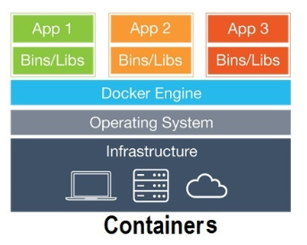
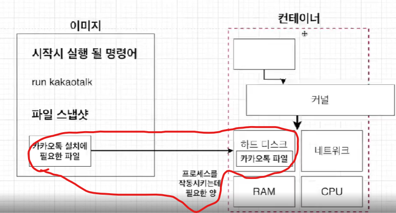

# Docker란?


## 1. Docker를 사용하는 이유

- install등을 할때 환경에 영향을 많이 받게 된다.
- 따라서 동일한 환경을 제공하기 위해서 도커를 사용하게 된다.
- 또한 install시 그냥 다운 받는 것 보다 간편함을 제시한다.


## 2. Docker란?

- 컨테이너를 사용하여 응용프로그램을 더 쉽게 만들고 배포하고 실행할 수 있도록 설계된 도구
- 컨테이너 기반의 오픈소스 가상화 플랫폼이며 생태계이다.


### 2-1) Container란?

- 컨테이너 안에 **다양한 프로그램, 실행환경을 컨테이너로 추상화**하여 동일한 인터페이스를 제공하여 **프로그램의 배포 및 관리를 단순하게 해준다.**
- 일반 컨테이너의 개념에서 물건을 손쉽게 운송해주는 것 처럼 프로그램을 손쉽게 이동 배포 관리를 할수있게 해준다.


### 2-2 Docker image란?

- 코드, 런타임, 시스템 도구, 시스템 라이브러리 및 설정과 같은 **응용프로그램을 실행하는 데 필요한 모든 것을 포함**하는 독립적이며 실행가능한 소프트웨어 패키지


### 2-3 Docker 사용 흐름


- local에 hello world라는 이미지를 찾음 => 없음
- docker hub에서 이미지가 존재하는지 확인 => pulling


### 2-4) Docker와 vm의 차이점

**Hypervisor 기반의 VM 구조**


- 하드웨어 위에 Host os존재 => 하이퍼바이저 위에 => Guest OS를 올려서 VM으로 나눈다.
- 따라서 VM은 독립적으로 돌릴 수 있음


**도커의 구조**



- 가상화된 공간을 생성하기 위해 리눅스 자체 기능인 chroot, namespace, c group을 사용함으로써 프로세스 단위의 격리 환경을 만들기 때문에 성능 손실이 없다.
- C Group
  - CPU, 메모리, Network Bandwith등 프로세스 그룹의 시스템 리소스 산용량을 관리
  - 즉 어떤 어플이 사용량이 많다면 C group에 집어 넣어서 CPU와 메모리 사용을 제한 한다.
- Namespace
  - 하나의 시스템에서 프로세스를 격리시킬 수 있는 가상화 기술


**도커와 VM의 공통점**

- 기본 하드웨어에서 격릴된 환경내에 애플리케이션을 배치하는 방법


**도커와 VM의 차이점**

- **도커**

  - 가상화된 공간을 생성할 때 리눅스 자체 기능을 사용하여 프로세스 단위의 격리 환경을 만든다 ==> 즉 성능 손실이 없다.

  - VM과 달리 커널을 공유해서 사용하기 때문에 컨테이너에는 라리브러리 및 실행파일만 있다. => 용량이 작다

  - 컨테이너 => 하이퍼바이저와 게스트 OS가 필요하지 않는다. ==> 따라서 **더 가볍다.**

  - 애플리케이션을 실행 할 때 컨테이너 방식에서는 호스트 OS위에 애플리케이션의 실행 패키지인 **이미지를 배포하기만 하면된다.**

    

- **VM**

  - VM은 애플리케이션을 실행하기 위해서 **VM을 띄우고 자원을 할당한 다음 게스트 OS를 부팅**하여 애플리케이션을 실행하야한다. => 복잡하고 무겁다.


**2-5) 이미지로 컨테이너 만들기**

- 이미지 : 응용 프로그램을 실행하는데 **필요한 모든 것**을 포함하고 있다.
- 필요한 모든 것?
  - **시작시 실행 될 명령어** 
    - 컨테이너 안에서 프로그램을 실행시키는 것
    - 이미지에서 run kakao라는 명령어를 가지고 있어야 run kakao라는 명령어를 칠 수 있다.
  - **파일 스냅샷**
    - 컨테이너 안에 파일이 있어야 그 파일을 실행시킬 수 있다.


**순서**

1. Docker 클라이언트에 docker run <이미지>를 입력한다.

```dockerfile
docker run <이미지>
```


2. 도커 이미지에 있는 파일 스냅샷을 컨테이너 하드 디스크에 옮겨 준다.




3. 이미지에서 가지고 있는 명령어(컨테이너가 실행될 때 사용될 명령어)를 ㄱ이용해서 카카오톡을 실행시켜준다.


- 컨테이너가 실행될 때 명령어가 실행되고 카카오톡(위 그림은 hello world) 가 실행되게 되는 것


**2-6) C-group, namespace를 도커에서 사용할 수 있는 이유**

- OS가 Linix가 아니라 window나 mac에서도 똑같이 위와같은 명령어를 사용할 수 있다.
- 어떻게 사용할 수 있을까?

**실제 구조**


- 도커가 실행될 때 리눅스 VM위에서 실행되게 된다.
- 따라서 여러 OS에서 사용하더라도 같은 환경에서 도커가 돌아간다고 할 수 있음
  - C group등을 사용할 수 있다

