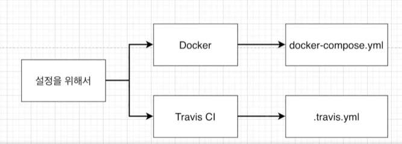

# 07_Docker_distribution2


## Travis CI란?

- Github에서 진행되는 오픈소스 프로젝트를 위한 Continuous Integration서비스이다.
- Gitbub repository에 있는 프로젝트를 특정 이벤트에 따라 자동으로 테스트, 빌드, 배포할 수 있다.
  - Private repository는 유료이다.


## Travis CI의 흐름


1. 로컬 Git에 있는 소스를 Github repo에 push
2. Travis CI에게 소스가 Push되었다고 말해준 뒤 업데이트 된 소스를 Github에서 가져온다.
3. Github에서 가져온 소스의 테스트 코드를 실행해 본다.
4. 테스트가 성공하면 AWS같은 Hosting site로 보내서 배포를 진행한다.


## Travis CI와 GIthub 연동하기


## Travis.yml 작성하기



- **Test수행하기 위한 준비**

  - 도커환경에서 리액트앱을 실행하고 있음

  - Travis CI에서도 도커환경 구성

  - 구성된 도커 환경에서 Dockerfile.dev를 이용해서 도커 이미지 생성

    

- **Test 수행하기**

  - 어떻게 Test를 수행ㅇ할 것인지 설정

    

- **AWS 배포**

  - 어떻게 AWS에 소스코드를 배포할 것인지 설정

```yaml
sudo: required # 관리자 권한

language: generic # 언어(플랫폼) => node, python 등등

services:
  - docker

# 스크립트를 실행할 수 있는 환경 (이미지 만들기)
before_install:
  - echo "start Creating an image with dockerfile"
  - docker build -t soxn3579/docker-react -f Dockerfile.dev .

# 스크립트 실행
script:
  # -e CI=true 환경설정
  # -- --coverage : 더 상세하게 보기위함
  - docker run -e CI=true soxn3579/docker-react npm run test -- --coverage
  
# 테스트 성공 후
after_success:
  - echo "Test Success"
```


## AWS에 대해 알아보기

- EC2 

  - 1대에 컴퓨터를 임대

  - OS 를 설치하고 웹서비스를 위한 프로그램들을 설치해서 사용하면 된다.

  - 1대의 컴퓨터를 EC2인스턴스라고 부른다.

    

- EB(Elastic Beanstalk)

  - 배포하고 화장하기 쉬운 서비스
  - 업데이트 할떄마다 자동으로 환경관리를 해준다.


```yaml
deploy:
	# 배포할때 제공해줄 서비스
	# ex) firebase, EC2, S3 등등
    provider: elasticbeanstalk 
    
    # 현재 위치
    region: "ap-northeast-2"
    
    # 생성된 app이름
    app: "docker-react-app"
    
    # 환경이름 : 생략을 하고 넘어가면 이런식으로 이름이 만들어진다.
    env: "DockerReactApp-env"
    
	# 해당 elasticbeanstalk을 위한 s3버켓이름
	# elasticbeanstalk을 생성할때 s3가 자동적으로 생성된다.
    bucket_name: "elasticbeanstalk-ap-northeaset-2-970989042"
    
    # APP과 동일한 이름
    bucket_path: "docker-react-app"
	
    # 어떤 브랜치에 Push를 할때 AWS에 배포를 할 것인지 설정
    on:
    	branch: master
```


## Travis CI => AWS


- AWS에서 제공하는 Secret Key를 Travis yml파일에다가 적어주면 된다.


## IAM (Identity and Access Management)

> - AWS 리소스에 대한 엑세스를 안전하게 제어할 수 있는 웹서비스
> - IAM을 상용하여 인증(로그인) 및 권한부여(권한 있음) 된 대상을 제어한다.

- Root 사용자

  - 현재 처음 가입하여 사용하고 있는 계정

  - AWS 서비스 및 리소스에 대한 완전한 엑세스 권한이 있음

  - ROOT사용자를 사용하는 것은 보안상 좋지 않음

    

- IAM

  - root 사용자가 부여한 권한만 가지고 있음

순서

- AWS Dash board에서 IAM을 클릭
- 사용자 추가
  - 프로그래밍 방식 엑세스
  - 권한
    - 기본 정책 직접 연결
    - ElasticBeanStak full acess
  - 

API키를 다른곳에 적어주고 다른곳에서 가져와야한다. 


**dockerfile**

```dockerfile
# builder stage : 빌드파일 생성 => usr/src/app/build로 파일들이 들어간다.
FROM node:alpine as builder
WORKDIR 'usr/src/app'
COPY package.json .
RUN npm install
COPY ./ ./
RUN npm run build

# run stage 
FROM nginx
EXPOSE 80 # 이부분을 추가해줘야한다. Nginx포트와 mapping을 해주는 것
COPY --from=builder /usr/src/app/build /usr/share/nginx/html
```


**Travis.yml**

```yaml
sudo: required # 관리자 권한

language: generic # 언어(플랫폼) => node, python 등등

services:
  - docker

# 스크립트를 실행할 수 있는 환경 (이미지 만들기)
before_install:
  - echo "start Creating an image with dockerfile"
  - docker build -t soxn3579/docker-react-app -f Dockerfile.dev .

# 스크립트 실행
script:
  # -e CI=true 환경설정
  # -- --coverage : 더 상세하게 보기위함
  - docker run -e CI=true soxn3579/docker-react-app npm run test -- --coverage

deploy:
	# 배포할때 제공해줄 서비스
	# ex) firebase, EC2, S3 등등
  provider: elasticbeanstalk 
  
  # 현재 위치
  region: "ap-northeast-2"
  
  # 생성된 app이름
  app: "docker-react-app"
  
  # 환경이름 : 생략을 하고 넘어가면 이런식으로 이름이 만들어진다.
  env: "DockerReactApp-env"
  
  # 해당 elasticbeanstalk을 위한 s3버켓이름
  # elasticbeanstalk을 생성할때 s3가 자동적으로 생성된다.
  bucket_name: "elasticbeanstalk-ap-northeaset-2-970989042"
  
  # APP과 동일한 이름
  bucket_path: "docker-react-app"

  # 어떤 브랜치에 Push를 할때 AWS에 배포를 할 것인지 설정
  on:
    branch: master
  
  # Travis CI에서 Secret Key가져오기
  access_key_id: $AWS_ACCESS_KEY
  secret_access_key: $AWS_SECRET_ACCESS_KEY
```


