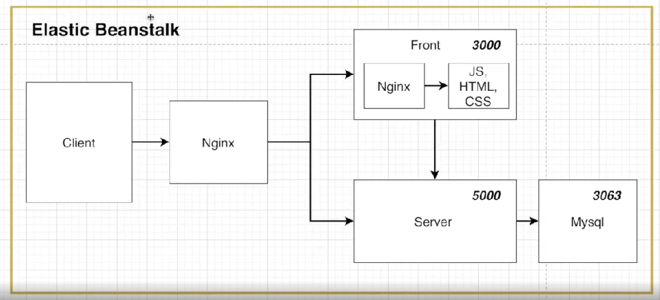

# 08_Docker_multi_container


## 복잡한 구조 (multi container)

> - 리액트, 노드, 데이터 베이스 구조를 활용하여 배포하기
> - 개발환경
> - 배포


## Nginx의 Proxy를 이용한 설계


- 장점
  - Request를 보낼때 URL부분을 host이름이 바뀌어도 변경시켜주지 않아도 된다.
  - 포트가 바뀌어도 변경을 안해주어도 된다.
- 단점
  - nginx설정, 전체 설계가 복잡하다


## React

### Dockerfile.dev

```dockerfile
FROM node:alpine

WORKDIR /app

COPY pakage.json ./

RUN npm install

COPY ./ ./

CMD [ "npm","run","start" ]
```


### Dockerfile

```dockerfile
FROM node:alpine as builder
WORKDIR /app
COPY pakage.json ./
RUN npm install
COPY ./ ./
RUN npm run build


FROM nginx
EXPOSE 3000 # port번호

# ./nginx/default.conf => 앞쪽 nginx는 proxy로 만들어 놓고 front쪽의 nginx를 뜻한다.
# /etc/nginx/conf.d/default.conf => container안에 있는 nginx폴더 안에 넣어준다는 뜻이다.
# 즉 default.conf파일을 container안에 copy한다는 뜻
COPY ./nginx/default.conf /etc/nginx/conf.d/default.conf

#
COPY --from=builder /app/build  /usr/share/nginx/html 
```

```yaml
# default.conf
server {
    listen 3000; # 3000번 port 

	# location/ 이라고 url이 오면 {} 안에 있는 것들이 실행된다.
    location / {
        root /usr/share/nginx/html; # nginx 기본 파일(정적파일들 저장되어 있는 곳)
        index index.html index.htm; # react index파일 설정
        try_files $uri $uri/ /index/html; # react SPA이기 때문에 설정
    }
}
```


## Node.js

### Dockerfile

```dockerfile
FROM node:alpine

WORKDIR /app

COPY pakage.json ./

RUN npm install

COPY ./ ./

CMD [ "npm","run","start" ]
```


### Dockerfile.dev

```dockerfile
FROM node:alpine

WORKDIR /app

COPY pakage.json ./

RUN npm install

COPY ./ ./

CMD [ "npm","run","dev" ]
```


## MySQL


- my sql 폴더
  - sqls 폴더
    - inistialize.sql : DDL로 테이블을 생성하는 구간
  - Dockerfile : MySQL을 도커이미지로 만들 공간
  - my.cnf : utf8로 인코딩하기 위한 파일 => 한글이 깨지기 때문


**개발환경 : Docker환경**



**운영 환경: AWS RDS서비스 이용**


- 이렇게 나누는 이유
  - DB는 조금의 실수로도 안 좋은 결과를 얻을 수 있다.
  - 따라서 실제 중요한 데이터들을 다루는 운영환경에서는 더욱 안정적인 AWS RDS를 이용하여 DB를 구성하는 것이 실무에서 더 보편적으로 쓰이는 방법이다.


### dockerfile

```dockerfile
FROM mysql:5.7

# utf바꾸는 파일을 도커 컨테이너 내에 있는 파일에 추가해주기
ADD ./my.cnf /etc/mysql/conf.d/my.cnf
```


### initialize.sql

```sql
# DB가 존재했으면 지우고 새로추가
DROP DATABASE IF EXISTS myapp;

CREATE DATABASE myapp;
USE myapp;
CREATE TABLE lists (
    id INTEGER AUTO_INCREMENT,
    value TEXT,
    PRIMARY KEY (id)
)
```


### my.cnf

```
[mysqld]
character-set-server=utf8

[mysql]
default-character-set=utf8

[client]
default-character-set=utf8
```


## Nginx


### default.conf

```yml
# front는 3000번으로 보냄
upstream frontend {
    server frontend:3000;
}

# back은 5000번으로 보냄
upstream backend {
    server backend:5000;
}

# 서버 80번 포트
server {
    listen 80;
	
    # proxy front
    location / {
        proxy_pass http://frontend;
    }
    
    # proxy back
    location /api {
        proxy_pass http://backend;
    }
	
	# react를 위한 설정
    location /sockjs-node {
        proxy_pass http://frontend;
        proxy_http_version 1.1;
        proxy_set_header Upgrade $http_upgrade;
        proxy_set_header COnnection "Upgrade";
    }
}
```


### Dockerfile

```dockerfile
FROM nginx

# defualt.conf를 container내로 copy
COPY ./default.conf /etc/nginx/conf.d/default/conf
```


## Docker-compose

> - **각각의 도커 파일을 서로 연결시켜주기**

```yaml
version: '3'

services:
  frontend:
    build: Dockerfile.dev
    context: ./frontend
    volumes:
    - /app/node_modules
    - ./frontend:/app
    stdin_open: true


  nginx:
    restart: always # nginx가 꺼진다하더라고 항상 재시작한다는 뜻
    build:
      dockerfile: Dockerfile
      context: ./nginx
    ports:
      - "3000:80"


  backend:
    build: 
      dockerfile: Dockerfile.dev
      context: ./backend
    container_name: app_backend
    volumes:
      - /app/node_modules
      - ./backend:app

  mysql:
    build: ./mysql
    restart: unless-stopped
    container_name: app_mysql
    ports:
      - "3306:3306"
    
    # 데이터 베이스 데이터 유지하기 위한 볼륨
    # 왜냐하면 container지우면 container안에 있던 data도 지워지게 된다.
    # 따라서 볼륨을 이용하여 data영속성을 지키도록 해준다.
    # host file sys에 data를 넣어서 data를 보관한다.
    volumes:
      - ./mysql/mysql_data:/var/lib/mysql
      - ./mysql/sqls/:/docker-entrypoint-initdb.d/
    environment:
      - MYSQL_ROOT_PASSWORK: root
      - MYSQL_DATABASE: root
```

**재시작 정책**

- restart: "no"

  - 어떠한 상황에서도 재시작 하지 않음

    

- restart: "always"

  - 항상 재시작

    

- restart: "on-failure"

  - on-failure에러코드와 함께 컨테이너가 멈추었을때만 재시작

    

- restart: "unless-stopped"

  - 개발자가 임의로 멈추려고 할때 빼고는 재시작


