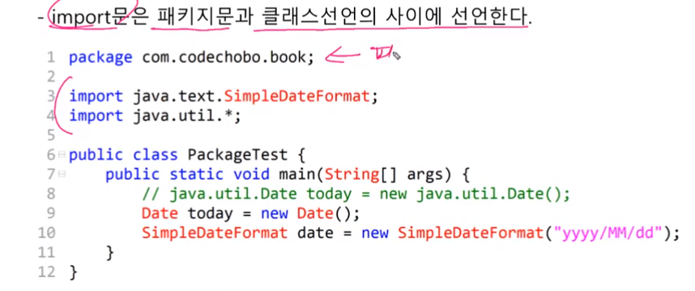
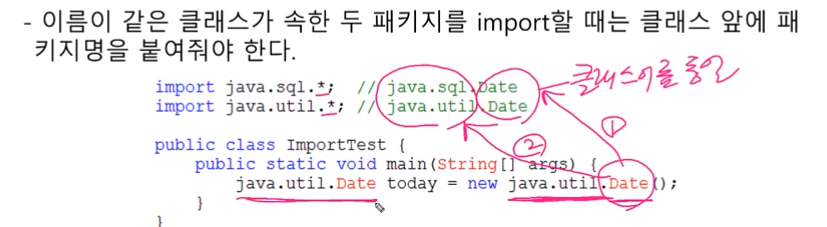
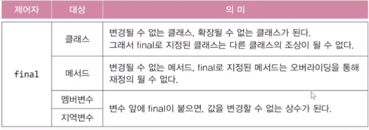
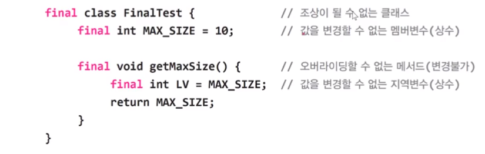
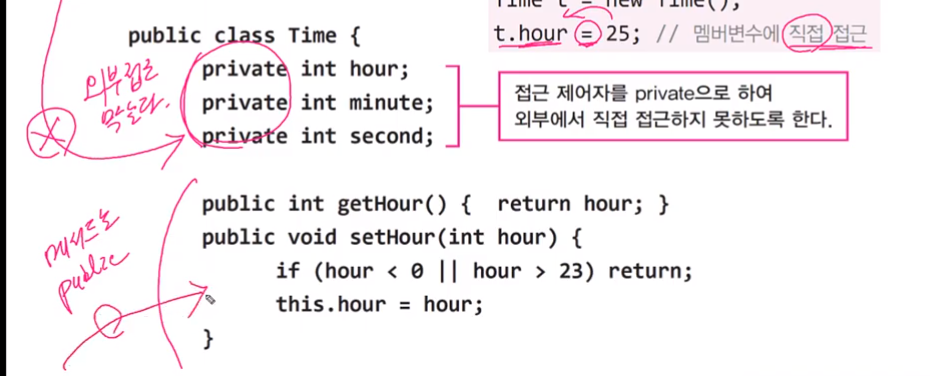

# ch7_자바 객체지향 언어


## class

클래스의 관계

1. 상속
2. 포함


**클래스간의 관계 결정**

상속 관계 : ~은 ~이다.

포함 관계 : ~은 ~을 가지고 있다

==> 둘 중에 자연스러운 문장으로 상속 포함관계를 결정한다. 

==> 원은 점을 가지고 있다?? 원은 점이다?? ==> 1번째 문장이 더 자연스러움 ==> 포함관계


## 1. 상속


- 기존의 클래스로 새로운 클래스를 작성하는 것 (코드의 재사용)
- 자손은 조상의 모든 멤버(iv, cv)를 상속받는다  (생성자, 초기화 블럭 제외)

```java
class Parent { }
class Child extends Parent{
    
}
```


- 자손의 변경은 조상에 영향을 미치지 않는다
  - 변수 값을 변경해도 조상에게 영향을 끼치지 않음


## 포함관계

- 클래스의 멤버로 참조변수를 선언 하는 것


```java
class Point{
    int x;
    int y;
}

class Circle{
    Point c = new Point();
    int r;
}
```

- Circle에서 point c의 좌표값을 불러오기 위해선 어떻게??
  - Circle c = new Circle();
  - c.c.y , c.c.x 라고 불러와야 함


## 단일 상속

- java는 단일 상속만 허용한다.
  - 단점이 많기 때문에 포기함
  - 비중이 높은 클래스 하나만 상속관계로
  - 나머지는 포함관계로 한다.

```java
class TvDVD extends Tv, DVD ==> 이런식으로 쓸 수 없음
```

```java
class Tv{
    boolean power;
    int channel;

    void power() { power = !power;}
    void channelUp() { ++channel ;}
    void channelDown() { --channel ;}
}


class DVD{
    boolean power;
    void power() {power = !power}
    void play(){ 내용 }
    void stop(){ 내용 }
    void rew(){ 내용 }
    void ff(){ 내용 }
}

// tv의 비중이 크기 때문에 Tv를 상속받는다 ==> 그리고 난 뒤에 DVD를 포함관계로 만듦
// 그리고 함수를 각각 만들어서 상속의 효과를 내도록 한다. 
class TvDVD extends Tv{
    DVD dvd = new DVD();
    
    void play(){
        dvd.play();
    }
    void stop(){
        dvd.stop();
    }
    void rew(){
        dvd.rew();
    }
    void ff(){
        dvd.ff();
    }
}

```


## Object 클래스 - 모든 클래스의 조상

- 부모가 없는 클래스는 자동적으로 Object클래스를 상속받게 된다.
  - 컴파일러가 자동으로 추가해줌
- 모든 클래스 = Object 클래스에 정의된 11개의 메서드를 상속
  - toString(), equals(Object obj), hashCode()


## 참조변수 super

- 객체 자신을 가르키는 잠조변수. 
- 인스턴스 메서드(생성자)내에서만 존재
- 조상의 멤버를 자신의 멤버와 구별할 때 사용


```java
public class Ex7_2 {

    public static void main(String[] args) {
        Child c = new Child();
        c.method();
    }
}
class Parant{
    int x = 10;
}
class Child extends Parant{
    // parant의 x는? ==> super.x

    int x = 20; // this.x

    void method(){
        System.out.println(x); // 가장 가까운 x ==> 따라서 this.x // 20
        System.out.println(super.x); // 10
        System.out.println(this.x);  // 20
    }
}
```


## super - 조상 생성자

- 조상의 생성자를 호출할 때 사용
- 조상의 멤버는 조상의 생성자를 호출해서 초기화
  - 왜 super를 쓰나??
  - 생성자와 초기화 블럭을 상속이 되지 않음 ==> 따라서 super를 통해서 생성자를 호출함


==> 조상의 생성자는 자손이 초기화 하지 않는다 ==> 즉 super로 호출을 시킨다

```java
class Point{
    int x,y;
    Point(int x, int y){
        this x = x;
        this y = y;    
    }
}

class Point3D{
    int z;
    Point3D(int x, int y,int z){
        super(x,y)
        this.z = z
    }
}
```

 


- **중요!!!** **생성자의 첫 줄에 반드시 생성자(super or this)를 호출해야 한다.**
  - 그렇지 않으면 컴파일러가 생성자의 첫줄에 super();를 삽입


## 패키지(package)

- 서로 관련된 클래스의 묶음

- 클래스느 클래스 파일, 패키지는 폴더. 하위 패키지는 하위 폴더
- 클래스의 실제 이름(full name)은 패키지를 포함
- rt.jar(runtime/ jar(클래스 파일을 묶어놓은 것))는 클래스들을 압축한 파일
  - java9부터 rt.jar는 없어짐
  - 모듈개념이 들어감 ==> 작은 모듈로 쪼개놓음


#### 패키지의 선언

- 패키지는 소스파일의 첫 번째 문장으로 단 한번 선언
- 같은 소스 파일의 클래스들은 모두 같은 패키지에 속하게 된다.
- 패키지 선언이 없으면 이름없는(unnamed)패키지에 속하게 된다. (default package)

- bin파일로 들어가서 패키지로가서 pacakage를 선언하면 된다.


#### 클래스 패스(class path)

- 클래스파일의 위치를 알려주는 경로
- 환경변수 classpath로 관리하며, 경로간의 구분자는 **;** 임
- classpath에 패키지의 루트를 등록해줘야 함


## import 문

- 클래스를 사용할 때 패키지 이름을 생략할 수 있다.
- 컴파일러에게 클래스가 속한 패키지를 알려준다.
- java.lang패키지의 클래스는 import를 사용하지 않고도 사용가능

```java
import java.util.Date;

class ImportTest{
    Date today = new Date();
}
```


import문은 패키지문과 클래스 선언의 사이에 선언




- 이름이 같은 클래스가 속한 두 패키지




- static 멤버를 사용할 떄 클래스 이름을 생략할 수 있음


```java
import static java.lang.System.out();
import static java.lang.Math.*;

out.printlin(random());
out.printlin(PI);

//이런식으로 사용가능

```


## 제어자(modifier)

- 클래스와 클래스의 멤버(멤버변수, 메서드)에 부가적인 의미 부여 ==> 형용사와 같은 느낌
- 접근 제어자는 하나만 붙일 수 있다
- 하나의 대상에 여러 제어자를 같이 사용가능 하다( 접근제어자는 하나만 )
  - 보통 접근제어자를 더 왼쪽에 쓴다 


#### static


#### final

- 마지막의, 변경될 수 없는






##### final class

-  ==> 마지막 class라는 것 ==> 즉 자식을 가질 수 없음 (leaf노드의 느낌)
- 대표적인 final class ==> String, Math


##### final 변수

- 변수 앞에 final을 붙이게 되면 상수가 된다.
- 즉 값을 변경할 수 없는 변수가 된다.


##### final 메서드

- 변경 불가능한 메서드가 된다
- 즉 오버라이딩을 할 수 없음 (조상 메서드를 덮어쓰는 것 ) ==> 자식에서 조상 메서드 제정의 하는 것


#### abstract - 추상의, 미완성의

- 용도 ==> 추상클래스를 상속 받아서 완전한 클래스로 만들어야 사용할 수 있음
  - 이때 객체를 생성할 수 있다 => 그것이 아니면 객체생성 불가


몸통이 없는 메서드들이 있음

```java
abstract class AbstractTest{ // 추상 메서드를 포함한 클래스 ==> 추상 클래스
    abstract void move(); // 몸통이 없음 {} <= 이게 없음 ==> 추상메서드
}
    
// 추상 메서드 = 미완성 메서드이다.

AbstractTest a = new AbstractTest(); // ==> 에러 : 추상클래스는 인스턴스 생성 불가

```


## 접근 제어자 (access modifier)


private		 :  같은 클래스 내에서만 접근이 가능하다.

(default)	  :  같은 패키지 내에서만 접근이 가능하다.

protected	: 같은 패키지 내에서, 그리고 다른 패키지의 자손 클래스에서 접근이 가능하다. 

public		  :  접근 제한이 전혀 없다.


==> 클래스에는 public, default 붙일 수 있음

==> 멤버에는 모두 다 붙일 수 있음


정리

- private => 하나의 파일 (하나의 클래스)
- default => 하나의 폴더
- protected => 같은 폴더 + 다른 폴더 자손(import 해서 불러옴)
- public ==> 아무때나 가능


## 캡슐화와 접근제어자

접근제어자를 사용하는 이유

- 직접 접근을 막고 간접접근을 허용하기 위한 것 => 갭슐화

- 외부로부터 데이터를 보호하기 위해서
  - 무슨 뜻?? 
  - hour, min, sec은 24, 59,59까지 숫자면 들어가야함
  - 하지만 다른 곳에서 접근해서 이 데이터의 범위를 바꾸거나 할 수 있음
  - 이러한 경우 데이터가 보호되지 않음 ==> 따라서 




## 다형성

- 여러 가지 형태를 가질 수 있는 능력

- 조상 타입 참조변수로 자손 타입 객체를 다루는 것

  - 타입이 불일치하는 것 ==> okay 

  - ```java
    // 원래
    SmartTv t = new SmartTv();
    
    // 서로의 타입이 불일치 함
    Tv t = new SmartTv();  
    //리보컨 = 제품 ==> 즉 Tv라는 리모컨으로 SmartTv를 조정
    //단 Tv = 조상타입 참조변수, SmartTv = 자손타입 객체
    ```

- 자손 타입의 참조변수로 조상 타입의 객체를 가리킬 수 없다.


### 일치 할 때와 일치하지 않을 때 차이

Tv 변수 5개

SmartTv 변수 2개 ==> 총 7개


**일치하는 경우 ( SmartTv t = new SmartTv(); )**

- 스마트 폰 리모컨 (버튼이 7개 존재 )
- 즉 일치할 경우에는 모든 객체를 다 사용할 수 있다.


**일치하지 않는 경우( Tv t = new SmartTv(); )**

- 리모컨 => Tv리모콘 ( 버튼 5개밖에 존재하지 않음 )
- 즉 일치하지 않으면 모든 객체 사용 불가


**불가한 경우**

SmartTv t = new Tv( ); ==> 자손 리모컨으로 부모 tv를 컨트롤 할 수 없음


이유 :

-  Tv는 5개의 기능을 가지고 있음 =

- smartTv 리모컨은 7개의 버튼이 있음 ==> 따라서 없는 걸 누르게 되면 작동 하지 않음
- 따라서 안됨


## 참조변수의 형변환

- 사용할 수 있는 멤버의 개수를  조절하는 것
- 중요한 건 뭐다??
  - 가르키는 실제 객체가 무엇인지 파악하는 것이 중요함

 

규칙

```java
class car {}
class FireEngin extends Car{}
class Ambulance extends Car{}
```

- 부모 자식간에 형 변환 가능
- 형제간에 형변환은 불가능 하다


```java
// car : 4개
// Fire : 5개


FireEngin f = new FireEgine(); // 타입 일치 ==> 5개 변수 사용 가능

// 조상 자손 형변환
// 즉 리모컨을 바꿔주는 행위라고 생각하면 된다. 
Car c = (Car) f; // 조상인 Car타입으로 형 변환 (생략가능) ==> 사용가능한 변수() ==> 4개 사용가능
FireEngin f2 = (FireEngin)c; // 자손인 FireEngine타입으로 형변환 (생략 불가능) ==> 5개 사용 가능

// 형제 끼리 형변환 ==> 불가능
Amblulance a = Ambulance f; // 에러 ==> 상속관계가 아닌 클래스 간의 형변환 불가
```


```java
public class Ex7_7 {
    public static void main(String[] args) {
        Car car = null;
        FireEngine fe1 = new FireEngine();
        FireEngine fe2 = new FireEngine();

        fe1.water();
//        car = fe1;

        car = (FireEngine) fe1; // ==> 5개에서 4개로 줄이는 것은 안전
//        car.water(); 에러가 나게 된다 ==> car type의 참조  변수로는 water를 호출 할 수 없다

        fe2 = (FireEngine) car;
        fe2.water(); // 4개 => 5개 늘리는 것은 어떤 변수가 추가되었는지 알수 없음 ==> 따라서 객체를 필수로 작성해야함

    }
}

class Car{
    String color;
    int door;

    void drive(){
        System.out.println("drive");
    }
    void stop(){
        System.out.println("stop");
    }
}

class FireEngine extends Car{
    void water(){
        System.out.println("water");
    }
}
```


## instanceof 연산자

- 참조변수의 형변황 가능여부 확인에 사용. 가능하면 true
  - 형변환 하기 전에 반드시 확인을 먼저 한다. (형변환 해도 되니??)
  - 그리고 형변환

 


