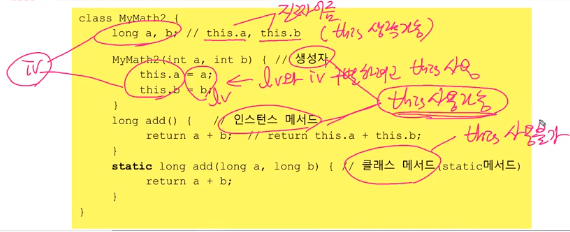

## overloading

한 클래스 안에 같은 이름의 메서드 여러 개 정의

==> 하나의 매서드 이름에 여러개 매서드가 들어갈때

==> 오버로딩이 가능하기 때문에 println( ) 괄호 안에 여러가지 변수타입을 넣을 수 있다

==> 만약 오버로딩을 지원하지 않았다면 각각 다른 명령어를 쳐줬어야 한다. (printSting 이런식으로)


오버로딩이 성립하기 위한 조건


1. 메서드 이름이 같아야 함
2. 매개변수의 개수 또는 타입이 달라야 한다.
3. 반환 타입은 영향 없다.

- 하지만 위와 같은 예시에서 add(3,3)을 넣으면 에러가 발생
  - 이유 : 둘다 가능하기 때문에
  - if (3,3L)이라고 했다면 첫번째꺼가 됐을 것임


## 생성자

- 인스턴스가  생성될 때마다 호출되는 인스턴스 초기화 메서드

- 객체 만들고 원하는 값을 넣는 것
- 생성자를 추가해야 ``Time t = new Time(12,34,56);``이런식을 사용할 수 있음


생성자 작성 규칙


- 생성자의 이름은 클래스의 이름과 같아야한다.
- return 값이 없음 (void를 붙이지 않는다.)
- 모든 클래스는 반드시 생성자를 가져야 한다.
  - Card c = new Card();  ==> 여기서 new Card부분이 생성자를 호출하는 것이었음
  - 만들어준적이 없는데 어떻게 생성한 것일까?
    - 기본생성자이기 때문
    - 생성자가 하나도 없을때는 compiler가 스스로 추가를 해준다.


#### 기본 생성자

```java
public class Ex6_11 {
    public static void main(String[] args) {
        Data1 d1 = new Data1();
        Data2 d2 = new Data2(3);
    }
}

class Data1{
    int value;
}

class Data2{
    int value;
    Data2(){} // 기본 생성자

    // 매개변수가 있는 생성자
    Data2(int x){
        value = x;
    }
}
```

- 매개변수가 없는 생성자
- 하는일이 아무것도 없음
- 생성자가 하나도 없을 때만 컴파일러가 자동으로 추가해줌
  - 이때 생성자가 하나도 없을때의 뜻
  - 진짜 생성자가 아예없을때를 의미
  - 즉 매개변수가 있는 생성자를 만들었을 경우에 컴파일러가 생성자 추가를 안해줌
    - 따라서 에러가 뜨게 된다.


## 생성자 this( )


- 괄호 붙은 것이 생성자

- 생성자에서 다른 생성자 호출할 때 사용

- 다른 생성자 호출시 첫줄에서만 사용가능


## 참조변수 this => 파이썬 self



- 괄호가 안붙은 것 = 참조변수

- 비슷하게 생겼지만 생성자 this와 전혀 다른 것임
- 인스턴스 자신을 가리키는 참조변수
- 인스턴스 메서드(생성자 포함)에서 사용가능
- lv와 iv를 구별할 때 사용한다.
- 클래스 매소드에서 this 사용불가
  - 왜? ==> iv를 사용하지 않기 때문에
  - this는 iv에만 사용하기 때문에


## 변수의 초기화

cv, iv 초기화의 종류 

- 자동초기화
- 간편초기화 ( = )
- 복잡초기화
  - {  } ==> 거의 사용하지 않음
  - static { }  :  cv초기화
  - 생성자  : iv 초기화


초기화 순서

1. cv => iv
2. 자동 => 간단 => 복잡


- 지역변수는 수동 초기화 해야한다. ==> 사용전 꼭!!
  - 지역변수는 메서드 내에서만 사용하는 변수
  - 즉 생명주기가 굉장히 짧음
  - 따라서 생성됐다가 사라졌다를 빠르게 반복함
  - 이때 만약에 초기화를 계속시켜주면 성능이 안좋아짐 ==> 따라서 덮어씌우는 방식을 사용한다.


#### 멤버(iv, cv)변수의 초기화

명시적 초기화(=)

- 대입 연산자(선언시)

```java
class Car{
    int door = 4; // 기본형 변수 초기화
    Engine e = new Engine() // 참조형 변수 초기화
        // 참조형의 경우 객체를 만들어서 넣어줘야한다.
}
```


초기화 블럭

static 초기화


- 인스턴스 초기화 블럭 { } : iv
- 클래스 초기화 블럭 : static { } : cv


생성자

- iv 초기화
- 복잡한 초기화 할때 사용한다.

```java
class Car(String color, String gearType, int door){
	this.color = color;
    this.gearType = gearType;
    this.door = door;
}
```


## class

클래스의 관계

1. 상속
2. 포함


**클래스간의 관계 결정**

상속 관계 : ~은 ~이다.

포함 관계 : ~은 ~을 가지고 있다

==> 둘 중에 자연스러운 문장으로 상속 포함관계를 결정한다. 

==> 원은 점을 가지고 있다?? 원은 점이다?? ==> 1번째 문장이 더 자연스러움 ==> 포함관계


## 1. 상속


- 기존의 클래스로 새로운 클래스를 작성하는 것 (코드의 재사용)
- 자손은 조상의 모든 멤버(iv, cv)를 상속받는다  (생성자, 초기화 블럭 제외)

```java
class Parent { }
class Child extends Parent{
    
}
```


- 자손의 변경은 조상에 영향을 미치지 않는다
  - 변수 값을 변경해도 조상에게 영향을 끼치지 않음


## 포함관계

- 클래스의 멤버로 참조변수를 선언 하는 것


```java
class Point{
    int x;
    int y;
}

class Circle{
    Point c = new Point();
    int r;
}
```

- Circle에서 point c의 좌표값을 불러오기 위해선 어떻게??
  - Circle c = new Circle();
  - c.c.y , c.c.x 라고 불러와야 함


## 단일 상속

- java는 단일 상속만 허용한다.
  - 단점이 많기 때문에 포기함
  - 비중이 높은 클래스 하나만 상속관계로
  - 나머지는 포함관계로 한다.

```java
class TvDVD extends Tv, DVD ==> 이런식으로 쓸 수 없음
```

```java
class Tv{
    boolean power;
    int channel;

    void power() { power = !power;}
    void channelUp() { ++channel ;}
    void channelDown() { --channel ;}
}


class DVD{
    boolean power;
    void power() {power = !power}
    void play(){ 내용 }
    void stop(){ 내용 }
    void rew(){ 내용 }
    void ff(){ 내용 }
}

// tv의 비중이 크기 때문에 Tv를 상속받는다 ==> 그리고 난 뒤에 DVD를 포함관계로 만듦
// 그리고 함수를 각각 만들어서 상속의 효과를 내도록 한다. 
class TvDVD extends Tv{
    DVD dvd = new DVD();
    
    void play(){
        dvd.play();
    }
    void stop(){
        dvd.stop();
    }
    void rew(){
        dvd.rew();
    }
    void ff(){
        dvd.ff();
    }
}

```


## Object 클래스 - 모든 클래스의 조상

- 부모가 없는 클래스는 자동적으로 Object클래스를 상속받게 된다.
  - 컴파일러가 자동으로 추가해줌
- 모든 클래스 = Object 클래스에 정의된 11개의 메서드를 상속
  - toString(), equals(Object obj), hashCode()


