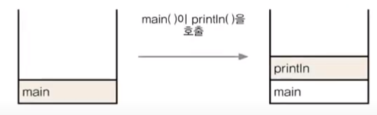
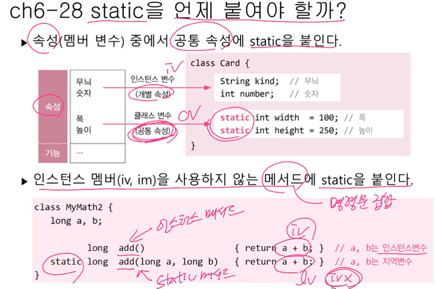
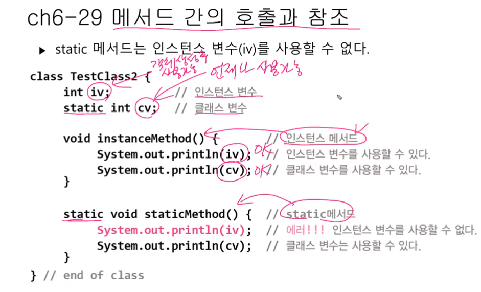
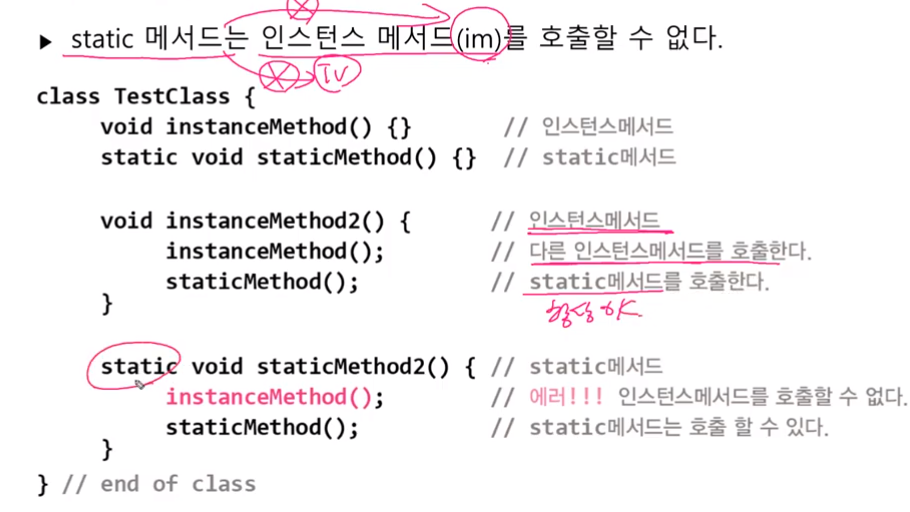
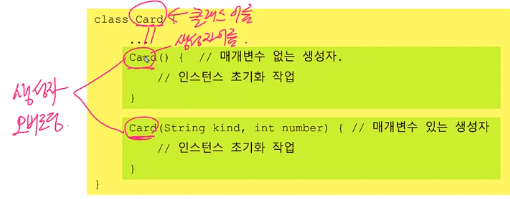
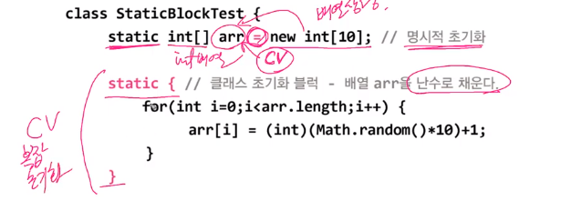

# ch6_자바 객체지향 언어

출력 서식

| %d   | 정수형 출력  |
| ---- | ------------ |
| %s   | 문자형 출력  |
| %f   | 실수형 출력  |
| %c   | 문자열 출력  |
| %n   | 줄 바꿈      |
| %b   | boolean 출력 |


## 1. 객체지향 언어

1. 캡슐화
2. 상속
3. 추상화
4. 다형성


## 2. 클래스와 객체

- 객체를 정의해 놓은 것 ==> 용도 : 객체를 생성하는데 사용

- 클래스 : 제품설계도 , 객체 : 제품 ==> 설계도 한번 만들어 놓으면 제품 쉽게 만들수 있어서


#### 속성과 기능

- 객체 : 속성(변수) + 기능(method)


#### 객체와 인스턴스 (거의 같은 말)

인스턴스 : 특정 클래스로부터 생성된 객체


##### 정리

클래스가 필요한 이유

- 객체를 생성하기 위해서

객체가 필요한 이유

- 객체를 사용하기 위해

객체를 사용한다는 것은?

- 객체가 가진 속성(변수)과 기능(method)을 사용하려고


## 3. 한 파일 여러 클래스 작성하는 방법


- 되는 경우

  - public 하고 이름소스파일 이름이 같아야한다. (arr)
  - public이 없을 경우 ==> class이름 중 아무거나 소스파일이름이면 가능

  

## 4. 객체의 생성과 사용

순서

1. 클래스 작성
2. 객체 생성
3. 객체 사용


객체의 생성

```java
Tv t;
t = new Tv();
```


객체의 사용

```java
t.channel = 7;  // 변수
t.channelDown(); // 메소드 사용방법
System.out.println(t.channel)
```


특징

- 사용되지 않는 객체가 있을 경우
  - garbage collector가 작동해서 필요없는 메모리를 삭제시켜준다
  - 언제 사용되지 않는 객체가 있을까?
    - t1에 주소 100짜리 저장
    - t2에 주소 200짜리 저장
    - t2=t1으로 할당
    - 그럼 t2는 주소 200이 아닌 100을 가르키게 된다.
    - 즉 주소 200짜리에는 아무도 가르키는 것이 없기 때문에 메모리를 차지하게 됨
    - 그럼 GC가 청소를 하게 된다.


```java
public class Ex6_1 {
    public static void main(String[] args) {
        Tv t;
        t = new Tv();
        t.channel = 7;
        t.channelDown();
        System.out.println(t.channel);

    }

}

class Tv{
    String color;
    boolean power;
    int channel;

    void power() {power = !power;};
    void channelUp() { ++channel ;};
    void channelDown() { --channel;};
}
```


```java
public class Ex6_2 {
    // 클래스 변수
    public static void main(String[] args) {
        Tv t1;
        Tv t2;
        Tv t3;


        t1 = new Tv(); // 인스턴스 변수(color, power, channel)
        t2 = new Tv();
        t3 = t1;

        t1.channel = 7;
        t1.channelDown();

        System.out.printf("t1 :");
        System.out.println(t1.channel); // 6

        System.out.printf("t2 :");
        System.out.println(t2.channel); // 0

        System.out.printf("t3 :");
        System.out.println(t3.channel); // 6
    }

}
```

- t1과 t3는 같은 결과가 나오게 됨 ==> 이유 : 같은 주소를 가르키고 있기 때문


## 5. 객체 배열

객체 배열 == 참조변수

객체 배열 만드는 법

```java
Tv[] tvArr = new Tv[3];

tvArr[0] = new Tv();
tvArr[1] = new Tv();
tvArr[2] = new Tv();
```


## 6. 클래스의 정의

**클래스의 정의**

- 설계도
- 데이터 + 함수
- 사용자 정의타입


1. 변수 : 하나의 데이터를 저장할 수 있는 공간
2. 배열 : **같은 종류**의 여러 데이터를 하나로 저장할 수 있는 공간
3. 구조체 : 서로 관련된 **여러 데이터(종류관계 없이)**를 하나로 저장할 수 있는 공간
4. **클래스 : 데이터와 함수의 결합 (구조체 + 함수)**
   - 왜 묶음?? ==> 서로 관련이 있기 때문에


사용자 정의 타입


- 원하는 타입을 직접 만들 수 있음
  - 그럼 그런 클래스를 만들면된다.


## 7. 선언위치에 따른 변수의 종류 => 객체 : iv변수 묶어 놓은 것이다.

#### 객체 : iv변수 묶어 놓은 것이다.


선언 위치에 따라서 3가지 종류로 나뉘게 된다.


영역


- 클래스 영역 (iv = instance variable), (cv = class variable , iv앞에 cv(static같은 것)를 붙인 것) 

  - 클래스 영역의 특징

    - y=x+3
    - sys ~~ 등등이 들어갈 수 없음
    - 변수선언과 메서드 선언만 가능

  - 중요한 점

    - iv의 생성 시기 ==> **인스턴스(객체)가 생성되었을 때**

  - cv와 Iv의 차이점

    - cv는 객체 생성이 필요없음 (아무때나 사용가능 함 ) (약간 python에서 init같은 느낌)
    - iv는 객체 생성이 필요함 (객체를 생성했을때만 사용가능)

    

- 메서드 영역 (lv = local variable) ==> 지역 변수


## 8. 클래스 변수와 인스턴스 변수

클래스 변수와 인스턴스 변수


ex) 카드


- 포커 카드
  - 숫자, 무늬 ==> 각각의 카드가 다른 속성을 가지고 있으어야 한다. ==> 인스턴스 변수
  - 가로, 세로 길이 ==>  모두 같은 속성을 가지고 있어야 한다. ==> 클래스 변수


#### 변수 사용방법

```java
Card c = new Card();
// 인스턴스 변수
c.kind = "HEART";
c.number = 5;


// 클래스 변수
// 앞에 클래스 명이 오게끔 써야함 : 이유 : iv로 오해할 수 있기 때문에
Card.width = 200;
Card.height = 300;

```


## 9. 메서드란

#### 매서드 정의

1. 문장들을 묶어 놓은 것 (작업 단위)
2. 값(입력)을 받아서 처리하고, 결과를 반환(출력)

3. 매서드 = 선언부 + 구현부
   - 반환 타입 : 작업의 결과의 타입을 적어놓는다
   - 출력값 : 0~1개만 가능하다.
     - 여러개를 반환하고 싶다면?? 배열이나 객체로 만들어서 반환해야한다.


#### 매서드의 특징

- 매서드는 꼭 클래스 안에 있어야 한다.
- 함수는 클래스에 독립적이다.


#### 메서드의 작성

- 반복적으로 수행되는 것을 만드는 것이 좋다 
- 하나의 매서드는 한 가지 기능만 수행하도록 작성한다.(재사용성을 높이기 위해)


## 10. 메서드의 호출

메서드는 정의할 때 타입을 정해주어야 함

하지만 타입이 없을 경우

- void를 사용함


흐름 파악할떄 한번 확인용

```java
public class Ex6_4 {

    public static void main(String[] args) {
        // 클래스 호출
        MyMath mm = new MyMath();
        
        long result5 = mm.max(3,4);
        long result6 = mm.min(3,4);

        System.out.println(result5);
        System.out.println(result6);

    }
}

class MyMath{
    // 함수는 항상 클래스안에 존재 해야함
    long max(long a, long b){
        long result = 0;
        if (a > b){
            return a;
        }else{
            return b;
        }
    }
    long min(long a, long b){
        return a<b ? a : b;
    }

```


## 11. retrun 문

return 문이 없을 수 있을때 있음

- 반환 타입이 void일때
- 즉 반환타입이 void가 아니라면 ?? ==> return 문이 필수적으로 필요하다.

오류가 날 경유

```java
// 이럴 경우 거짓일때 return문이 존재 하지 않기 때문에 오류 발생
int max(int a, int b){
    if (a>b){
        return a
    }
}

// 해결
int max(int a, int b){
    if (a>b){
        return a;
    }else{
        return b;
    }
}
```


## 12. 호출스택(call stack)

- 매서드 수행에 필요한 메모리가 제공되는 공간
  - 메서드 호출
  - call stack에 메모리 할당
  - 종료되면 해제
- 아래 있는 메서드가 위의 메서드를 호출한 것
- 맨 위의 메서드 하나만 실행중, 나머지는 대기




- main 실행 => main 메서드에서 prinln실행 ==> 위에 아이가 끝나야 main도 종료될 수 있음


## 13. 기본형 매개변수

**기본형 매개변수**

- 변수의 값을 읽기만 할 수 있음 (read only)
- x값을 바꾸는 것은 참조형임


```java
public class Ex6_6 {
    public static void main(String[] args) {
        Data d = new Data();
        d.x = 10;
        System.out.println(d.x);

        change(d.x);

        System.out.println("after change");
        System.out.println(d.x);

    }

    // static이 붙으면 ==> 클래스 변수
    static void change(int x){
        x = 1000;
        System.out.println("x : "+x);
    }
}

class Data { int x; }

-- 결과 --
10
x : 1000
after change
10
```


## 14. 참조형 매개변수

**참조형 매개변수** : 변수의 값을 읽고 변경할 수 있다. (read & write)

- 매서드에게 리모콘을 통째로 주는 것과 같다 ==> 따라서 그 리모컨으로 값을 변경할 수 있음

```java
public class Ex6_7 {

    public static void main(String[] args) {
        Data2 d2 = new Data2();
        d2.x = 10;
        System.out.println("first : "+d2.x);
        change(d2);
        System.out.println("after : "+d2.x);

        }
        static void change(Data2 d2){
            d2.x = 1000;
            System.out.println("change : "+d2.x);
    }

}

class Data2 { int x; }

-- 결과 --

first : 10
change : 1000
after : 1000
```


#### 참조형 반환타입

- 참조형의 반환 타입은 뭐임?? ==> 객체의 주소!!
  - 따라서 return을 할 때 객체의 주소를 반환하게 된다.


```java
class Data3{ int x; }

public class Ex6_8 {
    public static void main(String[] args) {
        Data3 d = new Data3();
        d.x = 10;
        System.out.println(d.x);

        Data3 d2 = copy(d);
        System.out.println(d2.x);
    }

    // 반환해야함 ==> 즉 메소드 타입을 지정해 줘야함 ==> 참조형 반환 ==> 주소값이 반환타입
    static Data3 copy(Data3 d){
        Data3 tmp = new Data3();
        tmp.x = d.x;
        return tmp;
    }
}
```


## 15. static 메서드와 인스턴스 메서드

**static 메서드** (객체 생성 없이 호출가능한 메소드)

- 앞에 static이 붙은 메서드
- 객체생성 없이 ==> class name. 메서드 이름 (a,b)
- iv, im(인스턴스 메서드)과 관련없는 작업을 하는 메서드
- 메서드 내에서 iv 사용 불가 


 **인스턴스 메서드** (객체 생성 있이 호출해야하는 메소드)

- 앞에 static이 안붙은 메서드

- 생성 (객체를 만들어 줘야함)
  - 참조변수.메서드 이름 ()으로 호출
  - iv, im과 관련된 작업을 하는 메서드
  - 메서드 내에서 인스턴스 변수 사용가능


차이


객체 : iv의 묶음이다

그럼 언제 static을 붙여야 함??

- iv를 사용하지 않은 method를 만들때 
- 즉 가장 큰 차이점은 iv를 쓰냐 안쓰냐의 차이
- 클래스 메소드(static메소드)는 iv가 필요 없음 ==> 즉 객체가 필요없다는 뜻
  - 따라서 MyMath.add(200,300)으로 가능





- static method는 객체 생성 없이 호출이 가능한 메소드이다
  - 따라서 객체를 생성하고 나서 인스턴스 변수를 선언해주었을지 안해줬을지 모름
  - ==> 그래서 쓸 수 없다





## overloading

한 클래스 안에 같은 이름의 메서드 여러 개 정의

==> 하나의 매서드 이름에 여러개 매서드가 들어갈때

==> 오버로딩이 가능하기 때문에 println( ) 괄호 안에 여러가지 변수타입을 넣을 수 있다

==> 만약 오버로딩을 지원하지 않았다면 각각 다른 명령어를 쳐줬어야 한다. (printSting 이런식으로)


오버로딩이 성립하기 위한 조건


1. 메서드 이름이 같아야 함
2. 매개변수의 개수 또는 타입이 달라야 한다.
3. 반환 타입은 영향 없다.

- 하지만 위와 같은 예시에서 add(3,3)을 넣으면 에러가 발생
  - 이유 : 둘다 가능하기 때문에
  - if (3,3L)이라고 했다면 첫번째꺼가 됐을 것임


## 생성자

- 인스턴스가  생성될 때마다 호출되는 인스턴스 초기화 메서드

- 객체 만들고 원하는 값을 넣는 것
- 생성자를 추가해야 ``Time t = new Time(12,34,56);``이런식을 사용할 수 있음


생성자 작성 규칙



- 생성자의 이름은 클래스의 이름과 같아야한다.
- return 값이 없음 (void를 붙이지 않는다.)
- 모든 클래스는 반드시 생성자를 가져야 한다.
  - Card c = new Card();  ==> 여기서 new Card부분이 생성자를 호출하는 것이었음
  - 만들어준적이 없는데 어떻게 생성한 것일까?
    - 기본생성자이기 때문
    - 생성자가 하나도 없을때는 compiler가 스스로 추가를 해준다.


#### 기본 생성자

```java
public class Ex6_11 {
    public static void main(String[] args) {
        Data1 d1 = new Data1();
        Data2 d2 = new Data2(3);
    }
}

class Data1{
    int value;
}

class Data2{
    int value;
    Data2(){} // 기본 생성자

    // 매개변수가 있는 생성자
    Data2(int x){
        value = x;
    }
}
```

- 매개변수가 없는 생성자
- 하는일이 아무것도 없음
- 생성자가 하나도 없을 때만 컴파일러가 자동으로 추가해줌
  - 이때 생성자가 하나도 없을때의 뜻
  - 진짜 생성자가 아예없을때를 의미
  - 즉 매개변수가 있는 생성자를 만들었을 경우에 컴파일러가 생성자 추가를 안해줌
    - 따라서 에러가 뜨게 된다.


## 생성자 this( )


- 괄호 붙은 것이 생성자

- 생성자에서 다른 생성자 호출할 때 사용

- 다른 생성자 호출시 첫줄에서만 사용가능


## 참조변수 this => 파이썬 self


- 괄호가 안붙은 것 = 참조변수

- 비슷하게 생겼지만 생성자 this와 전혀 다른 것임
- 인스턴스 자신을 가리키는 참조변수
- 인스턴스 메서드(생성자 포함)에서 사용가능
- lv와 iv를 구별할 때 사용한다.
- 클래스 매소드에서 this 사용불가
  - 왜? ==> iv를 사용하지 않기 때문에
  - this는 iv에만 사용하기 때문에


## 변수의 초기화

cv, iv 초기화의 종류 

- 자동초기화
- 간편초기화 ( = )
- 복잡초기화
  - {  } ==> 거의 사용하지 않음
  - static { }  :  cv초기화
  - 생성자  : iv 초기화


초기화 순서

1. cv => iv
2. 자동 => 간단 => 복잡


- 지역변수는 수동 초기화 해야한다. ==> 사용전 꼭!!
  - 지역변수는 메서드 내에서만 사용하는 변수
  - 즉 생명주기가 굉장히 짧음
  - 따라서 생성됐다가 사라졌다를 빠르게 반복함
  - 이때 만약에 초기화를 계속시켜주면 성능이 안좋아짐 ==> 따라서 덮어씌우는 방식을 사용한다.


#### 멤버(iv, cv)변수의 초기화

명시적 초기화(=)

- 대입 연산자(선언시)

```java
class Car{
    int door = 4; // 기본형 변수 초기화
    Engine e = new Engine() // 참조형 변수 초기화
        // 참조형의 경우 객체를 만들어서 넣어줘야한다.
}
```


초기화 블럭

static 초기화



- 인스턴스 초기화 블럭 { } : iv
- 클래스 초기화 블럭 : static { } : cv


생성자

- iv 초기화
- 복잡한 초기화 할때 사용한다.

```java
class Car(String color, String gearType, int door){
	this.color = color;
    this.gearType = gearType;
    this.door = door;
}
```


