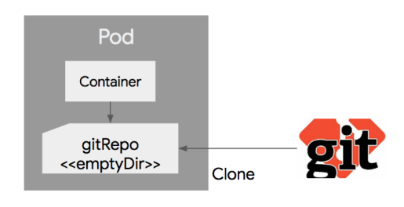
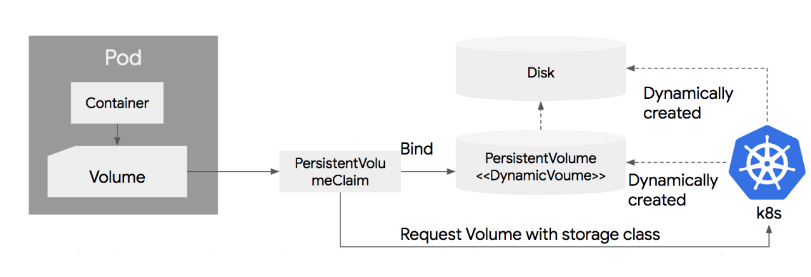

# 02_Doker_c8s

> - https://kyumdoctor.co.kr/13
> - https://bcho.tistory.com/1256
> - https://kubernetes.io/docs/concepts/storage/persistent-volumes/#persistentvolumeclaims

[TOC]


## 01_c8s란?

### 1-1) 선언형 인터페이스

- 명령형 인터페이스 vs **선언형 인터페이스**

  - 명령형

    - 에어컨의 냉매는 어떤걸 쓰고 얼마나 압축한 다음 어떻게 순환시켜~~

      

  - **선언형**
    - 쿠버네티스의 컨셉
    - 내 방의 온도가 20도가 되었으면 좋겠어


### 1-2) Master Node & Workder Node

- 여러대의 서버를 **마치 하나의 컴퓨터를 사용하는 것 처럼** 사용할 수 있다.


## 02_Kunbernetes의 목적


### 2-1) 다중의 도커 서버를 하나의 Pool로 구성

- 쿠버네티스는 **다중 서버의 도커 데몬에 연결**하여 사용
- 사용자는 사용하는 서버에 서버가 몇개인지 도커 컨테이너가 몇개가 실행 중인지 알 필요가 없음 


### 2-2) 다중 서버에 분산되어 컨테이너 생성

- 두 개의 워커 노드에 3개의 Container를 생성하게 되면 쿠버네티스에서 알아서 **컨테이너를 A서버와 B서버에게 할당한다.**
- Idle상태인 서버를 직접 찾을 필요가 없다


### 2-3) A와 B서버와의 컨테이너 통신

- 각 서버 컨테이너는 **각각의 private ip가 존재**
- A서버와 B서버에 있는 **컨테이너 간의 통신**을 **Kube-proxy**등을 통해 통신이 가능


### 2-4) 컨테이너 재생성

- 단일 서버를 사용하다 서버가 다운되거나 컨테이너가 fail되어 exit상태로 빠지는 경우 등을 방지하기 위해서 동일한 **컨테이너를 생성하고 서비스를 지속적으로 제공**한다.


### 2-5) Load Balance

- Round-Robin형태의 로드밸런싱을 제공한다. 


## 03_Object

### 03-1) Object 란

- 가장 기본적인 구성단위
- **Basic Object**
- **Controller**
- **Object spec설정** 이외에 추가 정보인 **메타 정보**들로 구성


### 03-2)  Object  Spec

- 오브젝트의 특성을 기술한 Object Spec으로 정의가 된다.

- 커맨드 라인을 통해서 오브젝트 생성시 인자로 인자로 정의를 하거나 **yaml, json파일로 스펙을 정의**할 수 있다.

  

## 04)  Basic Object

- 배포, 관리되는 가장 기본적인 오브젝트
  - **Pod**
  
  - **Service**
  
  - **Volume**
  
  - **Namespace**
  
    

### 04-1) Pod

```yaml
apiVersion:v1
kind: Pod # kind 정의
metadata:
	name: nginx
spec:
	containers:
	- name: nginx
	  image: nginx:1.7.9
	  ports:
	  - containerPort:8090
```

- apiVersion : 쿠버네티스 API버전

- kind : 리소스의 종류를 정의

- metadata: 이 리소스의 각종 메터데이터를 넣는다. **라벨이나 리소스의 이름** 등

- spec: 리소스에 대한 상세한 스텍을 정의 

  

**Pod단위로 묶어서 배포하는 이유는?**

- Pod내의 컨테이너는 **IP와 Port를 공유**

  - 즉 두개의 Container가 하나의 Pod로 배포되었을때, localhost를 통해서 통신이 가능하다

  - ex) 컨테이너 A가 8080, B가 7001로 배포, B에서 A를 호출할때는 locahost:8080으로 호출, A에서 B를 호출할때는 localhost:7001로 호출하면 된다.

    

- Pod내에 배포된 컨테이너간에는 **디스크 볼륨을 공유**할 수 있다.

  - 근래 어플리케이션들은 실행할 때 어플리케이션만 올라가는 것이 아니라 **Reverse proxy, 로그 수집기 등** 다양한 주번 솔루션이 같이 배포가 된다.
  - ex) 로그수집기의 경우 애플리케이션 로그 파일을 읽어서 수집한다.
    - 애플리케이션과 로그 수집기를 다른 컨테이너로 배포할 경우에 컨테이너에 의해서 파일 시스텖이 분리된다.
    - 따라서 배포된 컨테이너의 로그파일을 읽는 것이 불가능 하지만, **쿠버네티스의 경우 하나의 Pod내에서는 컨테이너들끼리 볼륨을 공유**할 수 있기때문에 **다른 컨테이너의 파일을 읽어올 수 있다.**


### 04-2)  Volume

- DB와 같이 영구적으로 파일을 저장해야하는 경우 Container Restart와 관계없이 **파일을 영속적으로 저장해야한다.** 이러한 storage를 Volume이라고 한다.
- Pod가 기동할때 컨테이너에 마운트(특정 위치와 연결)해서 사용한다.
- Volume은 pod내의 컨테이너가의 공유가 가능
  - 
  - 
  - 2번째 그림과 같이 Volume을 공유하여 htdocs를 공유하는 Voume과 logs를 공유하는 Volume을 마운트하여 공유할 수 있게 할 수 있다.


### 04-3) Service

- 일반적인 분산환경에서는 하나의  Pod으로 서비스하는 경우보다 여러개의 Pod을 서비스하면서, **이를 로드밸런서를 이용해서 하나의 IP와 Port로 묶어서 서비스를 제공**한다.
- **Pod** >> **동적으로 생성, 자동으로 restart** >> **IP가 바뀌게** 되기 때문에 Pod의 목록을 지정할 때 IP주소를 이용하는 것을 어렵다.
- 따라서 **Label과 Label Selector**를 사용
  -  label selector : 어떤 Pod를 서비스로 묶을 것인지 정의하는 것
  - myapp인 서비스만 골라내서 서비스에 넣고, 그 Pod간에만 로드밸런싱을 통해 외부로 버시스를 제공
  - 

```yaml
kind: Service # 종류
apiVersion: v1
metadata:
  name: my-service
spec:
  type: NodePort
  selector:
    app: myapp # selector 
  ports:
  - protocol: TCP
    port: 80
    targetPort: 9376
```

- kind : 서비스

- spec

  ports :

  TCP를 사용하되, 

  서비스는 80포트로, 

  서비스의 80포트의 요청을 컨테이너의 9376포트로 연결해서 서비스로 제공한다.

- Service Type의 종류

  - NodePort : 접근하는 IP는 Pod가 떠있는 노드의 IP를 사용, Port는 할당받는 Port사용
  - LoadBalancer : 클러스터 외부에서 접근할 수 있음
  - ClusterIP : 고정된 IP, Port를 제공, 클러스ㅓㅌ 내부에서만 접근할 수 있는 대역의 주소가 할당

- 실무에선 k8c에 MetaLB와 같은 LoadBalancing역할을 하는 모듈을 설치 후, LB type으로 서비스를 expose하는 방식을 사용

  


### 04-4) Name Space

- 한 쿠버네티스 클러스터내의 **논리적 분리단위**

- 하나의 클러스터 내에, 개발,운영,테스트 환경이 있을때 => 3개의 네임스페이스로 나눠서 운영할 수 있다.

  - 사용자별로 name space별 접근 권한을 다르게 운영

  - 네임스페이스별로 resource의 쿼타를 지정할 수 있다.(할당량), 개발 => CPU100, 운영 => CPU400과 GPU 100개

  - name space별로 리소스를 나워서 관리할 수 있음

    

- 주의할 점
  - 논리적인 분리라는 점
  - 즉 **다른 name space간의 pod이라도 통신은 가능**하다.
  - 네트워크 정책을 이용하여, 네임스페이스간의 통신을 막을 수 있다.
  - 하지만 높은 수준의 분리 정책을 원하는 경우 => **클러스터 자체를 분리하는 것을 권장**


**Label**

```json
"metadata":{
	"labels":{
		"key1": "value1",
         "key2": "value2",
	}
}
```

- metadata세션에 키/값 쌍으로 정의가 가능하다.
- 하나의 리소스에는 여러개의 라벨을 동시에 적용할 수 있다.


**selector**

```yaml
kind: Service
apiVersion: v1
metadata:
  name: my-service
spec:
  selector:
    app: myapp
  ports:
  - protocol: TCP
    port: 80
    targetPort: 9376
```

- 두가지 selector제공

  - Equaility based selector

    - `environment = dev`

    - `teir != dev`

      

  - Set based selector

    - `environment in (prodiction, qa)`

    - `tier notin (frontend, backend)`

      

## 05_Controller

> - 조금 더 편리하게 관리하기 위한 Controller이다.
> - 종류
>   - Replication Controller
>   - Replication Set
>   - DeamonSet
>   - Job
>   - StatefulSet
>   - Deployment
>

### 05-1) Replication Controller

- **Pod를 관리**해주는 역할, **지정된 숫자로** Pod를 가동시키고, 관리하는 역할


- Pod Selector

  - 라벨을 기반으로 하여, RC가 관리한 Pod를 가지고 오는데 사용한다.

  - 즉 RC가 어떤 Pod을 관리할지 정의해주는 것으로 보면 될 것

    

- Replica 수

  - RC에 의해서 관리되는 Pod의 수

  - replica수가 3, 3보다 작으면 새로운 Pod를 띄우고, 이보다 많으면 Pod를 삭제한다.

    

- Pod Template

  - **Pod를 추가로 기동할 때** 어떻게 Pod를 만들지 Pod에 대한 정보(도커 이미지, 포트, 라벨 등)에 대한 정보를 적어주는 곳

    

- 주의할 점
  - Pod가 이미 돌고 있는 상태에서 RC 리소스를 생성할 경우
  - 기존에 생성되어 있는 Pod가 template에 정의된 스펙과 다를지다로 그 Pod를 삭제하지 않는다.
  - ex_ 기본에 아파치 웹서버로 기동중인 Pod, RC의 template은 nginx로 Pod을 실행하게 되더라고 기존에 돌고 있는 아파치 기반의 Pod이 삭제 되지 않는다.


- nginx라는 이름의 RC를 정의
- app:nginx 인 Pod들을 관리
- 3개의 Pod가 항상 운영되도록 설정


### 05-2) ReplicaSet

-  Replication Controller 는 Equality 기반 Selector를 이용하는데 반해, Replica Set은 Set 기반의 Selector를 이용


### 05-3) Deployment

- ReplicaSet이나 RC의 좀더 **상위 추상화 개념**이다.

- 실제 운영에서는 Deployment를 사용하게 된다.

- 배포방식

  - 블루/그린 배포

    - 블루(예전)버전으로 서비스하고 있던 시스템을 그린(새로운)버전을 배포한 후, 프래픽을 블루에서 그린으로 한번에 돌리는 방식

    - 후에, 배포가 완료되고 문제가 없으면 예전 버전의 RC와 Pod을 지워준다.
    - 

  - 롤링 업그레이드

    - Pod를 하나씩 업그레이드 하는 방식

    - 새로운 RC를 만든 후 기존 RC에서 Replica수를 하나 줄이고, 새로운 RC에는 replica수를 하나만 준다. 

    - 

    - 만약 배포가 잘못되었을 경우 기존 RC의 replica수를 원래대로 올리고, 새버전의 replica수를 0으로 만들어 롤백이 가능

    - 불편한점

      - kubectl rolling-update명령은 클라이언트에서 실행하는 명령

      - 명령어 실행중에 클라이언트의 연결이 끊어지면 배포작업이 비정상적으로 끊어질 수 있는 문제가 있음

      - 롤백과정 역시 수동 컨트롤이 필요하다.

        

- 위와 같은 두가지 **배포방법을 자동화하기 위해 나온 추상화 개념**을 Deployment라고 보면 된다.

- RC를 생성, 관리하는 역할을 하며, 특히 롤백을 위한 기존 버전의 RC관리등 여러가지 기능을 포괄적으로 포함하고 있다.

  - 


## 06_Advanced Controller

> - RC,RS,Deploeyment는 웹서버와 같은 일반적이 workload에 대해 Pod를 관리하기 위한 컨트롤러이다.
> - 일반적인 workload 이외에, **DB, 배치작업, 데몬서버와 같이 다양한 형태의 워크로드 모델**이 존재한다.
>


### 06-1) DeamonSet

- DeamonSet은 Pod가 각각의 **노드에 하나씩만 돌게하는 형태로 Pod**를 관리하는 컨트롤러이다.


- RC나 RS에 의해서 관리되는 Pod는 여러노드의 상황에 따라서 일반적으로 비균등하게 배포가 된다.
- DeamonSet에 관리되는 Pod는 **모든 노드를 균등하게 하나씩만 배포**하게된다.
- **서버의 모니터링, 로그 수집용도로 사용가능**


- **특정 Node들에게만 Pod가 하나씩만 배포**되도록 설정 가능
- 특정 장비에 대한 모니터링을 하고자 할 때 가능하다
  - ex_ 특정장비(노드)에만 SSD를 사용하거나 GPU를 사용할 경우 그 장비가 설치된 노드만을 모니터링할 수 있음
- Pod의 **"node selector"의 라벨**을 이용해서 **특정 노드만을 선택**할 수 있음


### 06-2) Job

- workload 모델 중 배치가 **한번 실행되고 끝나는 형태의 작업**에 사용한다
  - ex_ 파일변환 작업 등 웹서버처럼 **계속 Pod가 떠 있을 필요가 없는 것들**

- Job이 종료되면 Pod도 같이 종료된다.
- 정의하는 방법 : command로 사용한다.

```yaml
apiVersion: batch/v1
kind: Job
metadata:
  name: pi
spec:
  template:
    spec:
      containers:
      - name: pi
        image: perl
        command: ["perl",  "-Mbignum=bpi", "-wle", "print bpi(2000)"] # 이부분
      restartPolicy: Never
  backoffLimit: 4
```

- **특정 노드가 장애가 낫을 경우**
  
  - restart 
    - => 즉 처음부터 작업을 다시 시작한다. => 데이터가 겹치거나 문제가 없는 형태여야 한다.
  - 다시 시작 안함
  
- **배치 작업을 하는 경우**

  - 

  - completion을 주면 순차적으로 completion횟수만큼 반복된다.

    

  - 

  - 위 그림과 같이 병렬로도 줄 수 있다.

  - completion 5, parallelism 2


**Cron jobs**

- **시간에 따른 실행조건을 정의**해놓을 수 있고, 이에 따라 Job커트롤러를 실행하여, 정의된 Pod를 실행할 수 있게 해준다.
- 주기적이고 반복적인 작업을 할때 용이
- 1분마다 간단한 데모 작업을 실행

```yaml
apiVersion: batch/v1beta1
kind: CronJob
metadata:
  name: hello
spec:
  schedule: "*/1 * * * *"
  jobTemplate:
    spec:
      template:
        spec:
          containers:
          - name: hello
            image: busybox
            args:
            - /bin/sh
            - -c
            - date; echo Hello from the Kubernetes cluster
          restartPolicy: OnFailure
```


**StatefulSet**

- DB와 같은 애플리케이션을 관리하기 위한 나온 컨트롤러


## 07_구성요소


- **master**

  - 마스터 노드

  - **다중 도커 데몬(서버)을 관리**하는 일을 한다.

  - 클러스터에 관한 전반적인 것을 결정하고 **이벤트를 감지 및 반응하는 역할**

  - Kubectl, api server, scheduler, controller manager, etcd

    

- **worker**
  
  - 도커가 설치되어 있으며 실제 컨테이너들이 생성되어 일하는 노드
  
  - task를 요청대로 수행하는 시스템
  
  - 컨테이너간의 네트워크 등 **서비스에 필요한 전반적인 일을 마스터 노드와 통신**하며 수행
  
  - Kubelet, kube-proxy, pod
  
    

### 07-1) Master의 구성요소

Kunectl

- 마스터 노드와 통신하는 명령어

- 쿠버네티스 API를 사용해서 마스터노드와 상호작용을 한다.

  

api server

- REST API요청을 처리

- 쿠버네티스 클러스터를 구성하는 각 커포넌트들과 통신을 담당

  

scheduler

- 노드들의 리소스 상태를 파악하여 pod가 배치될 적절한 노드를 선택


controller manager

- 쿠버네티스 클러스터 상태 감시

- 설정한 상태로 유지하는 역할

  

etcd

- 오픈소스 key-value저장소로서 k8s에서는 mater node의 API server가 HTTP/JSON API를 이용하여 접근할 수 있는 구성 데이터를 저장하는 용도로 사용


### 07-2) worker node의 구성요소

Kubelet

- 쿠버네티스 master node간의 통신을 담당하는 에이전트
- 노드에서 동작하는 pod들을 관리한다.


Kube-proxy

- 각 노드별로 탑재되며 네트워크 프록시 및 **load balancer 역할**을 해준다.
- pod-pod는 컨테이너의 그룹으로 한개 또는 여러개의 컨테이너를 포함하는 쿠버네티스의 작업단위


Container runtime

- Pod를 통해서 배포된 컨테이너를 실행하는 컨테이너 런타임

- 도커컨테이너 이외에도 rkt (보안이 강화된 컨테이너), Hyper container 등 다양한 런타임이 있다.

  

cAdvisor

- 각 노드에서 기동되는 모니터링 에이전트
- 노드내에서 가동되는 컨테이너들의 상태와 성능등의 **정보를 수집하여, 마스터 서버의 API 서버로 전달**
- **주로 모니터링을 위해서 사용**


## 08_디스크 (Volume)

> - volume이란 **Pod에 종속되는 디스크**
> - Pod에 속해 있는 여러개의 컨테이너가 공유해서 사용될 수 있다.

**Volume의 종류**

- Temp : emptyDir

- Local : hostPath

- Network

  - GlusterFS

    gitRepo

    NFS

    iSCSI

    gcePersistentDisk

    AWS EBS

    azureDisk

    Fiber Channel

    Secret

    VshereVolume 등등


### 08-1) emptyDir 

- Pod의 lifecycle과 같은 주기를 가진다 (삭제될때 삭제, 생성될때 생성)
- Pod 단위이기 때문에 Container가 crash되어 삭제되어도 emptyDir은 살아있다.
- emptyDir.medium 필드에 "Memory"라고 지정해주면, emptyDir의 내용은 물리 디스크 대신 메모리에 저장된다.

```yaml
apiVersion: v1
kind: Pod
metadata:
  name: shared-volumes
spec:
  containers: # 이런식으로 shared하는 것
  - name: redis
    image: redis
    volumeMounts:
    - name: shared-storage
      mountPath: /data/shared
  - name: nginx
    image: nginx
    volumeMounts:
    - name: shared-storage
      mountPath: /data/shared
  volumes:
  - name: shared-storage
    emptyDir: {}
```

- 위 코드는 **nginx와 redis컨테이너를 기동** 시키고, **emptyDir 볼륨을 생성하여 공유**하는 설정
  - 즉 nginx와 redis 컨테이너를 shared디렉토리에 마운트 한 것


### 08-2) hostPath

- **노드의 로컬 디스크의 경로를 Pod에서 마운트**해서 사용

- 같은 hostPath에 있는 볼륨은 여러 Pod사이에서 공유되어 사용

  - **Pod가 삭제 되더라도** hostPath에 있는 파일들은 삭제되지 않는다.

  - **다른 Pod가 같은 hostPath를 마운트** 하면 => 남아있던 **파일을 엑세스할 수 있다.**

    

- 주의할 점

  - Pod가 재시작 =>만약 다른 노드에서 기동? => hostPath가 다르기 때문에 파일 엑세스가 불가

- 노드의 로그 파일을 읽어서 수집하는 로그 에이전트를 Pod로 배포하였을 경우, 이 Pod에서 노드의 파일 시스템을 접근해야한다. 

```yaml
apiVersion: v1
kind: Pod
metadata:
  name: hostpath
spec:
  containers:
  - name: redis
    image: redis
    volumeMounts:
    - name: terrypath
      mountPath: /data/shared
  volumes:
  - name: terrypath
    hostPath:
      path: /tmp
      type: Directory
```


### gitRepo

- 이 volume을 생성하면 => git repo의 특정 리비전의 내용을 clone => 디스크 볼륨을 생성하는 방식
- 물리적으로 emptyDir이 생성되거, git repoㄴ용을 clone으로 다운받는다.



```yaml
apiVersion: v1
kind: Pod
metadata:
 name: gitrepo-volume-pod
spec:
 containers:
 - image: nginx:alpine
   name: web-server
   volumeMounts:
   - name: html
     mountPath: /usr/share/nginx/html
     readOnly: true
   ports:
   - containerPort: 80
     protocol: TCP
 volumes:
 - name: html
   gitRepo: # 이부분
        repository: https://github.com/luksa/kubia-website-example.git
        revision: master
        directory: .
```

- https://github.com/luksa/kubia-website-example.git의 mater를 클론받아 /usr/share/nginx/html에 마운트 시키는 설정이다.


## 09_PersistemtVolume and PersistemtVolumeClaim

> - PV : PersistemtVolume
> - PVC : PersistemtVolumeClaim


- **시스템 관리자** : 실제 물리 디스크를 생성 => 이 디스크를 PV라는 이름으로 k8s에 등록
- **개발자** : Pod를 생성할 때 PVC를 지정하여, 관리자가 생성한 PV와 연결한다.
  - 즉 직접 물리적 디스크에 대한 특성을 정의하지 않는다.

- 따라서 시스템 관리자가 생성한 물리디스크를 k8s 클러스터에 표현한것 => **PV**
- Pod의 볼륨과 PV를 연결하는 관계 => **PVC**


### 09-1) Persistent Volume

```yaml
apiVersion: v1
kind: PersistentVolume
metadata:
  name: pv0003
spec:
  capacity: # 볼륨의 용량 정의. 향후에는 필요한 IOPS나 Throughput등을 지원할 예정
    storage: 5Gi
  volumeMode: Filesystem #  Filesystem(default) 또는 raw를 설정가능
  accessModes: # 밑에 참조
    - ReadWriteOnce
  persistentVolumeReclaimPolicy: Recycle # 밑에 참조
  storageClassName: slow
  mountOptions:
    - hard
    - nfsvers=4.1
  nfs:
    path: /tmp
    server: 172.17.0.2
```

- **persistentVolumeReclaimPolicy**

  - PVC가 삭제된 후 다른 PVC에 의해서 재사용이 가능 => 재 사용시에 디스크의 내용을 지울지 유지할지에 대한 정책
  - Retain : 삭제하지 않고 PV의 내용 유지
  - Recycle : 재사용이 가능, 재 사용시에는 내용을 자동으로 삭제
  - Delete : 볼륨 사용이 끝나면, 해당 볼륨 또한 삭제
    - AWS EBS, GCE PD, Azure Disk등이 이에 해당한다고 한다.
    - Reclaim Policy는 디스크의 특성에 따라서 적용이 가능한 것과 불가능 한 것이 존재

  

- **AccessMode**

  - Pod에서 동시에 PV에 접근할 수 있는지에 대한 정책
  - ReadWriteOnce : PV가 하나의 Pod에만 마운트되고 **하나의 pod에서만 읽고 쓰기가 가능**
  - ReadOnlyMany : 여러개의 Pod에 마운트 가능, 여러개의 Pod에서 **동시에 읽기가 가능. 쓰기 불가능**
  - ReadWriteMany : 여러개의 Pod에 마운트 가능, 여러개의 Pod에서 **동시에 읽기, 쓰기 가능**


### 09-2) PV의 Lifecycle

- 생성 => Available 상태
- PVC에 바인딩, 사용 => Bound상태
- PVC가 삭제 => Released상태 (PV가 삭제되는 것이 아님) => 재사용 or 삭제


### 09-3) PV 생성 (Provisioning)

- yaml파일로 수동으로 생성
- Dynamic Provisioning : 자동으로 생성


## 10_PersistentVolumeClaim

> - Pod의 볼륨과 PVC를 연결

```yaml
kind: PersistentVolumeClaim
apiVersion: v1
metadata:
  name: myclaim
spec:
  accessMkode:
    - ReadWriteOnce
  volumeMode: Filesystem
  resources:
    requests:
      storage: 9Gi
  storageClassName: slow
  selector:
    machLanels:
      release: "stable"
    matchExpressions:
      - {key: environment, operator: In, values: [dev]}
      
```

- accessMode, volumeMode PV와 동일

- resources는 볼륨 사이즈 정의 

  

### Dynamic Provisioning

- 시스템 관리자가 별도로 디스크를 생성하고 PV를 생성할 필요없음
- PVC만 정의하면 이에 맞는 물리 디스크 생성 및 PV생성을 자동화해주는 기능



- PVC정의
- k8s가 물리 Disk생성 => PV생성
- PVC에 storage class를 지정하면, 이에 맞는 디스크를 생성하도록 한다.

````yaml
# PVC생성
apiVersion: v1
kind: PersistentVolumeClaim
metadata:
  name: mydisk
spec:
  accessModes:
    - ReadWriteOnce
  resources:
    requests:
      storage: 30Gi

```

# pod생성
apiVersion: v1
kind: Pod
metadata:
  name: redis
spec:
  containers:
  - name: redis
    image: redis
    volumeMounts:
    - name: terrypath
      mountPath: /data/shared
  volumes:
  - name : terrypath
    persistentVolumeClaim:
      claimName: mydisk
````


### Storage class


