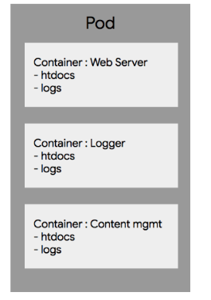
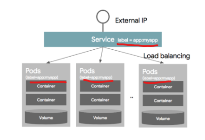
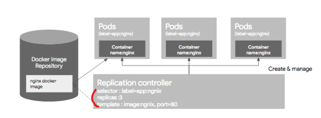
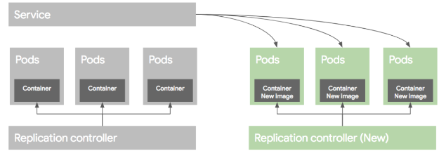
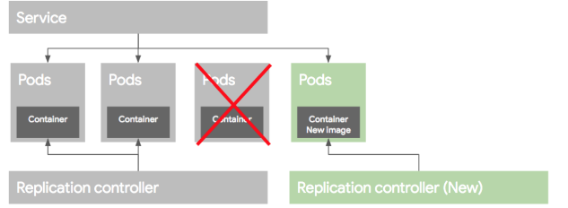
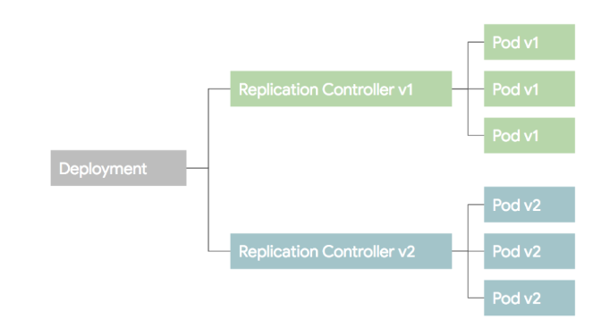
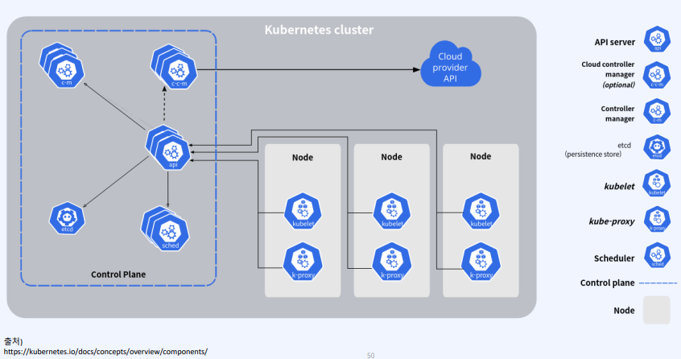

# 02_Doker_c8s

> - https://kyumdoctor.co.kr/13
> - https://bcho.tistory.com/1256


## 01_c8s란?

### 1-1) 선언형 인터페이스

- 명령형 인터페이스 vs **선언형 인터페이스**

  - 명령형

    - 에어컨의 냉매는 어떤걸 쓰고 얼마나 압축한 다음 어떻게 순환시켜~~

      

  - **선언형**
    - 쿠버네티스의 컨셉
    - 내 방의 온도가 20도가 되었으면 좋겠어


### 1-2) Master Node & Workder Node


- 여러대의 서버를 마치 하나의 컴퓨터를 사용하는 것 처럼 사용할 수 있다.


## 02_Kunbernetes의 목적


### 2-1) 다중의 도커 서버를 하나의 Pool로 구성

- 쿠버네티스는 **다중 서버의 도커 데몬에 연결**하여 사용
- 사용자는 사용하는 서버에 서버가 몇개인지 도커 컨테이너가 몇개가 실행 중인지 알 필요가 없음 


### 2-2) 다중 서버에 분산되어 컨테이너 생성

- 두 개의 워커 노드에 3개의 Container를 생성하게 되면 쿠버네티스에서 알아서 **컨테이너를 A서버와 B서버에게 할당한다.**
- Idle상태인 서버를 직접 찾을 필요가 없다


### 2-3) A와 B서버와의 컨테이너 통신

- 각 서버 컨테이너는 **각각의 private ip가 존재**
- A서버와 B서버에 있는 **컨테이너 간의 통신**을 **Kube-proxy**등을 통해 통신이 가능


### 2-4) 컨테이너 재생성

- 단일 서버를 사용하다 서버가 다운되거나 컨테이너가 fail되어 exit상태로 빠지는 경우 등을 방지하기 위해서 동일한 **컨테이너를 생성하고 서비스를 지속적으로 제공**한다.


### 2-5) Load Balance

- Round-Robin형태의 로드밸런싱을 제공한다. 


## Object

### Object 란

- 가장 기본적인 구성단위
- Basic Object
- Controller
- OBject spec설정 이외에 추가 정보인 메타 정보들로 구성


### Object  Spec

- 오브젝트의 특성을 기술한 Object Spec으로 정의가 된다.
- 커맨드 라인을 통해서 오브젝트 생성시 인자로 인자로 정의를 하거나 yaml, json파일로 스펙을 정의할 수 있다.

### Basic Object

- 배포, 관리되는 가장 기본적인 오브젝트
  - Pod
  - Service
  - Volume
  - Namespace

**Pod**

```yaml
apiVersion:v1
kind: Pod
metadata:
	name: nginx
spec:
	containers:
	- name: nginx
	  image: nginx:1.7.9
	  ports:
	  - containerPort:8090
```

- apiVersion : 쿠버네티스 API버전

- kind : 리소스의 종류를 정의

- metadata: 이 리소스의 각종 메터데이터를 넣는다. 라벨이나 리소스의 이름 등

- spec: 리소스에 대한 상세한 스텍을 정의 

  

**Pod단위로 묶어서 배포하는 이유는?**

- Pod내의 컨테이너는 **IP와 Port를 공유**

  - 즉 두개의 Container가 하나의 Pod로 배포되었을때, localhost를 통해서 통신이 가능하다

  - ex) 컨테이너 A가 8080, B가 7001로 배포, B에서 A를 호출할때는 locahost:8080으로 호출, A에서 B를 호출할때는 localhost:7001로 호출하면 된다.

    

- Pod내에 배포된 컨테이너간에는 **디스크 볼륨을 공유**할 수 있다.

  - 근래 어플리케이션들은 실행할 때 어플리케이션만 올라가는 것이 아니라 Reverse proxy, 로그 수집기 등 다양한 주번 솔루션이 같이 배포가 된다.
  - ex) 로그수집기의 경우 애플리케이션 로그 파일을 읽어서 수집한다.
    - 애플리케이션과 로그 수집기를 다른 컨테이너로 배포할 경우에 컨테이너에 의해서 파일 시스텖이 분리된다.
    - 따라서 배포된 컨테인너의 로그파일을 읽는 것이 불가능 하지만, **쿠버네티스의 경우 하나의 Pod내에서는 컨테이너들끼리 볼륨을 공유**할 수 있기때문에 **다른 컨테이너의 파일을 읽어올 수 있다.**


**Volume**

- DB와 같이 영구적으로 파일을 저장해야하는 경우 Container Restart와 관계없이 **파일을 영속적으로 저장해야한다.** 이러한 storage를 Volume이라고 한다.
- Pod가 기동할때 컨테이너에 마운트(특정 위치와 연결)해서 사용한다.
- Volume은 pod내의 컨테이너가의 공유가 가능
  - 
  - 
  - 2번째 그림과 같이 Volume을 공유하여 htdocs를 공유하는 Voume과 logs를 공유하는 Volume을 마운트하여 공유할 수 있게 할 수 있다.


**Service**

- 일반적인 분산환경에서는 하나의  Pod으로 서비스하는 경우보다 여러개의 Pod을 서비스하면서, **이를 로드밸런서를 이용해서 하나의 IP와 Port로 묶어서 서비스를 제공**한다.
- **Pod** >> **동적으로 생성, 자동으로 restart** >> **IP가 바뀌게** 되기 때문에 Pod의 목록을 지정할 때 IP주소를 이용하는 것을 어렵다.
- 따라서 **Label과 Label Selector**를 사용
  -  label selector : 어떤 Pod를 서비스로 묶을 것인지 정의하는 것
  - myapp인 서비스만 골라내서 서비스에 넣고, 그 Pod간에만 로드밸런싱을 통해 외부로 버시스를 제공
  - 

```yaml
kind: Service
apiVersion: v1
metadata:
  name: my-service
spec:
  selector:
    app: myapp
  ports:
  - protocol: TCP
    port: 80
    targetPort: 9376
```

- kind : 서비스

- spec

  ports :

  TCP를 사용하되, 

  서비스는 80포트로, 

  서비스의 80포트의 요청을 컨테이너의 9376포트로 연결해서 서비스로 제공한다.


**Name Space**

- 한 쿠버네티스 클러스터내의 논리적 분리단위

- 하나의 클러스터 내에, 개발,운영,테스트 환경이 있을때 => 3개의 네임스페이스로 나눠서 운영할 수 있다.

  - 사용자별로 name space별 접근 권한을 다르게 운영

  - 네임스페이스별로 resource의 쿼타를 지정할 수 있다.(할당량), 개발 => CPU100, 운영 => CPU400과 GPU 100개

  - name space별로 리소스를 나워서 관리할 수 있음

    

- 주의할 점
  - 논리적인 분리라는 점
  - 즉 다른 name space간의 pod이라도 통신은 가능하다.
  - 네트워크 정책을 이용하여, 네임스페이스간의 통신을 막을 수 있다.
  - 하지만 높은 수준의 분리 정책을 원하는 경우 => **클러스터 자체를 분리하는 것을 권장**


**Label**

```json
"metadata":{
	"labels":{
		"key1": "value1",
         "key2": "value2",
	}
}
```

- metadata세션에 키/값 쌍으로 정의가 가능하다.
- 하나의 리소스에는 여러개의 라벨을 동시에 적용할 수 있다.


**selector**

```yaml
kind: Service
apiVersion: v1
metadata:
  name: my-service
spec:
  selector:
    app: myapp
  ports:
  - protocol: TCP
    port: 80
    targetPort: 9376
```

- 두가지 selector제공

  - Equaility based selector

    - `environment = dev`

    - `teir != dev`

      

  - Set based selector

    - `environment in (prodiction, qa)`

    - `tier notin (frontend, backend)`

      

### 컨트롤러

- 조금 더 편리하게 관리하기 위한 Controller이다.
- 종류
  - Replication Controller
  - Replication Set
  - DeamonSet
  - Job
  - StatefulSet
  - Deployment

**Replication Controller**

- Pod를 관리해주는 역할, 지정된 숫자로 Pod를 가동시키고, 관리하는 역할



- Pod Selector

  - 라벨을 기반으로 하여, RC가 관리한 Pod를 가지고 오는데 사용한다.

  - 즉 RC가 어떤 Pod을 관리할지 정의해주는 것으로 보면 될 것

    

- Replica 수

  - RC에 의해서 관리되는 Pod의 수

  - replica수가 3, 3보다 작으면 새로운 Pod를 띄우고, 이보다 많으면 Pod를 삭제한다.

    

- Pod Template

  - **Pod를 추가로 기동할 때** 어떻게 Pod를 만들지 Pod에 대한 정보(도커 이미지, 포트, 라벨 등)에 대한 정보를 적어주는 곳

- 주의할 점
  - Pod이 이미 돌고 있는 상태에서 RC리소스를 생성할 경우
  - 기존에 생성되어 있는 Pod가 template에 정의된 스펙과 다를지다로 그 Pod를 삭제하지 않는다.
  - ex_ 기본에 아파치 웹서버로 기동중인 Pod, RC의 template은 nginx로 Pod을 실행하게 되더라고 기존에 돌고 있는 아파치 기반의 Pod이 삭제 되지 않는다.


- nginx라는 이름의 RC를 정의
- app:nginx 인 Pod들을 관리
- 3개의 Pod가 항상 운영되도록 설정


**ReplicaSet**

-  Replication Controller 는 Equality 기반 Selector를 이용하는데 반해, Replica Set은 Set 기반의 Selector를 이용


**Deployment**

- ReplicaSet이나 RC의 좀더 상위 추상화 개념이다.

- 실제 운영에서는 Deployment를 사용하게 된다.

- 배포방식

  - 블루/그린 배포

    - 블루(예전)버전으로 서비스하고 있던 시스템을 그린(새로운)버전을 배포한 후, 프래픽을 블루에서 그린으로 한번에 돌리는 방식

    - 후에, 배포가 완료되고 문제가 없으면 예전 버전의 RC와 Pod을 지워준다.
    - 

  - 롤링 업그레이드\

    - Pod를 하나씩 업그레이드 하는 방식

    - 새로운 RC를 만든 후 기존 RC에서 Replica수를 하나 줄이고, 새로운 RC에는 replica수를 하나만 준다. 

    - 

    - 만약 배포가 잘못되었을 경우 기존 RC의 replica수를 원래대로 올리고, 새버전의 replica수를 0으로 만들어 롤백이 가능

    - 불편한점

      - kubectl rolling-update명령은 클라이언트에서 실행하는 명령

      - 명령어 실행중에 클라이언트의 연결이 끊어지면 배포작업이 비정상적으로 끊어질 수 있는 문제가 있음

      - 롤백과정 역시 수동 컨트롤이 필요하다.

        

- 위와 같은 두가지 **배포방법을 자동화하기 위해 나온 추상화 개념**을 Deployment라고 보면 된다.

- RC를 생성, 관리하는 역할을 하며, 특히 롤백을 위한 기존 버전의 RC관리등 여러가지 기능을 포괄적으로 포함하고 있다.

  - 


## K8s 용어

- 구성 요소

- 

  - **master**

    - 마스터 노드

    - 다중 도커 데몬(서버)을 관리하는 일을 한다.

    - 클러스터에 관한 전반적인 것을 결정하고 이벤트를 감지 및 반응하는 역할

    - Kubectl, api server, scheduler, controller manager, etcd

      

  - **worker**
    - 도커가 설치되어 있으며 실제 컨테이너들이 생성되어 일하는 노드
    - task를 요청대로 수행하는 시스템
    - 컨테이너간의 네트워크 등 서**비스에 필요한 전반적인 일을 마스터 노드와 통신**하며 수행
    - Kubelet, kube-proxy, pod

- pod

  - k8c의 기본 배포단위
  - 컨테이너 혹은 컨테이너의 묶음
    - Container를 개별적으로 하나씩 배포하는 것이 아니라 pod단위로 배포
    - 즉 pod안에 Volume, containerized app등이 있을 수 있다.

- rc

  - replication controller의 줄임말

  - **pod를 자동으로 생성 복제해주는 컨트롤러**

  - 복제 개수 설정을 3으로 하게 되면 3개의 pod가 서비스상에서 계속 active상태가 된다.

    

- service

  - pod의 **group을 식별하는 라벨**이라는 기준에 따라 pod들을 하나의 서비스로 외부에서 접근할 수 있도록 해준다.


### Master의 구성요소

Kunectl

- 마스터 노드와 통신하는 명령어

- 쿠버네티스 API를 사용해서 마스터노드와 상호작용을 한다.

  

api server

- REST API요청을 처리

- 쿠버네티스 클러스터를 구성하는 각 커포넌트들과 통신을 담당

  

scheduler

- 노드들의 리소스 상태를 파악하여 pod가 배치될 적절한 노드를 선택


controller manager

- 쿠버네티스 클러스터 상태 감시

- 설정한 상태로 유지하는 역할

  

etcd

- 오픈소스 key-value저장소로서 k8s에서는 mater node의 API server가 HTTP/JSON API를 이용하여 접근할 수 있는 구성 데이터를 저장하는 용도로 사용


### worker node의 구성요소

Kubelet

- 쿠버네티스 master node간의 통신을 담당하는 에이전트
- 노드에서 동작하는 pod들을 관리한다.


Kube-proxy

- 각 노드별로 탑재되며 네트워크 프록시 및 load balancer 역할을 해준다.
- pod-pod는 컨테이너의 그룹으로 한개 또는 여러개의 컨테이너를 포함하는 쿠버네티스의 작업단위


