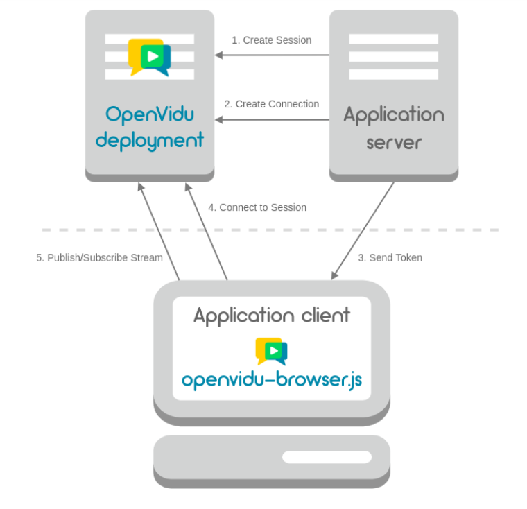

# WebRTC

https://post.naver.com/viewer/postView.naver?volumeNo=29126227&memberNo=50640104 더 확인해야할 부분

#### NAT

- **네트워크 주소 변환 (Network Address Tranlation)**
  
  - IP 패킷의 TCP/UDP포트 숫자와 소스 및 목적지의 IP주소등을 재기록하면서 라우터를 통해 네트워크 트래픽을 주고 받는 기술을 말함

- 사용 이유
  
  - 대개 사설 네트워크에 속한 여러 개의 호스트가 하나의 공인 IP주소를 사용하여 인터넷에 접속하기 위함 (**공유기 같은 걸로 묶고 싶기 때문에 사용하는 기술**)
  
  - 인터넷의 공인 IP주소를 절약할 수 있음
  
  - 인터넷이라는 공공망과 연결괴는 사용자들의 고유한 사설망을 침입자들로부터 보호할 수 있다는 점 (방화벽 사용)

#### STUN, TURN

**STUN**

- **Session Traversal Utilities for NAT**

- 단말이 자신의 공인 IP주소와 포트를 확인하는 과정에 대한 프로토콜

- 즉 STUN서버는 인터넷의 복잡한 주소들 속에서 **유일하게 자기 자신을 식별**할 수 있는 정보를 반환해준다 
  
  - WebRTC연결을 시작전 STUN서버를 향해 요청
  
  - STUN서버는 NAT뒤에 있는 PEER들이 서로 연결할 수 있도록 공인 IP와 포트를 찾아준다. 
  
  - **즉 우리집 주소를 알아내는 것 => 다른사람이 찾아오도록 하기 위해**

**TURN**

- **Traversal Using Relay NAT**

- STUN서버를 통해 자기자신의 주소를 찾지 못할 경우
  
  - 라우터들의 다른 방화벽 정책
  
  - 이전에 연결된 적이 있는 네트워크만 연결할 수 있게 제한
    (Symmetric NAT)

- TURN 방식은 네트워크 미디어를 중개하는 서버
  
  - 중간에 서버를 한 번 더 거친다.
  
  - 따라서 P2P통신이 아님 (Peer to Peer)
  
  - 구조상 지연이 필연적으로 발생
  
  - 따라서 최후의 수단으로 사용된다.

#### Candidate

- 후보
  
  - STUN, TURN서버를 이용해서 획득했던 IP주소와 프로토콜, 포트의 조합으로 구성된 연결 가능한 네트워크 주소들 

- Finding Candidate
  
  - 후보를 찾기위한 과정

- 일반적으로 3개의 주소를 얻게 된다
  
  - 자신의 사설 IP와 포트 넘버
  
  - 자신의 공인 IP와 포트 넘버 (STUN, TURN 서버로부터 획득)
  
  - TURN서버의 IP와 포트넘버 (TURN서버로 부터 획득가능)

#### ICE(Interactive Connectivity Establishment)

- 두 개의 단말이 P2P연결을 가능하게 하도록 최적의 경로를 찾아주는 프레임워크

- ICE프레임워크가 STUN or TURN서버를 이용해 상대방과 연결 가능한 후보들을 갖고 있음

- 즉 두 브라우저가 P2P 통신을 위해 통신 할 수 있는 주소를 알아냈다는 뜻

---------------------------------------------------------------------------------------------

여기까지는 서로의 IP주소를 알기 위한 과정 => 이제부터는 미디어와 관련된 정보를 교환하는 것이 필요 

#### SDP

- Session Description Protocol

- 스트리밍 미디어의 해상도나 형식, 코덱 등의 멀티미디어 컨텐츠의 초기 인수를 설명하기 위해 채택한 프로토콜
  
  - **수신 여부, 오디오 전송, 해상도** 등등

- 제안 응답(Offer/ Answer)
  
  - 교환할 것이라고 제안
  
  - 상대방으로부터 응답이 오기를 기다림
  
  - 응답을 받음
    
    - ICE 후보 중에서 최적의 경로를 결정하고 협상하는 프로세스가 발생
    
    - 수집한 ICE후보글로 패킷을 봰 가장 지연시간이 적고 안정적인 경로를 찾음
    
    - IEC후보가 선택 되면 모든 메타 데이터와 IP주소 및 포트, 미디어 정보가 피어 간 합의가 완료 된다.
  
  - 각 피어에 의해 로컬 데이터 스프림의 end point가 생성
  
  - 이 데이터는 양방향 통신 기술을 사용하여 최종적으로 양방향으로 데이터 전송
  
  - 후보를 못찾았을 경우
    
    - 보안 이슈등으로 인해
    
    - 폴백으로 세팅한 TURN서버를 P2P대용으로 설정

#### Tricle ICE

- 비효율적인 후보 교환 작업을 **병렬 프로세스로 수행**할 수 있게 만드는 것이 바로 Trickle ICE
  
  - 원래는 ICE 후보들을 수집해서 그 목록을 완성한 후 한번에 교환하게 된다.
  
  - 하지만 SDP의 제안 응답 모델과 맞물리면서 단점으로 작용 => **시간이 오래 걸림**
  
  - 네트워크 환경에 따라 지연이 걸릴 수 있음
  
  - 한 쪽 피어의 ICE후보 수집작업이 완료 되어야만 다른 피어가 ICE후보를 모을 수 있기 때문에 비효율적

- 두 개의 피어가 ICE후보를 수집하고 교환하는 과정을 동기적 프로세스에서 **비동기적 프로세스로 만드는 기술**

- **ICE후보를 찾아내는 즉시 교환을 시작함**

#### Signaling

- 이 모든 과정을 시그너링이라고 부른다

- RTCPeerConnection통신에 사용할 프로토콜, 패널 미디어 코덱 및 형식, 데이터 전송 방법, 라우팅 정보와 NAT통과 방법을 포함한 통신 규격을 교환하기 위해 **두 장치의 제어 정보를 교환하는 과정**

- 웹 소켓 (Web Socket)

- 서버 전송 이벤트 (Server-sent-Event)

- 폴링 (Polling)
  
  - 시그널링 정보를 조회할 수 있는 API를 만든 후
  
  - 브라우저 단에서 주기적으로 CHR을 요청하는 기법

- Kinesis Video Stream, Google App Engine으로 구현된 시그널링 서버가 존재 

- [WebRTC-Experiment/Signaling.md at master · muaz-khan/WebRTC-Experiment · GitHub](https://github.com/muaz-khan/WebRTC-Experiment/blob/master/Signaling.md)[WebRTC-Experiment/Signaling.md at master · muaz-khan/WebRTC-Experiment · GitHub](https://github.com/muaz-khan/WebRTC-Experiment/blob/master/Signaling.md)


#### 장점

- 지연시간이 짧다
  
  - 콘텐츠를 잘게 쪼개서 전송하는 방식으로 파일 사이즈를 줄여서 전송 지연시간을 단축
  
  - Chunked Streaming
  
  - 전송되기 전에 전체 세그먼트가 로드될 때 기다리지 않고 chunk가 준비 될 떄 각 세그먼트를 점진적으로 전달 할 수 있음

- 보안성이 좋음


#### 한계

UDP위에서 동작

- 이유 : 데이터를 빠르게 전송 할 수 있어야하기 때문

- 문제
  
  - 데이터 손실을 발생 할 수 있음
  
  - 비디오 같은 경우에는 크게 중요하지 않지만 중요문서같은 경우에는 중요하게 된다.

WebRTC통신원리

크게 3가지 클래스에 의해 실시간 데이터 교환이 일어나 

- Media stream
  
  - 카메라와 마이크 등의 데이터 스트림 접근

- RTCPeerConnection
  
  - 암호화 및 대역 폭 관리 및 오디오, 비디오의 연결

- RTCDataChannel
  
  - 일반적인 데이터의 P2P통신

## 


## WebSocket

(3way hand shake 4way hand shake 찾아보기)

#### 작동 원리


1 ) Handshake

- 최초 연결 요청 시 클라이언트에서 HTTP를 통해 웹 서버에 요청


2 ) 전 이중 통신

- 연결이 수립되면 클라이언트와 서버 양측간의 데이터 통신 단계가 시작

- 서로 메세지를 보내며 통신 => 프레임 단위로 이루어진다.

- Heartbeat
  
  - ping : 상대방에게 ping 패킷을 보내는 것
  
  - pong : 수신측은 가능한 빨리 pong 패킷을 상대방에게 전송해야함


3 ) 연결 종료

- 클라이언트 혹은 서버 양측 누구나 연결을 종료할 수 있음


  

## Open Vidu


정리 및 확인 할 부분 찾기

Front

```javascript
//default
axios.defaults.headers.post["Content-Type"] = "application/json"
;// 글로벌 axios 기본(defaults) 설정 => application/json
const s = "i7b105.p.ssafy.io";
const OPENVIDU_SERVER_URL = "https://" + s + ":8443";
const OPENVIDU_SERVER_SECRET = "admin";
```

- Content-Type
  
  - 이미지, 영상 : multipart/form-data
  
  - json텍스트 : application/json


Back

- application.properties

```java
#openvidu
openvidu.url: https://localhost:4443/
openvidu.secret: MY_SECRET
```


#### OpenVidu 아키택쳐

- OpenVidu deployment
  
  - 모든 필요한 real-time 스트리밍 인프라를 제공한다.


###### server application

- you can directly call the [REST API](https://docs.openvidu.io/en/stable/reference-docs/REST-API/) endpoints with any REST client

- Integrating OpenVidu in your application server is essential to make your videocalls secure. Visit section **[Application server](https://docs.openvidu.io/en/stable/application-server/)** to learn how to integrate OpenVidu in your application's server side.

- 세션을 보호하기 위해서 Application server와 연동이 필요하다.

- **`OPENVIDU_URL`** and **`OPENVIDU_SECRET`** 필요


- client application


### Workflow of an OpenVidu Session



1. 서버로 부터 session초기화 ( 세션 만듦 )

2. 서버로 부터 세션을 위한 connection을 만든다

3. 사람수 많큼 connection을 만들어 주어야 한다.

4. 각각의 Connection은 토큰을 가지고 있어야한다.

5. 토큰을 client에게 가져다 준다.


