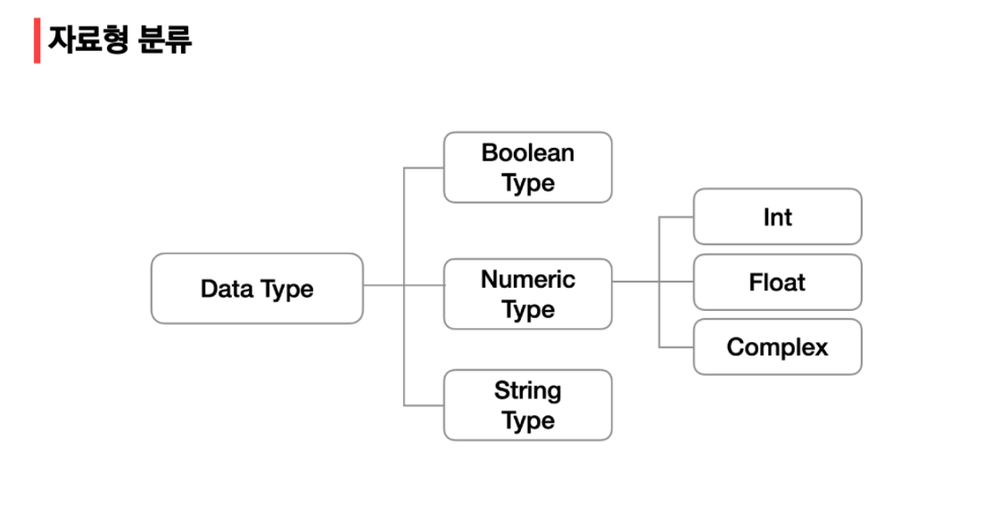
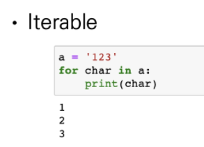
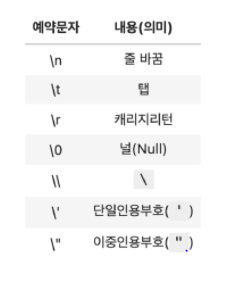
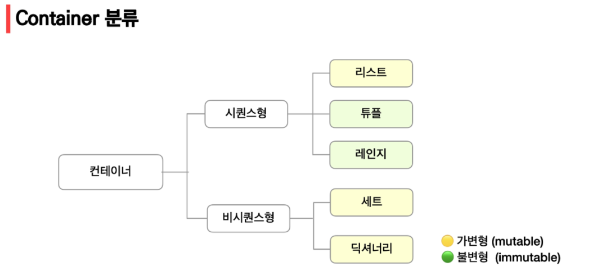
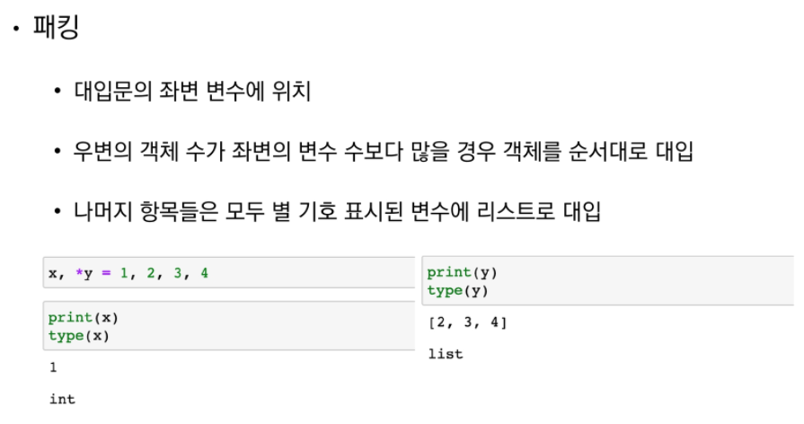
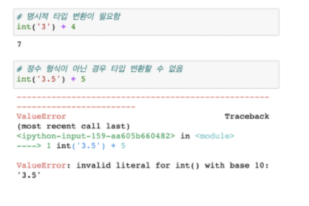
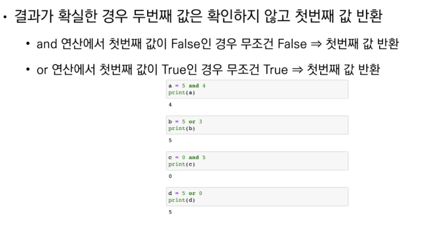
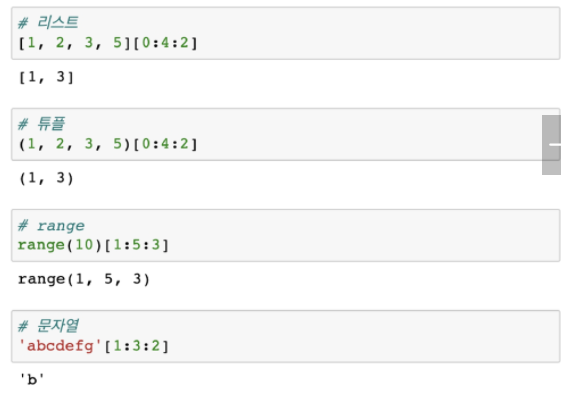

# Python 기초

- 스타일 가이드 : PEP8

## 문법

### 변수(Variable)

- 이름 = 값 (등호 1개 => 할당)
- 객체(ocject) = things(무언가)
- 변수 활용에 중요한 점 == 타입(type)


### 변수 연산

- 숫자 + 숫자 가능
- 문자 + 문자 가능


### 변수 할당


typeerror (unpack) : 풀 이름이 부족하다

too many 				:  변수가 너무 많음


## 자료형



### 불린(Boolean)


### 정수(int)

- 특징: overflow가 발생하지 않는다.

- 진수 (b, o, x)

  - 2진수: 0b     ex)  ob10 --> 2

  - 8진수 : 0o    ex)  0o30 --> 24

  - 16진수: 0x   ex)  0x10 --> 16


### 실수(Float)

- 특징 : rounding error

  - 
  - 해결: 절대값을 씌워서 굉장히 작은 수라면 rounding 에러라고 판단한다. 

- 확인 하는 방법 2가지

  - ```python
    a = 3.5 - 3.12
    b = 0.38
    
    abs(a - b) <= 1e-10
    ```

  - ```python
    import sys
    abs(a - b) <= sys.float_info.epsilon
    ```

  - ```python
    # math.isclose() 를 이용해서 a와 b의 값이 같은지 확인할수 있습니다.
    import math
    math.isclose(a, b)
    입실론은 굉장히 작은 수이다
    따라서 굉장히 작은 수 인지 물어보는 것이다.
    ```


### Complex

- 복소수
- 문자열 => 복소수 complex('1 + 2j') 안됨 // complex('1+2j') 됨


## 문자열(String Type)

- immutable(변하지 않음) : str 의 일부분만 바꿀 수 없다.
- Iterable(반복가능)  :  for 문에서 순서대로 표현가능




### Escape sequence



### String Interpolation

- 문자열 사이에 변수를 넣는다


- datetime 에서도 가능

  - ```python
    import datatime
    today = datetime.datetime.now()
    print(f'오늘을 {today:%y}년 {today:%m}월{today:%d]일 {today:%A}}')
    ```

  - 


## 컨테이너(Container)

- 분류 : 순서가 있는 데이터 vs 순서가 없는 데이터

  


### 리스트(list)

- list[-1] : 끝에 값을 의미한다.
- boxes = ['a','b',['apple', 'banana', 'cherry']]
- boxes[- 1] [1] [0]          # 'b'  
- sum([[리스트],[리스트]   ......   ],  [  ]) 를하게 되면 정렬시켜준다

```python
f_2018 = sum([[0], [512], [256] * 2, [128] * 4, [64] * 8, [32] * 16], [])

print(f_2018)
#[0, 512, 256, 256, 128, 128, 128, 128, 64, 64, 64, 64, 64, 64, 64, 64, 32, 32, 32, 32, 32, 32, 32, 32, 32, 32, 32, 32, 32, 32, 32, 32]


print(sum ([[1], [2]], []))
#[1, 2]

print(sum ([[1], [2]], [3]))
#[3, 1, 2]

print(sum (([1], [2]), [3, 4]))
#[3, 4, 1, 2]
```


### 튜플(Tuple)

- 불변 ==> 변경이 불가능
- x, y = 1, 2    ==    x, y = (1, 2)   :  파이썬 내부적으로 tuple로 처리한다


### 레인지 (Range)

-  range(n, m, s): n ~ m-1 을 s만큼 증가
- s => -1   가능
- n > m    가능


### Packing/ Unpacking Operator

	*을 사용한다.



**packing은 list로 저장된다. **


 **각각이 흩어져서 들어간다!! 라는 뜻임**


### 셋(Set)

- 집합이랑 비슷하다.
- set( ) or { }중괄호를 사용한다. 
- {1,2,3,1,2}       # {1,2,3}

- **주의 :** 
  - {}: 빈 중괄호 = 딕셔너리 // 만약 **빈 set**을 원하면 ==> **set()**
  - **순서가 필요할 경우 사용 x**


### 딕셔너리(Dictionary)

- 키 - 값(key - value)
- **key**에 **list 불가**   ///  **value**에 **list 가능**
- 순서 없음

```python
dic = {1 : 2, 2: 3}
dict.get(1)
dict[1]
# 둘다 값이 똑같이 나온다
# 하지만 둘이 다른점: get은 에러를 출력하지 않고 None을 밷는다
# 빼올때 하나 씩 보면 된다. 
# 모두 []를 넣으면 된다

#dic = { 'dic_list' : [{'age': 20, 'location': "서울"}, {'age': 30, 'location': "경기"}], 'list': {['1', '2', '3'],1 : 'integer',(1,2) : 'tupple'}

# ex) dic['dic_lst'][0][1] 이런식으로
```


## 형 변환(Typecasting)


### 자료형 변환

- 암시적 형 변환(Implicit) : 사용자 의도 x, 파이썬 내부에서 변환


		**int와 float 연산 ==> 무조건 float**


- 명시적 형 변화(Explicit) : 

		그냥 형태를 맞추기 위해서 변환을 시켜주는 것 ex) int() ==> str()




			만약 float('3/4') + 5.3을 하고 싶다면
	
			a = '3/4' , float(a) + 5.3이면 가능


### 컨테이너 형 변환


dictionary를 list로 변환 ==> key만 나옴


## 연산자(Operator)

### 산술연산자

- divmod ==> 튜플로 반환 (몫, 나머지)
- import math
- math.squrt ==> 루트

- 특정 변수가 비어 있는지 확인하기 위해서는
  - x == None이 아닌 x is None을 사용하는 것을 권장한다.
- 

### 논리 연산자

- and : 모두 True 일때만 True
- or : 모두 False 일때만 False



and : 3번쨋꺼 ==> 0이 False ==> 0

or :  4번쨋꺼 ==> 5가 True ==> 5


is 는 같은 저장장소를 물어보는 것이다

ex) 같은 list라고 하더라고 저장장소가 다르기 때문에 False가 뜬다.

### 멤버십 연산자

- in
- not in


### 시퀀스형 연산자

- '12' + 'b'     ==> '12b'

- (1, 2) + ('a', )  ==> (1, 2, 'a')

  

### 슬라이싱(Slicing)


						미포함이라고 하더라도 에러가 뜨지 않는다	


​				




### set 연산자


### 프로그램 구성 단위

- **식별자 **  : 이름

- **리더럴 **  : 변수

- **문장**      : 실행 가능한 최소한의 코드 단위

- **함수 **     : 명령을 수행하는 함수 묶음

- **모듈 **      : 함수/클래스의 모름

- **패키지**    : 프로그램과 모듈 묶음

- **라이브러리 **: 패키지 모음