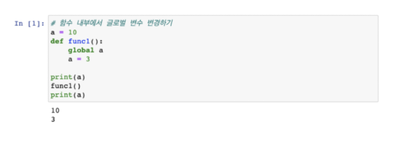
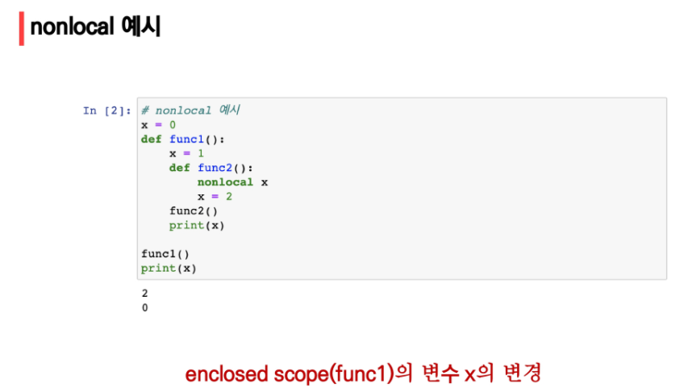
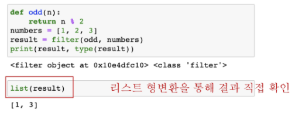

# 함수

``` python
def func(parameter):
    return returning_value
```

구조 및 순서:

1. 선언과 호출
2. 입력
3. 결과값
4. 문서화   ==> print(print.\__dox__) 어떻게 써야하는지 설명해준다.
5. 범위


## 구조

### 선언과 호출

1. 호출이 어떻게 될지 먼저 생각 하자
2. 매개변수를 어떻게 정할지 생각하자
3. 선언 작성

```python
# 호출방법
foo()   # parameter 없을때 빼고 호출
add(2,3) # 있을 땐 넣어서 호출

# 실습문제1
# 입력 받은 수를 3제곱하는 cube 작성
# cube를 활용하여 2의 세제곱, 100의 세제곱

def cube(x):
    return x ** 3

print(cube(2), cube(100))
```


### 함수의 결과값 (Output)

- void function (비어있다는 뜻)
  - return값이 없으면 None 반환


- value returning function
  - return은 print와 다르다 (print는 return을 포함하지 않는다)
  - return값 반환
  - 반환후 함수 종료 
  - return을 2개를 사용할 수 없다

```python
def minus_and_product(x,y):
    return x-y, x*y

y =minus_and_product(4,5)
print(y)
# (-1, 20)

# 이런 식으로 사용해야한다.
# 하나의 값으로 반환 = 튜플로


# 실습문제2
# 사각형 넓이와 둘레를 구하라

def rectangle(width, height):
    area = width*height
    around = (width + height)*2
    return area, around
# (600, 100)
```


### 입력(Input)

- Parameter:  이름을 지어줄 때 사용되는 것
- Argument: 호출할때 사용되는 것

```python
def say_anything(anything):     # parameter = anything
    print(f'hello {anthing}')
  
say_anything('python')   # argument = 'python'
```


##### Arguments(순서 다음 지정 순)

- position Arguments: 순서대로 (필수)


- keyword Arguments (선택):
  - 직접 변수의 이름으로 전달가능(x , y 바꿔도 가능)

```python
def add(x,y):
    return x + y

add(x = 2,  y) #이거 안됨 
add(2,  y = 3) #이거는 됨  신기ㅋㅋ
```


- defalt arguments Value
  - 값을 미리 정의해 둘 수 있다

```python
def add(x, y=0):
    return x + y

add(2) # 2

# 하지만 이건 안됨
def add(x = 0 , y):
    return x + y
```


- 정해지지 않은 여러 개의 Arguments 처리
  - **print(*obdects, sep = ' ', end ='\n')** 를 사용한다
    - end는 끝에 무언가를 붙여줘 (다음줄로 넘겨줘)
    - sep (띄어졌을 때)  --> ' 1', '2  '  ==> 1 2
  
  
  
  - (*arg) 를 사용할 땐 튜플로 들어간다
  
  - **(\**kwargs)** 딕셔너리 사용

```python
def add(*args):
    for arg in aㄱgs:
        print(arg)
        
# *은 묶는 것이다.

add(2,3,4,5)

def family(**kwargs):
    print(kwargs)
    
family(father = '고길동', monster = '둘리')
# **은 딕셔너리로 묶는 것이다.

# 실습 문제
x = [1,2,3]

def fuc(x):
    for i in x:
        print(i)
#1
#2
#3   으로 나오게 된다.
   
def fuc(*x):
    for i in x:
        print(i)

fuc(x)
# [1,2,3] 으로 나오게 된다.
# 이유: 
for i in ([1,2,3], ):   # 이런식으로 나오기 때문이다
        print(i)
        
        
def my_url(**x):
	return 'https://api.go.kr?sidoname={}&key= {}&'.format('sidoname','key')

# https://api.go.kr?sidoname=sidoname&key=key&
```


### 함수의 범위(Scope)

- 함수는 코드 내부에 local scope를 생성한다
  - 블랙박스 안에서 만든 변수값들은 함수 외부에서 사용 불가능
- LEGB 순으로 간다

``` python

```


- global 키워드를 쓸때는 상단에 써야한다.



1. 글로벌이 함수 안에 있음

2. 그럼 그 함수를 사용하면 a 값은 global값이 된다

3. print(a)를 했을 때 global a값이 나오게 된다 라는 뜻이다.





 만약 함수 하면서 디버깅 기능이 없으면

```python
def local(c):
    print(local())
# 이런식으로 써주면 된다
```


### 함수 응용

##### map(function, iterable)

- function: 각 요소에 적용하고 싶은 함수의 이름을 넣는 것

- iterable: 리스트 등등


```python
# map
# input 값들을 숫자로 바로 활용하고 싶을 때
input_valie = map(int, input().split())

# 리스트 풀기
result = [20, 20]
n, m = result  # n = 20, m = 20


```


```python
def add(*x):
    a, b = x
    return a + b

a = list(map(add, [[1,2],[3,4]]))
print(a)
```


##### filter(function, iterable)

- 결과를 True인 것을 반환한다




##### zip(\*iterables)

- 튜플로 모아준다.


```python
# zip튜플로 모아줄 수 있음 
>>> numbers = (1, 2, 3)
>>> letters = ("A", "B", "C")
>>> pairs = list(zip(numbers, letters))
>>> pairs
[(1, 'A'), (2, 'B'), (3, 'C')]


# unzip
>>> numbers, letters = zip(*pairs)
>>> numbers
(1, 2, 3)
>>> letters
('A', 'B', 'C')

# 사전 변환 ==> 딕셔너리로 변환시켜주기
>>> keys = [1, 2, 3]
>>> values = ["A", "B", "C"]
>>> dict(zip(keys, values))
{1: 'A', 2: 'B', 3: 'C'}

>>> dict(zip(["year", "month", "date"], [2001, 1, 31]))
{'year': 2001, 'month': 1, 'date': 31}


# 만약에 길면 짧은 것 기준으로 넣어준다
a = [a,b,c]
b = [1,2,3]
c = [x,y,z]

print(list(zip(a,b,c)))

출력: [('a', 1, 'x'), ('b', 2, 'y'), ('c', 3, 'z')]

# 트랜스폼이 가능하다(시계)
# 이중 리스트에 넣어져 있음
from pprint import pprint
a = [[1,2,3,4,5]] * 5
b = zip(*a)
pprint(list(b))

ppirnt(b)

[(1, 1, 1, 1, 1),
 (2, 2, 2, 2, 2),
 (3, 3, 3, 3, 3),
 (4, 4, 4, 4, 4),
 (5, 5, 5, 5, 5)]


# 반대방향으로(반시계)

from pprint import pprint
a = [[1,2,3,4,5]] * 5
b = zip(*a[::-1])

pprint(b)


# 이런식으로 하더라도 
dic = {'하나' : 1, '둘': 2, '셋':3}
keys = ['하나', '둘']

ans = {}

for key in keys:
    ans[key] = dic[key]

print(ans)
# {'하나': 1, '둘': 2}
```


##### lambda

- 이름없는 익명함수
- 함수를 한번 정도만 쓸 것 같을 때 사용한다.

- 복잡한 함수 안됨


##### 재귀함수

- 자기 자신을 호출
- 1개이상의 종료되는 조건이 필요, 수렴하도록 작성
- stack overflow가 될 수 있음( 총 1000번까지만 할 수 있음)
- 반복문이 더 빠름 그러나 가독성이 좋음


- 코드 구현

```python
# ex) n! (1~n 까지 다 곱한 것)

def factorial(n):
    if n == 0 or n == 1:
        return 1
    else:
        return n * factorial(n-1)
 
factorial(4)

# 함수를 내부에서 factorial(n-1)을 호출한다
# 즉! 재귀함수야~ 라는 뜻

```


