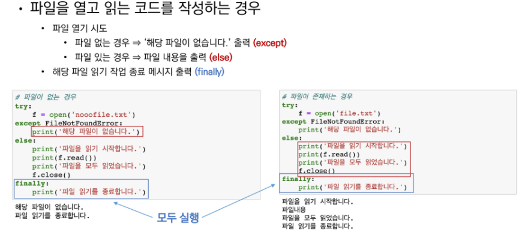

# 에러/예외처리

- 디버깅
- 에러와 예외
- 예외 처리
- 예외 발생시키기


## 디버깅

- branches	:모든 조건 커버?
- for loops    : 반복문 원하는 횟수? 반복문 값 (진입, 결과) 하나만 반환 등등
- while loops: for + 종료 조건 ==> 무한 루프에 빠지지 않았는지
- function     : 제대로 인풋을 넣어 주었는지 결과// type


#### 디버깅 방법

- print문 활용
  - 함수 결과, 반복, 조건을 나누어서 생각한다.
- breakpoint, 변수 조회등을 활용

- 해결방법:
  - 휴식을 가진다
  - **누군가에게 설명해봄**
  - **인형에게 설명해좀**


## 에러와 예외

SyntaxError : 문법적인 오류

- cannot assign to literal ==> 여기에 숫자 안돼
- EOL : 안끝났어 (따온표를 안씀)
- EOF : print(  

####  예외(Exception)

ex) ZeroDivision Error 등등


## 예외처리

- try 문
  - 여기서 에러가 발생하면

- except 문
  - 그럼 여기서 에러 발생시켜


```python
# 숫자를 입력 받고 싶은데 아닐 때
try:
    num = input('숫자입력: ')
    print(int(num))
    
except ValueError as msg:
    print('숫자가 입력되지 않았습니다.' , msg)
    
except : # ==> 이런식으로 사용가능하다
 
```


- 이런식으로 사용가능
- 가장 작은 범주부터 큰 범주로 순서대로 해야한다. 


Finally 를 사용하는 경우

- 파일을 열고 읽는 코드를 작성하는 경우 사용하게 된다.




if else는 에러가 나올때 멈춤

try except는 에러가 나더라도 에러를 처리하려고 한다.


### 예외 발생 시키기 에러

#### - raise <표현식> (메세지)

- 실제 프로덕션 코드에서 활용


#### - assert <표현식> (메세지)

- 일반적으로 디버깅 용도로 사용된다.
- 특정조건이 False일때 에러를 발생시킨다.


