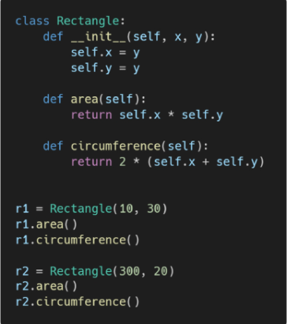
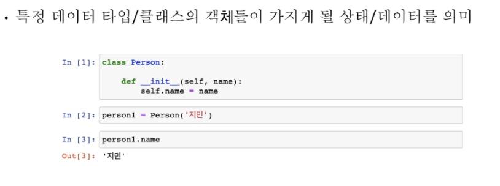
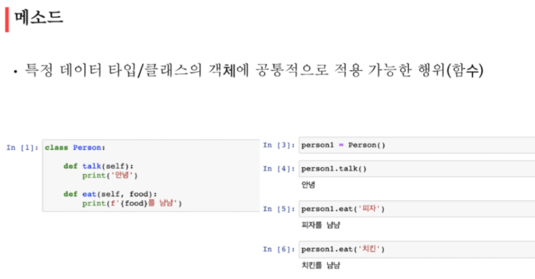
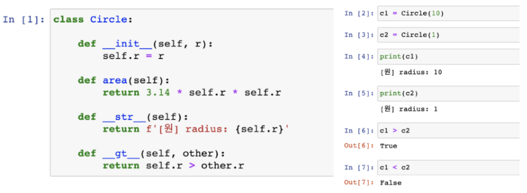
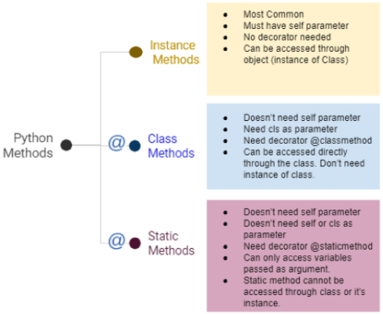
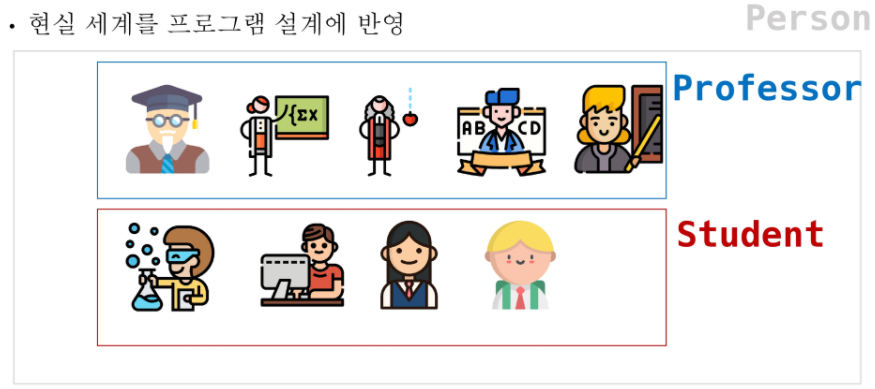
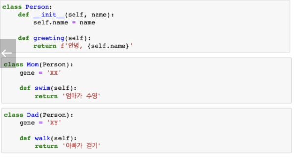

# OOP

- 객체지향 프로그래밍
- 갹채지향 핵심개념

## 객체지향 프로그래밍

- 파이썬은 모두 객체(object)로 이뤄져 있다.
- 객체(object) = 특정 타입의 인스턴스(instance)
  ex) 123은 int의 인스턴스/ []는 list의 인스턴스

- 객체(object) = 속성 (attribute)+ 기능(method)

|            절차 지향            |         객체지향         |
| :-----------------------------: | :----------------------: |
| - 리턴한 값을 다시 저장해줘야함 | 원본자체를 바꿀 수 있다. |
|      -  함수까지 사용가능       |   - class 사용이 가능    |

### 객체지향이 필요한 이유

- 현실 세계를 프로그램 설계에 반영 (추상화)
- 사람의 행동 등등




- 객체지향의 구조

- 사각형 : **class** (사람) :
- r1, r2  : **instance** (아이유)
- 가로세로길이  : **attrubute**  ()
- 넓이를 구한다(사각형의 행동) : **method** (인사, 노래부른다 등등)


속성




## 인스턴스

### self

- 인스턴트 자기 자신을 말한다.
- 매개변수 이름으로 self를 첫번째 인자로 정의한다.

- 다른 단어로 써도 작동하지만, 파이썬의 암묵적인 규칙


```python
class Person:
    # 인스턴스 메서드
    # 파이썬 내부적으로 Person.test(p1)으로 작동하고 있다
    
    def test1(self):
        return 'test'   # 이렇게 하면 안됨
    
    def test2(self):
        return self
    
p1 = Person()

p1.test1() 
# 타입에러가 뜨게 된다. test는 0개의 positional argements 인데 1개가 주어짐

s = p1.test2()
print(s)	# 이것과 아래 값이
print(p1)  # 같은 값이 생성
           #Person.test(p1)
# 첫번째 인자를 self에 넣어준다.
# (첫번째 인자).area()  ==> 앞에 괄호가 def( 여기 ) 로 들어가게 된다
# 따라서 return에도 self.x 등등이라고 써줘야한다.

```


#### 생성자(constructor) 메소드

- def\__init__ (self):   ==> 이런식으로 사용
- 인스턴스 객체가 생성될 때 자동으로 호출되는 메소드
- 보통 초기값을 설정해주고 싶을때 사용한다. 

```python
class Person:
    
    def __init__(self, name, age):
        # 인스턴스 변수를 정의하기 위해 사용한다
        self.name = name  # p1의 이름은 = '영택'이야 라는 뜻이다
        self.age = age  # 왼쪽: p1은 . 오른쪽: 들어오는 변수값
        # 즉 정의를 해주는 것이다
        
        
# 이것을 사용하기 위해서는
p1 = Person('영택', 100) # 이런식으로 사용
print(p1.name, p1.age) # 이렇게 사용가능하다.


class Person:
    
    def __init__(self, name, age):
        self.nn = name  # 즉 이렇게 사용이 가능하다
        # nn과 name을 잘 확인해보기
p1 = Person('영택', 100)
print(p1.nn)


class Person:
    
    def __init__(self, name, age =1):

        self.name = name
        self.age = age
        
        
# 이것을 사용하기 위해서는
p1 = Person('영택') # 이런식으로 사용
print(p1.name, p1.age) # 이렇게 사용가능하다.
# 영택, 1 
```


#### 소멸자(destructor)

- 인스턴스가 사라질 때(직전) 호출되는 메소드

```python
class Person:
    
    def __init__(self):
        print('응애')
        
    def __del__(self):
        print('악!')
        
p1 = Person()
# 응애

del p1
# 악!
        
```


#### 매직 메소드

- 특정 상황에 자동으로 불리는 메소드

ex)


```python
class Person:
    
    def __init__(self, name, age, height):
        self.name = name
        self.age = age
        self.height = height
        
    def __gt__(self, other):    # gt = great = 더 크다 라는 뜻
        return self.age > other.age
    
    def __len__(self):
        return self.height
    
    def __str__(self):
        return f'<{self.name}>: {self.age}살'
    
 
p1 = Person('재영', 100, 190)
p2 = Person('지선', 10, 185) 

p1 > p2
# True  # 재영 100살 > 지선 10살

len(p1)  # 190
len(p2)  # 185

#str을 추가 해 줬을때
print(p1)
#<재영> : 100살
```




## 클래스

### 클래스 메소드

- @classsmethod 데코레이터를 사용하여 정의란다.
- 호출시 첫번째 인자로 클래스(cls)가 전달된다. 

```python
class MyClass:

    @classmethod           #여기서는 self를 사용하지 않는다.
    def class_method(cls):
        
        return cls
    
MyClass.class_method()
MyClass # 둘이 똑같은 값을 반출한다.

```


###  스태틱 메소드

- @staticmethod를 사용해서 정의한다.
- 호출시, 어떠한 인자도 전달되지 않음
- 1개 값이 필요함
- 언제사용?
  - 속성을 다루지 않고 단지 기능만을 하는 메소드를 정의 할 때


#### 정리

```python
class MyClass:
    
    # 함수는 기본적으로 로컬 스코프를 가지고 있음
    # 내부에서 활용하고 싶으면 파라미터로 받도록 정의
    
    #인스턴스 메서드 : 인스턴스를 조작하고 싶어
    #(파이썬 제작자) 함수 내부에 인스턴스를 던져주도록 설계
    # 메서드를 정의할 때 self로 받도록 한다
       
    def instance_mthod(self):
        retirn self     
    
    #클래스 메서드: 클래스를 조작하고 싶어
    #(파이썬 제작자) 함수 내부에 클래스를 던져주도록 설계
    # 메서드를 정의할 때 cls를 받도록
    @classmethod
    def class_method(cls):
        print(cls.var)
        return cls
     
    # 스태틱 메서드: 클래스나 인스턴스를 조작할 생각은 없는데 함수를 쓸거야
    def static_method():
        return ''

```




## 객체 지향의 핵심개념

- 추상화
- 상속
- 다형성
- 캡슐화


### 1. 추상화




### 2. 상속

- 상위 클래스에 정의된 속성, 행동, 관계 등을 그대로 사용하기 위해서


```python
class Person:
    
    def __init__(self, name, age):
        self.name = name
        self.age = age
        
    def talk(self):
        print(f'hi. I am {self.name}')


class Professor(Person):
    # 위에 있는 함수들을 사용할 수 있다. 
    def __init__(self, name, age, department):
        self.name = name
        self.age = age
        self.department = department


class Student(Person):
    # 위에 있는 함수들을 사용할 수 있다. 
    # talk을 새로 만들면 덮어씌어진다. 즉 상속받고 쓰고 싶은건
    # 정의를 또 안해주고 쓰고, 다시 만들고 싶으면 그냥 다시 만들면 된다
    def __init__(self, name, age, gpa):
        self.name = name
        self.age = age
        self.gpa = gpa

    def talk(self):
        print('충성충성', {self.name}, '입니다 교수님')


p1 = Professor('jang', 20, 'scitence')
p1.talk()  #   f'hi. I am jang'    
        
        
p1 = Student('jang', 20, 'scitence')
p1.talk()  #  '충성충성', jang, '입니다 교수님'
    
```


- isinstnace (object, classinfo)
  - classinfo의 instance거나 subclass인 경우 True


- issubclass (object, classinfo)
  - class가 classinfodml subclass면 True

ex)

```python
issubclass(bool, int) # True
#이유: bool (0,1)   int 123213

issubclass(float, int) # False
#float 실수 int 정수
```


#### super()

```python
class Person:
    
    def __init__(self, name, age):
        self.name = name
        self.age = age
        
    def talk(self):
        print(f'hi. I am {self.name}')


class Student(Person):
    def __init__(self, name, age, student_id):
        
    	## 이부분을 확인하면 된다.
        #self.name = name
        #self.age = age
        #이렇게 다 적어주지 않아도 된다.
        
        super().__init__(name, age)
		self.student_id = student_id
        
    def talk(self):
        print('충성충성', {self.name}, '입니다 교수님')
```


#### 상속 + classmethod

```python
class Person:
    population = 0
    
    @classmethod
    def add_population(cls):
        cls.population += 1   # 정의를 한것 넘겨줄 것// 1씩 더할 것이다

class Student(Person):
    population = 0

Person.add_population()
print(Person.population)
# 1이 나오게 되고

Student.add_population()
print(Student.population)
# 1이 여기서도 나오게 된다. 왜냐하면 상속받고 class를 다룰 것이기 때문이다.
```


#### 다중 상속

- 두개 이상의 클래스를 상속 받는 




- 마지막 부분에 gene이 앞에 있기 때문에 Dad의 gene으로 상속이 되게 된다.
- 엄마가 먼저 들어오게 된다면 gene은 xx가 된다.


```python
class A:
    name = 'A'

class B(A):
    name = 'B'

class C(A):
    name = 'C'

class D(B,C):
    pass

d = D()
print(d.name)

# B 가 나오게 된다. 
```


### 3. 다형성

- 재정의가 가능하다


### 4. 캡슐화

#### 접근제어자 종류

- Public Access Modifier        : 어디서나 (언더바 없이 시간하는 메소드)
- Protected Access Modifier : 
  안에서만 <단지 암묵적 약속>(언더바 1개로 시작하는 메소드)

```python
class Person:
    
    def __init__(self.name, age):
        self.name = name
        self._age = age   
        # 언더바 하나로하면 우리 실제로 사용하지 말자라는 암묵적인 규칙이다
        
    def get_age(self):
        return self._age
    
    
p1 = Person('song', 23)
p1._age
# 23
```


- Private Access Modifier      :  접근 불가(언더바 2개로 시작하는 메소드)

```python
class Person:
    
    def __init__(self.name, age):
        self.name = name
        self.__age = age   
        # 언더바 2개로하면 우리 실제로 사용하지 말자라는 암묵적인 규칙이다
        
    def get_age(self):
        return self.__age
    
    
p1 = Person('song', 23)
p1.get_age()
# 이것을 해야 접근을 할 수 있다
p1.__age
# 오류가 뜨게 된다
```


####  getter메소드와 setter메소드

```python
class Person:
    
    def __init__(self, age):
        self._age = age
        
    
    @property
    def age(self):
        return self._age
    
    @age.setter   # 변수의 값을 설정하는 성격의 메소드
    def age(self):
        return self._age - 10
    
    
    
    getter
    #p1.age() 라고 하면 출력이 되지 않는다
	#p1.age라고 해야 출력이 된다
    # 메서드를 정의했는데 속성처럼 사용할 수 있도록 한다
    
    
    
    class Person:
    
    def __init__(self, age):
        self._age = age
        
    
    @property
    def age(self):
        return self._age
    
    @age.setter   # 변수의 값을 설정하는 성격의 메소드
    def age(self):
        self._age = self.age - 10
    
    
    
    @age.setter
    p1 = Person(40)
    p1.age
	# 30의 값이 나오게 된다
    
```


