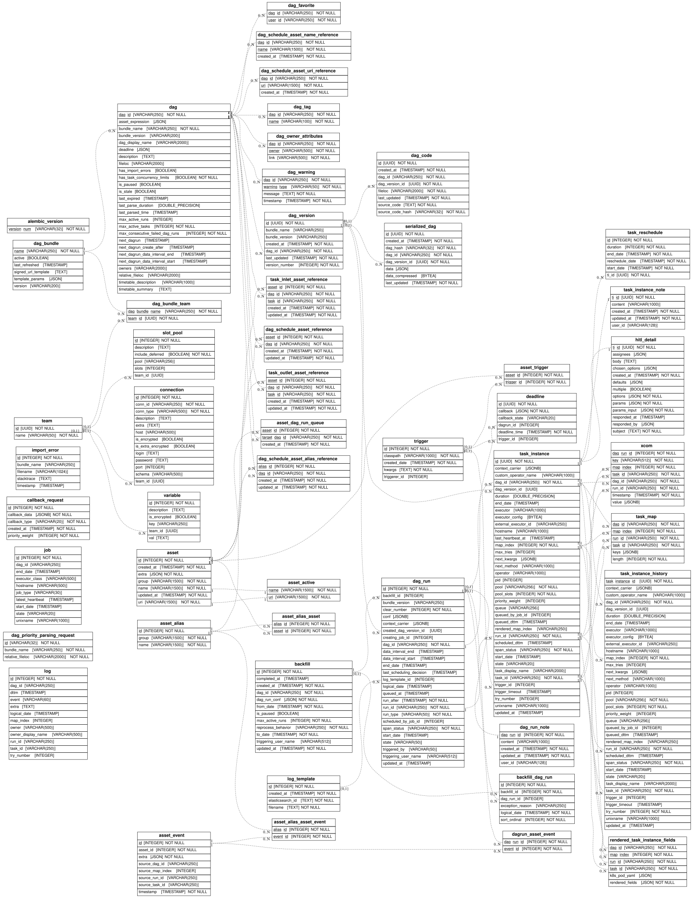
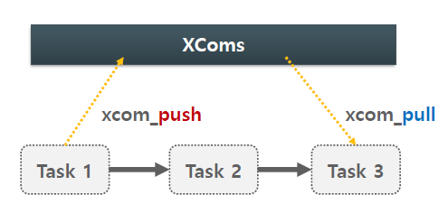

# 01_Airflow

## 1.  DAG

- DAG : Task들의 흐름과 순서를 정의한 Workflow
- Task : 
  - DAG 안에서 구동되는 독립적인 실행 단위
  - Python 실행, Bash 명령어 수행, SQL 실행 등 가능
- Task Dependency
  - \>> , \<<, set_upstream, set_downstream, chain 등을 사용해서 정의
- Task 실행
  - **각 Task는 별도의 OS Process로 동작.**
  - Celery Executor 사용시 DAG 내 서로 다른 Task는 별도 H/W 노드에서 분산 실행
  - 


**Sensor 동작 방식 확인 필요**


### DAG Run

- Dag 의 실행 Instance 로서 Airflow 의 Scheduler 나 외부 Trigger 등에 의해서 DAG 를 수행할 때 마다 부여되는 Run object
- 개별 Dag Run 은 별도의 상태 (status: running/failed/success 등 을 가짐

###  Task Instance

- 개별 Task Instance 는 **별도의 프로세스로 수행**
- Airflow 스케줄러
  - 어떤 Task 를 먼저 수행할지를 결정 
    \> 순서에 따라 Task 들을 Queue 에 입력 
    \> Executor 는 이들을 별도 Worker Process 들로 수행함
  - 각 Task Instance 는 isolated 된 환경 에서 수행됨
- Dag 내 개별 Task Instance 간의 **데이터 공유 전달 는 Xcom 을 사용함**
  - 왜냐하면 별도의 프로세스로 수행하기 때문에 기본적으로 공유되는 데이터가 없기 때문


## 2. Meta DB




## 3. Xcom



- Cross Communication 
- **DAG 내** Task 들간의 데이터 정송을 위한 Airflow 내부 메커니즘
  - 즉 DAG 내에서만을 위한 공유
- Task들은 별도 프로세스로 수행되기 때문에 Task간 데이터 전송을 외부 스토리지에 기반해야한다.
  - **여기서 외부 스토리지는 버전 업이 되면서 RDB 외에 Object Storage 등을 사용할 수 있게 되었다.**
- 주의
  - **사이즈가 큰 Xcom 값은 사용하면 안된다.**
  - Meta DB 용량이 매우 커져 Airflow 성능 전반에 영향을 끼칠 수 있다.
  - 작은 크기의 정보성 데이터가 바람직하다.
    - ex_파일 경로 , 상태코드 , 처리 작업 리스트 ,특정 작업 수행 일정 , 동적 생성된 API 요청 ID 등


### Xcom Custom

- Pydantic을 사용해서 객체 패턴을 사용할 순 없을까? (나의 생각)
  - 흔한 사용법은 아니지만 dag가 복잡해질 수록 필요성이 있어야할 수 있음

```
# 방법 1 : airflow.cfg 활용
[core]
xcom_backend = plugins.custom_xcom_backend.PydanticXComBackend


# 방법 2 : 환경변수 활용
AIRFLOW__CORE__XCOM_BACKEND=plugins.custom_xcom_backend.PydanticXComBackend
```

```python
# claude 답변
@staticmethod
def serialize_value(value, **kwargs):
    if isinstance(value, BaseModel):
        payload = {
            "__pydantic_type__": f"{value.__class__.__module__}.{value.__class__.__qualname__}",
            "data": value.model_dump()
        }
        return json.dumps(payload).encode()
    return BaseXCom.serialize_value(value, **kwargs)

@staticmethod
def deserialize_value(result):
    raw = BaseXCom.deserialize_value(result)
    if isinstance(raw, dict) and "__pydantic_type__" in raw:
        module_path, class_name = raw["__pydantic_type__"].rsplit(".", 1)
        import importlib
        module = importlib.import_module(module_path)
        model_class = getattr(module, class_name)
        return model_class.model_validate(raw["data"])
    return raw
```

```python
# Astronomer 등에서 제공하는 패턴
@staticmethod
def serialize_value(value, **kwargs):
    if sys.getsizeof(value) > 48 * 1024:  # 48KB 초과면
        path = upload_to_minio(value)
        return json.dumps({"__minio_ref__": path}).encode()
    return BaseXCom.serialize_value(value, **kwargs)
```

```python
# 내가 보기엔 용량 차이도 없을거 같음
// 기존 dict 방식
{"doc_id": "abc123", "page_count": 10, "status": "done"}

// 타입 정보 추가 방식
{
  "__pydantic_type__": "myapp.models.DocumentProcessResult",
  "data": {"doc_id": "abc123", "page_count": 10, "status": "done"}
}
```


