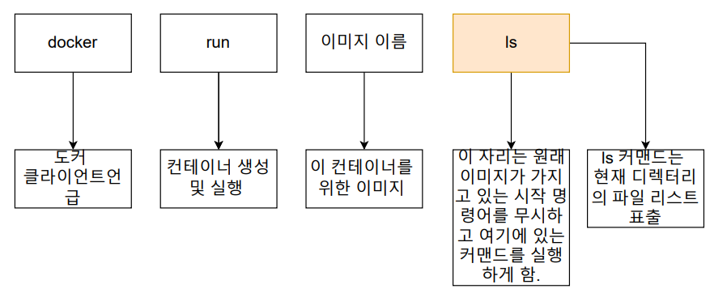
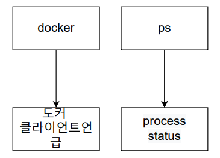
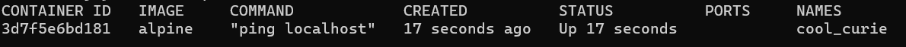
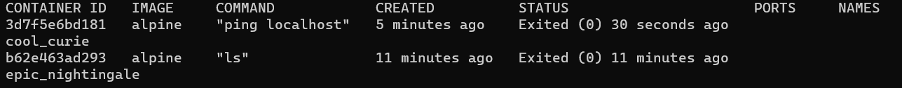
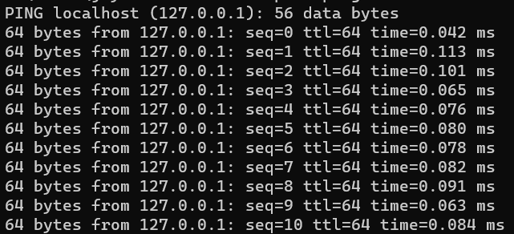
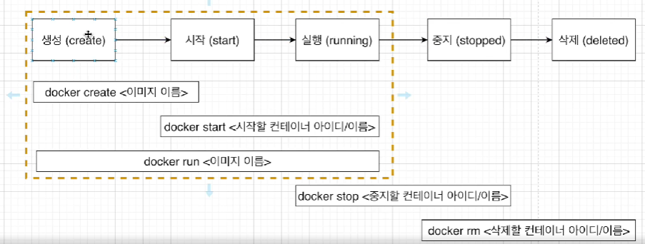
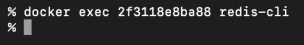

# 02_Docker의 명령어


## 1) docker image 내부파일 구조



- **ls**
  -  현재 디렉터리의 파일 리스트

- hello world에 ls 명령어를 쳤다면?
  - error가 뜨게 된다.
  - 왜냐하면 ls 명령어가 hello world이미지 안에 없기 때문이다.


## 2) Container 나열하기



- **ps** (process status) => 프로세스 상태

  - ```dockerfile
    docker ps 
    docker ps -a # (모두 출력)
    docker ps --format 'table{{.Name}} \t table{{.Image}}' # 필요한 table만
    ```

**docker ps**



- Container ID : 해쉬값
- Image : 컨테이너 생성시 사용한 도커 이미지
- Command : 컨테이너 시작 시 실행될 명령어
- Created : 생성 시간 
- Status : 컨테이너의 상태 => Up(실행), Exited(종료), Pause(일시정지)
- Ports : 컨테이너가 개방한 포트와 호스트에 연결한 포트
- Names : 컨테이너 고유한 이름 => --name 옵션으로 이름을 설정할 수 있음


**docker ps -a**




**docker run alpine ping localhost**



- alpine 이미지를 이용하여 localhost에 ping을 찍어라


## 3) docker container life cycle



- **docker run = docker create + docker start**
  - docker run은 create + start이다
  - create = container를 생성 => 하드디스크에 파일 스냅샷을 저장
  - start = 명령어를 통해 container를 실행시키는 역할
    - -a : attach => container가 실행될때 output을 화면에 띄워준다.
    - docker start -a <ID>


- **docker 중지**

  - ```dockerfile
    docker stop <중지할 컨테이너 아이디/이름>
    docker kill <중지할 컨테이너 아이디/이름>
    ```

  - stop과 kill의 차이점

    - Stop

      - stop은 Gracefully하게 중지를 시킨다.

      - 그동안 **하던 작업들을 완료하고 컨테이너를 중지**시킴

      - **순서 : docker stop => sigterm => 정리하는 시간 => sigkill** 

        

    - Kill

      - 바로 컨테이너를 중지시킨다. 
      - **순서 : docker stop => sigkill** 


- **삭제**

  - ```dockerfile
    docker rm <아이디/ 이름> # 삭제할 떄는 중지한 후 컨테이너를 삭제할 수 있다.
    docker container prune # 모두 삭제
    docker rmi <이미지 id> # 이미지 삭제
    docker system prune # 한번에 컨테이너, 이미지, 네트워크 모두 삭제 (실행중인건 x)
    
    # prune : 잘라내다라는 뜻 (가지치기하다)
    ```


## 3) 실행중인 Container에 명령어 전달

```dockerfile
docker exec # 이미 실생중인 컨테이너에 명령어 전달
ex)
	docker exec 59f8532754ea ls
```


## 4) docker 환경에서 Redis 서버 실행하기


**순서**

```docker
docker run redis
docker exec -it <컨테이너 아이디> <명령어>
```

- 그냥 redis-cli를 치게 되면 에러가 발생
- **에러가 발생하는 이유** : redic-cli가 컨테이너 밖에서 명령어를 


- **-it** : it를 붙여줘야 명령어를 실행한 후 계속 명령어를 적을 수 있다.
  - i : interactice / -t : terminal => 터미널과 상호작용해라
  - 만약 -it 가 없다면 redis-cli를 키기만 하고 다시 밖으로 나와버린다.
  - 


## 5) docker 실행중인 컨테이너

> - 실행중인 컨테이너에 명령어를 쳐야할 일이 많음
> - 하지만 명령어가 너무 길어지기 때문에 shell안으로 들어가서 명령어를 칠 수 있게 해줄 수 있다.

**sh**


```docker
docker exec -it <컨테이너 아이디> <sh, bash, ash, powershell>
```


