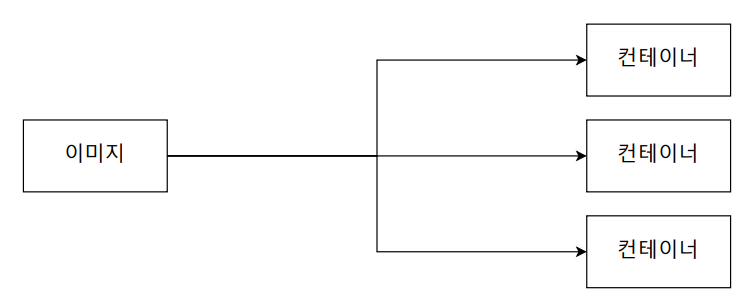
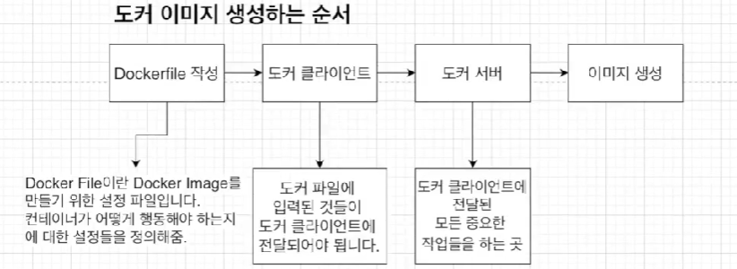
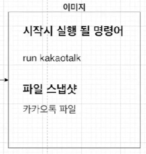
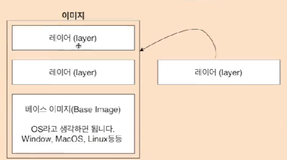
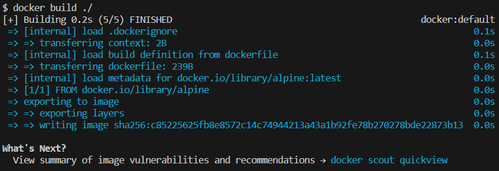
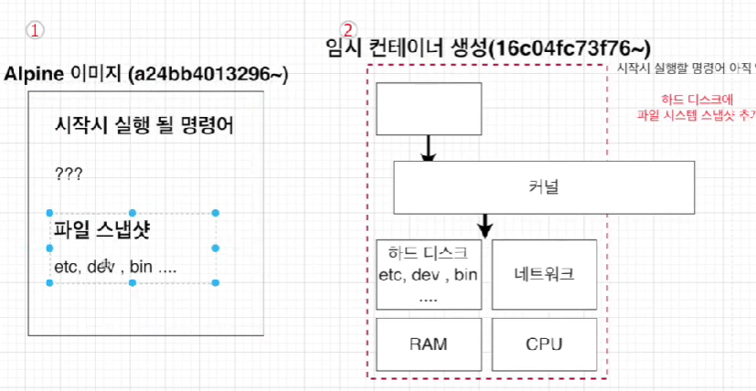
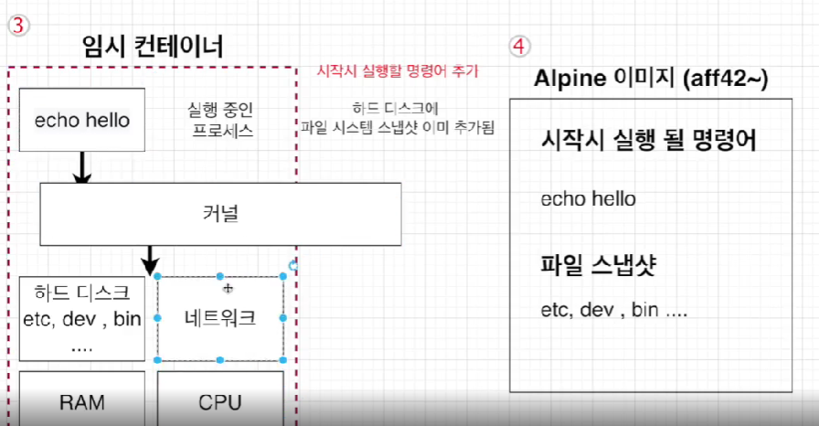
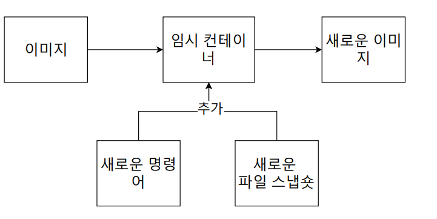

# 03_Docker_Image

> - 여태까지는 도커 허브에 있는 이미지를 가져와서 사용했다.
> - 하지만 **직접 도커 이미지를 만들어서 사용**할 수 있을 뿐만아니라 **도커 허브에 올려서 공유**할 수 있다.


## 1) Image란?



- 컨테이너를 만들기 위해 **필요한 설정이나 종속성들**을 갖고 있는 소프트웨어 패키지
- 컨테이너 생성 docker create <이미지 이름>


**도커 이미지 생성하는 순서**



- Dockerfile
  - Docker Image를 만들기 위한 설정파일
  - Container가 어떻게 행동해야하는지에 대한 설정들을 정의

- Docker cli
  - Docker 파일에 입력된 것들이 Docker CLI에 전달


## 2) Docker File

### 2-1) Docker File 이란?

- 도커 이미지를 만들기 위한 **설정 파일**
- **컨테이너가 어떻게 행동해야** 하는지에 대한 설정들을 정의해주는 곳


### 2-2) Docker File 만드는 순서



0. 도커 이미지가 필요한 것이 무엇인지 생각해야한다.
1. **베이스 이미지**를 명시해준다. (파일 스냅샷에 해당)
2. 추가적으로 필요한 파일을 다운받기 위한 **명령어 명시** (파일 스냅샷에 해당)
3. 컨테이너 시**작시 실행 될 명령어**를 명시 (시작시 실행될 명령어)


### 2-3) 베이스 이미지란?



- 도커 이미지는 여러개의 **레이어로 되어** 있다.
  - 베이스 이미지 => 기반이 되는 부분
  - OS라고 생각하면 된다.
- 레이어는 주간 단계의 이미지라고 생각하면 된다.


## 3) Hello문구 출력하기

### 순서

1. 도커 파일을 만들 폴터 만들기
2. 폴더 열기
3. 파일 하나를 생성, 이름은 dockerfile
4. 그 안에 먼저 어떻게 진행해 나갈지 기보적인 토대로 명시
5. 베이스 이미지부터 실제 값으로 추가해준다.


### 뼈대


- FROM
  - 이미지 생성시 기반이 되는 이미지레이어
  - **<이미지 이름> : <태그>** 형식으로 작성
  - 태그를 안붙이면 자동적으로 최신것으로 다운
  - **ex) ubuntu : 14.04**

- RUN
  - 도커이미지가 생성되기 전에 수행할 쉘 명령어

- CMD
  - 컨테이너가 시작되었을 때 실행할 실행 파일 or 쉘 스크립트
  - 해당 명령어는 DockerFile내 1회만 사용할 수 있음


### Doker File 로 이미지 만들기

**Build 란?**



- docker build ./
- 해당 디렉토리 내에서 dockerfile이라는 파일을 찾아서 **도커 클라이언트에 전달**시켜준다.


**이미지가 만들어지는 순서**





- Alpine 이미지 (원래 Alpine)
- 임시 컨테이너 생성후 임시 컨테이너에 파일 스냅샷을 넣는다.
- 내가 만든 명령어들을 사용하여 임시 컨테이너에 넣어준다.
- 만들어진 **임시 컨테이너를 이용하여 Alpine이미지를 새로 생성**해준다.
  - 즉 Alpine이미지를 커스텀하기 위해서 임시 컨테이너를 만들어서 커스텀하는 느낌이다.


**정리**




### Docker 이름 주기

```dockerfile
-t <나의 도커아이디>/<저장소/프로젝트이름>:<Version>
```


