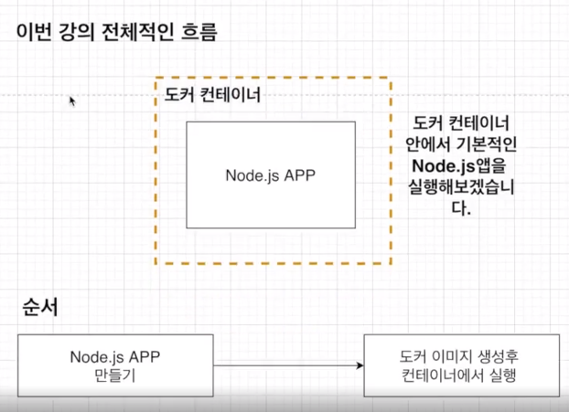
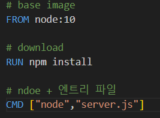
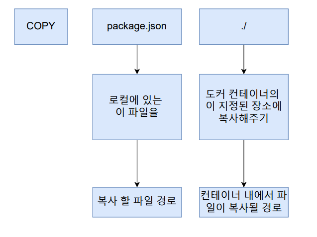
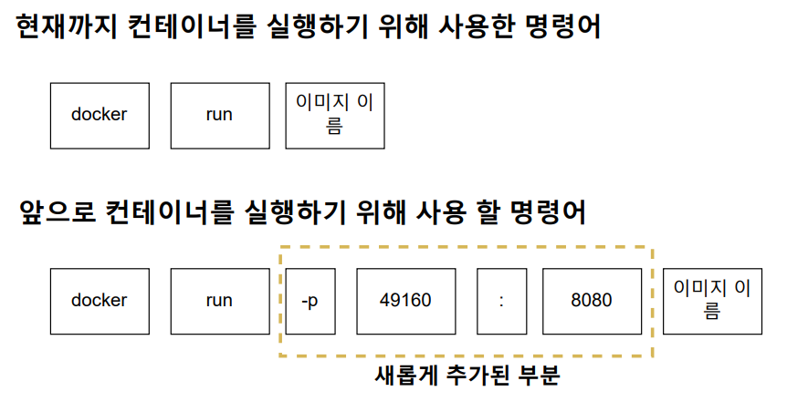
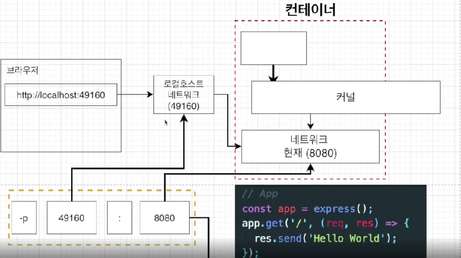
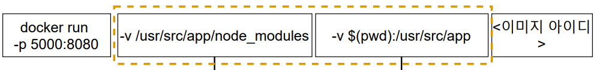

# 04_Docker_with_Nodejs




## 1) Copy가 필요한 이유



- 위와 같이 작성하고 build를 진행할 시 **file을 찾지 못한다는  Error가 발생**한다. 

  - 왜냐하면 package.json이 docker container 밖에 위치하기 때문이다.

    

- 순서

  - 베이스 이미지 생성

  - 임시 컨테이너 작성 및 복사 

    - => 이때 package.json이 임시 컨테이너 밖에 있기 때문에 안으로 넣어주어야한다.
    - how? => **COPY** 사용

  - 임시 컨테이너 바탕으로 새로운 custom image 생성

    

**COPY**



```dockerfile
# base image
FROM node:10

# pakage와 server.js copy
# ./의 의미 : 현재 directory에 있는 모든 file을 컨테이너에 넣기 위해
COPY ./ ./

# download
RUN npm install

# ndoe + 엔트리 파일
CMD ["node","server.js"]
```

- RUN
  - ex) `RUN pip install torch`
  - ex) `RUN pip install -r reqirements.txt`
  - 이런식으로 download받을 것들을 정할 수 있다.


## 2) 실제 server가 돌아가지 않는 이유

> port mapping이 되어있기 않기 때문이다.



- 위와 같이 pakage.json파일을 컨테이너 안으로 넣어주어야 했다.
- 네트워크와 port등 또한 컨테이너 안으로 넣어주어야한다.
  - 컨테이너 내부에 있는 네트워크와 연결해주어야 한다.




- 컨테이너 PORT를 8080으로 정해주었다.
- 8080으로 정했다고 해서 local네트워크에서 해당 컨테이너를 접근할 수 있는 것이 아니다.
  - 즉 컨테이너 외부에서 접근하는 것이 불가능하다.


## 3) Work DIR

> - 이미지안에서 애플리케이션 소스코드를 가지고 있을 디렉토리를 생성하는 것

### 3-1) working 디렉토리가 있어야하는 이유

- working dir을 만들지 않을 경우 
  **모든 소스코드와 관련된 파일들이 이미지 디렉토리에 들어가게 된다.**
  1. 이 중에서 원래 이미지에 있던 파일이름이 같다면 **폴더가 덮어씌어져 버린다.**
  2. 모든 파일이 한 디렉토리에 들어가서 **정돈이 되지 않는다.**


```dockerfile
# base image
FROM node:10

# work dir
WORKDIR /usr/src/app

# pakage copy
COPY ./ ./

# download
RUN npm install

# ndoe + 엔트리 파일
CMD ["node","server.js"]
```


## 4) 소스 변경할 때마다 Build하지 않기

```dockerfile
# base image
FROM node:10

# work dir
WORKDIR /usr/src/app

# pakage copy
COPY pakage.json ./

# download
RUN npm install

# 전체 코드 copy
COPY ./ ./

# ndoe + 엔트리 파일
CMD ["node","server.js"]
```

- **pakage를 먼저 copy하고 전체코드를 copy하는 이유**
  - 종속성 부분 먼저 copy를 하고 npm install을 진행한다.
  - 이렇게 하면 source를 변경하더라고 npm install을 하지 않는다.
  - 즉 pakage부분은 캐시로 사용해서 빌드를 할때 효율적으로 만들 수 있다.


## 5) Docker Volumes

> 소스코드를 변경하면 바로 적용되게 만들기

### 5-1) Copy와 Volumes의 차이점

- Copy
  - 파일을 복사해서 도커 컨테이너 안에 넣는 것이다.
  - 변경한 파일을 적용시키기 위해선 **이미지를 다시 빌드해야 한다는 특징**이 있다.

- Volumes
  - 복사를 하는 것이 아니라 로컬에 있는 것을 mapping하게 된다.
    - 즉 직접 가져오는 것이 아니라 참조하는 것
  - 


### 5-2) 명령어



- 윈도우의 경우 : -v %cd%:/usr/src/app

- 첫번쨰 변경 부분 : node_modules는 volume에서 빼라

  - 빼는 이유 : 로컬에 node_module이 없기 때문에 container에서 참조할 수 없다. 따라서 node module을 빼고 찾으라는 뜻이다. 

    

- 두번쨰 변경 부분 : 나머지는 volume에 넣어라


### 5-3) pwd란?

- **print working directory**
- 현재 작업 중인 디렉터리의 이름을 출력하는데 쓰인다.


