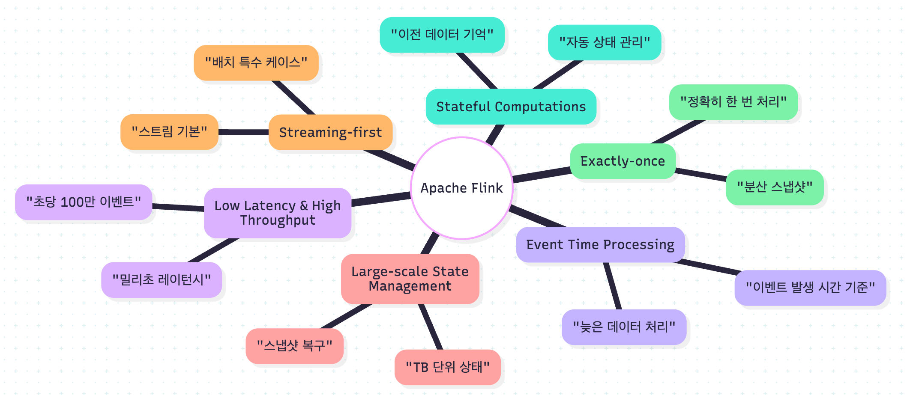
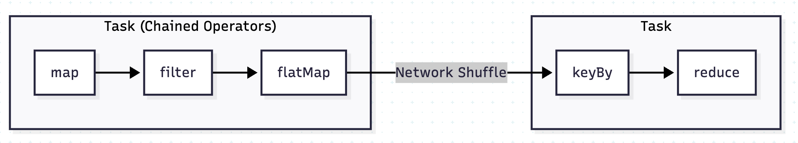
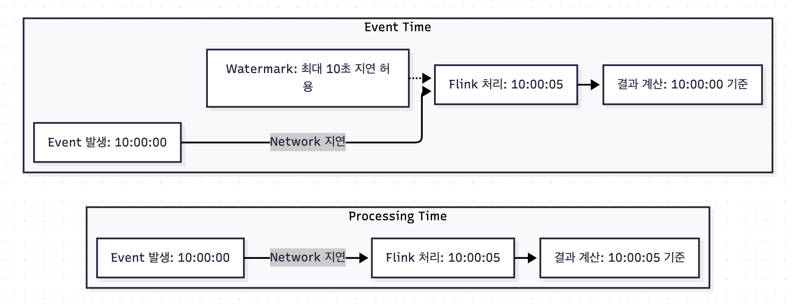

# 01_Flink 란



- 기본 : streaming 처리
- 특수한 경우 : batch 처리
- Batch : bounded stream
- Stream : unbounded stream

- 마이크로 배치
  - 작은 단위 시간단위로 배치처리하는 것


## Batch vs Stream code 비교


### MapReduce

```java
Dataset<Event> events = readFromHDFS("data/yesterday");
Dataset<Event> result = events
	.groupBy("userId")
    .aggredate();
results.writeToHDFS("/output/yesterday");
```

### Stream

```java
DataStream<Event> events = env.addSource(new KafkaSource<>(...));

DataStream<Result> results = events
   .keyBy(Event::getUserId)
   .window(ThumblingEventTimeWindows.of(Time.minutes(5))) // 5분마다 모아서 계산
   .aggregate(new AggregateFunction<>(...));

results.addSink(new KafkaSink<>(...));

// 무한 스트림 : 실시간 데이터 처리
StreamExecutionEnviroment env = StreamExecutionEnviroment.getExecutionEnv();

DataStream<Event> stream = env.addSource(new KafkaSource<>());

stream
   .keyBy(Event::getKey)
   .process(new MyProcessFunction())
   .addSink(new KafkaSink<>());

env.execute();


// 유한 스트림 : 배치 처리
StreamExecutionEnviroment env = StreamExecutionEnviroment.getExecutionEnv();
env.setRuntimeMode(RuntimeExecutionMode.BATCH) // 배치 모드를 설정

DataStream<Event> stream = env.readTextFile("hdfs://path/to/file");

stream
   .keyBy(Event::getKey)
   .sum("value")
   .writeAsText("hdfs://output")

env.execute();
```


## 핵심 요소

### True Streaming 



```java
Source → Operator1 → Operator2 → Sink
 |         |           |          |
 ▼         ▼           ▼          ▼
[barrier] [barrier]   [barrier]  [barrier]
 |         |           |          |
 ▼         ▼           ▼          ▼
[state]   [state]     [state]    [state]

// Source Exactly Once -> Two Phase Commit이 아닌 Checkpoint를 기반
// Sink 외부 시스템과의 일관성을 보장 -> Two Phase Commit

// task chain
stream
   .map()
   .filter()
   .flatMap()
   .keyBy() // 데이터 파티션을 변경 -> 네트워크 셔플 
   .reduce() // 새로운 task로 인지
```

### Asynchronous Checkpoint


- 비동기로 Checkpoint를 찍는다?

```java
// checkpoint
env.setParallelism(128) // 128개의 병렬 task
stream
   .keyBy()
   .map() // 128개의 독립적인 인스턴스로 나뉘어 실행이 된다.
   .print()
```

### Event Time Processing



- Network 지연으로 인해서 해당 메세지가 늦게 도착하게 됐다면 도착시간이 아니라 Event를 발생한 시간을 기준으로 처리하게 된다.

```java
// Event Time
DataStream<Event> stream = env.addSource(new KafkaSource<>(...));

// Event time 타임스탬프 추출 및 watermark 설정
stream.assignTimestampsAndWatermarks(
    WatermarkStrategy
        .<Event>forBoundedOutOfOrderness(Duration.ofSeconds(10)) // 최대 10초 지연 허용
        .withTimestampAssigner((event, timestamp) -> event.getEventTime()) // 이벤트 발생 시간 사용
);

// Event time 기반 5분 Tumbling Window 집계
stream
    .keyBy(Event::getUserId)
    .window(TumblingEventTimeWindows.of(Time.minutes(5)))
    .sum("value"); // sum 연산
```


