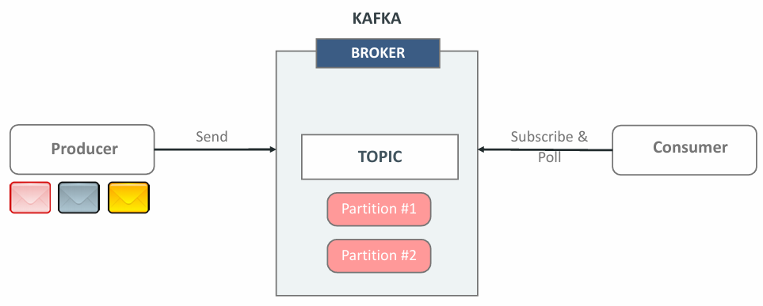
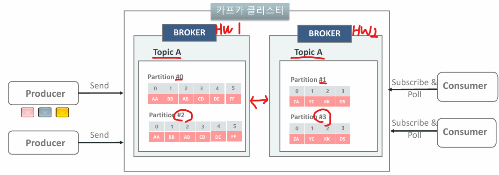
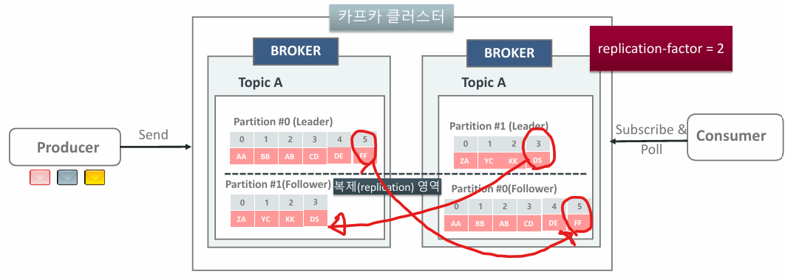
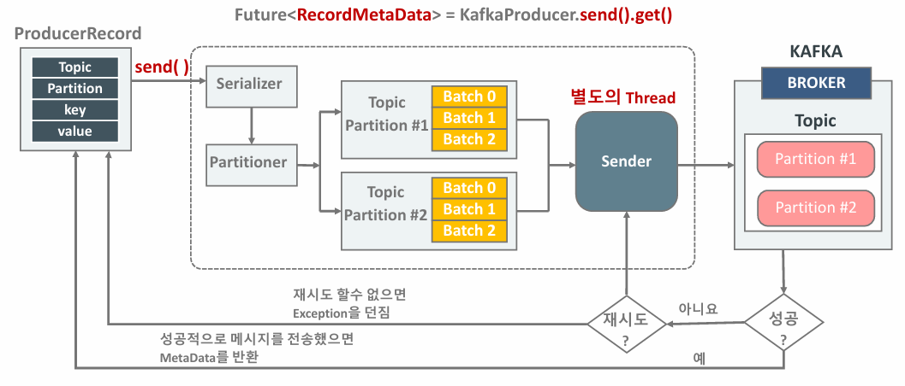
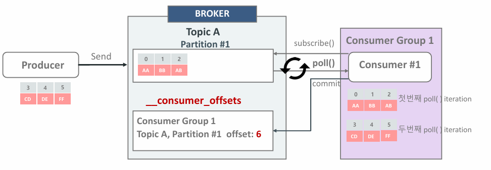
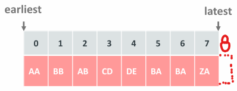
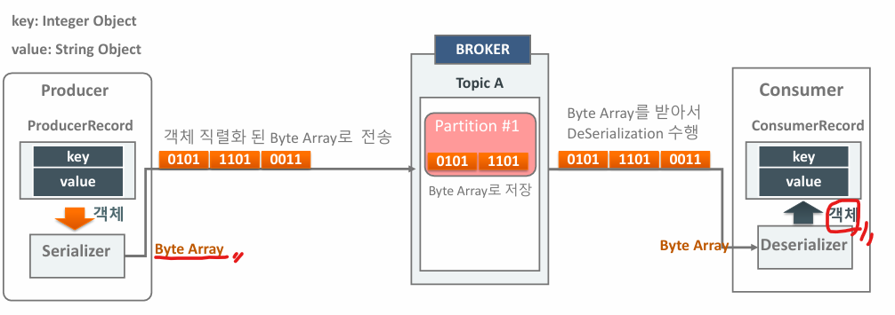
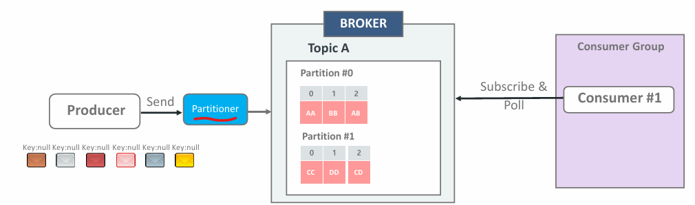
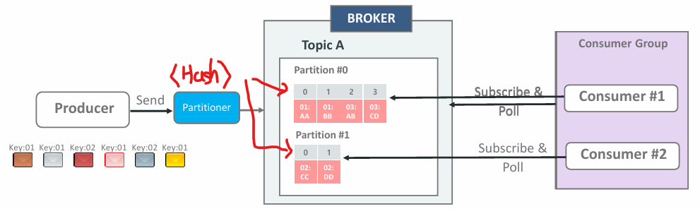

# 01_Kafka

## 0_Llinux 명령어 && vi

```shell
ls -alu : a(숨김 포함), l(상세정보), u(최종 수정시간)

- 현재 작업 중인 디렉토리의 경로 출력
pwd

- 새파일 생성
touch newfile.txt: 
 
- 파일 복사
cp source.txt dest.txt

- 파일, 디렉토리 이동, 이름 변경
mv oldname.txt newname.txt

- 삭제
rm file.txt

- 파일 내용 출력
cat file.txt

- 파일에서 특정 패턴의 문자열 검색
grep "search_term" file.txt

- 파일이나 디렉토리의 권한 변경
chmod +x *.sh

- 파일시스템의 디스크 공간 사용량 확인
df -k

- 현재 실행중인 프로세스 출력
ps -aux

- kill -9 1234
- wget http://example.comt/file.txt
- curl -O http://example.com/file.txt
- apt-get : 패키지 관리자를 이용해 소프트웨어를 설치하거나 관리 (Debian계열)
- journalctl : systemd 로그 확인


sudo apt-get udpate
sudo apt-get upgrade
ps -df | grep apt d
```

### vi 

```vi
1. 명령모드 (ESC)
2. 입력모드 (i : 커서가 현재 위치한 부분에서 시작)
3. 클론모드(:) 
4. 명령어
:wq  >> 저장하고 나가기
hjkl >> 좌하상우
x    >> 커서에 있는 글자 삭제
dd   >> 커서가 있는 라인 삭제
G    >> 맨 아래로 가기
u    >> 이전으로 되돌리기
yy   >> 커서가 있는 라인 복사
```


## 1. Kafka 소개

> - distributed event streaming platform (끊임 없이 들어오는 이벤트를 분산 처리하는 시스템)

### 메시지 시스템을 쓰는 이유

- M(다수) to M(다수)를 사용하지 않기 위해서
- 고가용성, 확장성 등이 좋기 떄문에
-  다양한 환경을 지원해준다.
- 비즈니스의 변화와 데이터 활용 욕구, 새로운 기술의 등장 등을 만족할 수 있기 때문이다.


**kafka 실행 순서**

```
기동
1. zookeeper.properites 읽어서 기동 후 
2. server.properties 읽어서 kafka 기동
```


## Topic



- Topic은 **여러개의 Partition**으로 구성된 **일련의 로그 파일**
- RDB에서 Partitioned-Table과 유사한 기능이다. 
- Key와 Value 기반의 메시지 구조 
- **append-only**  >>  update 이런거 없음


### Topic, Partition, Offset

- 개별 레코드는 offset으로 불리는 일련변호를 할당 받는다.
- 파티션은 **파티션마다 독립적이다.** 
- 따라서 **offset도 완전히 독립적이다.**


### Topic과 Partition의 병렬 처리



- 분리된 HW 두개에서 같은 Topic A
- 이렇게 Partition은 다르게 구성해서 병렬처리를 할 수 있음
- **하지만 여기서는 broker하나가 죽으면?**
  - 따라서 이렇게 구성하면 안됨



- 같은 Topic A, 다른 HW
- **Leader에서 값을 받으면 follower에서 값을 복사하게 된다.**
  - 이렇게 하면 Broker 1번이 죽더라도 2번에도 복사한 값이 존재하기 때문에 가용성을 높일 수 있다.

- 단점
  - 스토리지가 많이 들게 된다.


### Topic 생성 및 정보 확인


```
$CONFLUENT_HOME/bin/kafka-topics

--bootstrap-server localhost:9092
 >> Topic을 생성할 kafka broker 서버주소
 
--create
>> --topic: 기술된 topic명으로 topic 신규 생성
>> --partitions : Topic의 파티션 개수
>> --replication-factor : replication 개수

--list
>> 브로커에 있는 Topic들의 리스트

--decribe
>> --topic : 기술된 topic명으로 상세 정보표시
```


## Producer와 Consumer 개요

### Producer



- Topic에 메시지를 보내는 역할
- 성능 / 로드밸런싱 / 가용성 / 업무 정합성 등을 고려하여 어떤 브로커의 파티션으로 메시지를 보내질 전략적으로 결정
- Message에 반드시 포함되어야할 것
  - Topic
  - Value
- 보내는 값들은 다 문자열 (숫자를 보내도 문자열로 보내짐)


### Consumer



- Topic에서 메시지를 읽어 들임
- 여러 개의 Consumer들로 구성될 경우 어떤 브로커의 파티션에서 메시지를 읽어들일지 전략적으로 결정

### Consumer의 auto.offset.reset



```
auto.offset.reset = earlist : 처음 offset 부터 읽음 >> 0번부터 읽음
auto.offset.reset = latest : 마지막 offset 부터 읽음 >> 8번부터 읽음
```

- defualt >> latest 
- --from-beginning을 사용하면 auto.offset.reset이 earlist로 저장


## Serialized Message 전송



- Message를 보낼 때 Serializer를 통해서 byte[] 로 변환을 시킨 뒤에 해당 topic으로 보낸다.
- 카프카에서 Serializer를 지원해주나, 업무에 적용할 때는 직접 serializer를 구현해야할 경우가 많다.


## Kafka key

- 메시지는 Producer를 통해 전송
- 메시지를 받은 Partition은 토픽에 어떤 Partition으로 전송 할 지 결정함

### key 값을 가지지 않는 Message 전송



- key값을 가지지 않는 경우 Round Robin, Sticky Partition 등의 파티션 전략이 선택이 되어 파티션 별로 메시지가 전송 될 수 있음

- 각 Partition 내의 Message는 순서가 보장이 됨

- **하지만 여러 Parititon의 Message들의 순서는 보장이 되지 않음**

-  따라서 순서가 필요하다면 key값을 삽입해서 설계해야함

  

### Key값을 가지는 Message 전송



- key를 업무 로직이나 메시지 분산 성능 영향을 고려해여 생성한다.
- **특정 Key값을 가지는 메시지는 특정 파티션으로 고정되어 전송된다. (Hash 값)**
- 따라서 하나의 Consumer에 하나의 Partition을 맡는다면 Consumer가 Message를 읽는 순서가 보장이 되게 된다.
- Message key는 고유값이 아니라 특정 파티션으로 보내기 위한 것으로 이해하면 될듯

```
1. key message를 kafka-console-producer를 이용하여 전송
    >> separtor를 :(콜론)으로 하겠다.
    >> 그리고 key값을 true로 넣을거다
kafka-console-producer --bootstrap-server localhost:9092 --topic test-topic \
--property key.separator=: --property parse.key=true

2. key message를 kafka-console-consumer에서 읽어들임.

kafka-console-consumer --bootstrap-server localhost:9092 --topic test-topic \
--property print.key=true --property print.value=true --from-beginning
```


