# 02_Client

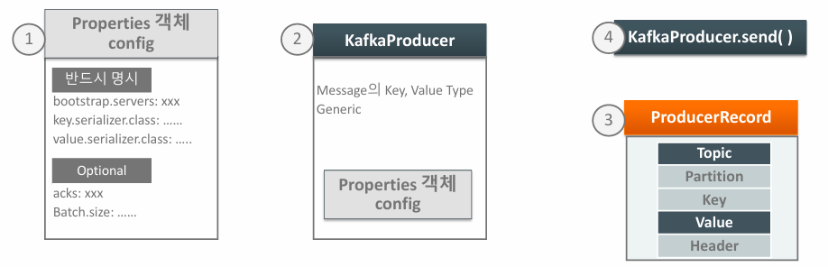

```java
public class SimpleProducer {

    public static void main(String[] args) {

        String topicName = "simple-topic";

        //KafkaProducer config
        Properties props = new Properties();

        // bootstrap.servers, key.serializer.class, value.serializer.class
        props.setProperty(ProducerConfig.BOOTSTRAP_SERVERS_CONFIG, "192.168.56.101:9092");
        props.setProperty(ProducerConfig.KEY_SERIALIZER_CLASS_CONFIG, StringSerializer.class.getName());
        props.setProperty(ProducerConfig.VALUE_SERIALIZER_CLASS_CONFIG, StringSerializer.class.getName());

        // KafkaProducer
        KafkaProducer<String, String> kafkaProducer 
            = new KafkaProducer<>(props);

        // ProducerRecord
        ProducerRecord<String, String> producerRecord 
            = new ProducerRecord<>(topicName, "id-001", "hello world");

        // send
        kafkaProducer.send(producerRecord);

        // send를 한다고 바로 가지 않음
        // buffer에 있는거 다 보냄
        kafkaProducer.flush();
        kafkaProducer.close();
    }
}
```


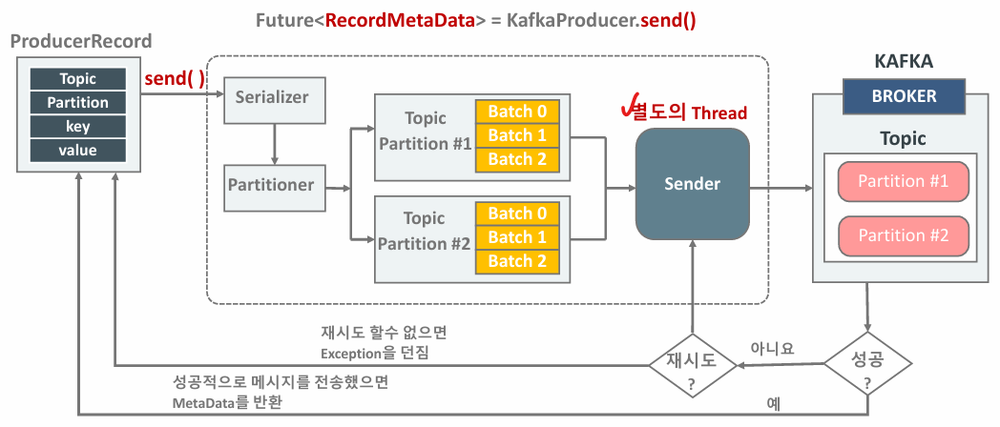

- send()를 진행
- serializing >> Partitioner >> Topic >> Bach
- Batch로 쌓아놓고 flush하면 별도의 Thread를 통해서 Send하게 


## Producer 메시지 동기화/ 비동기화

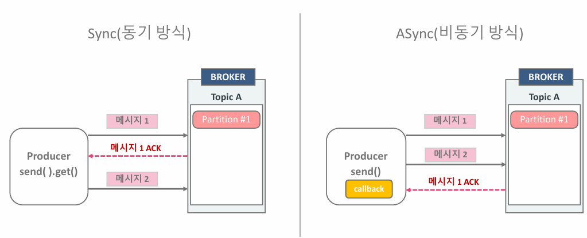

- 동기화

  - `RecordMetadata recordMetadata = kafkaProducer.send(producerRecord).get();`

  - `kafkaProducer.send(producerRecord)`의 반환 값은 `Future<>` 이다.

  - 따라서 .get() 을 통해서 객체를 받아올 수 있다.

    

- 비동기화 

  - Callback을 통해서 return 값을 얻게 된다.


### Callback을 이용한 Producer와 Broker와의 메시지 전송/재전송

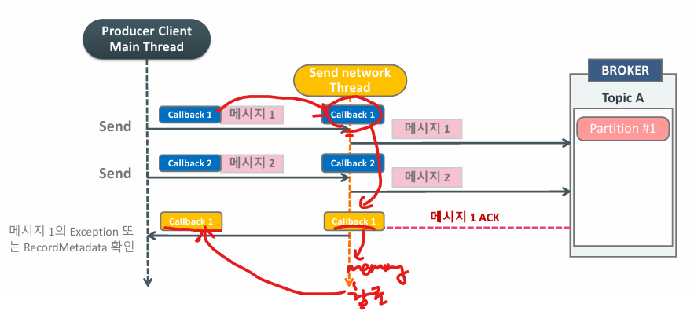

- Callback 객체를 만들어서 SendThread에게 보내주면 메시지를 채워서 broker에 보낸다.
- Broker에서 작업이 완료된 후에 ACK를 보내면 이전에 만들었던 Callback 객체를 받고 MainThread에서 Callback 객체를 참조하게 된다.
- 그럼 onComplete 함수가 발동되게 된다.
  - 이때 Exception이 터지게 되고 재전송해야하는 Exception이라면 broker는 다시 재전송을 하게 된다.

```java
prosucer.send(producerRecord, new Callback(){
    @Override
    public void onCompletion(RecordMetadata metadata, Exception ex){
  		if(ex == null){
            System.out.print("receive metadata");
        }
        else{
            ex.printStackTrace();
        }
    }
})
```


## Multi Partitioner 


## Producer의 acks 설정에 따른 send 방식

### 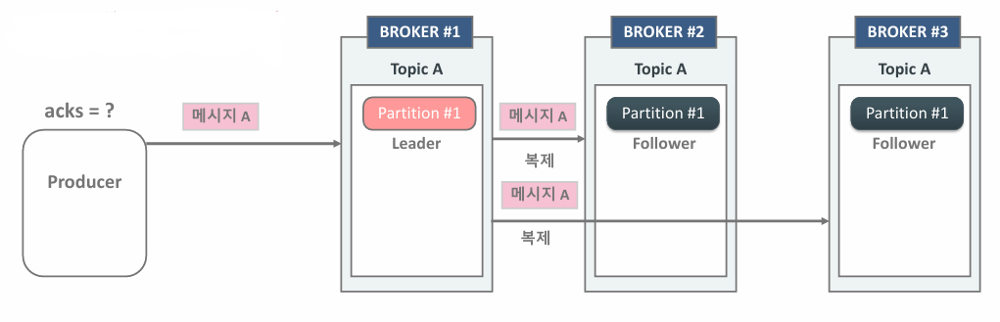

- acks의 설정에 따라 send의 방식이 달라진다.
- Multi Broker 일 경우 Message를 복제하게 된다.
- 3개의 Broker 중 Leaker를 선출하고 Producer는 Message를 Leader Broker에게만 메시지를 보낸다.


### acks 0 일 경우

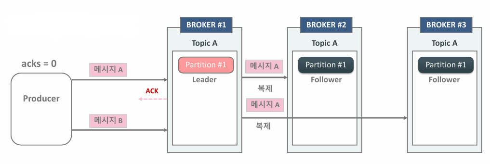

- Producer는 Leader Broker가 ACK를 받지 않고 다음 메시지 바로 전송
- 재전송 하지 않음 - ack를 확인하지 않기 때문에 재전송할지 안할지 모르기 때문
- **메시지 손실 우려, but 가장 빠름**
  - IoT센서 데이터 등 메시지 손실에 민감하지 않은 데이터에 활용


### acks 1일 경우

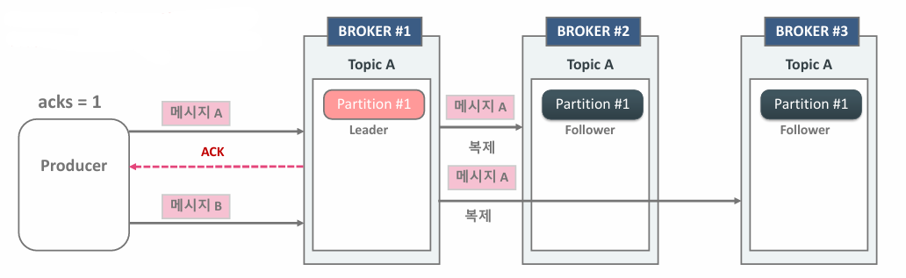

- Producer는 Leader Broker 메시지 A를 받았는지 ACK를 받은 후 다음 메시지 전송
-  오류 메시지를 Broker로 부터 받으면 재전송
- **Replicator에 완벽하게 복사되었는지는 확인하지 않음**
  - 따라서 Leader Broker가 Replication 하기 전에 죽으면 데이터 손실
  - 다른 Broker가 Leader로 선출돼서 전송을 이어가겠지만 이미 손실된 데이터 복구 x 
  - ex_
    - Leader가 data100 다른 broker에게 복사하기 전에 인데 죽음 
    - 다른 Broker는 data 100을 받지 못한채로 다음 메시지인 data 101부터 받음
    - data 100은 유실


### acks all 일 경우

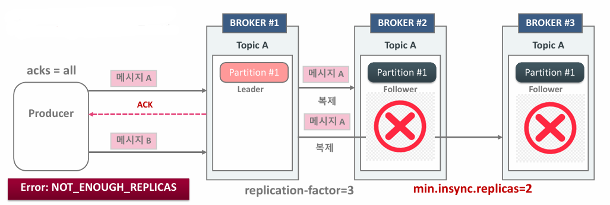

- Producer는 Leader Broker가 메시지 A를 정상적으로 받고 min.insunc.replicas 개수 만큼 데이터를 복제한 뒤에 ACK를 받고 다음 메시지를 보냄.
- 상대적으로 전송속도가 느림


- **참고**
  - Callback 기반의 async에서도 동일하게 acks 설정에 기반하여 retry가 수행된다.
  - 따라서 retry될 경우 data 역전이 일어날 수 있음


## Producer 배치

### Producer의 메시지 배치 전송의 이해

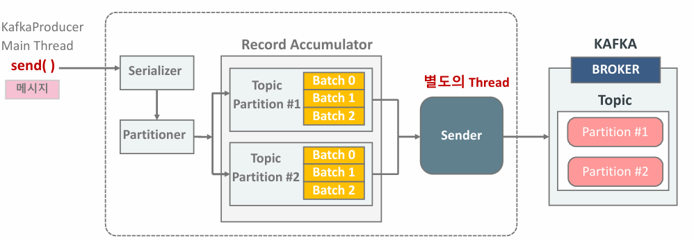

- **메시지 전송 순서**
  - send() 호출
  - 값을 Serializer에서 byte로 변환
  - Partitioning하면서 이미 어디로 보낼 지 알고 있음
  - (선택) Compression
  - Record Accumulator에 Message를 저장
  - Sender에서 별도의 Thread로 Batch단위로 전송


### Producer Record와 record Batch

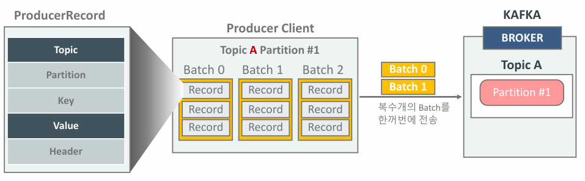

- send() 호출 시 Accumulator에서 단일 메시지를 토픽 파티션에 따라 Batch 단위로 묶인 뒤 전송
- buffer.memory 설정 사이즈 만큼 보관 될 수 있음
- 여러 개의 Batch들로 한번에 전송될 수 있음


### Kafka Producer Record Accumulator

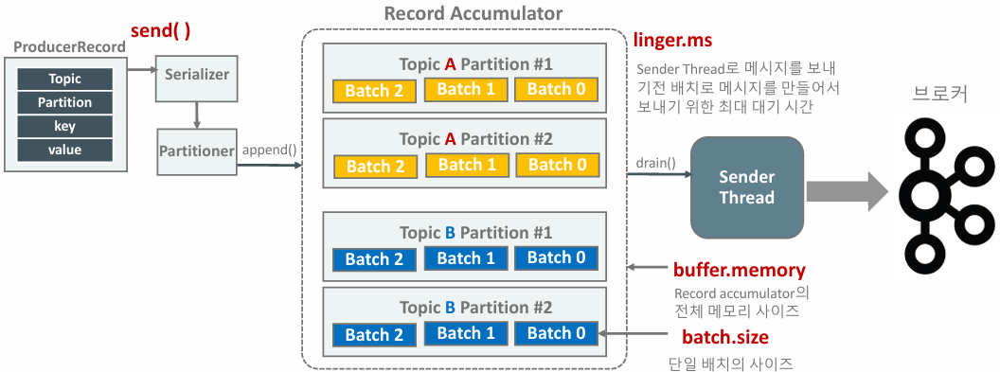

- Partitioner.append() 를 통해 record가 Accumulator에 저장된다.
- Sender Thread는 Record Accumulator에 누적된 메시지 배치를 꺼내서 브로커로 전송
- 각 Thread의 역할
  - main = send()호출, Accumulator에 데이터 저장하는 역할
  - send = 데이터를 보내는 역할

### Producer의 linget.ms와 batch.size

- **linget.ms**
  - Sender Thread가 개별 메시지 배치를 가져가기전 최대 linger.ms만큼 기다린 후 브러커로 전송
- **batch.size**
  - batch 사이즈 만큼 모았다가 보내는 방식
  - Producer에서 sync 방식으로 매시지를 보낼 경우 메시지 record 하나만 전송되게 된다.
    - 배치안에 메시지 하나만 넣어서 보냄
- **고찰**
  - Producer와 Broker간의 전송이 매우 빠르고 Record Accumulator 에서 적당히 누적이 된다면 linger.ms가 0이어도 무방하다.
  - Producer와 Broker간의 전송이 느리다면 linger.ms를 시도해볼만함
  - 하지만 linger.ms는 보통 20ms이하로 권장


## Producer의 전송/ 재전송

### Producer의 메시지 전송/재 전송 시간 파라미터

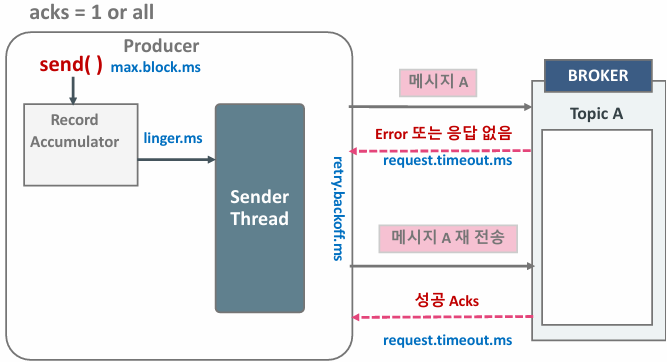

- `delivery.timeout.ms >= linger.ms + request.timeout.ms`
  - delivery.timeout.ms 는 항상 linger.ms + request.timeout.ms보다 크거나 같아야한다.
  - 만약 작을 경우 Exception을 터트린다.
  - delivery.timeout.ms : 전송 전체의 최대 대기 시간
- `max.block.ms` : 
  - send() 호출 시 Record Accumulator에 append하지 못하고 block되는 최대시간
  - 초과 될 경우 Timeout Exception이 터지게 된다.
  - 보통 Accumilator에 Batch가 꽉찼을 경우 발생하게 된다.
  
- `linger.ms`
  - Sender Thread가 Accumulator에서 배치별로 가져가기 위한 최대 대기시간
  
- `request.timeout.ms`
  - 전송에 걸리는 최대시간
  - 전송 재시도 대기시간 제외
  - 초과 시 retry하거나 Timout Exception 발생
  
- `retry.backooff.ms`
  - 전송 재시도를 위한 대기 시간
  
- `delivaer.timeout.ms`
  - Producer 메시지(배치) 전송에 허용된 최대 시간.
  - 초과 시 Timout Exception 발생


### Producer의 메시지 재전송

```
[default]
retry = 2137483647
delivery.timeout.ms = 12000
```

- 보통retries는무한대값으로설정하고delivery.timeout.ms(기 본120000, 즉 2분) 를조정하는것을권장.


## max.in.flight.request.per.connection

- 비동기 전송 시 브로커의 응답없이 한꺼번에 보낼 수 있는 Batch의 개수 = default:5
- 즉 배치단위로 보내는데 비동기라도 ACK를 받아야 다음 배치들을 보내게 된다.


### Retry 상황 시 데이터 역전상황

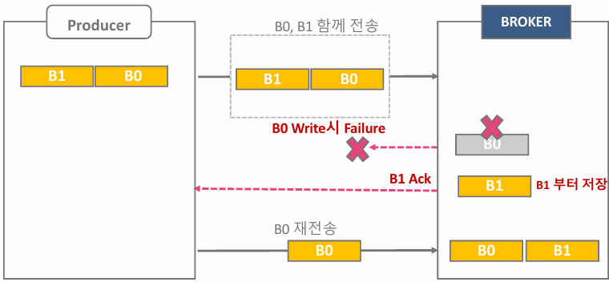

- B0가 먼저 들어오고 B1이 들어온 상황
- B0가 Exceoption으로 Retry 하는 상황에 B1은 저장이 완료된 상황
- 그럼 B1이 먼저 Broker에 들어오고 B0가 늦게 들어와 데이터가 역전된 상황
- 순서가 무조건 맞아야하는 경우는 분산시스템이 안맞을 수 있음
  - 하지만 **enable.idempotence=true** 설정으로 커버 가능


## at most once, at least onece, exactly once

- at most once (최대 한번) : acks=0
- at least once (적어도 한번) : 중복 허용 (retry)
- exactly once (정확히 한번)
  - Idempotence(멱등성) : Producer의 message 전송 retry시 중복 제거
  - Transaction 기반 전송 : Consumer > Process > Producer(Kafka Streams)에 주로 사용되는 Transaction 기반 처리

**Idempotence (멱등성)**

- Producer는 Producer ID 와 SEQ를 Header에 저장하여 전송
  - Producer ID : Producer 기동시 마다 새롭게 부여받음
  - SEQ : 순차적으로 증가
- **Broker 에서 메시지 Sequence가 중복될 경우 메시지 로그에 기록하지 않고 Ack만 전송**
  - Broker는 받은 메시지의 Sequence가 브로커가 원래 가지고 있던 메시지의 Sequence 보다 1만큼 큰 경우에 브로커에 저장한다.

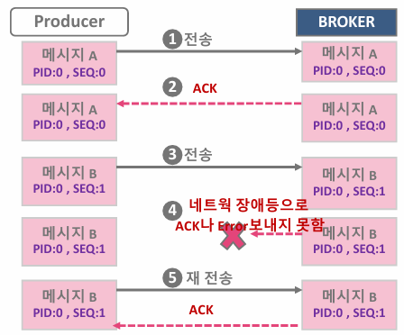

- 메시지 B의 Ack를 받지 못한 Producer는 메시지 B를 다시 보냄
- 메시지 B는 Broker에게 재전송 됨
- 하지만 Broker는 Sequence가 인 메시지가 이미 저장되어어서 해당 메시지를 메시지 로그에 저장하지 않고 Ack만 보냄


**Idempotence 를 위한 Producer 설정**

- `enableidempotence = true`
- `ack = all`
- `retries > 0`
- `max.in.flight.requests.per.connection = 1~5`

- Idempotence 적용 후 성능이 (최대 20%) 감소할 수 있지만 기본적으로 Idempotence 적용 권장

**유의 사항**

- case 1 
  - default : `enable.idempotence=true`로 하고 다른 파라미터를 잘못 설정하면 idempotence 동작 안함
- case 2
  - 명시적으로 `enable.idempotence=true`를 하고 파라미터를 잘못 설정하면 Config 오류가 발생하면서Producer가 기동되지않음


### Idempotence 기반 메시지 정송 순서 유지

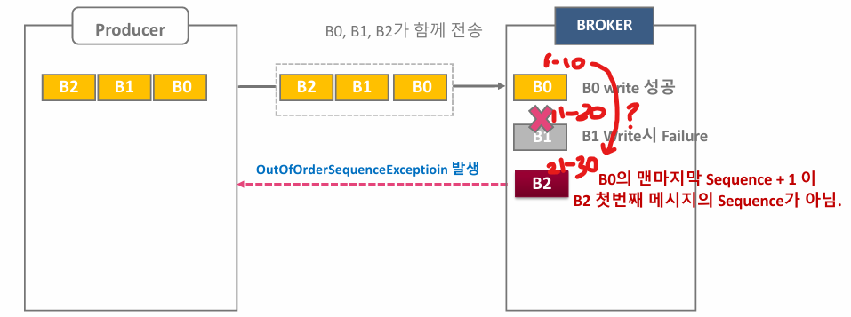

- B1이 write fail로 인해 전송 실패
- B0 다음 메시지가 11이 아니라 B2의 21이기 때문에 중간에 값이 없어진 것을 알 수 있음
- OutOfOrderSequenceException 발생하여 Producer에게 전달
- 이렇게 재전송이 일어나더라도 전송 순서를 지킬 수 있음


## Partitioner

### default partitioner

- Key값이 Null이면 stickyPartition으로 보낸다.
- Keyr값이 있으면 Hashing으로 보내게 된다.

```java
public int partition(
    String topic, Object key, byte[] keyBytes, Object value, byte[] valueBytes, Cluster cluster, int numPartitions
) {
    return keyBytes == null ? this.stickyPartitionCache.partition(topic, cluster) : 							Utils.toPositive(Utils.murmur2(keyBytes)) % numPartitions;
}
```


### Custom Partition

**Custom이 필요한 이유**

- Key에 따라 보내고 싶은 곳을 정하고 싶기 때문에 Custom이 필요하다.
- interface : `Partitioner`로 구현


