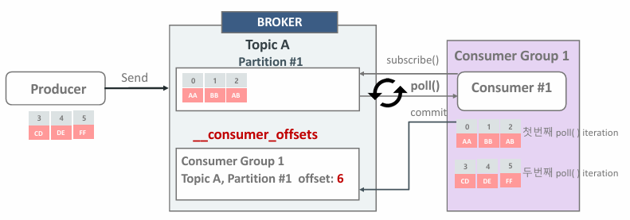
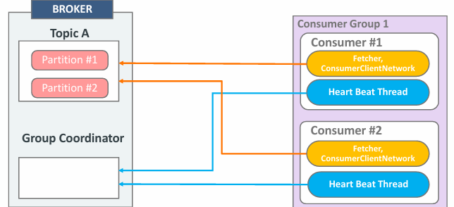

# 03_Consumer

## Consumer란 

- Topic 메시지를 읽는 역할을 수행
- 모든 Consumer들은 고유한 group.id를 가지는 Consumer Group에 소속되어야 함
- 개별 Consumer Group 내에서 여러 개의 Consumer들은 토픽 파티션 별로 분배

### Subscribe, poll, commit

- Subscribe
  - Consumer가 Subscribe를 호출해서 읽어들이려는 토픽을 등록한다.
- Poll
  - poll을 이요해서 주기적으로 브로커의 토픽 파티션에서 메시지를 가져온다.
- Commit
  - 메시지를 성공적으로 가져왔으면  Commit을 통해 __consumer_offset에 다음에 읽을 offset 위치를 기재한다.

1. Producer가 메시지를 보냄
2. Partition에 메시지가 쌓임
3. Consumer가 poll을 통해서 Partition에 있는 메시지를 가져옴
4. 가지고 왔으면 `__consumer_offsets`의 offset에 다음 읽을 offset을 적어놓는다.

### Kafka Consumer의 주요 수행 - Heart Beat

- KafkaConsumer
  - Fetcher, ConsumerClientNetwork 등의 주요 내부 객체와 Heart Beat Thread를 생성한다.
  - Fetcher, ConsumerClientNetwork는 Broker의 토픽 파티션에서 메시지를 Fetch 및 Poll 수행
  - Heart Beat Thread는 Consumer의 정상적인 활동을 Group Coordinator에 보고하는 역할
    - Group Coordinator는 주어진 시간동안 Heart Beat를 받지 못하면 Consumer들의 Rebalance를 수행 명령을 하고 Consumer Group에서 Rebalance를 수행하게 된다.

