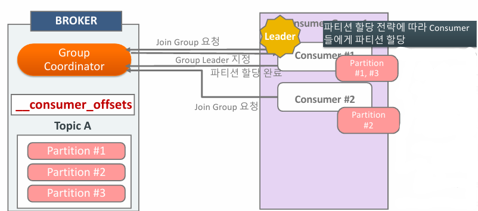

# 03_Consumer


## Consumer란 

- Topic 메시지를 읽는 역할을 수행
- 모든 Consumer들은 고유한 group.id를 가지는 Consumer Group에 소속되어야 함
- 개별 Consumer Group 내에서 여러 개의 Consumer들은 토픽 파티션 별로 분배

### Subscribe, poll, commit

- Subscribe
  - Consumer가 Subscribe를 호출해서 읽어들이려는 토픽을 등록한다.
- Poll
  - poll을 이요해서 주기적으로 브로커의 토픽 파티션에서 메시지를 가져온다.
- Commit
  - 메시지를 성공적으로 가져왔으면  Commit을 통해 __consumer_offset에 다음에 읽을 offset 위치를 기재한다.


1. Producer가 메시지를 보냄
2. Partition에 메시지가 쌓임
3. Consumer가 poll을 통해서 Partition에 있는 메시지를 가져옴
4. 가지고 왔으면 `__consumer_offsets`의 offset에 다음 읽을 offset을 적어놓는다.


### Kafka Consumer의 주요 수행 - Heart Beat


- KafkaConsumer
  - Fetcher, ConsumerClientNetwork 등의 주요 내부 객체와 Heart Beat Thread를 생성한다.
  - Fetcher, ConsumerClientNetwork는 Broker의 토픽 파티션에서 메시지를 Fetch 및 Poll 수행
  - Heart Beat Thread는 Consumer의 정상적인 활동을 Group Coordinator에 보고하는 역할
    - Group Coordinator는 주어진 시간동안 Heart Beat를 받지 못하면 Consumer들의 Rebalance를 수행 명령을 하고 Consumer Group에서 Rebalance를 수행하게 된다.


## KafkaConsumer 구성요소


- Fetcher
- ConsumerNetworkClient
- SubscriptionState
- ConsumerCoordinator
- HeartBeatThread

### poll() 매소드


```java
while (true) {
    // 최대 1초동안 기다림
    // 여러 개의 Records를 가지고 있음 왜냐하면 배치단위로 가져올 것이기 때문
    ConsumerRecords<String, String> consumerRecords = kafkaConsumer.poll(Duration.ofMillis(1000));
    for (ConsumerRecord record : consumerRecords) {
        logger.info("key : {}, val : {}, partition : {} "
                    , record.key(), record.value(), record.partition());
        // poll로 Data를 가져와서 저장등을 수행하는 시간이 오래걸리는 작업 = Main Thread
    }
```

- Fetch는 Linked Queue 데이터를 가져오는 역할

  - Queue에 **데이터가 있을 경우 Fetcher는 데이터를 바로 가져와 return**하고 poll() 수행완료

  - Queue에 데이터가 없을 경우 ConsumerNetworkClient에서 데이터를 브로커로부터 가져올 것을 요청

    - 이때 최대 Duration.ofMillis(1000) 동안 기다리게 된다.
    - 1초동안 대기 후에도 없을 경우에는 요청하게 됨

    

- ConsumerNetworkClient는 비동기로 계속 브로커의 메시지를 가져와서 Linked Queue에 메시지를 저장하는 역할


### 주요 파라미터

- `fetch.min.bytes`

  - Fetcher가 record들을 읽어들이는 최소 bytes

  - 브로커는 `fetch.min.bytes` 이상의 새로운 메시지가 쌓일때 까지 메시지를 전송하지 않는다.

  - default 값이 1이므로 수정해줘야하는 파라미터 => 16k정도 세팅하면..될지도?

    

- `fetch.max.wait.ms`

  - 브로커에 `fetch.min.bytes` 이상의 메시지가 쌓일 때까지 최대 대기시간

  - 즉 `fetch.min.bytes` 만큼 메시지가 쌓이지 않았을 때 대기해준다.

  - default = 500ms

    

- `fetch.max.bytes`

  - Fetcher가 한번에 가져올 수 있는 최대 데이터 bytes

  - Topic에 많은 파티션이 있어도 총 가져오는 데이터량은 `fetch.max.bytes`로 제한 된다.

  - default = 50MB

    

- `max.partition.fetch.bytes`

  - Fetcher가 파티션별 한번에 최대로 가져올 수 있는 데이터 bytes

  - 보통 Partition 별로 데이터를 가져오기 때문에 이 값이 주로 작동할 것으로 보임

  - 즉 Producer가 데이터를 너무 빨리 보내서 Broker에 값이 쌓이는 상황이라면 partition fetch bytes 읽어서 가져오게 됨

  - default = 10MB

    

- `max.poll.records`

  - Fetcher가 한번에 가져올 수 있는 레코드 수
  - default = 500


###  auto.offset.reset

- `auto.offset.reset = earliest`
- `auto.offset.reset = latest` 
  - earliest든 latest든 동일 Consumer Group으로 Consumer가 새롭게 접속할 시 __consumer_offsets에 ㄷ있는 offset 정보를 기반으로 메시지를 가져옴
  - 즉 **이미 __consumer_offsets에 offset이 저장되어있는 경우  earliest, latest 상관없이 마지막 offset부터 읽어들인다. **
- 그럼 earliest는 왜 사용하는 걸까?
  - __consumer_offsets 가 설정되어 있지 않는 경우 (처음 기동되는 경우) 처음부터 읽어들일건지 설정하는 것. 만약 latest라고 하면 Consumer가 기동되지 않았지만 Producer로 인해 데이터는 쌓여있을 경우 읽지 않은 것들은 누락되고 마지막꺼 부터 가져올 것이기 때문
- Consumer Group의 Consumer가 모두 종료 되어도 offset 정보는 7일동안__consumer_offsets에 ㅓ저장되어있다. (offset.retention.munutes)


## Group Coorndinator && Rebalancing

### Group Coordinator란


- Broker의 Group Coordinator는 Consumer Group내의 Consumer들에게 파티션을 재 할당하는 Rebalancing을 수행하도록 지시한다.
  - 새로운 Consumer가 추가되거나 기존 Consumer가 종료될 때 
  - heartbeat에서 응답이 오지 않을 때
  - Topic에 새로운 Partition이 추가될 떄

**Broker의 Group Coordinator와 Consumer Leader의 관계**



1. Consumer Group내의 **Consuemr가 브로커에 최초 접속 요청 시** Group Coordinator 생성
2. 동일 group.id로 여러 개의 Consumer로 Broker의 Gorup Coordinator로 접속
3. Group에 가장 빨리 join을 요청한 Consumer가 Leader Consumer 로 지정 
4.  Leader Consumer는 파티션 할당 전략에 따라 Consumer들에게 파티션 할당
5.  Leader Consumer는 최종 할당된 파티션 정보를 Group Coordinator에게 전달 
6. 정보 전달 성공을 공유한 뒤 개별 Consumer들은 할당된 파티션에서 메시지를 읽음


### Consumer Group Status


## Consumer Static Group Membership

### 필요성

- Rebalancing할 땐 Consumer들이 잠시 멈춘다. (rebalancing을 수행해야하기 때문에)
- 유지 보수 차원의 Consumer Restart도 Rebalncing을 초래할 수 있다.
- 즉 Rebalancing이 필요하지 않을 것 같은 순간에도 Rebalancing이 일어날 수 있는 경우를 방지하기 위해서 존재


- Consumer Group내의 Consumer 들에겐 고정된 id를 부여
- Consumer 별로 Consumer Group 최초 join 시 할당된 파티션을 그대로 유지, Consumer가 shutdown되더라도 `session.timeout.ms`내에 재기동되면 rebalance 가 수행되지 않고, 기존 파티션 재할당

- EX (그림)
  - Consumer #3 가 종료, but 바로 Rebalancing 일어나지 않음. Partition #3는 다른Consumer에재할당되지 않고 읽혀지지 않음
  - Consumer #3 가 `session.timeout.ms` 내에 재기동되면 Partition #3은 Consumer #3으로 할당
  - Consumer #3 가 `session.timeout.ms` 내에 재기동 되지 않으면?
    - Rebalance가 수행 된 후 Partition #3가 다른Consumer에 할당됨
- **확인**
  - `session.timeout.ms`의 default값은 45초
  - Consumer Static Group Membership를 적용할 경우에는 조금 더 큰 값으로 설정행야 의미 있음
    - 왜냐하면 조금 더 오랜시간동안 재기동될 수 있을지 확인해주는 것

```java
// consumer static member를 설정
// 각 consumer 마다 값을 바꿔줘야한다. 
props.setProperty(ConsumerConfig.GROUP_INSTANCE_ID_CONFIG, "1");
```


## Heart Beat Thread

- poll()이 작동되면 생성된다.


```java
while (true) {
    // poll 시작
    ConsumerRecords<String, String> consumerRecords = kafkaConsumer.poll(Duration.ofMillis(1000));
    for (ConsumerRecord record : consumerRecords) {
        // poll로 Data를 가져와서 저장등을 수행하는 시간이 오래걸리는 작업 = Main Thread
        // RDB, NoSQL 등으로 보내는 단계에서 시간이 오래걸릴 수 있음
        // 이때 300초(default) 시간이 넘게 되면 rebalancing = max.poll.interval.ms
        // 여기가 병목을 방지하는 것이 중요하다. 아니면 의도치 않은 rebalancing이 일어나게 된다.
    }
    // poll 종료
```

- +첫번째 poll() 할 때는 메시지를 가져오지 않고, Heart Beat Thread생성 등을 진행한다.


## Rebalance Mode

> - Eager mode
> - Cooperative mode

### Consumer에서 Rebalance가 발생하는 상황

- Consumer Group 내에 새로운 Consumer 추가 or  종료
- Topic에 새로운 Partition 추가될 때
- session.timeout.ms 이내에 Heartbeat가 응답이 없을 때
- max.poll.interval.ms 이내에 poll() 메소드가 호출되지 않을 때

### Eager mode


- 모든 Consumer가 잠시 메시지를 읽지 않는 시간으로 인해 Lag가 상대적으로 크게 발생할 가능성이 있음


### (Incremental) Cooperative mode


## Consumer 파티션 할당 전략

> - 목표
>   - Consumer의 부하를 파티션  별로 균등하게 할당
>   - 데이터 처리 및 리밸런싱의 효율성 극대화


### Round Robin과 Range 비교


- Round Robbin

  - 균등하게 consumer에게 분배

  - 문제점 : 

    - Topic A, B (Partition#1) 끼리 묶여있지 않다.
      - 이로 인해 Consumer에서 값을 가공하기 굉장히 힘들게 된다.
    - Rebalance 이후에 Consumer들을 균등하게 배치하려고 할 것임 따라서 Rebalancing 이전 파티션과 Consumer들의 Mapping이 변경될 수 있음

    

- **Range (default)**

  - 동일한 Key 값으로 되어있는 파티션은 특정 Consumer에 할당
  - EX)
    - Topic A : Order, Topic B : OrderItem
    - 둘다 Order id를 가지고 있다고 가정
    - 이럴 때 Topic A, B의 양쪽 Partition #1은 동일한 Order Id를 가지고 있을 것이다.
    - 왜냐하면 Producer에서 값을 보낼때 같이 보내기도 할 것이고, Hash로 Partition 구분이 될 것이기 때문에 동일한 Partition에서는 동일한 Id값을 넣을 수 있게 된다.
    - **즉 Consumer에서 값을 가공하기 편하게 된다.**


### Sticky


- Rebalancing 시 기존 토픽들의 파티션과 Consumer 매핑은 최대한 유지
- 이전 mapping을 기억해뒀다가 재할당
- 하지만 그림의 Partition #3 같은 경우에는 Consumer가 나눠질 수 있음


### Cooperative Sticky


- Sticky와 유사하지만 모든 매핑을 Rebalancing할 때 취소하지 않음
- 재할당 되어야 할 파티션만 Consumer에 따라 순차적으로 수행하여 할당


