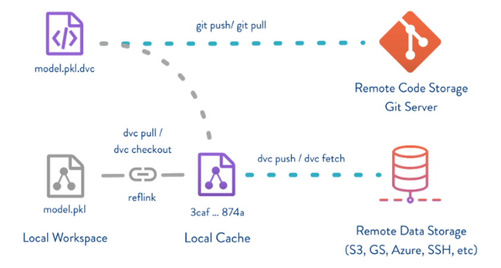
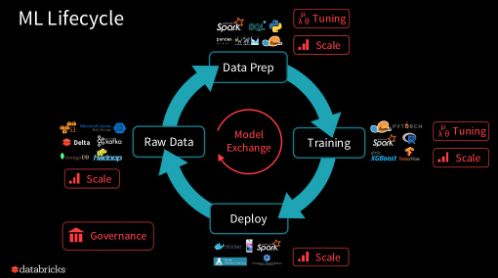

# 03_DataManagement

> - https://velog.io/@jkseo50/
> - https://github.com/iterative/dvc
> - https://myeonghak.github.io/mlops
> - https://www.slideshare.net/databricks/introduction-fo-mlflow


## 01_DataManagement를 해야하는 이유

- RawData가 존재
  - 이때 노이즈를 줄이기 위해서나 모델의 성능을 위해서 RawData를 여러가지 버전으로 변형시킨다.
  - 이때 변형된 데이터 version이 많아지기 때문에 Data Manamgement를 진행해야한다.
  - 따라서 data를 versioning하는 것이 필요하다.


## 02_DVC

> - Data Version Control
> - 머신러닝 파이프라인에서 데이터나 데이터 처리방식, 모델 등이 바뀌는 일이 빈번하게 발생하는 것을 version관리할 수 있게 도와주는 tool이다.



- Loval Workspace에 파일을 만든다.

- 저장

  - **실제 데이터** => 지정된 **storage**에 저장

  -  **설정파일과 데이터의 메타파일** => **git**에 저장

    

- DVC에 데이터를 저장할 때

  - remote storage에 데이터를 저장

  - remote storage에 내 위치를 메타파일에 저장한다.

    

- DVC에 데이터를 가져올 때

  - 메타 데이터 => 해당 데이터의 remote storage내의 위치를 조회 => 데이터를 가져옴
  - 설정파일과 메타파일을 git으로 버전관리한다.
  - 즉 dvc에 저장되는 데이터와 git에 저장되는 데이터가 같은 version으로 관리되게 된다.


## 03_DVC 실습

### 03-1) dvc : push

```powershell
git init  # git 저장소 초기화
dvc init  # dvc 저장소 초기화

# demo 파일 생성
mkdir data
cd data
touch demo.txt

# dvc로 tracking
dvc add data/demo.txt

# dvc add를 하면 /demo.txt.dvc가 생기게 된다. => meta data 
git add data/demo.txt.dvc data/.gitignore 

# git commit
git commit -m "add demo"

# remote storage를 세팅한다.
# => google drive의 url마지막 부분 복사(id)
dvc remote addd -d storage gdrive://{id}

# dvc config를 git에 commit
git add .dvc/config
git commit -m "remote storage"

# dvc push
dvc push
```

- `demo.txt.dvc`  : meta data이며 git에는 이 파일만 올라가게 된다.

  - git에는 많은 용량의 파일들이 올라갈 수 없기 때문에 meta data만 올리게 된다.

    

- **.dvc/config**

  - 즉 remote storage가 무엇인지에 대한 conf이다.
  - 밑의 예제는 gdrive

  ```txt
  [core]
      remote = storage
  ['remote "storage"']
      url = gdrive://{id}
  ```

- `dvc push`
  - push를 하게 되면 구글드라이브에 폴더와 파일이 생기게 된다.
  - 이때 다운로드를 받게 되면 demo.txt파일이라는 것을 알 수 있다. 


### 03-2) dvc pull 

```powershell
# dvc pull을 진행한다.
dvc pull
```

- 그렇다면 pull이 된다.


### 03-3) dvc checkout

```powershell
# 데이터를 변경한 뒤 push => 이전 버전으로 되돌아가기

# add, commit, push => dvc, git add 후 git commit
dvc add data/demo.txt
git add data/demo.txt.dvc # git에는 meta data만 들어가면 된다.
git commmit -m 'update demo.txt'
dvc push

# 이전 버전으로 되돌리기
git checkout <commit_id> data/demo.txt.dvc
dvc checkout

# 이후 확인하면 data가 이전 버전으로 되돌아가 있다.
```


## 04_Model Management


### 04-1) MLflow 란?

- 머신러닝 모델의 lifecycle을 관리해주는 tool

- 4개의 component

  - MLflow tracking

    - 실험 기록을 추적하며, 파라미터와 그 결과를 비교한다.

      

  - MLflow project

    - ML code를 재사용, 재구현 가능한 형태로 패키징하여 다른 데이터 과학자들과 공유하거나 프로덕션으로 변환한다.

      

  - MLflow models

    - 다양한 ML라이브러리로 만들어진 모델을 관리하고 다양한 모델 서빙과 추론 플랫폼으로 배포

      

  - MLflow model registry

    - 중앙 모델 스토어를 제공, 한 MLflow모델의 전체 라이프 사이클을 협동적으로 관리. 이러한 관리 작업에는 versioning, stage trainsition, 주석 처리등을 포함


### 04-2) MLflow Tracking

> - ML모델을 여러개 학습시키고 관리할 때 발생하는 meta data를 관리해주는 저장소 역할을 한다.

1) **Entity(meta data) store**

   - 학습과 관련된 **가벼운 metadata**를 수집하고 통합한다.

   - file store(로컬 파일 시스템)

   - SQL store : SQLAlcgmy를 사용하여 DB와 연동할 수 있음

   - REST store : 자체적인 인프라를 구축하고 싶은 조직에게, restful한 추상화 제공

     

2) **Artifact store**

   - **무거운 데이터**를 저장한다. (학습데이터, 모델파일 등)
   - Amazon S3
   - Azure Blob
   - Google Cloud 등

**간단한 예제**

- logging

```powershell
# 예제 파일다운받기
wget https://raw.githubusercontent.com/mlflow/mlflow/master/examples/sklearn_elasticnet_diabetes/linux/train_diabetes.py train_diabetes.py

# train_diabetes.py 파일안에 있는 코드 => log를 찍는 명령어들이 존재
mlflow.log_param("alpha", alpha)
mlflow.log_param("l1_ratio", l1_ratio)
mlflow.log_metric("rmse", rmse)
mlflow.log_metric("r2", r2)
mlflow.log_metric("mae", mae)
mlflow.sklearn.log_model(lr, "model", signature=signature)

# code실행
mlflow ui # ui를 키는 것
python train_diabetes.py # param default값으 로 실행

# mlruns에 학습한 데이터들이 저장되게 된다.
```


```python
from pprint import pprint

import numpy as np
from sklearn.linear_model import LinearRegression
from sklearn.preprocessing import StandardScaler
from sklearn.pipeline import Pipeline

import mlflow
from utils import fetch_logged_data


def main():
    # enable autologging
    mlflow.sklearn.autolog() # 이 함수를 사용하면 자동으로 log를 찍어주게 된다.

    # prepare training data
    X = np.array([[1, 1], [1, 2], [2, 2], [2, 3]])
    y = np.dot(X, np.array([1, 2])) + 3

    # train a model
    pipe = Pipeline([("scaler", StandardScaler()), ("lr", LinearRegression())])
    pipe.fit(X, y)
    run_id = mlflow.last_active_run().info.run_id
    print("Logged data and model in run: {}".format(run_id))

    # show logged data
    for key, data in fetch_logged_data(run_id).items():
        print("\n---------- logged {} ----------".format(key))
        pprint(data)

if __name__ == "__main__":
    main()
```


### 04-3) MLflow Projects

> - 재생산성, 재사용성을 확보하기 위한 기능
> - 모델을 프로젝트화 한다고 보면된다. 

1. **재생산가능하도록 ML실행을 위한 패키징 포멧**

   - Project config를 포함한 optional ML progect file을 관리

   - 어떤 코드 폴더든, git hub repository든 지원

     

2. **재상산성을 위해 dependency 정의**

   - conda, R, docker dependency에 대한 정보를 ML프로젝트에 명시적으로 기록

   - 거의 모든 환경에서 재상산 가능할 수 있도록 지원

     

3. **프로젝트 구동을 위한 실행 API**

   - CLI/ Python/ R/ Java
   - 로컬 및 원격 실행 지원


### 04-3) MLflow Models

> - 모델이 정해진 양식에 따른 입력을 받았을 때 추론 결과를 뱉어낼 수 있도록 배포할 수 있어야한다.
> - 이를 위해 MLflow는 다양한 환경에서 다양한 툴로 모델을 배포할 수 있도록 중간 스탠다드 역할을 수행


### 04-4) MLflow registry

> - 다양한 버전 그리고 stage 충돌 없이 쉽게 관리할 수 있는 기능을 제공

- 중앙화된 Repository

  - 등록된 모든 모델들과 그에 상응하는 메타데이터를 가지고 있다.

  - 즉 등록된 모든 모델을의 모든 버전들이 저장되고 접근할 수 있다.

    

- model staging

  

- 변화 관리와 mointoring

  - 모델 repository에 변경사항이 발생했을 시 => 핵심 정보를 로그로 남ㄱㄹ 수 있도록 이벤트 설계 가능


### 04-5)  ML model의 lifecycle

> - Raw data
> - prepare data
> - model training
> - model deployment



- 4가지 단계를 순차적으로 반복적으로 이뤄진다.

  


## 05_model serving

> - 서비스에 적용할때 어떻게 서비스화 할것인지
> - 서비스 제공방식
>   - ex_ HTTP API Request, 챗봇, 좋아요, 구글, 길찾기 등
> - 실시간, 일정기간 후, 결과를 다시 반환(추천 순위, 추천 맵 등)


**서빙 단계에서 막히는 이유**

- 모델개발과 sw개발 방법의 괴리감
- 모델 개발과정과 sw개발 과정의 파편화
- 모델 평가 방식 및 모니터링 구축의 어려움


