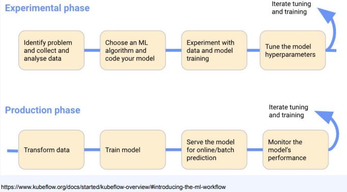
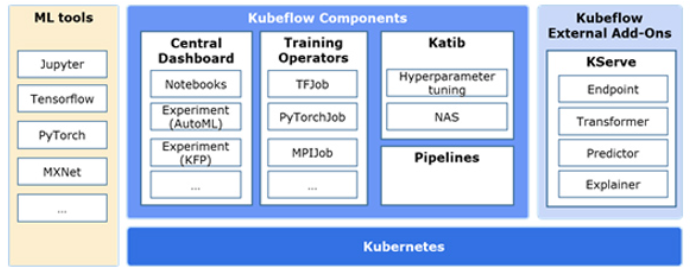
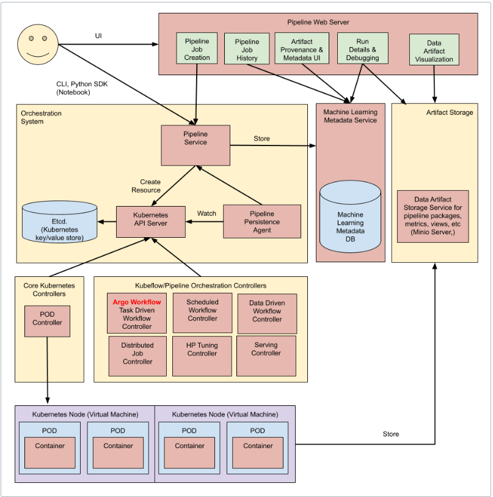

# 05_Kubeflow


## 05_1) AI 과정

> - 일반적인 모습



- 실험 단계

  1. 문제 정의, 데이터 수집 및 분석 

  2. ML model 선택

  3. 실험 및 training

  4. 하이퍼파라미터 튜닝

     

- 배포 과정

  1. data 변형
  2. train model
  3. model serving
  4. monitoring

Kubeflow는 위 과정들을 K8s를 바탕으로 진행할 수 있게 도와주는 툴이다.


## 05_2) kubeflow 란?



- 위와 같은 서비스들을 제공한다.
- 머신러닝 workflow의 ML model 학습부터 배포단계까지 모든 작업에 필요한 도구와 환경을 K8s위에서 component로 제공한다. 
- Compoenet
  - Central Dashboard : Notebooks, AutoML, KFP등의 컴포넌트를 이용할 수 있도록 UI를 제공
  - Training Operrators
    - 딥러닝 프레임워크에 대해 분산 학습을 지원한다.
    - 사용자가 분산 학습 명세서를 작성하여 K8s에 배포하면 Kubeflow Training Operator는 명세서에 따라 workflow를 실행한다.
  - Kaib
    - Kaib를사용하여 AutoML 기능을 제공한다.
    - Hyper Parameter Tuning, Neural Architecture Search기능이 있다.
  - Pipelines
    - 머신러닝 workflow를 구축하고 배포하기 위한 ML Workflow Orchestration 도구
    - Pipelines와 Pipeline Components를 재사용하여 다양한 실험을 빠르고 쉽게 수행할 수 있음
    - 머신러닝 workflw를 DAG(방향 순환이 없는 그래프)로 정의한 것
    - model을 serving까지 보내는데 필요한 모든 작업을 재사용 가능한 단위(component)로 나누고, k8s위에서 연결시켜주는 역할


## Pipline과 Component의 관계

> - Component : 재사용 가능한 형태로 분리된 하나의 작업 단위
> - Pipeline : 여러 Component들의 연관성, 순서에 따라 연결된 Graph

### K8s 관점

- Pipeline : Workflow
- Component : Pod

**Pipeline**

- kfp sdk를 사용하여 pipline을 구현

- dsl-compile 명령어를 사용해 컴파일을 진행한다. ==> 그럼 k8s가 이해할 수 있는 형태의 yaml파일이 생성되게 된다.

- kind : Workflow

- **workflow란?**

  - 여러 개의 container들을 정해진 순서에 따라 실행 => input/ouput을 전달하는 것

    

**Component**

- kfp sdk를 사용하여 component을 구현
- 생성된 pipeline => workflow yaml파일의 spec.tamplates에 해당 컴포넌트를 감싼 부분이 추가된다.
- 하나의 독립적인 pod로 생성 => component내부에 작성된 코드를 component decorator에 작성한 base_image환경에서 실행
  - 하나의 pipeline 내에 연속된 component라고 하더라도 memory를 공유하는 일은 일어하지 않는다. 
  - 서로 다른 component간의 data공유는 input/output변수 or 파일경로로 넘겨주는 방식을 사용
  - pvc공유하여 사용가능


wget -Uri https://github.com/kubernetes-sigs/kustomize/releases/download/kustomize%2Fv5.0.3/kustomize_v5.0.3_windows_amd64.tar.gz -OutFile kustomize_v5.0.3_windows_amd64.tar.gz


```
tar -xvzf C:\Users\jayho\Desktop\mlops-prac\kubeflow-prac/kustomize_v5.0.3_windows_amd64.tar.gz -C C:\Users\jayho\Desktop\mlops-prac\kubeflow-prac/kustomize_v5.0.3_windows_amd64
```


minikube start --driver=docker --cpus=4 --memory=6g --kubernetes-version=v1.25.11


 --extra-config=apiserver.service-account-signing-key-file=/var/lib/minikube/certs/s a.key --extra-config=apiserver.service-account-issuer=kubernetes.default.svc


- `Kubernetes` (up to `1.26`) with a default StorageClass

- ```
  kustomize
  ```

  5.0.3

  - ⚠️ Kubeflow is not compatible with earlier versions of Kustomize. This is because we need the [`sortOptions`](https://kubectl.docs.kubernetes.io/references/kustomize/kustomization/sortoptions/) field, which is only available in Kustomize 5 and onwards [#2388](https://github.com/kubeflow/manifests/issues/2388).

- `kubectl`


1.25.11


Overview




