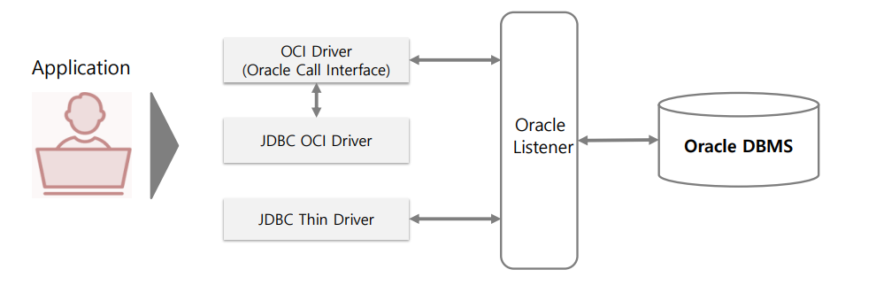
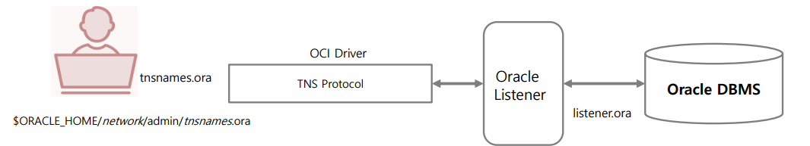
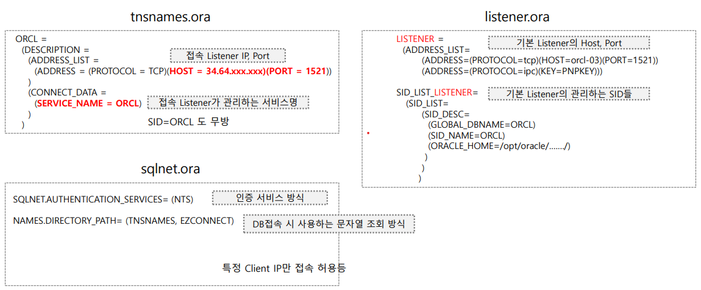

# 00_install




- Oracle DB 접속을 위한 Client
  - C/C++ 기반 : OCI (Oracle Call Interface)
    - 운영체제의 C/C++로 만들어 졌으며, Oralcle의 SQL*Net 기반에서 움직인다.
  - Java 기반 : JDBC
- ODBC, ODP for .Net, JDBC OCI Driver 모두 최종적으로 OCI Driver를 이용하여 오라클 DB에 연결해야한다.
- OCI는 운영체제 별로 별도의 클라이언트 툴로 설치해야함
- JDBC Thin Driver는 Java로 만들어졌으면 TCP 기반으로 접속, SQL*Net 기반의 추가적인 클라이언트 설치 불필요.
- OCI보다 상대적으로 가볍고, Java가 설치되어 있는 클라이언트에서는 어디서나 빠르게 오라클 DB 접속 가능


## SQL Net이란

> - 오라클 클라이언트와 오라클 DB서버가 서로 인터페이스 하는 전반적인 네트웤 구성을 의미



- 환경 파일
  - tnsnames.ora : 보통 클라이언트 쪽에 있음
  - listener.ora : 보통 서버쪽에 있음
  - sqlnet.ora : 양쪽 모두 가능

OCI Driver를 활용하기 위해서 반드시 tnsnames.ora가 구성되어야함




- listener.ora는 서버를 만들 때 이미 만듦
- tnsnames.ora의 SERVICE_NAME이 LISTENER가 관리하는 이름이다
  - 즉 Mapping이 된다.
- Listner에 있는 GLOBAL_DBNAME과 SERVICE_NAME이 일치해야한다.
  - SERVICE_NAME는 SID라고 정해도 무방하다

- SQLNET.ORA
  - 클라이언트에서 인증을 어떻게 받을지에 대해 정하는 파일
    - 문자열이 들어왔을때 해석을 해서 TNSNAME에 가서 본다.
    - 특정IP만 볼것인지 등에 대해


오라클 리스너

```층
lsnrctl  -- listener컨트롤에 접속하게 된다.
status
lsnctr start -- 작동


```


