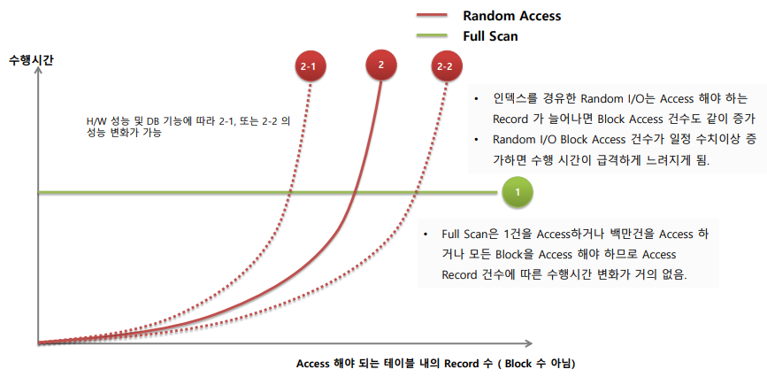
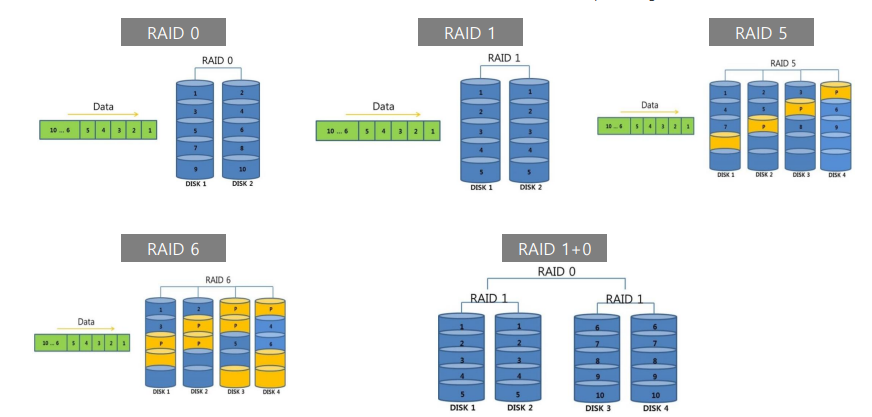
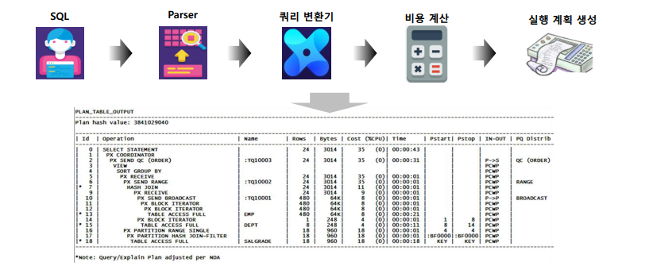

# 01_Oracle_Architecture

여러개의 Processor들이 메모리를 공유를 하게 된다.

**필수사항**

- 프로세스
  -  사용자 프로세서
  - Oracle 프로세서 : 
    Server Processor, Background Processor 
    (둘의 결합으로 대부분의 DB Work을 수행한다. )
- 메모리
  - SGA : 공유 메모리 구조
  - PFA : Server Process 개별로 할당되는 구조
- DB 파일
  - Datafile : 테이블 등이 저장되는 파일
  - Redo Log File : DML 변경사항을 실시간 기록하는 파일
    - 과거 Redo Log ==> 아카이브 
  - Control File : structure 변경사항 기록


- SGA (System Global Area)
  - Shared Pool (SQL 쿼리/실행 계획)
  - DataBase Buffer Cache
  - Redo Log Buffer
  - Large Pool


Oracle Connection & Server Process


- 순서
  1. user process에서 드라이버 (OCI, JDBC 등)를 사용하여 getConnect요청
  2. Ligtener에 연결이 되어 Server Process를 하나 생성해준다.
  3. Server Process에서 명령을 받고 수행 후 UserProcess에게 전달을 하게 된다.
     - PGA는 Server Processor가 사용하는 고유의 메모리 영역이다.
     - 즉 Sorting, Hash join 등 여러 로직을 수행하기 위한 공간


## Database Block

### Database Block정의


- DB 데이터 검색과 저장의 가장 기본 단위
  - 8,16,32,64K 로 단위를 구성할 수 있음
  - 한번 설정을 진행하였다면 변경이 불가능 하다.
- 모든 DB I/O 는 DB block 단위로 수행 
  - 의미 
    - 한 테이블에 컬럼이 적어서 200byte의 용량만 가지고 있다고 하더라도 8K(최소단위)의 데이터 블록을 읽어야한다. 
    - 저장 공간이 낭비가 되지만 성능을 위해 이렇게 사용한다.
    - IO 성능을 향상시키기 위해서이다.
    - 컬럼이 너무 많아진다면 테이블을 나눠서 진행한다.
  - 단 하나의 레코드를 읽을지라도 최소한 1Block은 Access를 해야한다.


1. 컬럼의 사이즈가 중요하다. ==> 즉 Block의 개수로 진행을 해야한다.
   - 따라서 서로 동일하지 않다.
   - IO의 횟수는 면적으로 생각해야한다.
2. 하이워터마크
   - 하이워터 마크라는게 Update, Create등을 하다보면 늘어나게 된다.
   - 따라서 서로의 Segment가 다르기 때문에 검색속도가 차이날 수 있다.


## 클러스터링 팩터

- 클러스터링 팩터란?
  - 사용자가 자주 검색하는 **비슷한 값들이 서로 얼마나 옹기종기 모여있느냐**에 따라서 엑세스하는 Block의 개수가 달라진다.
  - 즉 I/O 횟수가 차이가 나게 된다.


- 빨강색을 엑세스 한다고 가정
  - Case 1 : Block 1과 Block2를 엑세스하면 된다.
  - Case 2 : Block 1,3,4,5 총 4개를 엑세스해야한다.
- Color를 기준으로 만들어 놓은 것
  - 데이터를 만들어 두는 조건에 따라서 상황이 역전 될 수 있기 때문에 어떤 값으로 클러스터링 할지 파악하는 것이 중요하다.


### Index를 통한 테이블 Access의 클러스터링 팩터

- **인덱스 로우의 순서**와 테이블에 저장되어 있는 **데이터 로우의 위치가 얼마나 비슷한 순서로** 저장되어 있는가에 대한 내용이다.


- 왼쪽
  - Col1 index로 진행할 경우 2개의 Block을 엑세스하게 된다.
- 오른쪽
  - Col2 Index로 진행할 경우 3개의 Block을 엑세스하게 된다.
- 즉 동일한 테이블에 index가 걸려있더라도 검색조건에 따라 클러스터링 팩터가 다르며 성능이 달라질 수 있다.


## IO엑세스 유형

### Random Access와 Sequential Access에 차이

- **Sequential Access**
  
  - 정해진 순서대로 데이터를 순차적으로 검색하게 된다.
  - 테이터를  차례차례로 읽혀진다. = Table Full Scan
  - Mulit 블록을 I/O단위로 사용가능 하다
    - 즉 DB_FILE_MULTIBLOCK_READ_COUNT 로 설정가능
    - **임계점이 32**정도라고 한다.
  - 데이터 읽는 양은 Random I/O보다 많을 수 있으나 대용량의 데이터를 읽을 경우 random I/O보다 훨씬 효율적이다.

- **Random Access**
  
  - 원하는 레코드만 직접 엑세스하는 방법
    	 = 데이터를 빨리 검색할 수 있는 엑세스 방식이다. = index방식
  - Index는 순서대로 되어 있지만 Block에서는 순서대로 저장이 안되있을 수 있음
  - 따라서 디스크 Access Time이 중요하게 된다.
    - 디스크 HEAD의 위치를 표면 위의 특정 트랙으로 이동시키는데 시간
  - 대부분의 OLTP 성 Application은 Random I/O Access유형이다. 


## Randcom I/O 증가량에 따른 성능 변화

- 문제 : Randcom I/O 증가량에 따른 성능
  1. 1만건의 Record를 Access하기 위해서 **Random I/O시 1000 Block** 이 필요하고 **Full Scan시 십만 Blcok** 필요한 경우 어떤게 더 빠른가?
     - 보통 **Random I/O**가 더 빠르게 된다.
  2. 100만건의 Record를 Access하기 위해서 **Random I/O시 십만** Block 이 필요하고 **Full Scan시 십만 천만** 필요한 경우 어떤게 더 빠른가?
     - **Full Scan**이 더 빠르다

- Random I/O 100배 늘어난 것과 Full Scan 100배 들어난 것을 많은 차이가 있음
  - Random I/O 100배 늘어난 것이 성능에 더 많은 영향을 주게 된다.
  - 즉 비율로 생각하면 안된다 (**절대량이 중요하다**)
  - 절대량이 늘어날 수록  H/W적인 제약으로 인하여 성능이 급격하게 저하됨

분포도가 좋다 : 해당값의 유니크한 정보가 많다라는 뜻이다.

```sql
select (1/cnt)*100
from (
	select count(distinct code) cnt /* select 9 rows */
	from XXX
) a
-- distinct : 중복인 값 제거
```

- [문제]
  1. 특정 TABLE의 컬럼값 **분포도가 균일하게 10%**일 경우, 가령 컬럼값 A,B,C,D,E,F,G,H,I,J 열 종류가 모두 균일하게 건수가 같다고 가정하자 (분포토 10%라는 뜻)
  2. **1억건**이 넘는 대용량 테이블에 해당 컬럼으로 단독 인덱스를 생성할 것인가?
  3. 만일 동일 테이블에 해당 컬럼값 분포도가 균일하게 **1%라면**, 가령 컬럼값이 100종류이면 모두 균일하게 건수가 같다면 해당 컬럼으로 단독 인덱스를 생성할 것인가?
- [답변]
  -  절대량으로 생각해야한다. 즉 1억건이라는 큰 테이블이기 때문에 가령 1%의 분포도를 가지고 있다고 할지라도 단독 인덱스를 사용하는 것은 지양해야한다.


Table Full Scan과 Random I/O 비교



- Index
  - Access를 해야하는 Record가 증가하면 Block Access도 증가한다.
  - 즉 읽어야하는 건수의 개수가 적을수록 좋다.
  - **Random I/O는 신중하게 사용해야한다.**
- Full Scan
  - 1건을 Access하나 백만건을 Access하나 어차피 다 확인해야하기 때문에 똑같다.


## HDD와 Flash Storage 그리고 RAID의 이해 

### Disk Storage의 Stripping

- RAID란
  - Redundant Array of Independent Disk
  - 여러개의 디스크를 묶어 하나의 디스크처럼 사용하는 기술
  - 디스크 I/O병렬화로 인한 성능 향상
- Storage에 RAID0 Stripping을 한 경우 I/O가 균일하게 모든 DiskDrive에 동시에 수행되어 빠른 시간안에 I/O처리 가능



- RAID 0 : 
- RAID 1 : 미러링 => 가용성을 위함
- RAID 5 : 패러티을 사용한다. 
  => 오라클에서는 write병목현상으로 인해 잘 사용하지 않음 
  => 큰회사에서 잘 사용하지 않음
  => 
- RAID 6 : 패러티 Disk가 두개가 있는 것
  => 안전하게 보관 가능
- 전반적으로 RAID 1+ 0을 사용한다.
  - 

### Flash Storage의 폭발적인 성장

- SSD기반 Flash Sotrage을 기반으로 Random I/O를 기존 HDD기반 보다  몇배 이상 향상


### OLTP와 BATCH 그리고 I/O Latency와 Throughput

- **OLTP Real time processing**

  - **실시간**으로 DB 데이터를 조회/갱신 하는 시스템

  - 대부분의 업무 시스템 (금융/통신/ERP등)

  - 건당 매우 빠른 수행 시간이 생명 (보통 0.01 ~ 1초 이하)

  - 빠른 수행 시간을 위해 I/O Latency가 우선시 됨

    - Latency란?
      - 시스템에서 I/O가 요청되었을때 이를 수행하는데 걸리는 시간
      - 즉 I/O Delay시간을 의미한다. (milliseconds단위로 측정)

    

- **Batch Processing**

  - 작업을 몰아 두었다가 **한번에 처리하는 시스템**
  - 주로 야간, 주말, 월말 등 정산/마감/통계 생성 등 **대량의 테이터를 일괄 처리**할때 사용
  - 대량의 데티어를 처리 성능을 위해서 I/O Throughput이 우선시 됨
    - Throughput
      - 정해진 시간동안 (보통 1초) 얼마나 많은 데이터를 처리할 수 있는지 의미
      - 만약 주간에 Batch를 돌린다고 할때 특정 Resource만 사용할수 있도록 진행해야한다.

- IOPS(I/O Per Seconds)
  - 초당 I/O횟수. 
  - 보통 Sequential, Random으로 분리하여 측정한다.
  - 일반적으로 IOPS가 높을수록 Latency가 빠름
  - Throughput은 IOPS * I/O size


### SQL

- 일반적으로 튜닝은 Instance 튜닝, SQL튜닝으로 나뉜다.
- 데이터 베이스 명령 = SQL 



1. SQL 문 작성
2. Parser를 진행하므로써 정합성 확인
3. 쿼리 변환 ==> Optimization으로 효율적으로 변환
4. 실행 계획으로 변환하게 된다. ==> Cost계산 (인덱스를 탈지, Full Scan을 할지 등)

SQL 활용 능력

- 오라클 아키텍처의 이해
- 인덱스 활용, 인덱스 적용
- 조인의 원리, 다양한 데이터 연결 원리 체득
- 부분 범위처리
- 집합 기반의 SQL 처리
- 대용량 데이터 처리방안 (파티셔닝 및 병렬처리)
- **튜닝 책**으로 진행


