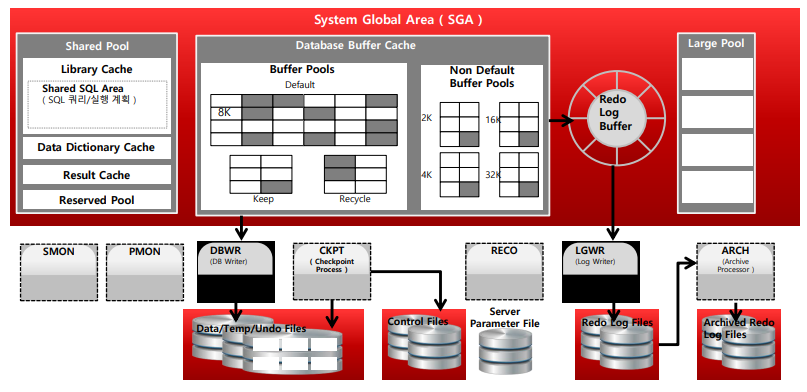
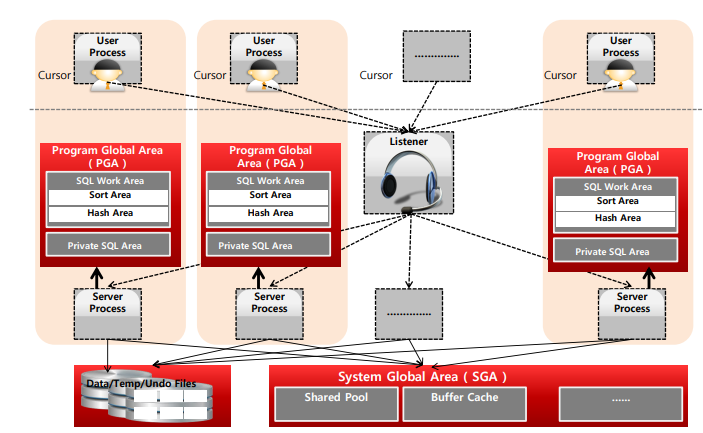
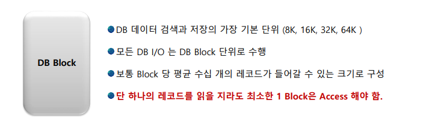
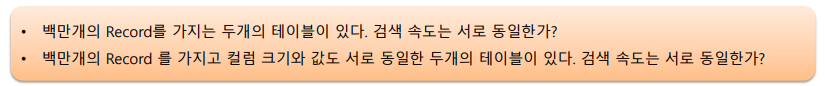
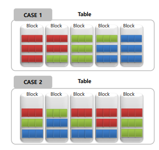
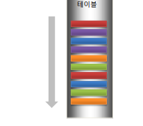
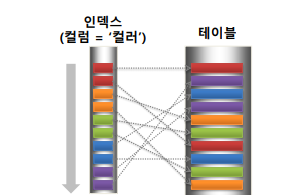

# 01_Oracle_Architecture

여러개의 Processor들이 메모리를 공유를 하게 된다.

**필수사항**

- 프로세스
  -  사용자 프로세서
  - Oracle 프로세서 : 
    Server Processor, Background Processor 
    (둘의 결합으로 대부분의 DB Work을 수행한다. )
- 메모리
  - SGA : 공유 메모리 구조
  - PFA : Server Process 개별로 할당되는 구조
- DB 파일
  - Datafile : 테이블 등이 저장되는 파일
  - Redo Log File : DML 변경사항을 실시간 기록하는 파일
    - 과거 Redo Log ==> 아카이브 
  - Control File : structure 변경사항 기록

- SGA (System Global Area)
  - Shared Pool (SQL 쿼리/실행 계획)
  - DataBase Buffer Cache
  - Redo Log Buffer
  - Large Pool

Oracle Connection & Server Process

- 순서
  1. user process에서 드라이버 (OCI, JDBC 등)를 사용하여 getConnect요청
  2. Ligtener에 연결이 되어 Server Process를 하나 생성해준다.
  3. Server Process에서 명령을 받고 수행 후 UserProcess에게 전달을 하게 된다.
     - PGA는 Server Processor가 사용하는 고유의 메모리 영역이다.
     - 즉 Sorting, Hash join 등 여러 로직을 수행하기 위한 공간

## Database Block

### Database Block정의

- DB 데이터 검색과 저장의 가장 기본 단위
  - 8,16,32,64K 로 단위를 구성할 수 있음
  - 한번 설정을 진행하였다면 변경이 불가능 하다.
- 모든 DB I/O 는 DB block 단위로 수행 
  - 의미 
    - 한 테이블에 컬럼이 적어서 200byte의 용량만 가지고 있다고 하더라도 8K(최소단위)의 데이터 블록을 읽어야한다. 
    - 저장 공간이 낭비가 되지만 성능을 위해 이렇게 사용한다.
    - IO 성능을 향상시키기 위해서이다.
    - 컬럼이 너무 많아진다면 테이블을 나눠서 진행한다.
  - 단 하나의 레코드를 읽을지라도 최소한 1Block은 Access를 해야한다.

1. 컬럼의 사이즈가 중요하다. ==> 즉 Block의 개수로 진행을 해야한다.
   - 따라서 서로 동일하지 않다.
   - IO의 횟수는 면적으로 생각해야한다.
2. 하이워터마크
   - 하이워터 마크라는게 Update, Create등을 하다보면 늘어나게 된다.
   - 따라서 서로의 Segment가 다르기 때문에 검색속도가 차이날 수 있다.

## 클러스터링 팩터

- 클러스터링 팩터란?
  - 사용자가 자주 검색하는 **비슷한 값들이 서로 얼마나 옹기종기 모여있느냐**에 따라서 엑세스하는 Block의 개수가 달라진다.
  - 즉 I/O 횟수가 차이가 나게 된다.

- 빨강색을 엑세스 한다고 가정
  - Case 1 : Block 1과 Block2를 엑세스하면 된다.
  - Case 2 : Block 1,3,4,5 총 4개를 엑세스해야한다.
- Color를 기준으로 만들어 놓은 것
  - 데이터를 만들어 두는 조건에 따라서 상황이 역전 될 수 있기 때문에 어떤 값으로 클러스터링 할지 파악하는 것이 중요하다.

### Index를 통한 테이블 Access의 클러스터링 팩터

- **인덱스 로우의 순서**와 테이블에 저장되어 있는 **데이터 로우의 위치가 얼마나 비슷한 순서로** 저장되어 있는가에 대한 내용이다.

- 왼쪽
  - Col1 index로 진행할 경우 2개의 Block을 엑세스하게 된다.
- 오른쪽
  - Col2 Index로 진행할 경우 3개의 Block을 엑세스하게 된다.
- 즉 동일한 테이블에 index가 걸려있더라도 검색조건에 따라 클러스터링 팩터가 다르며 성능이 달라질 수 있다.

## IO엑세스 유형

### Random Access와 Sequential Access에 차이

- **Sequential Access**
  
  - 정해진 순서대로 데이터를 순차적으로 검색하게 된다.
  - 테이터를  차례차례로 읽혀진다. = Table Full Scan
  - Mulit 블록을 I/O단위로 사용가능 하다
    - 즉 DB_FILE_MULTIBLOCK_READ_COUNT 로 설정가능
    - 임계점이 32정도라고 한다.
  - 데이터 읽는 양은 Random I/O보다 많을 수 있으나 대용량의 데이터를 읽을 경우 random I/O보다 훨씬 효율적이다.

- **Random Access**
  
  - 원하는 레코드만 직접 엑세스하는 방법
    	 = 데이터를 빨리 검색할 수 있는 엑세스 방식이다. = index방식
  - Index는 순서대로 되어 있지만 Block에서는 순서대로 저장이 안되있을 수 있음
  - 따라서 디스크 Access Time이 중요하게 된다.
    - 디스크 HEAD의 위치를 표면 위의 특정 트랙으로 이동시키는데 시간
  - 대부분의 OLTP 성 Application은 Random I/O Access유형이다. 

