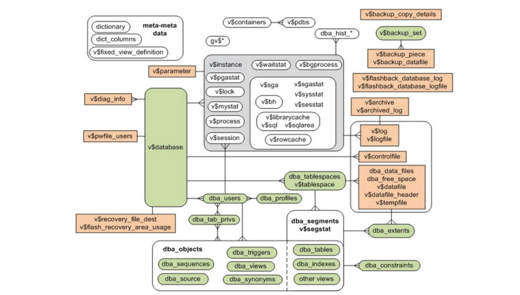
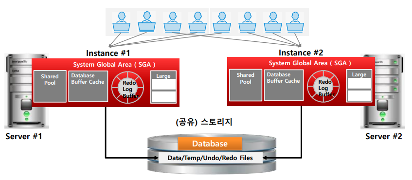
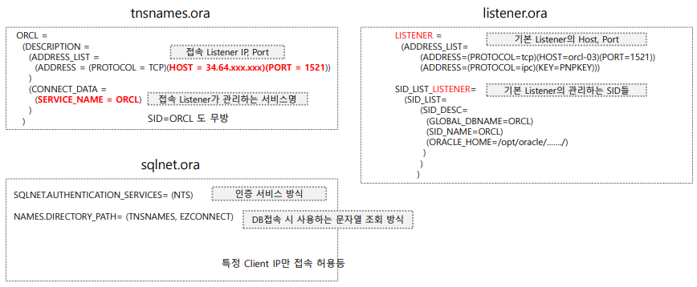
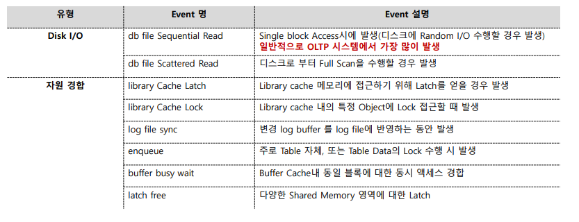
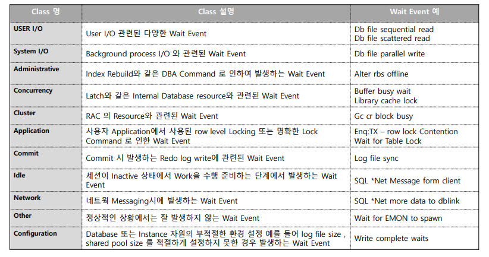

# 02_Oracle_Basic

## 01_Data Dictionary개요

### DataDictionary란

- 오라클 DB를 구성하는 모든 요소에 대한 정보를 가진다 
  - ex_ Object, Schema, segment, SGA, Parameter, Log, DataFile, Backup, Recovery 등
- 다양한 성능 정보와 Wait정보를 제공한다.
  - Wait : 오라클 DB에 어디가 병목인지 알려주는 정보
- DB Admin, Monitorying, Tuning을 위한 가장 중요한 정보


### Data Dictionary 유형

- USER_XXX Views
- ALL_XXX Views
- DBA_XXX Views : sys와 같은 table확인 가능
  - 특정 사용자/ 전체 사용자/DBA 권한 사용자에게만 보여지는 Object 정보
  - grant DBA role : 사용자이지만 DBA접근이 가능한 사용자

- V$ XXX Views
  - DB 전반에 걸쳐 여러 요소들의 정보 제공

- X$ XXX Tables
  - DB Internal 핵심 정보를 가지며 많은 Data Dictionary View들의 백 정보를 제공

사용자는 Data Dictionary에 오직 Select 만 가능하다.


### 오라클 주요 Data Dictionary



- V$ View들은 사실 Synonym이며 V_$ View를 가리킨다.
  - Synonym : 원본 테이블이 아니라 새로운 테이블을 만들어서 제공해주는 View이다. 
- V_$ View는 GV`_`$ View로 부터 만들어지며 GV`_`$ View는 RAC구조 Data dictionary(Global view)의 View 정보이다.
- RAC가 아닌경우 Instance가 1개 (instance id = 1)인 경우이므로 GV_$ View에서 해당 instance_id의 값만 View 재 생성


```sql
-- USER_XXX Views이 어떤 것들을 가지고 있는지 알고 싶을 때
SELECT * FROM USER_TABLES;

-- INDEX의 다양한 속성들
SELECT * FROM USER_INDEXES;

-- 자신(SOE) + 다른 사용자의 TABLE정보 ==> 접근 가능하도록 권한을 받은 것
SELECT * FROM ALL_TABLES;

-- DBA권한이 있을 경우
SELECT * FROM DBA_TABLES;

-- DBA가 V$SESSION의 권한을 주기 위해선?
-- V_$SESSION => 언더바를 넣어줘야한다. ==> V$ 는 TBALE이 아니기 때문 
GRANT SELECT ON V_$SESSION TO SOE;  -- 부여
REVOKE SELECT ON V_$SESSION FROM SOE; -- 회수

-- 전체 INSTANCE에 대한 정보를 알수 있음
SELECT * FROM GV$SESSION


```


### Instance와 Database의 구분 및 RAC 개념



- Instance
  - 메모리
  - 데이터에 관련된 것들이 메모리에 올라가 있으면 Instance이다.
  - 일반적으로 DB작동 되는지에 대한 것은 Instance도 포함한 개념이다.

- DB
  - Database에 있는 파일들을 DB라고 한다.
  - Database가 SGA로 올라가야 정상적으로 기동이 된 것
  - 이래야 Server Process가 SGA에 붙어서 작업을 할 수 있음

- RAC
  - 많은 동시접속자에 대해 어떻게 분산시킬지에 대한 개념
  - instance를 늘릴수록 선형적으로 성능이 늘어난다.


### SID, SERVICEC_NAMES, DB_NAME, GLOBAL_DBNAVE구분


- **SID** 
  - instance의 고유명을 나타낸다.
- **SERVICE NAME**
  - 개념적으로 DB에서 서비스되는 Database서비스 명을 의미한다. 일반적으로 1개 또는 여러개의 instance가 결합되어 서비스 가능
  - ex) service name이 ORCL이라는 것이 존재하고 instance 2개가 하나의 service name을 가지고 있다면 Listener가 라우팅을 해줘서 instance1로 갈지 2로 갈지 결정해준다.
- **DB NAME**
  - DB의 이름
- **DB DOMAIN**
  - 집합적인 DB 도메인
- **GLOBAL_DBNAME** 
  - DB이름이지만 DB_NAME + DB_DOMAIN으로 구성
  - 기본 SERVICE_NAME은 GLOBAL_DBNAME으로 설정함
    - 즉 GLOBAL_DBNAME이 default service name이다.
  - 기본 서비스 NAME이 GLOBAL DB NAME과 동일하게 나온다.
  - 큰 조직의 경우 GLOBAL_DBNAME을 부여한다.
  - 




- tnsnames.ora
  - 옛날에는 connect data 부분의 service name이 sid밖에 없었지만 확장성을 위해서 service_name이 생겼다.

- listener.ora
  - listener에는 service name이 존재하지 않는다.
  - 하지만 GLOBAL_DBNAME이 존재한다. 이게 SERVICE NAME과 mapping이 되는 것이다. 


### Oracle Wait Event

- 성능 및 운영 관리를 위해 알아야 할 가장 중요한 요소중 하나
- 서버 프로세스 또는 백그라운드 프로세스가 DB의 **CPU, Memory, Database File, I/O**등의 모든 자원을 엑세스하고 이용하는 **세부 단계별로 상세한 Wait Event를 발생** 
- 오라클의 모든 성능 요소 및 자원 사용현황은 Wait Event의 발생정도에 따라 모니터링 가는함


### 주요 Wait Event

- 내부처리 아키텍처를 알아야한다.





[meta link] : 


