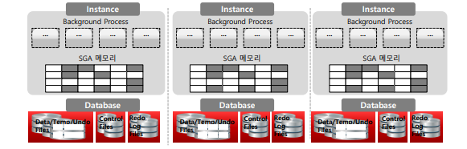
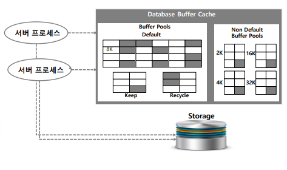
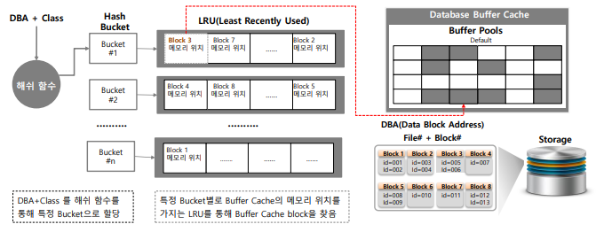
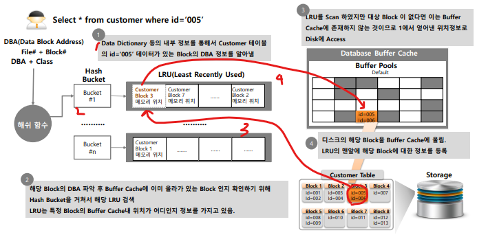

# 03_SGA와 ASMM

## 01_MemoryStructure and SGA

- **Shared Memory**

  - SGA (System Global Area)

  - 공유 메모리이다.

  - 매우 많은 Server Process가 동시에 동시에 접근한다.

  - Disk I/O를 최대한으로 줄이기 위해 Access한 데이터는 저장해 놓는다.

    

- **Non Shared Memory**

  - PGA (Program Global Area)
  - 각 서버 프로세스가 개발 메모리를 할당

- 오라클의 메모리 활용 전략
  - Disk I/O를 최대한으로 줄일 수 있는가?
  - 동시에 많은 프로세스에서 최대한 어떻게 효율적으로 자원할당을 할 것인가?
  - 시스템 안정성을 어떻게 유지할 것인가?

## 02_Oracle SGA 개요

- Database Buffer Cache

  - Disk I/O의 영향도를 줄이기 위해 데이터 파일의 데이터 블록을 메모리로 Copy

  - 사용자 => SQL => 특정 Data를 가져올시 => 다시 Storage로 내려가지 않고 값을 저장

  - 공간을 효율적으로 사용하기 위한 로직이 존재 => 즉 우선순위가 낮아지면 지우게 된다.

    

- Shared  Pool

  - SQL의 실행 계획을 공유하기 위한 메모리 공간

    

- Redo Log Buffer

  - DML을 날릴때 Buffer에 일정 사이즈로 모아서 Storage로 보내게 된다.

  - I/O를 줄이기 위한 방법

  - Redo log file에 Write되기 이전에 Memory에 먼저 Write되는 영역

    

- Large Pool

  - Parallel Qeury 메시징 또는 대용량의 메모리 할당이 필요한 경우 사용된다.

    

- Java Pool

  - Java Object에 대한 메모리 영역

    

- Stream Pool

  - Data 복제 등을 위한 Stream 사용영역

- Instance

  - Background Process와 SGA메모리 영역을 의미

  - Instance를 시작 => SGA영역을 할당, Background Process를 구동시키게 된다.

    

- Database

  - DB를 저장하는 물리적 영역
  - dbf파일, control파일, log파일 등 데이터를 저장되어있는 물리적인 공간이다.
    - 즉 file을 일컫는다.

## Buffer Cache 개요

- Storage I/O Access를 최소화 하기 위해서 한번 Access한 Block은 RAM영역에 저장
  1. Server Process가 데이터 최소 Access시  Strage에 Access
  2. 해당 Block이 Buffer Cache에 로드
  3. 해당 Block Access시 Buffer Cache에서 Access진행
  4. Storage I/O Access량 감소
- Random I/O 성능 영향을 최소화하는 중요한 역할이다.
- OLTP는 공유메모리의 활용을 얼마나 잘하느냐가 중요하다.

### Buffer Cache를 통한 데이터 Access

- OS Memory구조 참고

- Buffer Cache에 어떤 Block이 존재하는지 찾기 위해 **Hash Bucket**과 **LRU**제공
  - Hash Bucket : Hash Table
  - LRU : Least Recently Used (오랫동안 사용안한 애 지우기) - 최근에 사용한 순서
- DBA(data block address) = File#과 Block# ==> 개별 데이터 Block
  - 즉 File 넘버, Block 넘버로 되어있음
- 순서
  1. 처음에 Data Dictionary등의 내부정보를 통해서 테이블에 block의 DBA정보를 알아낸다.
  2. DBA + Class (Data주소 + redo block인지, data block인지 등을 판단하는 class)를 결합 시킨 뒤 Hash 함수를 통과시킨다.
  3. blcok별로 hash bucket을 할당 받는다.
  4. hash bucket은 Linked List구조를 갖는다.
  5. Block안에는 메모리 위치가 저장되어 있다. 따라서 메모리 위치를 기반으로 buffer pools에 메모리에 찾아가게 된다. (ex_ Block 3번)

예시

- 회색 => 최초 storage접근
- 빨강 => 최초 접근 이후 데이터 값 가져오기

