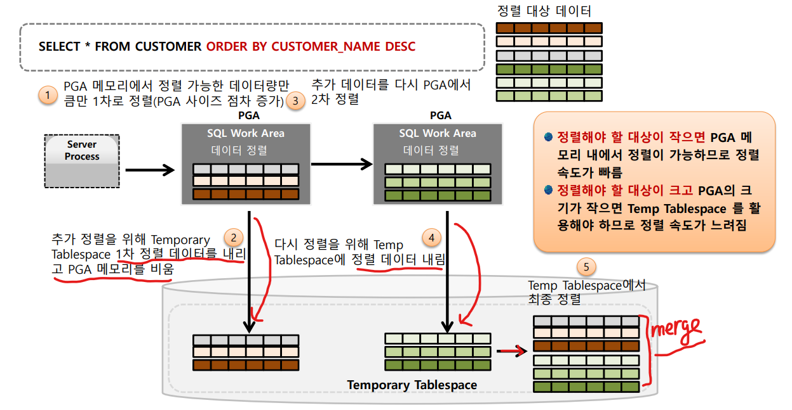

# 04_PGA


## 1. PGA (Program Global Area) 개요


**PGA를 사용되는 경우**

- 보통 정렬이나 Hasing 할 때 Disk I/O를 줄이기 위해 사용된다.
  - SQL의 Order by, Group by와 같이 정렬이 필요할 경우 Disk  I/O를 감소
    - 정렬을 하는 것 등은 사실 Hit Ratio가 높지도 않고 특정 SQL에 전용으로 사용되는 경우가 많다. 또한 재활용하기에도 힘들기 때문에 SGA와 같이 공유메모리를 사용하지 않고 개별 메모리를 사용하게 끔 진행한다.
  - 해쉬 조인 시 Disk I/O 감소
  - 거의 모든 정렬 및 Hashing 작업이 메모리에서 수행될 수 있도록 PGA 사이징의 적정 조절 필요
    - ex_ 굉장히 큰 테이블이 존재할시 이것을 정렬시키기에는 메모리를 거의 다 쓰게 될 것이다. 따라서 큰 테이블을 정렬할 시 tamparary tablespace를 이용해서 interface를 이용해서 진행 된다.

**Private SQL Area**

- Cursor & Data Fetch
- SQL 바인드 변수가 이쪽에 오게 된다.


### PGA를 활용한 SQL 정렬 메커니즘



- **정렬해야 할 대상이 작을 경우**
  - PGA에서 정렬을 완료시킨다.
  - 위와 같은 정렬을 Optimal Sorting이라 한다.

- **정렬해야할 대상이 클 경우**
  1. PGA에서 정렬 가능한 데이터만 정렬 진행
  2. Tamporary Tablespace에 1차 정렬 데이터를 내리고 PGA를 비운다.
  3. PGA 사이즈를 점차 늘리게 된다. (오라클 내부 알고리즘)
  4. 추가 데이터를 다시 PGA에서 2차 정렬
  5. Tamporary Tablespace에 2차 정렬 데이터 ==> 반복
  6. Temp Tablespace에서 최종으로 merge를 하여 정렬을 진행한다.
     - 즉! Temp Tablespace를 활용해야하므로 **정렬 속도가 느려진다.**


## PGA 할당 정책 및 파라미터 설정

### PGA 메모리 할당 방법

- **과거**

  - DBA가 Workload를 감안하여 PGA의 개별 메모리 구성요소를 직접 설정

  - 이렇게 초기 설정을 하면 나중에 변경이 너무 힘듦

    - 다양한 SQL/업무 유형에 따라 최적화된 PGA개별 메모리 구성 요소를 설정하는 것이 매우 어려움

    - ```sql
      SORT_AREA_SIZE = 10M
      SORT_AREA_RETAINED_SIZE = 5M
      HASH_AREA_SIZE = 10M
      ```

- 현재

  - ```SQL
    WORKAREA_SIZE_POLICY = AUTO -- 사이즈를 정하는 정책을 자동으로 하겠다는 뜻
    WORKAREA_SIZE_POLICY = MANUAL -- 다시 원래 쓰던걸로 돌아가겠다
    
    
    -- 전체 DB에 있는 INSTANCE에서 동적으로 각각 OLTP를 설정해준다.
    -- 4G 이상도 갈 수 있다. 4G를 감안해서 Server Process에 메모리를 할당하겠다는 것이지 4G까지로 맞춘다는 것이 아니다.
     PGA_AGGREATE_TARGET = 4G
     
     
     
    ```


### PGA 할당 정책 및 크기 설정을 위한 파라미터


- batch program 사용시 tamparary I/O를 줄이기 위해서 POLICY를 MANUAL로 바꾸는게 아닌 이상 AUTO를 사용하는 것을 권장


