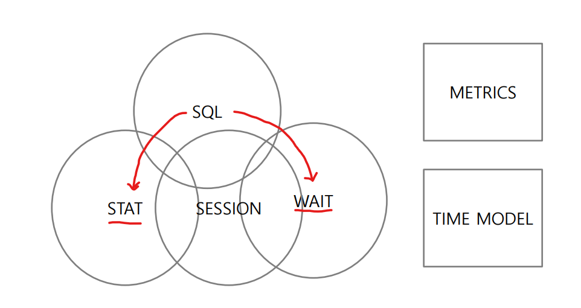
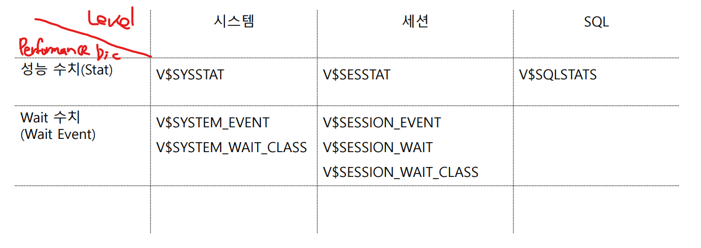
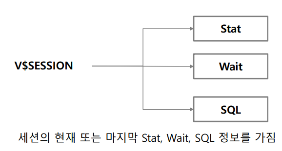
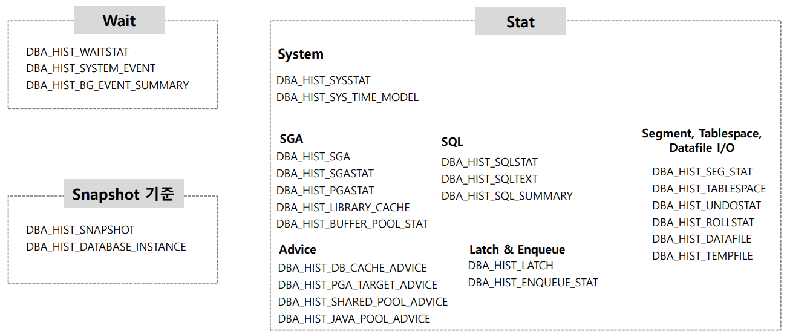

# 04_DataDictionary

> 대부분의 데이터 사전 정보는 Dictionary cache(SGA > Shared Pool)에 유지된다. DBMS가 동작하는 동안 사용자 접근을 검증하고, 스키마 객체의 상태를 입증하기 위해 수시로 접근해야하기 때문이다. 모든 정보는 LRU(Least Recently Used) 알고리즘에 의해서 메모리 내에 저장된다. 분석된 정보는 일반적으로 캐시 안에 유지된다. 테이블과 테이블의 컬럼을 설명하는 ‘COMMENTS’ 컬럼은 자주 접근하지 않는 한 캐시에 저장되지 않는다.
>
> https://sshplendid.github.io/blog/dev/oracle/2015/12/28/oracle-data-dictionary/


## 1. DB 성능 분석을 위한 주요 구성요소 및 분석 방법론



- USER + SERVER PROCESSOR => SESSION이라고 한다.
  - SESSION에서 많은 SQL이 생긴다.
  - SESSION이 DB에 일을 시키는 주체가 되게 된다.

- 이 6개가 성능 모델 주요 구성 요소라고 한다.


### 일반적인 성능 분석 프로세스


- SYSTEM 레벨에서 먼저 모니터링 확인
- SESSION 레벨에서 어디가 문제인지 확인이 필요
- SQL 레벌에서 원인 및 문제점을 찾는 것이 필요


## 2. Data Dictionary의 이해



- 성능분석 대부분이 이 테이블을 기반으로 출발한다.

```sql
SELECT * FROM V$SYSSTAT;
SELECT * FROM V$SUSTEM_EVENT; -- STAT과 마찬가지로 NAME이 고유하다. 즉 하나만 존재

SELECT WAIT_CALSS, SUM(TOTAL_WAITS) TOTAL_WAITS 
FROM V$SYSTEM_EVENT 
GROUP BY WAIT_CLASS -- CLASS와 TOTAL WIAT를 뽑을 수 있음


```


```SQL
-- V$SQL을 사용하기도 하는데 이걸 모니터링에도 사용하고 너무 많이 써서 SQLSTATS라는 것을 만들었다.
SELECT * FROM V$SQLSTATS; -- SQL에 대한 상세한 정보가 들어있다.


```


## 시스템 Wait

```sql
-- 값은 최종값이다. 
-- 값은 계속 변할 수 있다.
-- 과거 이력을 알 수 없다 
select * from v$sysstat;


-- 최근
-- 누적 현재
V$SYSTEM_EVENT
V$SYSTEM_WAIT_CALSS

-- DELTA 현재
V$EVENTMETRIC -- 1분 단위로 기간 정보가 나오게 된다./ 그렇게 많이 사용 안함
V$WAITCLASSMETRIC

-- DELTA 최근
V$WAITCLASSMETRIC_HISTORY -- 더 과거를 보고 싶을 때

```


### 주요 STAT 메트릭


- Pysical Read : 초당 몇 block읽는지/ 한번 트랜잭션 할때 read어떻게 하냐 
- 

```sql
-- 누적 현재
V$SYSSTAT

-- DELTA 현재 / 1분동안 값
V$SYSMETRIC

-- DELTA 최근 / 
V$SYSMETRIC_HISTORY
V$SYSMETRIC_SUMMARY

```


## Session 관련 주요 Perfomance Dictionary

- V$SESSION_WIAT
  - 세션의 현재 또는 마지막 Wait Event정보
- V$SESSION_EVENT
  - 세션의 과거부터 현재까지의 모든 Wait Event 정보
- V$SESSTAT
  - 세션의 Stat 수치를 누적 현재 값으로 표현



- **세션의 현재 또는 마지막 Stat, Wait, SQL 정보를 가진다.**
  - 즉 마지막 값만 가지고 있음
- 얼마나 wait시간이 되었는지 등등

```sql

-- STAT => 누적값
-- stat은 number 값만 가지고 있어서 조인해줘야한다.
SELECT A.*, B.NAME
FROM V$SESSTAT A, V$STATNAME B
WHERE A.STATISTIC# = B.STATISTIC#

```


### V$SESSIOS과 V$ACTIVE_SESSION_HISTORY

- V$SESSION : 접속 세션의 현재 정보만 나타냄
- V$ACTIVE_SESSION_HISTORY
  - 세션의 30분 동안의 정보를 나타냄
  - 수집단위가 1초이다. => 수집이 안될 수 있음
  - 따라서 모니터링 TOOL을 V$SESSION을 계속 본다.


## V$SQL, V$SQLSTATS

- **V$SQL**

  - 한번 수행된 SQL에 대한 광범위한 정보를 가지고 있음.

  - SQL Parsing, Opimizer에 대한 정보뿐만 아니라 수행 횟수, 수행 모듈, I/O 및 메모리 사용량 등의 다양한 성능 지표 등 SQL에 대한 거의 대부분의 데이터를 수집

    

- **V$SQLSTATS**

  - V$SQL 보다 성능 지표 측면에서 보다 편리한 정보를 제공
  - 모니터링 툴에서 V$SQL을 많이 조회함에 따라서 이에 따른 영향도를 줄이기 위해 편리하게 SQL 성능 지표를 제공하기 위해서 만들어짐.


## DBA_HIST_XXX



- Repository 형태의 값들
- create snapshot이라는 걸 쳐서 새로 찍는다
