# 06_Wait_Event

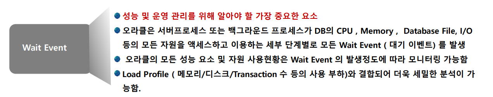


### Idle Wait Event & Non Idle Wait Event

- Wait Event
  - **Idle Wait Event**
    - Timer, Message Sending, Client data waiting 등 리소스를 사용하지 않거나 클라이언트로 부터 답변을 기다려야하는 등의 Wait Event
    - DB 성능에 큰 영향을 미치지 않는 Wait Event 
      - 하지만 application 영향이 없는 것은 아니다.
  - **Non Idle Wait Event**
    - DB 내에서 Active Work 처리 과정 중에 발생하는 Wait Event
    - DB Time에 포함되어 중점적인 성능 모니터리인 요소인 wait event


### DB Time

- 정의	
  - DB Time은 User Process가 실제 일을 하면서 또는 DB에서 **waiting 되면서 사용된 총 시간**을 뜻한다.
    - Foreground 세션이 **DB call을 하여 자원을 사용한 총 시간**
    - CPU 시간, I/O 시간, Non Idle Wait Event시간 등으로 구성
      - ex_ parsing, excute, fetch 등
  - SQL을 처리하는데 있어서 어떤 자원을 사용했는지 등을 통하여 DB Time을 산출하게 된다.
  - **DB Time = CPU Time + Non Idle Wait Time** + Idle wait time
- 

- CPU Time보다 Non Idle Wait Time이 많으면?
  - CPU를 사용하는건 당연하다
  - 하지만 CPU가 다른 요소들 (Non Idle wait 등 )답을 가져오기는데 있어서 wait time이 크게 되면 비효율적으로 자원을 쓰고 있다고 할 수 있다.
  - 즉 Resource를 많이 사용하냐 안하냐는 wait time이 크냐 안크냐로 정의할 수 있음

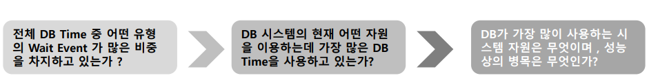


### Wait Event Class

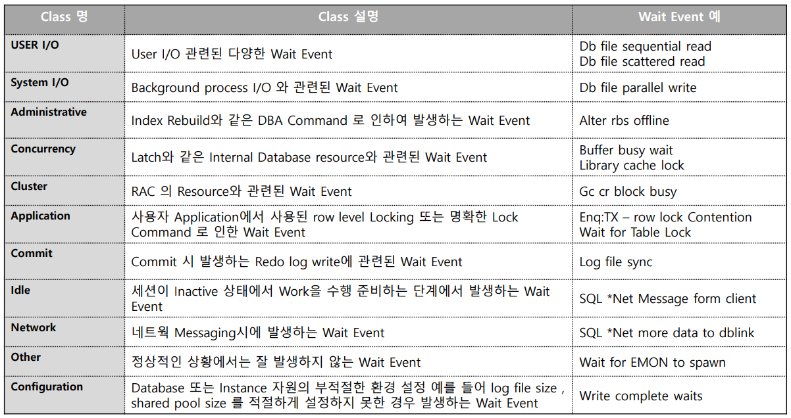

- USER I/O
  - storage i/o를 Access할 때 나오는 I/O
- System I/O
  - back ground
- Concurrency
  - shared memory에 block을 Access할 때 Lock을 걸어주는 Latch같은 것
- Commit
  - load buffer가 Redo Log File에 write할때 발생하는 Wait/ redo와 관련되어있음


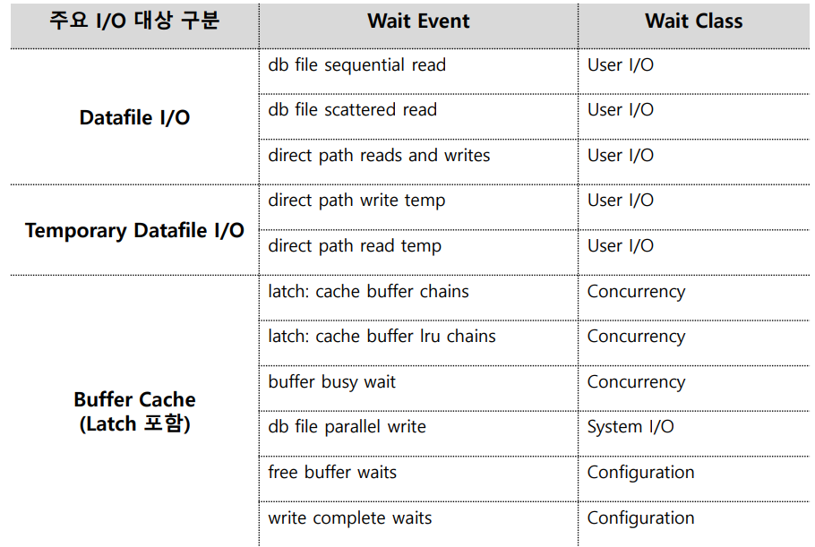

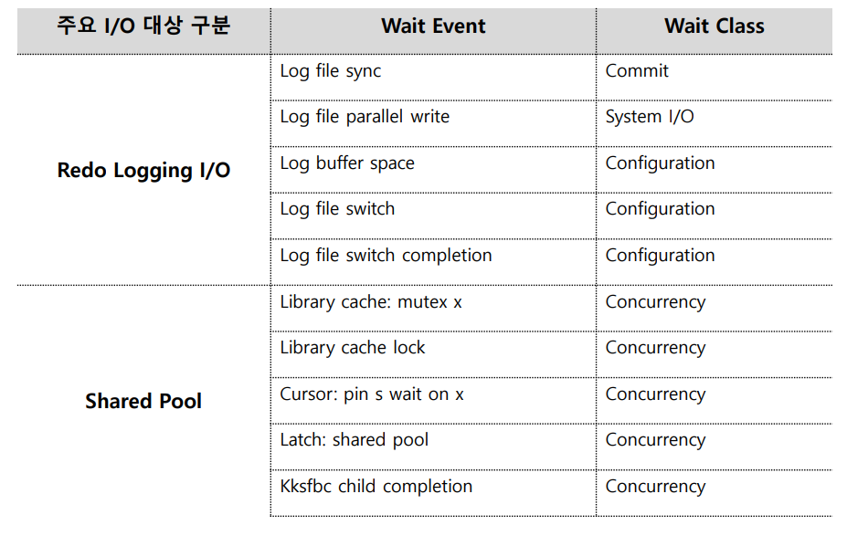


## DB file sequential read와 DB file scattered read의 이해

- **DB file sequential read **=> 이름 때문에 헷갈릴 수 있지만 Random I/O때이다

  - Single block **Storage I/O** (random I/O)를 수행할 때 발생

    - buffer에서 읽는거는 storage i/o가 아니다

  - version up이 되면서 자주 발생하지는 않음

  - 주로 Index를 경유하여 table을 Random Access할 때 발생하며 많은 Wait time 소모 많은 Wait Time 소모
     (Index unique/range scan, Table random  I/O Access 형태)

  - 대량 발생 시 OLTP 시스템에서 성능을 저하시키는 주 원인

    - 명확하게 Random I/O가 접근하면 좋지만 Range부분에서 그렇지 않은 부분이 있을 수 있다 => Event 발생

  - CPU는 보통 buffer에 있는 값을 가져오게 된다. 하지만 이거 대비 DB file sequential read가 훨씬더 많다면 Random I/O가 많이 일어나고 있고 이러한 환경이 계속 일어나면 시스템에 큰  영향을 끼칠 수 있다.

    

- **DB file scattered read** => 

  - Multi block Storage I/O (Full Scan)을 할 때 발생하게 된다.
  - DB_FILE_MULTIBLOCK_READ_COUNT 값의 설정에 따라 block을 읽는 수가 달라지게 된다. => 한번 Access


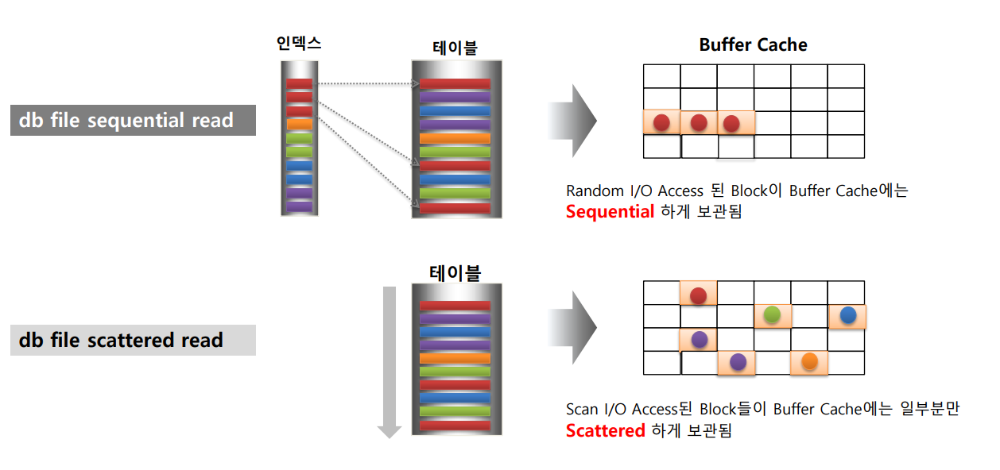

- db file sequential read
  - buffer cache에 올라갈 때 Sequential하게 보관된다.

- DB file scattered read
  - scan한 것을 buffer에 모두 올리지 않고 일부분 만 올리게 된다.
  - 흩어지게 끔 버퍼에 올라가 있다.
  - 이유 : 
    - Sequential하게 올라가게되면 Sequential함을 지켜야하기 때문에 저장되어 있는 애들을 쫒아내 버릴 수 있다.
    - 따라서 흩어지게 하여 메모리를 더욱 효율적으로 사용할 수 있다.


### Full Scan시 Buffer Cache 활용 메커니즘

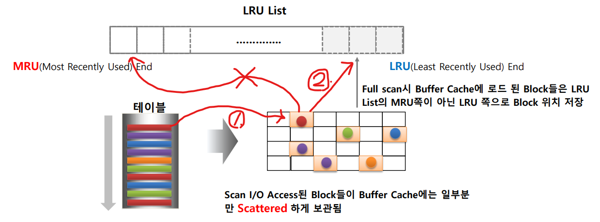

- Full Scan 후 일부 데이터만 Buffer에 올라가게 된다.

- 그리고 보통은 List의 앞부분으로 가서 Aging out이 되는데 Full Scan을 할 경우에는 뒷쪽으로 가서 Aging out이 빨리되게 된다

- **일부 데이터 buffer +  우선순위 낮은 상태 LRU List 진입**

  - 11g 부터는 비교적 작은 테이블 만 db file scattered read 발생

  - 일정 용량 이상 테이블 => **direct path read**

    - 즉 Buffer cache에 load 하지 않는다.

      

- 대량의 데이터가 Buffer Cache에 Load 되면서 기존의 pinned 된 Block 들이 Buffer Cache에서 Out을 최대한 억제하는 방향으로 관리되게 되었다.

```sql
alter system flush buffer cache; -- buffer cache 비우기

-- index =>> sequential read wait time이 늘어나게 된다.
select * from table where customid = 1000; 
```


### DB file sequential read와 DB file scattered read 개선 방안

- DB file sequential read

  - Random I/O 를 많이 소모하는 SQL 튜닝 
    (Physical I/O 뿐만 아니라 Buffer Cache를 많이 소모하는 SQL)

    - AWR : SQL ordered by Reads (Physical I/O) SQL ordered by gets (Buffer Cache)
      둘다 튜닝을 시켜줘야한다.

  - Random I/O 성능이 더 뛰어난 스토리지 기술 적용 (Strippin, SSD를 포함한 스토리지 고려)

  - Buffer Cache Size 늘리기? => V$DB_CACHE_ADVICE 에서 증가 효과가 검증된 경우
    ==> 보통은 효과가 없으나 CAHCE사이즈가 너무 낮을 경우 가능

  - **CPU 대비 발생 비율**, 

    - cpu 가 40%인데  sequential  read도 40%이다 라고 한다면 
      => OS에서 CPU usage를 얼만큼 쓰고 있는냐를 봐야한다.
      OD CPU usage가 10% 밖에 안되는데 sequential  read도 40% 이면 얘 때문에 딱히 호들갑 떨 필요 없음
    - OS가 cpu usage를 60~70%인데 cpu 20% 사용  sequential  read 50%?
      ==> 이러면 잡아줘야한다.

  - **1회 발생시 Wait time 에 주목할 것**

    - 보통은 3mm/s 를 용인할 수 있는 정도로 본다.

      

- DB file scattered read 

  - 쿼리 튜닝
  - Throughput이 뛰어난 스토리지 기술 적용
  - DB_FILE_NULTIBLOCK_READ_COUNT를 늘리는 것은 큰 도움이 되지 않음
    - 늘린다고 바로 적용이 되지 않는다.
    - 내부적으로 판단한 후로 진행
  - Hidden parameter인 _small_table_threshold, _serial_direct_read 에 따라 direct I/O 결정한다.
    - _small_table_threshold의 단위 K
      - 만약 20MB이면 20MB 이상 Table부터 direct I/O진행
    - _serial_direct_read 
      - enable direct read in serial => auto => _small_table_threshold 결정?


## direct path read와 direct path write의 이해

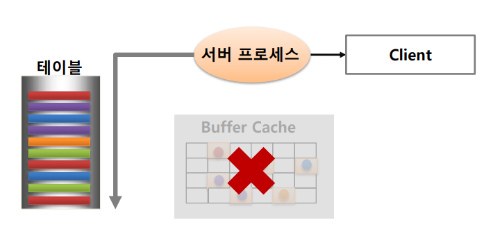

- 서버 프로세스가 Buffer Cache를 거치지 않고 바로 Storage에 direct read, write I/O를 수행
  - 대량의 데이터를 가지고 올때는 Buffer를 거치지 않고 Access하는 Direct I/O가 더 효율적이다. 왜냐하면 대량의 데이터를 Buffer에 넣게 되면 기존에 있던 Data들이 다 방을 빼야하기 때문

- direc path read

  - 일정 크기 이상의 테이블을 Full Scan 할 때

  - Create table As select 구문 실행 시 (select 시)

  - Parallel Query를 이용하여 Full Scan 할때

    

- direc path write

  - Insert /*+ append\*/ direct I/O
  - Create table As Select 구문시 (Create 할때)
  - Parallel DML


## direct path read temp와 direct path write temp

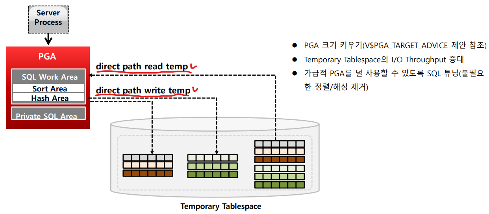

- 서버 프로세스가 정렬 또는 해싱 작업 등으로 PGA를 활용할 때 메모리가 부족할 경우 Temporary Tablespace에 read/write를 수행하면서 발생하는 Wait Event
  - **개선 방안**
    - **PGA 크기 키우기** => V$PGA_TARGET_ADVICE 제안 참조 
      - PGA_AGGREGATE_TARGET을 유연성 있게 적용하면 된다.
      - 하지만 절대적인 솔루션은 아니게 된다.
    - Temporary Tablespace의 I/O Throughput 증대 ==> SSD로 교체
    - 가급적 PGA를 덜 사용할 수 있도록 SQL 튜닝 ==> 정렬/ 해싱 제거


## Latch, Enqueue, Mutex의 이해


### Oracle Latch와 Lock(Enqueue)의 개요

- 모두 Lock 개념
- DBMS에서 Lock은 update를 진행할 때 Record에 

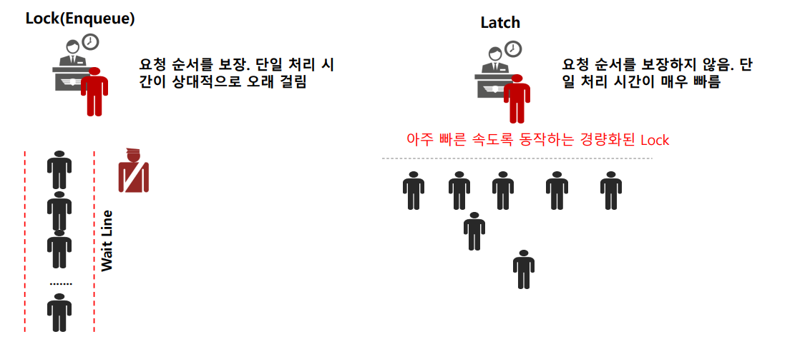

- **Lock (Enqueue)**

  - 요청한 순서를 보장

  - 즉 줄을 세우고 그것을 관리하는 관리자를 세워 순서를 보장하게끔 하는 매커니즘

  - 하지만 굉장히 느리게 된다. CPU입장에선 답답함

    

- **Latch**

  - 요청 순서와 상관없이 먼저 온 순서대로 바로 일을 처리하도록 진행

  - 요청 순서는 보장 안됨

  - 일 처리 시간이 매우 빠르게 된다.

    

- 즉 시스템 마다 관리하는 방법이 다를 수 있음


### Latch, Enqueue, Mutex 비교

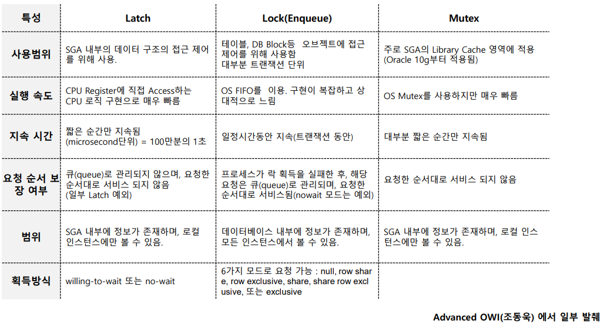

- Latch

  - Mutex와 비슷한 구조를 가지고 있다.

    - 즉 OS의 Mutax를 참고하여 Oracle Kernal에 구현했음

  - **SGA 내부의 데이터 구조**의 접근 제어를 위해 사용한다.

    - SGA에서는 굉장히 많은 사용자에 대한 요청을 처리해야한다.

  - CPU Register에 직접 Access하는 CPU로직 구현 ==> 매우 빠름

  - 순서를 보장하지는 않으나 일부 Latch는 순서를 보장함

  - RAC일 경우에 SGA내부에 정보가 존재하기 때문에 로컬 인스턴스에서만 볼 수 있다.

  - (Latch경우 => exclusive하다)

  - 2가지 모드

    - willing-to-wait : 요청 실패시 다시 요청 하는 것
    - no-wait : 요청 실패시 그냥 다른 애 찾는 것

    

- Lock(Enqueue)

  - 테이블, DB Block등 Object에 접근제어를 위해 사용 => 트랜잭션 단위 
  - OS FIFO => 느림
  - 락 획득 실패 => 요청은 큐로 관리, 순서대로 서비스 된다.
    (nowait 모드 예외)
  - 6가지 모드로 요청 가능 (row level로 갈 것인지 등)
    - null
    - row share
    - row exclusive 
    - share : 여러 Process가 접근이 가능한 경우 (보통 Read일 경우)
    - share row exlusive
    - exlusive : 다른 Process가 잡았으면 다른 Process는 기다려야함 


## Cache buffer chains와 cache buffer lru chains이해 및 개선 방안

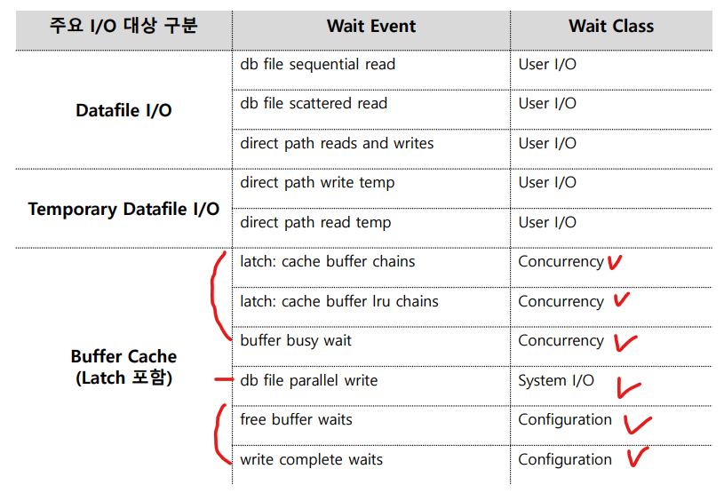

- Concurrency 때문에 발생한다.
  - 자주 Access하는 Hot Block때문에 wait event가 발생한다.


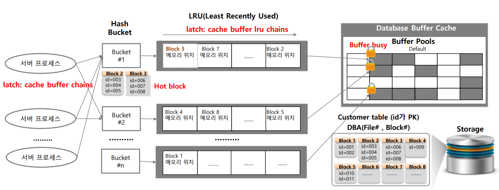

- **Buffer Cache에 특정 Block을 찾는데 비용이 많이 발생하게 된다.**
- latch : cache buffer chains
  - 특정 서버 프로세스가 Block을 Access하기 위해선 Bucket을 잡아야한다.
  - 이때 발생하는 latch가 latch : cache buffer chains 이다.

- latch : cache buffer lru chains
  - LRU에서 data를 찾을 때도 latch를 잡아야한다. (scan할때)
  - 이때 발생하는 latch가 latch : cache buffer lru chains이다.

- Hot Block
  - 많은 Server Process가 동일한 Data를 요구함
  - 이로 인해 똑같은 Hash Bucket과 LRU의 Latch의 Latch를 획득하기 위해 Server Process가 경합이 일어남 ==> **Hot Block**
  - 주로 대량 범위를 Access하는 악성 SQL들이 빈번하게 Cache Buffer를 사용하면서 발생하는 Wait Event이다. 

**HOT block 예시**

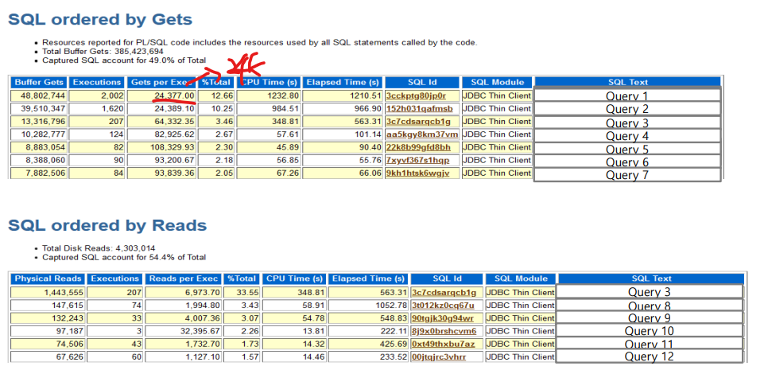

- 한번 Access하는데 24k Block을  Access진행 = 24k
- DB buffer block = 8k
  - 24k * 8k => 200M정도 된다.
  - access횟수도 많음

- **조치**
  - 대량 범위의 I/O를 빈번하게 수행하는 SQL을 튜닝해야한다.
  - Block 내부의 데이터를 hot block을 회피 할 수 있도록 재정렬해야한다.
    - Partitioning 사용


### Hash Partition을 통한 Hot block 개선

> https://zzanggoo.tistory.com/70

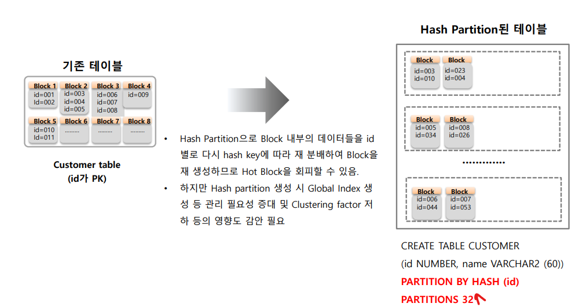

- Partitioning key 값에 hash 함수를 적용하여 data를 분할하는 방식
- 성능 향사의 목적으로 나온 개념이다.
  - 특정 범ㅇ위에 분포도가 몰려서 각기 size가 다르게 되는 것을 보완하며, 일정 분포를 가지 파티션을 나누고 균등한 데이터 분포도를 이용한 병렬처리로 퍼포먼스를 향상 시킬 수 있음
- 파티션 수를 2의 제곱근으로 설정해야한다.
  - 보통 32 이상부터 성능향상이 이루어졌다. (경험)
- null 값은 첫번째 파티션에 위치한다.
- 보통은 SQL 튜닝으로 해결하지만 해결이 안될 경우 이 lv까지 내려와야한다.


## Buffer Busy Waits 이해 및 개선 방안

### Buffer Busy Waits란

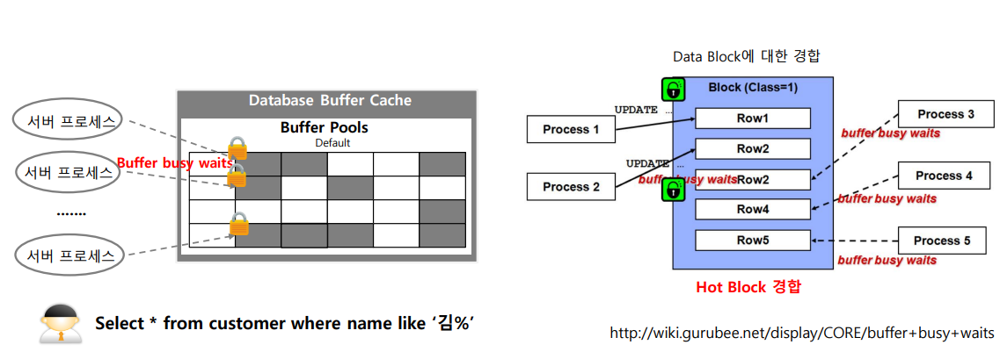

- 서버 프로세스가 Buffer cache내 block을 Access하기 위해선 해당 Block에 대한  Lock을 획득해야한다.
- 동시에 **여러 서버 프로세스들이 동일한 buffer block에 Access 할 경우** 경합이 발생하게 된다.
  - 즉 전반적으로 **Hot Block에 대한 것**

- Row Level Lock

  - 오라클에 경우 Row 락과 Block락을 둘다하게 되는데, Row => TS를 걸게된다.

  - 잡고 있는 Lock에 대한 무게가 크다.

  - Row를 Update하거나 할 때 거는 Lock이다. 

    

- Block Level Lock 

  - Block 단위 Lock은 가벼운 Lock이다.
  - Select를 진행할 때 또한 Lock을 획득해야한다.
  - Block Lv 에 Lock을 획득한 뒤에 Row Lv Lock인 TS를 걸어야한다.
  - 해당 메모리에 접근하기 위한 Lock, 공유 메모리이기 때문

- Hot Block 예시 1)
  - select * from customer where name like '김%'
  - 위와 같은 Query는 김씨가 많고(범위가 넓음), 자주 호출된다?
    - Hot Block이 될 가능성 높음 

- Hot Block 예시 2)
  - 범위가 좁은데 인덱스를 scan할떄 나타날 때가 종종 있음
  - 리프 블럭을 scan할때 특정 leaf block만 access할 경우가 있을 수 있다.
  - 왜냐하면 PK를 보통 sequence 같이 순차적으로 늘리는 경우가 많음
    - 한쪽 leaf block만 쪼개져서 확장되는 경우가 생길 수 있음
    - 이로 인해서 한쪽 leaf node들의 block에 값만 계속 차는 경우가 생길 수 있음
    - 그럼 그쪽으로만 Access를 하게 되어서 Hot Block이 발생할 수 있음


### Buffer Busy Wiats 해결 방안

1. **대량 범위의 I/O를 수행하는 SQL 튜닝** [가장 중요!!]
2. **Hash Partition**등으로 Block 내부의 데이터를 hot block을 회피 할 수 있도록 재 정렬
   - Hash Partition을 할 순 있지만 영향도 check하는 것이 굉장히 힘든 일이 될 수 있다.
3. **Reverse Index**는 Index Block의 Buffer Waits 자체는 해결할 수 있지만 rance scan등이 기존과 다른 결과를 초래하므로 **적용금지**
   - range scan 없이  무조건 = 로 index를 탄다면 고려해볼 순 있으나 그런 경우가 거의 없음
   - index의 key값이 1234였으면 4321로 바꾸는 것
   - 분산이 되었으나 range sacn할때 그냥 full scan으로 들어간다 => 부하가 많이 들어감
   - equal 조건밖에 안됨


## Free buffer wait, DB file parallel write, write complete waits이해 및 개선 방안

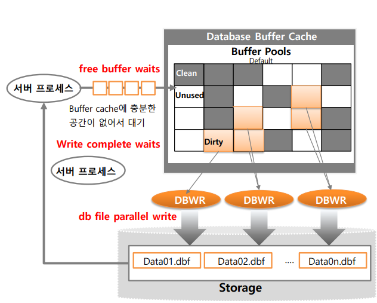

- **Free buffer waits**
  - Free Buffer가 부족하여 DBWR에게 Dirty Buffer를 디스크에 Wirte하여 비워 줄 것을 요청하면서 대기하는 Wait
  - Free buffer가 나올때까지 기다리는 것
    - Free buffer : 사용하지 않거나 사용이 가능한 상태 
    - Buffer에 올려야 하는데 여유공간이 없는 상태라고 볼 수 있음
  - Dirty Buffer에 경우 다시 DBWR로 인해서 DB에 Write해줘야 Free Buffer로써 사용할 수 있음
  - **발생 원인**
    - Free Buffer Wait보통 Dirty buffer가 많아서 발생한다기 보다는 대량 범위를 Access하는 악성 SQL에 의해서 발생한다. 
      ==> 한번에 너무 많은 공간을 차지하기 때문에 발생하게 된다.
    - 이런 것들이 자주 호출되게 된다.
- **db file parallel write**
  - DBWR이 Dirty block을 Storage의 데이터 파일에 Write 수행 시 대기하는 Wait
  - parallell Query랑은 아무상관없음
- **write complete waits**
  - DBWR이 write하고 있는 버퍼 블록을 서버 프로세스가 읽기 위해서 대기하는 Wait
  - 지금 write 중이니 complete할 때까지 기다리라는 


### 발생 원인 및 개선 방안

1. 대량 범위를 Access하는 악성 SQL
   - **SQL 튜닝** 및 **Direct I/O**로 유도 가능한지 검토 
     - 시간보다 **최소 block을 사용하도록 튜닝하는 것을 목표로 해야함**
   - OLTP program 튜닝
     - index 튜닝 60~70%
     - sql 튜닝 나머지정도 된다.
2. 느린 Storage I/O Write 성능
   - **db file parallel write의 wait 시간** 검토 후 Storage 성능 점검
     - 약 10~20ms 정도된다면 storage 성능을 고려해봐야한다.
   - DBWR 숫자 증가 
     (보통 Storage I/O가 Async I/O 지원되면 한 개로도 충분
       db_wireter_process = CPU/8 권장)
3. DBWR이 많은 잡업량
   - checkpoint가 많이 발생하는지 확인
     - FAST_START_MTTR_TARGET이 지나치게 작을 경우 발생 가능하다.
     - 복구시간을 얼마나 빠르게 Recovery할 것이냐에 대한 parameter
     - 즉 복구 시간을 빠르게하기 위해서 자주 저장을 해주는 느낌이다.
     - 따라서 check point가 매우 자주 일어나게 된다.
4. Wirte complete wait, db fiile parallel write가 일반적으로 나타난다면 보통은 Storage I/O성능 이슈


## Log File Sync와 Log File Parallel Wirte 이해 및 개선 방안

log file sync는 DML을 사용한다면 친근하게 만나는 wait event이다.

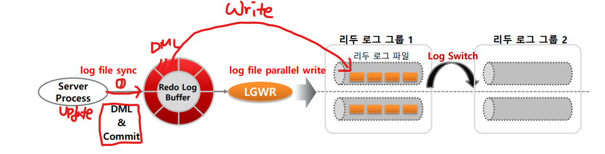

- **Log File Sync**

  - Server Process가 DML 수행 후 Commit을 하는 순간에 log file sync라는 wait event를 발생하면서 대기한다.

    - 즉 LGWR에게 Write 요청 후 기다리는 것

  - 주로 매우 빈번한 commit이 발생하거나 redo log file의 I/O 시스템 성능이 좋지 않을 떄 발생

    - RAID5일때 많이 발생
    - DML이 많은 것과 commit이 자주 발생하는 것은 다르다.

    

- **Log File Parallel Write**

  - LGWR도 log file parallel write라는 wait event를 발생하고  OS에게 write 요청 후 대기
  - sync와 마찬가지 이유로 주로 발생한다.


### 발생 원인 및 개선 방안

1. 너무 빈번한 Commit으로 발생. Commit의 단위를 줄여야한다.

   - 너무 상세하게 업무적으로 분리된 Transaction별로 Commit을 수행한다면 이들을 통합하여 하나의 Tansaction으로 통합 

     - 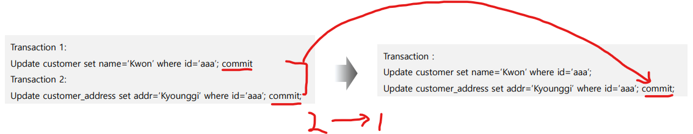

     - 트랜잭션 설계가 잘못된 경우이므로 수정해준다.

     - 하지만 동시접속자 수가 많고, 개별 commit을 날린다고 해서 일어나는 경우는 많지 않음

       

   - **PL/SQL For loop** 내에서 **1건당 Commit**을 할 때 발생

     - 여러 건을 한번에 Commit하는 것으로 수정

     - ```sql
       Cursor c1 IS
       select id
       	, name 
       from customer;
       
       Begin
       	For cus_rec in c1;
       	Loop
       		update customer_address set addr = `  ` where id = cur_rec.id;
       		commit_interval := commit_interval + 1;
       		
       		-- commit을 100번당 한번씩 하도록 짠다 / N번당 한번
       		if MOD(commit_interval,100) = 0 then commit; 
       		end if
       	END Loop
       ```

     - Arrary Proccessing을 통하여 진행하도록한다.


2. system이 RAID 5 일경우 I/O Write 성능 이슈가 발생한다.

   - system이 RAID 5일 경우 DML이 많은 시스템일 경우 log file sync가 빈번하게 발생한다.

   - 따라서 RAID 1+0 구성 권고

   - Storage DR을 Sync 레벨로 구성한 경우 DR시스템의 거길에 따라 lof file sync가 빈번하게 발생하여 성능 영향을 끼칠 수 있음

     - sync 모드 : commit이 되면 DR에서도 commit이 되고 현 시스템이 ACK까지 받아야 1 commit이 된다.
       - 즉 sync모드로 시스템을 구성할 경우 **150~200km 정도 거리제약**이 있다.
       - **async를 고려해야한다.**

   - **리두 버퍼 크기가 너무 클 경우** 기록해야할 데이터가 늘어나 log file sync 대기시간 증가 가능

     - 즉 한번에 저장해야할 것들이 많기 때문에

       - 막 1G까지 늘어남? => 다른 문제들이 생기게 됨 / IO양이 못따라감

       - **100M 이상 잡는건 아니라고 생각함** => 이것도 크게 잡은 것

       - 40~100M 사이

         

## Log buffer sapce, log file switch completion, log file switch의 이해

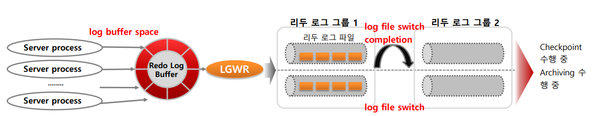

### Log buffer space

- 정의

  - Redo Log Buffer 파일에 들어가기 위해서 기달리는 event

- 원인

  - Redo Log Buffer는 1/3이 차면 LGWR을 이용하여 Storage에 저장을 하게 된다.

  - 하지만 

    1. Redo Log Buffer가 극도로 작을 경우
    2. DML이 굉장히 많을 경우

    - 빠르게 Redo Log Buffer를 점유하는 상황이 발생하여 wait 발생

  - 따라서 LGWR을 빠르게 만들어 줘야한다.

- 해결

  - Redo Log Buffer를 최소 10M이상 증가시킨다. (크기가 너무 작을 경우 )
  - I/O성능을 높여준다.
  - redo Log를 최대한 쓰지 않는 방향으로 진행한다.
    - **insert /*+append\*/  from table**
      - 하지만 이걸 써도 redo log file이 남는다. 요즘은 드라마틱하게 줄어들진 않음
    - **Table을 Nologging으로 바꾸는 방법**
      - 이렇게 되면 table복구를 할 수 없다. 따라서 이런식으로 batch를 치지 않음
      - 따라서 보통 batch성 table들을 Nologging을 사용한다.
      - batch성 table : 테이블 조합해서 만들어 낼 수 있는 table들
      - 중요한 Table일 경우 Nologging을 사용하지 않는 것이 맞음

### log file switch completion

- 정의
  - Redo Log File Group이 다 차게 되면 다른 Group으로 switch를 하게 된다.
  - 하지만 너무 다른 그룹들이 너무 빨리차서 다음 Group이 아직 DB 파일에 Check Point를 진행하고 있는 경우 또는 Archive를 수행하고 있는 경우에 wait로 오래기다리게 되는 경우 발생하게 된다.
- 해결
  - Log file switch completion/ log file switch의 경우 redo log file크기를 증가시킨다.


## Library cache 상세 구조

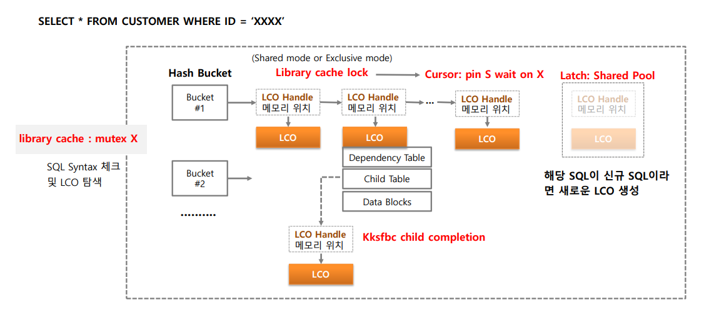


- Library Cache자체는 각각의 LCO를 획득해야한다.

  - SQL을 가지고 SQL과 관련된 LCO를 찾아야한다.

  - 그래서 여러 정보들을 찾아서 작업을 진행한다.

    

- col에 대한 Index를 Rebuild하거나 drop하거나 Index 추가하는 등 작업을 진행

  - 그럼 LCO가 변경이 된다.
  - ALTER TABLE DROP / ALTER INDEX와 같은 DDL이 수행되면 LCO에 대한 변경이 반영되어야한다.
  - 따라서 Library Cache내의 해당 **LCO들에 대한 Latch/Lock이 수행되어야한다.**

- LCO (Library Cache Object)
  - SQL을 수행하기 위한 여러 오브젝트에 대한 정보 보유
  - SQL, Package, Procedure, 테이블, 인덱스 등
    - SQL에서 참조하는 Obejct들의 구성
    - 참조 권한
    - SQL 및 실행 계획 관련 메모리 영역 포인터
  - 오래되거나 Invalidate된 SQL은 Aging out을 적용

- Dependency Table
  - SQL이 참조하는 Table
    - View, Procedure, Trigger

- Child Table
  - 밑에 설명

- Data Block
  - SQL 및 실행계획 관련한 메모리 영역 포인터
    - 파스 트리(parse tree)가 만들어진다
    - index 무엇을 타는지 등


### SQL 다중 버전 관리

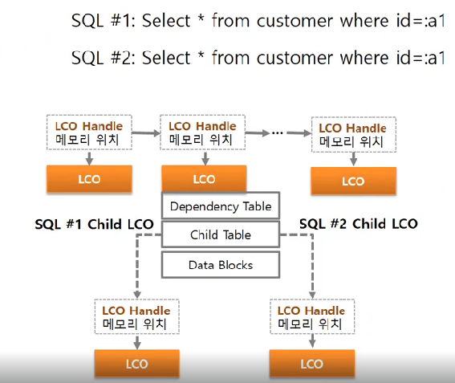

- 호출하는 스키마가 다름
  - 스키마 명 : TOM
  - 스키마 명 : BRAD
    - 즉 유저가 다른데 Table이 똑같은 경우가 있음
      - 믹싱, 극판, 화성의 유저가 각각있는데 Table이름은 같지만 데이터가 다름
      - SQL자체가 똑같음
    - 이러한 경우 때문에 다중 버전을 관리해야한다.
  - 위 같은 경우
    - 1개의 Parent LCO
    - 2개의 Child LCO를 가지고 있음

- Parent LCO
  - SQL 자체만 가지고 있음
- Child LCO 
  - 모든 LCO에 관한 정보를 모두 가지고 있음


- Latch 보다 Mutax가 조금 더 빠르다

  - 하지만 전반적으로 다 적용되지는 않고 Library cache쪽이 Mutax로 좀 바뀌었다.

- **library cache : mutex X**

  - SQL Syntax 체크 및 LCO 탐색하는데 mutax 사용

    

- **Libarary cache lock**이 기본적으로 들어감

  - parsing
    - soft parsing : 오랫동안 잡고 있진 않는다.
    - hard parsing 
      - **Cursor : pin S wait on X 이벤트도 발생**하게 된다.
  - mode
    - shared mode
      - soft parsing이 되면 shared mode가 적용이 된다.
    - exclusive mode
      - Hard Parsing, PL/SQL과 같이 LCO를 exclusive 하게 잡아야하는 것들이 exclusive mode로 보통 진행된다.
        - 정보를 저장해놔야하기 때문에 exclusive 하게 잡음

  

- **Latch : shared pool**

  - 신규 SQL이 들어오면 신규 메모리가 잡혀야한다.

  - 그럴때 Latch에 shared pool이 잡히게 된다.

    

- **Kksfbc child completion**

  - child LCO를 만들기 위해서 대기하는 wait
  - 보통 Cursor : pin S wait on X 이벤트와 같이 발생한다고 보면 된다.


### 해결방안

1. Dynamic/ Literal SQL 빈도가 높은지 확인
   - 반드시 Static SQL 적용 (변환이 어려울 경우 CURSOR_SHARING=FORCE 적용)
2. Shared Pool 크기 증가가 필요한지 확인
   - Library Cache, Data Dictionary Cache Hit Ratio 95~99% 이상 유지
   - V$HARED_POOL_ADVICE 등을 참조하여 적정 Shared Pool 크기 산정
3. 동시 접속 부하가 많은 업무 시간에 DDL 수행 금지
   - ALTER TABLE, 특히 INDEX 생성, Rebuild등의 작업은 동시 접속 부하가 많을 시 금지
     - col 추가, modify, index 등등 절대 금지
     - table에 대해 analize 금지
4. 크기가 큰 PL/SQL 패키지는 Age out 되지 않게 pinning 고려
   - execute dnms_shared_pool.keep('패키지 명')
5. 버그 등을 의심
   - version up등을 하면서 버그가 나오는 경우가 많음
   - 보통 Library cache에서 버그가 많이 나옴
   - Mutex를 썼을때 버그가 많이 발견된 적도 종종 었었음

