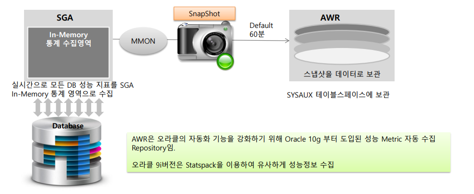
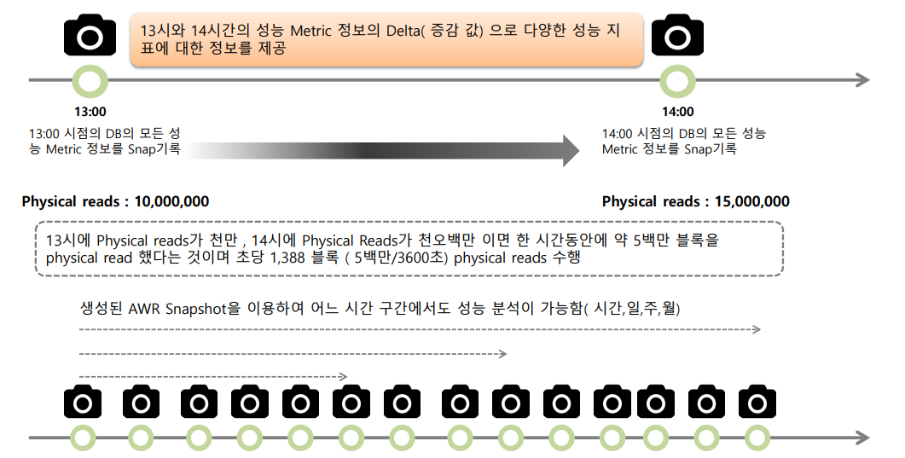
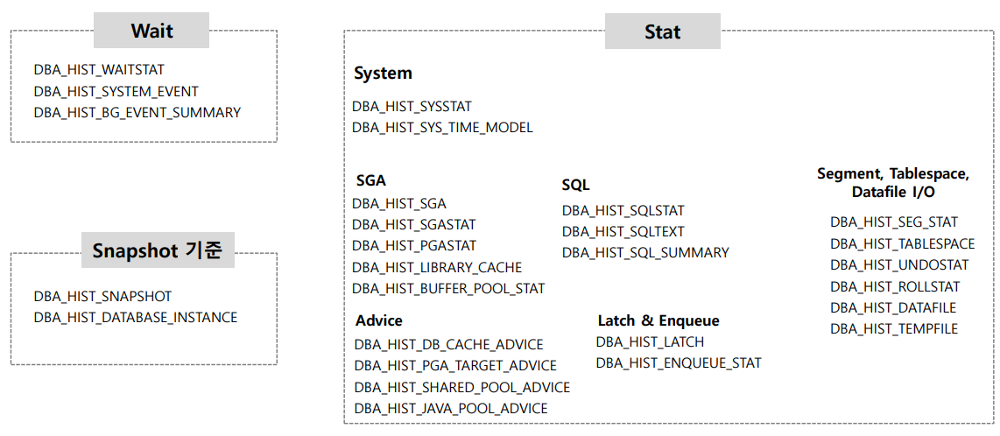

# 07_AWR


## 01_AWR (Automatic Workload Repository)



- 순서
  1. SGA In Memory 통계 수집 영역으로 수집
  2. MMON으로 SnapShot 을 찍음
  3. SYSAUX 테이블 스페이스에 보관
- 성능 정보에 대한 내장 Repository
- Default 60분마다 DB Metrics의 Snapshot을 생성하여 Default 8일 보관
- 모든 Oracle 자체 관리 기능 (Self Management)의 기보 자료가 된다.
  - ADDM, SQL Tuning Advisor, Undo Adviser, Segment Adviser


## AWR 작동



- 13시에 snap shot을 찍음
  - 그럼 DBA HIST관련된 테이블에 모두 값이 찍히게 된다.
- 이렇게 14시에도 snapshot을 찍는다.
  - 만약 13시 1천만/ 14시 1천5백만이 찍혔다면 1시간동안 500만 블록을 physical read했다는 뜻
  - 즉  1388블록 / 초 수행
  - 이렇게 추이를 만들수 있다.




## AWR 만드는 방법

```sql
cd $ORACLE_HOME/rdbms/admin


```


