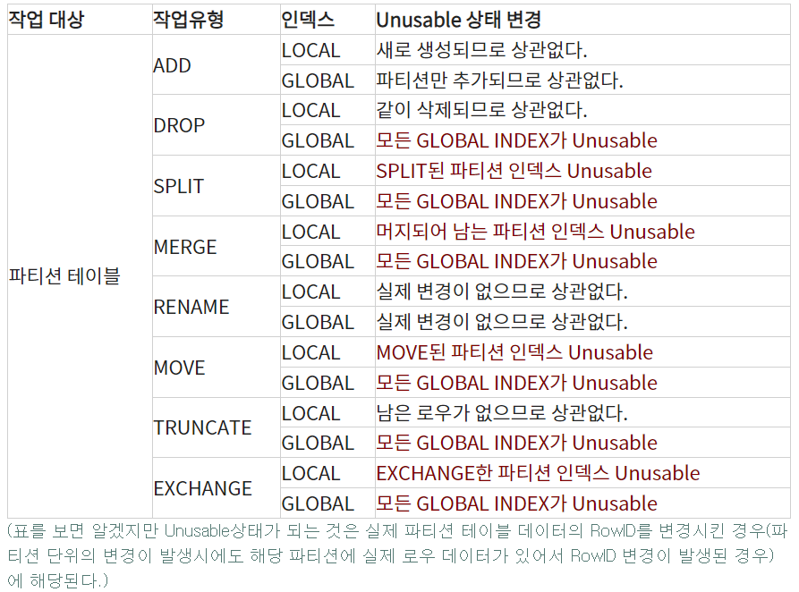

# 파티션

update indexes 내부 동작 어떻게 되는지 확인 필요


로컬 파티션 인덱스

- 각 테이블 파티션과 인덱스 파티션이 서로 1:1대응 관계가 되도록 오라클이 자동으로 관리하는 파티션 인덱스


Local Partition Index

- 각 인덱스 파티션이 테이블 파티션과 1:1대응관계를 가지며 테이블 파티션 속성을 그대로 상속받는다.
- 파티션 키를 사용자가 따로 정의하지 않아도 오라클이 자동으로 관리하는 것이 특징
- 각 테이블 파티션과 인덱스 파티션이 서로 1:1대응 관계를 형성 
  ==> 만약 테이블이 결합 파티셔닝 되어 있다면 인덱스도 같은 단위로 파티셔닝된다.
  ==>  [질문] 결합 파티셔닝이란
- 장점
  - 관리적 편의성 존재
  - 테이블 파티션 구성에 변경이 생기더라도 인덱스를 재생성 할 필요가 없음 
    ==> 관리비용 적음
- 단점
  - 테이블 파티션 구성을 따라간다 ==> 자유도가 떨어짐
    - 다른 파티션키를 사용해서 인덱스를 만들 수 없음
    - 테이블에서 sales_no를 기준으로 파티션이 되어 있다면, customer_name 컬럼으로 파티션을 구성할 수 없음 ==> 동일하게 가져가야함


Non Partiontion Index

- 파티셔닝 하지 않은 Index
- 만약 테이블만 파티셔닝이 되어있다면 1:M의 관계를 가짐
  - 즉 하나의 인덱스 세그먼트가 여러 테이블 파티션 세그먼트와의 관계를 갖는다.
- 글로벌 비 파티션 인덱스라 불린다.


Global Partition Index

- 테이블 파티션과 독립적인 구성을 갖도록 파티셔닝하는 것
- 테이블은 파티셔닝이 되어 있지 않을 수도 있음
- 제약사항
  - 기준 테이블의 파티션 구성에 변경이 생길때 마다 인덱스가 unuable상태로 바뀌고 그때마다  인덱스를 재생성해야한다는 것
  - 비 파티션 인덱스일때도 동일
- 9i 버전 이후
  - update global indexes옵션
    - DDL 작업에 의해 영향받는 인덱스 레코드를 자동으로 갱신해주므로 **unuable상태로 빠지지 않는다.**
    - 하지만 파티션DDL로 인해 영향받는 **레코드가 전체의 5% 미만**일때만 유용하다.
    - **이상일 경우 ==> 인덱스 재생성하는 것보다 오히려 늦다.**
    - **update global indexes을 주고 하나씩 없애고 재생성 될때까지 대기했어야 했다.**


Global Partition Index

- 경합을 분산시키려고 글로벌 해시 파티셔닝을 하는 경우 외에는 거의 사용되지 않음

- 비 파티션 테이블에 대한 글로벌 파티션 인덱스

  - 테이블을 파티셔닝하지 않을 정도로 중소형급 테이블이면 굳이 인덱스만을 따로 파티셔닝 할 이유는 없음 => Local Index로 할 필요없음

    

- 파티션 테이블에 대한 글로벌 파티션 인덱스

  - 이 경우에는 글로벌보다는 Local Partition index와 비파티션 인덱스가 주로 사용

1. 테이블과 같은 컬럼으로 파티셔닝 하는 경우

   - 상황
     - 날짜 컬럼 기준으로 월별 파티셔닝
     - 인덱스는 분기별 파티셔닝하는 경우
   - 글로벌 
     - Prefixed 파티션만 허용되므로 날짜 컬럼을 선두에 둬야한다.
     - **날짜 조건은 대게 범위 검색조건** => 인덱스 스캔 효율면에서 불리
     - **[질문]NL조인에서 Inner테이블 엑세스를 위해 자주사용되는 인덱스라면 비효율이 더 크게 작용**

2. 테이블과 다른 컬럼으로 파티셔닝 하는 경우

   - 상황

     - 테이블 파티션 기준인 날짜 이외 컬럼으로 인덱스를 글로벌 파티셔닝 할 수 있음

       

## 파티션 관리

> - 파티션 추가/삭제/병함
> - 파티션 변환 (파티션 테이블과 일반테이블의 변환)
> - 기타 관리

```SQL
CREATE TABLE sales
    (prod_id       NUMBER(6)    CONSTRAINT sales_product_nn  NOT NULL,
     cust_id       NUMBER       CONSTRAINT sales_customer_nn NOT NULL,
     time_id       DATE         CONSTRAINT sales_time_nn     NOT NULL,
     channel_id    CHAR(1)      CONSTRAINT sales_channel_nn  NOT NULL,
     promo_id      NUMBER(6)   ,
     quantity_sold NUMBER(3)    CONSTRAINT sales_quantity_nn NOT NULL,
     amount        NUMBER(10,2) CONSTRAINT sales_amount_nn   NOT NULL,
     cost          NUMBER(10,2) CONSTRAINT sales_cost_nn     NOT NULL)
   PARTITION BY RANGE (time_id)
   (PARTITION Q1_1998 VALUES LESS THAN (TO_DATE('19980401','YYYYMMDD')),
    PARTITION Q2_1998 VALUES LESS THAN (TO_DATE('19980701','YYYYMMDD')),
    PARTITION Q3_1998 VALUES LESS THAN (TO_DATE('19981001','YYYYMMDD')),
    PARTITION Q4_1998 VALUES LESS THAN (TO_DATE('19990101','YYYYMMDD')),
    PARTITION Q1_1999 VALUES LESS THAN (TO_DATE('19990401','YYYYMMDD')),
    PARTITION Q2_1999 VALUES LESS THAN (TO_DATE('19990701','YYYYMMDD')),
    PARTITION Q3_1999 VALUES LESS THAN (TO_DATE('19991001','YYYYMMDD')),
    PARTITION Q4_1999 VALUES LESS THAN (TO_DATE('20000101','YYYYMMDD')),
    PARTITION Q1_2000 VALUES LESS THAN (TO_DATE('20000401','YYYYMMDD')),
    PARTITION Q2_2000 VALUES LESS THAN (TO_DATE('20000701','YYYYMMDD')),
    PARTITION Q3_2000 VALUES LESS THAN (TO_DATE('20001001','YYYYMMDD')),
    PARTITION Q4_9999 VALUES LESS THAN (MAXVALUE)); -- MAXVALUE 설정?
    -- 어떤 값이 들어오더라도 에러가 발생하지 않게 하기 위해 MAXVALUE를 지정하는 것

INSERT INTO SALES
SELECT PROD_ID, CUST_ID,
       ADD_MONTHS(TIME_ID,(ROWNUM-1)*3)+1 TIME_ID,
       CHANNEL_ID, PROMO_ID, QUANTITY_SOLD, AMOUNT_SOLD, ROWNUM
 FROM SH.SALES
 WHERE ROWNUM <= 20 ;

COMMIT ;
```


추가

- ex_ 리스트 파티션에서 2001년 1분기 데이터를 추가하려는 경우 등

- MAXVALUE로 지정된 경우

  - 기존 파티션안에 대상이 포함되어 있다면 아래의 분할(SPLIT)을 이용하여 처리

  - SPLIT이란

    - 

    

- MAXVALUE가 없는 경우

  - 기존 파티션의 범위 밖으로 새로이 추가되는 경우

  - ```SQL
    alter table sales add partition Q1_2001 values less than ('20010101') tablespace pts_2001Q1;
    ```

  - maxvalue로 지정한 파티션이 있는데 위와같이 추가할시
    ora-14120 : DATE열에 파티션 바운드가 불완전하게 지정되었습니다.
    라는 에러가 발생하게 된다.

삭제

- alter table sales drop partition Q1_1998

  

분할

- 기존 생성되어 있는 파티션을 쪼개는 기능

- 새로 추가될 데이터 2001년 1분기 데이터를 저장할 파티션을 추가하려는 경우 MAXVALUE파티션을 분할하면 된다.

- ```SQL
  alter table sales split partition Q4_9999 
  at (TO_DATE('20010101','YYYYMMDD')) 
  into 
  (partition Q4_2000 tablespace pts_2000Q4, 
   partition Q4_9999 tablespace pts_9999Q4)
  ```

- 분할되는 기존 파티션을 그대로 사용할 경우에는 기존 파티션 정보를 그대로 기술해 주면 된다.

- split partition은 매우 큰 partition table이나 view를 handling 하는데 유용하다.

  

- 파티션 테이블 중간에 파티션 추가하기에 좋음

- ```SQL
  alter table p_tmp split partition emp_p2 
  at(3000)
  (partition emp_p2, partition emp_p3)
  -- 대상, 기준, 생성, 기존값
  -- 이전 p1 2000, p2 4000
  -- 이후 p1 2000, p2 3000, p3 4000
  ```

- 주의!!!!

  - split을 할 경우 status UNUSABLE상태로 돌입
  - 파티션 테이블의 로컬 인덱스도 같이 파티션된다!
  - 데이터가 있는 상태라면 REBUILD 작업이 필수로 요구된다. [질문 ] UPDATE 없나?


속성 변경

- 전체 partition 속성 변경도 가능, 특정 partition의 속성만 변경도 가능

- ```sql
  alter table sales storage(next 10M) -- 모든 partition의 next값이 변경
  ```

- ```sql
  alter table sales part_tbl modify partition Q4_9999 storage(maxextents 100)
  -- 특정 속성만 변경 가능
  -- Q4_9999 partition의 maxextents값만 변경
  ```


인덱스 관리

- 파티션 별로 RowID를 다르게 갖게 된다.

  - 즉 파티션 변경이 발생하게 되면 RowID의 변경이 발생하게 된다.

- 따라서 실제 파티션 테이블의 RowID와 변경된 파티션 로컬 인덱스와 글로벌 인덱스의 ROwID가 일치하지 않게 되어 IU(index unusable)가 발생하여 인덱스의 사용이 불가하게 된다.

- partition index가 IU되었을때 partition index를 사용하게 되면 다음과 같은 인덱스가 발생한다.

- ```sql
  ORA-01502 : 인덱스 'sales_gpnk1' 또는 인덱스 분할영역은 사용할 수 없는 상태이다.
  ```

- 인덱스를 사용하지 않고 해당 full scan하면 에러가 발생하지 않음

  - 하지만 옵티마이져가 실행계획 수립시에 IU를 체크하지 않으므로 해당 인덱스를 사용하는 실행계획이 수립되고 실제 수행시 오류가 발생하게ㅔ 됨으로 이미 운용중인 어플리케이션이나 SQL이 정상 수행되지 않는다.
  - 이런 경우 skip_unuable_indexes = TRUE 파라메터를 지정
  - 수행시에 해당 인덱스가 UI이면 이를 사용하지 않고 TABLE FULL SCAN등을 한다.
  - 경우에 따라서 유용하게 사용가능하다.

- IU 상태일 경우 
  - 어떤 partiiton이 IU가 되면 그 partiiton을 사용하기 전에 REBUILD해야한다.
  - IU partition을 제외한 다른 partition만 읽거나 DML을 수행하는 작업은 IU partition을 access하지 않는 한 오류가 발생하지 않는다.
  - IU partition을 rebuild하기 전
    - split, rename, global index drop등이 가능하다
    - IU상태인 인덱스를 다시 수행가능하게 하는 작업은 경우에 따라 큰 부하가 발생할 수 있다.
  - 로컬 파티션 인덱스
    - 해당 로컬 인덱스만 재 생성해주면 된다.
  - 글로벌 파티션 인덱스
    - 글로벌 인덱스를 한번에 재생성할 수 없고 개별 파티션 단위로만 재생성이 가능함
    - 글로벌 인덱스의 파티션 수 만큼 나누어 지정하여 재생성해야한다.
    - 원인 : 파티션의 변경, 파티션 데이터의 RowID가 변경되는 경우
    - 




인덱스 Rebuild

- partition의 index를 rebuild

  - ```sql
    alter index idx01_sales rebuild partition idx_Q4_9999;
    ```

- global index sales_idx01 rebuild

  - ```sql
    alter index idx01_sales rebuild;
    ```

- global partition index 인덱스는 인덱스 전체를 한번에 재생성 할 수 없다.

  - ```sql
    alter index SALES_GPNK1 rebuild
    ```

- ORA-14086 : 분할영역된 인덱스는 전체를 다시 만들 수 없습니다. 와 같은 Error발생

  - ```sql
    alter index SALES_GPNK1 rebuild partition SALES_GPI01 ;
    ```

  - 위와 같이 인덱스 파티션 단위로 재생성해중어야만 한다.

  - global partition index인 경우 non-partition index이든 partition index이든 테이블 관련 작업인 경우 rebuild 필수 ==> 파티션 테이블 별로 global index의 rebuild작업용의 스크립트를 작성해 놓아야 빠른 시간안에 관련 인덱스를 재 생성 할 수 있다.


index IU 상태 예방

- 오라클에서 NULL데이터는 정렬에서 마지막에 위치하게 된다.

  - 파티션 키의 값이 NULL인 경우 MAXVALUE파티션에 존재하게 된다.
  - 이 경우에 푀신의 데이터를 위해서 파티션을 추가시 maxvlaue를 split하게 되면 실제 데이터 로우가 있는 파티션에서 변경 작업이 일어난다. ==> IU발생

- 실제 운영데이터

  - 최종 파티션과 MAXVALUE파티션 사이에 **dummy 파티션**을 하나 두어 NULL값이 위치한 MAXVLAUE파티션을 분리하는 것이 좋다.
  - ex) 날짜가 key인 경우 [질문]
    - '20021001' 인 현재 파티션과 MAXVALUE 사이에 '21000101'이나 '99990101'과 같은 dummy 파티션을 유지하는 방법으로 실무에서 사용할 수 있다. 

- **update global indexes**

  - global index가 base table과 동시에 변경이 되어 global index에 대한 rebuild를 관리하지 않아도 된다.

  - 사용가능한 DDL 명령어
    => SPLIT, MERGE, ADD, MOVE, COALESCE, DROP, TRUNCATE, EXCHANGE

  - 사용 : partition specification 바로 뒤 , parallel clause바로 앞

  - ONLINE으로 base table에 대한 DDL을 수행하면서 global index를 그에 맞춰 변경시킬 수있음

    - ```sql
      ALTER TABLE sales DROP PARTITION sales1 
      UPDATE GLOBAL INDEXES
      PARALLEL (DEGREE 4);
      ```

    - ONLINE변경은 전체적인 처리의 부하가 Rebuild보다 크다.

    - row의 양이 적을때 유용하다.

    - 전체 글로벌 인덱스를 재 생성하는 시간보다 ONLINE update하는 시간이 적을 때 유리

**파티션 추가시 로컬 인덱스의 속성 관리**

- local index partition의 경우 관련 syntax를 지원하지 않는다. 
  (table tartition, tablespace, physical storage attribute)
- 오라클은 자동으로 index partition, tablespace, physical storage attribute를 지정. 
  (ALTER TABLE SPLIT PARTITION도 마찬가지)
- new index partition의 이름은 new table partition과 같은 이름이 할당
  - (table tartition, tablespace, physical storage attribute) => 자동으로 default값이 할당
- local index에 지정된 default값이 없을 경우 user의 default tablespace가 사용된다.
- 따라서 parititon을 추가하여 사용하는 경우 index parititon관리에 주의가 요구된다.
- 


파티션 키 데이터의 변경

- ORA-14402 : 분할영역 키 열을 수정하는 것은 분할영역 변경이 생깁니다.

  - 파티션 운영 중 키 컬럼의 데이터가 변경되어 파티션을 이동 시에 생기는 에러

- ``` SQL
  ENABLE ROW MOVEMENT;
  DISABLE ROW MOVEMENT;
  
  -- EX
  ALTER TABLE SALES ENABLE ROW MOVEMENT;
  
  ```

- 

파티션 테이블의 변환

- EXVHANGE 명령

  - 특정 partition을 non-partition , non-partition을 partition으로 변환시켜 주는 역할

  - 내부적으로 data(index) segment를 교환(data dictionary의 변경)하는 것이지 실제로 각각의 row들을 옮기는 것이 아니다.

    

- 파티션 => 일반 테이블의 변환

  - table을 변환하기 위해 dummy table을 생성하고, alter table EXCHANGE PARTITION 명령어를 통해 수행한다.
    ==> 매우 빨리 data dictionary를 update시킴

    1. 변경하려는 파티션과 동일한 구조를 같는 테이블을 생성
       ```sql
       create table sales_EXCH as select * from sales where 1=2;
       ```

    2. alter tbale EXCHANGE을 이용하여 변경
       ```sql
       alter table sales exchange 
       partition Q4_9999 
       with table sales_EXCH 
       without validation
       ```

       - 파티션 테이블의 해당 파티션의 구조는 그대로 유지된다. 
       - 기존 파티션은 빈 파티션이 된다.
       - 즉 exchange를 사용하면 실제 데이터가 파티션에서는 더이상 유지되지 못하므로 해당 경우에만 사용할 수 있는 단점이 있다.
       - without validation을 이용하면 유일성 조건 등의 기존 테이블에 걸린 제약조건을 체크하지 않는다. ==> **변환전에 미리 체크하는것이 좋다.**

  

- 일반 테이블 => 파티션 변환

  - alter table EXCHANGE이용

  - ```SQL
    ALTER TABLE sales EXCHANGE 
    PARTITION Q3_1999 
    WITH TABLE sales_EXCH 
    WITHOUT VALIDATION ;
    ```

  - 


- UPDATE INDEXES
  - With asynchronous global index maintenance, a drop partition update indexes operation is on metadata only and all global indexes remain valid.
  - 비동기적으로 global index를 유지하면서 a drop partition update indexes operation는 오직 메타데이터만 있다. 그리고 global indexex를 유지한다


```
1) 해당 partitioned table전체를 drop한 후 recreate한다.

drop table sales ;
drop tablespace pts_9999Q4 including contents ;
tablespace recreate.
table rebuild .
문제점은 전체 partitioned table을 복구해야 하므로 시간이 오래  소요된다.

2) 해당 partition만을 drop후 재 생성 한다.

alter table sales drop partition Q4_9999 ;
drop tablespace pts_9999Q4 including contents ;
tablespace recreate.
add partition or split partition.
해당 partition만의 data를 reload한다.
partitioned table전체 data를 reload하는 것 보다 짧은 시간이 소요된다.

3) temporary table을 생성하여 exchange한다.

sales table과 동일한 구조의 dummy table을 다른 tablespace에 생성한다.
create table dummy_sales as select * from sales where 1=2;
이 table을 문제의 partition과 exchange한다.
alter table sales exchange partition Q4_9999 with table dummy_sales without validation ;
drop tablespace pts_9999Q4 including contents ;
새로운 partition에 필요한 data를 load한다.
```


