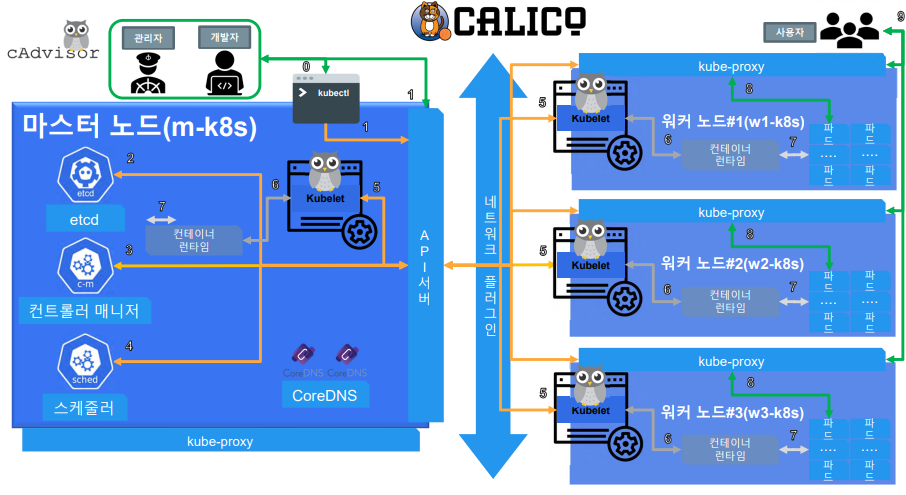
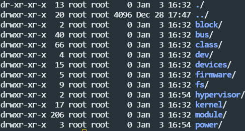
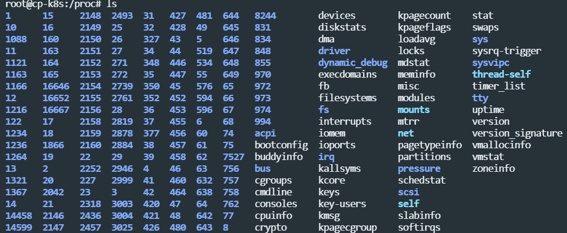
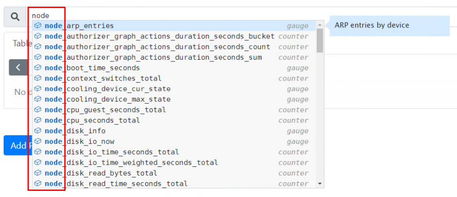
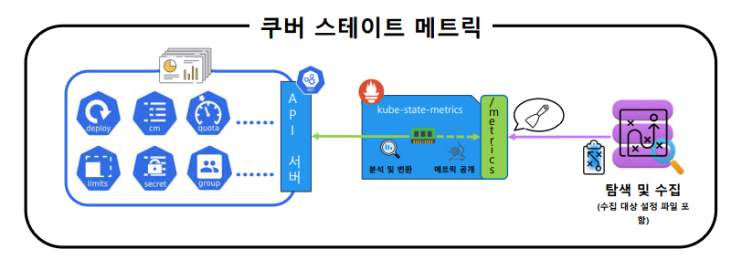
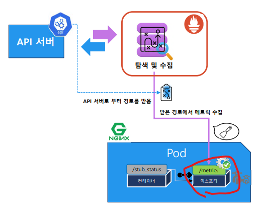
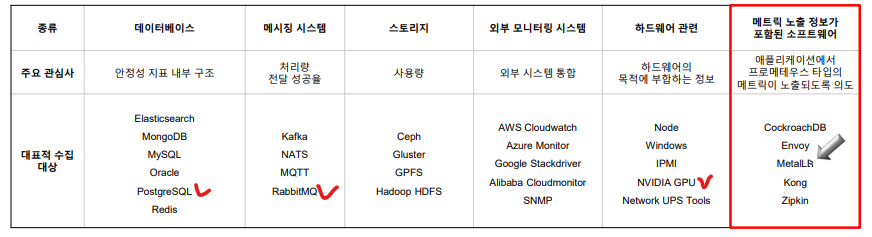
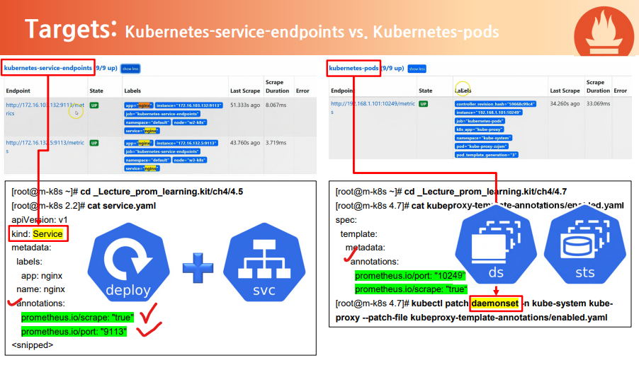

# 01_Prometheus

- 모니터링은 쉽게 할 수 있어야한다.
- 조치가 쉬워야한다.
- 프로메테우스는 쿠버네티스를 사용할 때 큰 효과를얻을 수 있음


## Monitoring

- **메트릭 :** 
  - 시간이 지남에 따라 변화하는 데이터
  - 숫자로 표현되는 CPU, Memory 등을 나타낸다.
  - ex)
    - Resource : CPU, Memery, Disk, IO, Network
    - Application : TPS(처리량),  RPS(처리속도), 상태 값(Error), 애플리케이션 고유 값
- **Metric Pipeline**


- **Log Pipeline**
  - 숫자가 아닌 사람이 읽을 수 있는 형태의 데이터


- 프로메테우스 외 도구들
  - zabbix(현 시점 좋은 tool), sentry, nagios, scouter


## Kubernates 

- CRD (Custom Resource Definition)
  - 각 리소스마다 자체적인 관리를 위해 현재 MealLB(Load Balancer)에서 사용


## Prometheus 배포

- helm을 통해서 베포 진행

```
# 15초 설정
helm install prometheus edu/prometheus \
--set pushgateway.enabled=false \
--set alertmanager.enabled=false \
--set nodeExporter.tolerations[0].key="node-role.kubernetes.io/master" \
--set nodeExporter.tolerations[0].effect="NoSchedule" \
--set nodeExporter.tolerations[0].operator="Exists" \
--set nodeExporter.tolerations[1].key="node-role.kubernetes.io/control-plane" \
--set nodeExporter.tolerations[1].effect="NoSchedule" \
--set nodeExporter.tolerations[1].operator="Exists" \
--set server.service.type="LoadBalancer" \
--set server.global.scrape_interval="15s" \
--set server.global.evaluation_interval="15s" \
--set server.extraFlags[0]="web.enable-lifecycle" \
--set server.extraFlags[1]="storage.tsdb.no-lockfile" \
--namespace=monitoring \
--create-namespace
```

```
# 1분 설정
helm install prometheus edu/prometheus \
--set pushgateway.enabled=false \
--set alertmanager.enabled=false \
--set nodeExporter.tolerations[0].key="node-role.kubernetes.io/master" \
--set nodeExporter.tolerations[0].effect="NoSchedule" \
--set nodeExporter.tolerations[0].operator="Exists" \
--set nodeExporter.tolerations[1].key="node-role.kubernetes.io/control-plane" \
--set nodeExporter.tolerations[1].effect="NoSchedule" \
--set nodeExporter.tolerations[1].operator="Exists" \
--set server.service.type="LoadBalancer" \
--set server.extraFlags[0]="web.enable-lifecycle" \
--set server.extraFlags[1]="storage.tsdb.no-lockfile" \
--namespace=monitoring \
--create-namespace
```


## Web UI


- **Configuration에 등록 >> Target으로 치환 >> Service Discovery 대상 물색 및 목표물 파악**
  - UI menu에서 Status 에 Configuration, Target, Service Discovery 확인 가능


## Export

- Metric을 수집하고 공개해주는 Exportor가 필요
- 왜냐하면 Metric이 노출되어줘야 가능하기 접근이 가능하기 때문이다.


### Container metric (cAdvisor)



- docker container랑 뭐가 다른지 확인이 필요
- 컨테이너 metric 같은 경우에는 kubelet의 cAdvisor를 통해서 노출되게 된다.
- `container_` 와 같이 노출되어진다.

### Node Exportor

- /sys 
  -  저장 장치, 네트워크 장치 및 입출력 장치와 같은 각종 장치들을 운영체제에서 사용할 수 있도록 파일시스템의 형태로 연결시켜 놓은 디렉토리
  - 
  - cgroup과 관련된 정보들이 sys에 존재
    - https://www.slideshare.net/JoHoon1/systemd-cgroup

- proc
  - 리눅스 운영체제에서 구동 중인 프로세스들의 정보를 파일시스템의 형태로 연결시켜 놓은 디렉터리이다.
  - 개별 프로세스의 대한 정보, CPU, 메모리 사용량, 장치 정보와 같은 정보를 포함하고 있다.
  - 



- node export에 의해 수집되는 값들이다.


### Kube




###  Application Metric

- Application과 Container의 차이 >> 목적이 다름
  - Application 각각의 개발자들이 원하는 정보로 꾸며져 있음
  - Container의 중심으로 이미 구조화 된 것들

- **Application 전용**
  - 이런 경우에는 Application에서 Exporter를 지원해주게 된다.



- 전용 Exportor를 따로 띄워주어야 한다.

```yaml
apiVersion: apps/v1
kind: Deployment
metadata:
  labels:
    app: nginx
  name: nginx
spec:
  replicas: 2
  selector:
    matchLabels:
      app: nginx
  template:
    metadata:
      annotations:
        # config default exec/logs connectivity for main nginx 
        kubectl.kubernetes.io/default-container: nginx # 이부분
      labels:
        app: nginx
    spec:
      containers:
      - image: nginx:1.21
        name: nginx
        volumeMounts:
        - name: nginx-vol
          mountPath: /etc/nginx/templates
        env:  # 이 부분 8080 port
        - name: PORT
          value: '8080'
      - image: nginx/nginx-prometheus-exporter:0.10.0 # export container 정보들
        name: exporter
        ports:
        - containerPort: 9113
        args:
        - -nginx.scrape-uri=http://localhost:8080/stub_status # 8080정보를 수집한단 뜻
      volumes:
      - name: nginx-vol
        configMap:
          name: nginx-config
          items:
          - key: site.conf.template
            path: site.conf.template
```



- 빨간 박스 : 메트릭 노출정보가 이미 있음


### 이미 Metrix Export 준비는 되어있지만 수집이 안된 App들



- annotations가 있어야 등록이 된다.
- 언제 Service로 사용하고 언제 daemonset으로 사용할까?
  - 정답은 없으나, 보통 고객쪽 Service 쪽에 annotation을 건다.
  - 보통 내부적으로 내부적으로 시스템 정보가 오갈때는 daemonset에 annotation을 걸게 된다.


