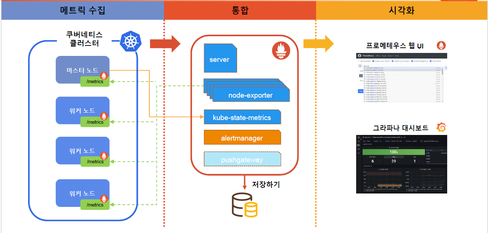
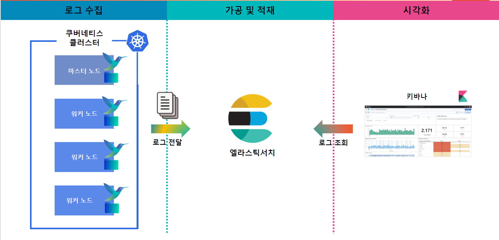
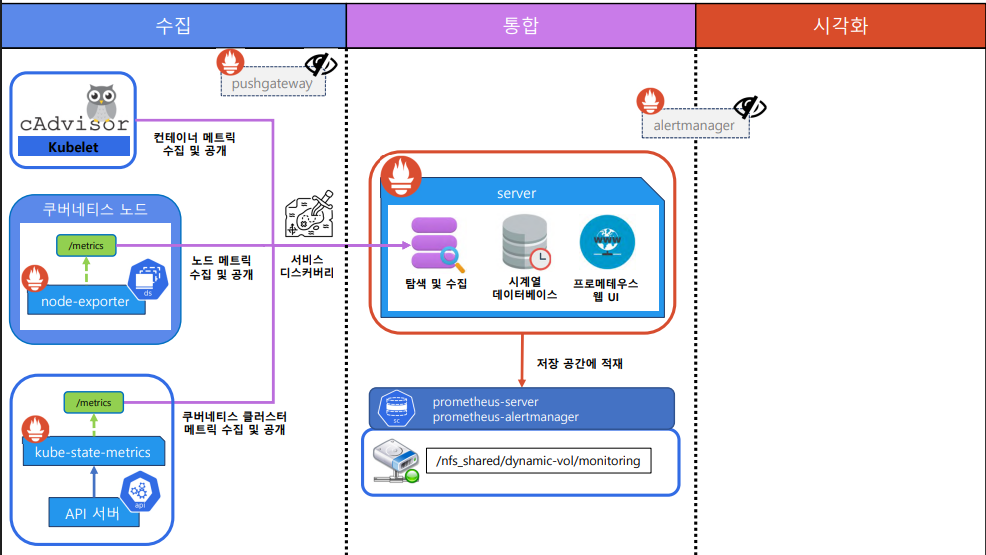

# 01_Prometheus

- 모니터링은 쉽게 할 수 있어야한다.
- 조치가 쉬워야한다.
- 프로메테우스는 쿠버네티스를 사용할 때 큰 효과를얻을 수 있음


## Monitoring

- **메트릭 :** 
  - 시간이 지남에 따라 변화하는 데이터
  - 숫자로 표현되는 CPU, Memory 등을 나타낸다.
  - ex)
    - Resource : CPU, Memery, Disk, IO, Network
    - Application : TPS(처리량),  RPS(처리속도), 상태 값(Error), 애플리케이션 고유 값
- **Metric Pipeline**



- **Log Pipeline**
  - 숫자가 아닌 사람이 읽을 수 있는 형태의 데이터




- 프로메테우스 외 도구들
  - zabbix(현 시점 좋은 tool), sentry, nagios, scouter


## Kubernates 

- CRD (Custom Resource Definition)
  - 각 리소스마다 자체적인 관리를 위해 현재 MealLB(Load Balancer)에서 사용


## Prometheus 배포

- helm을 통해서 베포 진행

```
# 15초 설정
helm install prometheus edu/prometheus \
--set pushgateway.enabled=false \
--set alertmanager.enabled=false \
--set nodeExporter.tolerations[0].key="node-role.kubernetes.io/master" \
--set nodeExporter.tolerations[0].effect="NoSchedule" \
--set nodeExporter.tolerations[0].operator="Exists" \
--set nodeExporter.tolerations[1].key="node-role.kubernetes.io/control-plane" \
--set nodeExporter.tolerations[1].effect="NoSchedule" \
--set nodeExporter.tolerations[1].operator="Exists" \
--set server.service.type="LoadBalancer" \
--set server.global.scrape_interval="15s" \
--set server.global.evaluation_interval="15s" \
--set server.extraFlags[0]="web.enable-lifecycle" \
--set server.extraFlags[1]="storage.tsdb.no-lockfile" \
--namespace=monitoring \
--create-namespace
```

```
# 1분 설정
helm install prometheus edu/prometheus \
--set pushgateway.enabled=false \
--set alertmanager.enabled=false \
--set nodeExporter.tolerations[0].key="node-role.kubernetes.io/master" \
--set nodeExporter.tolerations[0].effect="NoSchedule" \
--set nodeExporter.tolerations[0].operator="Exists" \
--set nodeExporter.tolerations[1].key="node-role.kubernetes.io/control-plane" \
--set nodeExporter.tolerations[1].effect="NoSchedule" \
--set nodeExporter.tolerations[1].operator="Exists" \
--set server.service.type="LoadBalancer" \
--set server.extraFlags[0]="web.enable-lifecycle" \
--set server.extraFlags[1]="storage.tsdb.no-lockfile" \
--namespace=monitoring \
--create-namespace
```


## Web UI



- **Configuration에 등록 >> Target으로 치환 >> Service Discovery 대상 물색 및 목표물 파악**
  - UI menu에서 Status 에 Configuration, Target, Service Discovery 확인 가능


## Export

- Metric을 수집하고 공개해주는 Exportor가 필요


